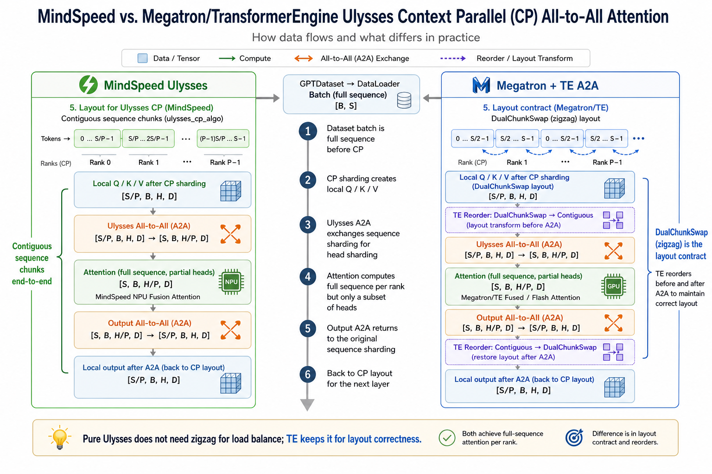

# MindSpeed 与 Megatron/TransformerEngine Ulysses Context Parallel 方案详解

> 本文围绕 Ulysses 风格的 Context Parallel all-to-all 方案展开。重点回答几个问题：数据从 `GPTDataset.__getitem__` 到 attention 前后是怎样流动的；MindSpeed 的 `ulysses_cp_algo` 为什么按连续 sequence chunk 切 batch；Megatron/TransformerEngine 的 `cp_comm_type=a2a` 为什么仍然保留 DualChunkSwap/reorder；两套实现的 all2all 在 shape、通信、约束和调试思路上有什么差异。

## 0. 总览

Ulysses CP 可以先记住一句话：

**CP 先把同一个 sequence 在 sequence 维度切到不同 rank；进入 attention 时再用 all-to-all 把 sequence 分片换成 head 分片，让每张卡拿到完整 sequence、但只计算一部分 attention heads；attention 后再 all-to-all 换回原来的 sequence 分片。**

用符号表示：

```text
S: 全局 sequence length
B: micro batch size
H: 本 TP rank 上的 attention heads
D: head dim
P: context parallel size
```

MindSpeed Ulysses 的主形态：

```text
GPTDataset.__getitem__()
  -> 单条样本长度约为 seq_length + 1
  -> tokens / labels 长度为 seq_length

DataLoader
  -> batch: [B, S]

TP rank 0 读取 batch
  -> TP group broadcast

CP batch 切分
  -> tokens / labels / position_ids: [B, S / P]

Embedding + Transformer
  -> hidden: [S / P, B, hidden]
  -> Q/K/V: [S / P, B, H, D]

Ulysses Q/K/V all-to-all
  -> Q/K/V: [S, B, H / P, D]

FlashAttention / NPU fusion attention
  -> context: [S, B, H / P, D]

Ulysses O all-to-all
  -> context: [S / P, B, H, D]

后续 linear projection / MLP
```

Megatron + TransformerEngine 的 `cp_comm_type=a2a` 也是 Ulysses 风格：

```text
Q/K/V before attention:
  [local sequence, batch, heads, dim]
    -> all-to-all
  [global sequence, batch, heads / P, dim]

O after attention:
  [global sequence, batch, heads / P, dim]
    -> all-to-all
  [local sequence, batch, heads, dim]
```

但是它和 MindSpeed 有一个关键差别：

```text
MindSpeed ulysses_cp_algo:
  CP batch shard 是连续切分 sequence
  rank i 拿 [i * S/P, (i+1) * S/P)

Megatron/TE CP:
  CP batch shard 默认是 DualChunkSwap / zigzag
  先切成 2P 个 chunk
  rank i 拿 chunk_i 和 chunk_(2P-i-1)
```

这会带来一个容易混淆的结论：

```text
从纯 Ulysses 算法看：
  all-to-all 后每张卡都拥有完整 sequence，因此不需要 zigzag 来均衡 attention 计算量。

从 Megatron/TE 当前实现看：
  TE CP 把 DualChunkSwap 作为输入布局约定，A2A 内部 reorder 依赖这个布局。
  所以它不是为了 Ulysses 本身必需，而是为了和 Megatron 数据切分、RoPE、mask、THD 元数据保持一致。
```

本文不放最后的总结图，主要用源码路径、shape 表和流程拆解来说明。

## 1. 关键源码路径

MindSpeed 相关：

```text
MindSpeed-mul/MindSpeed/mindspeed/arguments.py
  --context-parallel-algo
  --ulysses-degree-in-cp
  MindSpeed 对 ulysses_cp_algo / megatron_cp_algo 的参数约束

MindSpeed-mul/MindSpeed/mindspeed/core/context_parallel/get_batch_utils.py
  get_batch_on_this_tp_rank()
  get_batch_on_this_cp_rank()
  _get_batch_on_this_cp_rank_in_ulysses_cp()
  _get_batch_on_this_cp_rank_in_megatron_cp()

MindSpeed-mul/MindSpeed/mindspeed/te/pytorch/attention/dot_product_attention/dot_product_attention.py
  MindSpeedTEDotProductAttention
  DotProductAttention.forward()
  cp_size > 1 时选择 CP strategy

MindSpeed-mul/MindSpeed/mindspeed/te/pytorch/attention/dot_product_attention/context_parallel.py
  UlyssesCPStrategy
  CPStrategyFactory

MindSpeed-mul/MindSpeed/mindspeed/te/pytorch/attention/dot_product_attention/ulysses_context_parallel.py
  AttnFuncWithCPAndQKVOA2A()
  all_to_all()
  _AllToAll
  _aligned_all_to_all()

MindSpeed-mul/MindSpeed/mindspeed/core/transformer/flash_attention/reset_attention_mask/
  EOD/reset attention mask 相关 wrapper
```

Megatron + TransformerEngine 相关：

```text
Megatron-LM/pretrain_gpt.py
  get_batch()
  调用 get_batch_on_this_cp_rank()

Megatron-LM/megatron/core/utils.py
  get_batch_on_this_cp_rank()
  get_pretrain_batch_on_this_cp_rank()
  get_sft_batch_on_this_cp_rank()

Megatron-LM/megatron/core/extensions/transformer_engine.py
  TEDotProductAttention wrapper
  给 TransformerEngine 传 cp_group / cp_stream / cp_comm_type

Megatron-LM/megatron/training/arguments.py
  --context-parallel-size
  --cp-comm-type
  seq_length % (2 * context_parallel_size) 约束

TransformerEngine/transformer_engine/pytorch/attention/dot_product_attention/context_parallel.py
  context_parallel_attention()
  AttnFuncWithCPAndQKVOA2A
  flash_attn_a2a_communicate()
  reorder_seq_chunks_for_a2a_before_attn()
  reorder_seq_chunks_for_a2a_after_attn()
  THD reorder helpers
```

## 2. Ulysses CP 到底在并行什么

普通 tensor parallel 常常会把 attention head 分到不同 TP rank 上。Context parallel 的目标不是替代 TP，而是解决长序列时每个 rank 上的 sequence 太长，激活、attention score、KV 等内存压力过大的问题。

假设不开 CP，某个 TP rank 上的 Q/K/V 是：

```text
Q/K/V: [S, B, H, D]
```

开 CP 后，输入到某个 CP rank 的本地 Q/K/V 一般是：

```text
Q/K/V local: [S / P, B, H, D]
```

这时有两类常见 CP 思路：

```text
Ring / P2P CP:
  每个 rank 只保留自己的 Q。
  K/V 在 CP ranks 间环形传递。
  每个 rank 分多轮计算 partial attention。

Ulysses / A2A CP:
  Q/K/V 同时做 all-to-all。
  把 sequence 维的切分交换成 head 维的切分。
  每个 rank 得到完整 sequence，但是只负责 H/P 个 heads。
```

Ulysses 的核心交换可以理解为：

```text
输入:
  rank r: [S/P, B, H, D]

沿 head 维切给 P 个 rank:
  rank r 准备发送 P 份 [S/P, B, H/P, D]

all-to-all 后:
  rank r 收到来自所有 sequence shard 的同一组 heads
  [P, S/P, B, H/P, D] -> [S, B, H/P, D]

attention:
  对完整 S 做 attention，但只算 H/P 个 heads

输出 all-to-all 反向交换:
  [S, B, H/P, D] -> [S/P, B, H, D]
```

所以，Ulysses 的“每张卡拿完整序列”不是从 dataloader 开始就完整，而是在 attention 内部 all-to-all 之后才完整。attention 结束后又还原成 sequence shard。

## 3. MindSpeed Ulysses 全链路

### 3.1 参数入口

MindSpeed 的 CP 算法由 `--context-parallel-algo` 控制：

```python
# MindSpeed-mul/MindSpeed/mindspeed/arguments.py
group.add_argument('--context-parallel-algo', type=str, default='ulysses_cp_algo',
                   choices=['ulysses_cp_algo', 'megatron_cp_algo', 'hybrid_cp_algo',
                            'adaptive_cp_algo', 'hybrid_adaptive_cp_algo'])
```

对 Ulysses 有几个重要约束：

```text
context_parallel_size > 1 且 context_parallel_algo == ulysses_cp_algo:
  seq_length 必须能被 context_parallel_size 整除
  num_attention_heads 必须能被 context_parallel_size * tensor_model_parallel_size 整除

context_parallel_algo == megatron_cp_algo:
  seq_length 必须能被 2 * context_parallel_size 整除
```

这个约束和切 batch 的方式一致：

```text
MindSpeed Ulysses:
  连续切 P 份
  只需要 S % P == 0

MindSpeed Megatron CP:
  zigzag 切 2P 份
  需要 S % (2P) == 0
```

还有一个特殊限制：

```text
context_parallel_size > 1
reset_attention_mask == True
attention_mask_type == 'causal'

MindSpeed 参数校验中会要求:
  context_parallel_algo == 'megatron_cp_algo'
```

这意味着 accelerated EOD reset causal 模式在这套参数校验里被限制给 ring/megatron CP 路径。虽然 `get_batch_utils.py` 中能看到 Ulysses 分支对 reset attention mask 的处理痕迹，但实际能不能走到，还要以参数校验和启动配置为准。

### 3.2 从 GPTDataset.__getitem__ 到 full sample

`GPTDataset.__getitem__` 读出来的是“训练样本”，不是一个自然语言句子。对 GPT 预训练来说，一个样本通常来自连续 token 流：

```text
text: 长度 seq_length + 1
tokens = text[:-1]  -> 长度 seq_length
labels = text[1:]   -> 长度 seq_length
```

这里的“全长样本”指的是：

```text
在 CP 切分之前，单条样本已经具有完整 seq_length。
```

例如：

```text
seq_length = 8192

GPTDataset.__getitem__ 返回单条样本:
  tokens:       [8192]
  labels:       [8192]
  loss_mask:    [8192]
  position_ids: [8192]
```

DataLoader collate 后：

```text
tokens:       [B, 8192]
labels:       [B, 8192]
loss_mask:    [B, 8192]
position_ids: [B, 8192]
```

这个 8192 不一定对应一个句子，也不一定对应一个 document。Megatron/MindSpeed 的 GPT 预训练数据集通常会把多个 document token 串成连续 token 流，再按 `seq_length + 1` 切样本。因此：

```text
单个 document 不足 8192:
  可能和后续 document 拼在同一个训练样本中。

单个 document 超过 8192:
  可能被切成多个训练样本。

是否在 document 间插入 EOD:
  取决于离线 preprocess 是否启用 --append-eod。
```

MindSpeed 离线处理里 `--append-eod` 是可选项：

```python
# MindSpeed-mul/MindSpeed/tools/preprocess_data.py
group.add_argument('--append-eod', action='store_true',
                   help='Append an <eod> token to the end of a document.')
```

如果不带 `--append-eod`，离线数据就不会自动在 document 末尾追加 EOD token。是否跨 document 拼接，在线 GPTDataset 仍然会按 token 流和 sample index 逻辑构造样本。

### 3.3 get_batch_on_this_tp_rank: 数据迭代器只 next 一次，不代表 batch 只有一条

MindSpeed 的 `get_batch_on_this_tp_rank(data_iterator)` 里关键逻辑是：

```python
if mpu.get_tensor_model_parallel_rank() == 0:
    if data_iterator is not None:
        data = next(data_iterator)
    else:
        data = None
```

这里没有显式 `for` 循环，是因为训练外层循环每个 step/micro-step 都会调用一次 `get_batch_on_this_tp_rank()`。函数内部只负责本次 step 从 DataLoader iterator 里取一个 batch。

所以：

```text
next(data_iterator) 返回的是一个 batch，不是一条样本。

batch 大小由 micro_batch_size 决定:
  tokens: [micro_batch_size, seq_length]
```

TP 并行下，一般只让 TP rank 0 真实从 iterator 取数据，然后广播给同一个 TP group 里的其他 TP rank：

```text
TP rank 0:
  data = next(data_iterator)
  tokens / labels / loss_mask / position_ids 拷到 GPU
  broadcast

TP rank != 0:
  创建 empty tensor
  接收 broadcast
```

这保证同一个 TP group 的 ranks 看到同一个 batch。TP 是切模型参数/head/hidden，不应该切不同训练样本。

### 3.4 get_batch_on_this_cp_rank: MindSpeed Ulysses 连续切 sequence

TP broadcast 之后，如果 `context_parallel_size > 1`，还会沿 sequence 维做 CP 切分。

MindSpeed 的分发入口：

```python
# MindSpeed-mul/MindSpeed/mindspeed/core/context_parallel/get_batch_utils.py
def get_batch_on_this_cp_rank(batch):
    args = get_args()
    cp_size = args.context_parallel_size

    if args.context_parallel_algo == 'megatron_cp_algo':
        batch = _get_batch_on_this_cp_rank_in_megatron_cp(batch)
    elif args.context_parallel_algo == 'ulysses_cp_algo':
        batch = _get_batch_on_this_cp_rank_in_ulysses_cp(batch)
```

Ulysses 分支：

```python
def _get_batch_on_this_cp_rank_in_ulysses_cp(batch):
    cp_rank = mpu.get_context_parallel_rank()
    cp_size = mpu.get_context_parallel_world_size()
    for key, val in batch.items():
        if key == 'attention_mask':
            continue
        if val is not None:
            seq_dim = 1 if key != 'attention_mask' else 2
            val = val.chunk(cp_size, dim=seq_dim)[cp_rank].contiguous()
            batch[key] = val
    return batch
```

注意这里是 `chunk(cp_size)`，也就是连续切分：

```text
S = 8192
P = 4

rank0: tokens[:, 0:2048]
rank1: tokens[:, 2048:4096]
rank2: tokens[:, 4096:6144]
rank3: tokens[:, 6144:8192]
```

这和 Megatron CP 的 zigzag 不一样。MindSpeed 的 Megatron CP 分支是：

```python
val = val.view(..., 2 * cp_size, val.shape[seq_dim] // (2 * cp_size), ...)
index = torch.tensor([cp_rank, (2 * cp_size - cp_rank - 1)], device=val.device)
val = val.index_select(seq_dim, index)
```

例如 `P=4` 时：

```text
先切成 8 个 chunk:
  c0 c1 c2 c3 c4 c5 c6 c7

rank0: c0 + c7
rank1: c1 + c6
rank2: c2 + c5
rank3: c3 + c4
```

这个 zigzag 是给 ring/megatron CP 的 causal 负载均衡准备的。Ulysses 分支不做这个。

### 3.5 为什么 MindSpeed Ulysses 不需要 zigzag

如果直接按 sequence 连续切：

```text
rank0: 前 S/P token
rankP-1: 后 S/P token
```

对于 ring/p2p CP，后面的 token 在 causal attention 中可见历史更长，计算量可能更大，所以需要 zigzag 把前后 chunk 配对。

但 Ulysses 的注意力计算发生在 all-to-all 之后：

```text
CP batch shard:
  rank0: [S/P, B, H, D]
  rank1: [S/P, B, H, D]
  ...

Q/K/V all-to-all 后:
  rank0: [S, B, H/P, D]
  rank1: [S, B, H/P, D]
  ...
```

也就是说，每个 rank 都在完整 sequence 上做 attention，只是负责不同 head 子集：

```text
rank0 计算 heads 0..H/P-1 上的完整 S attention
rank1 计算 heads H/P..2H/P-1 上的完整 S attention
```

对 causal attention 来说，每个 head 子集的 sequence 长度和 mask 结构一样，所以 ranks 之间的计算量天然接近。因此：

```text
纯 Ulysses 算法不需要 zigzag 来均衡 attention 计算量。
MindSpeed 的 ulysses_cp_algo 用连续 chunk 是合理的。
```

### 3.6 Q/K/V 进入 MindSpeedTEDotProductAttention

CP batch 切完后，模型只看到本 rank 的 sequence shard：

```text
tokens: [B, S/P]
```

embedding 和 transformer 前面的线性投影会产生：

```text
hidden: [S/P, B, hidden]
query_layer: [S/P, B, H, D]
key_layer:   [S/P, B, H_kv, D]
value_layer: [S/P, B, H_kv, D]
```

在 `MindSpeedTEDotProductAttention` 中，如果 `context_parallel_size > 1`，会设置：

```text
cp_group
cp_global_ranks
cp_stream
cp_comm_type = config.context_parallel_algo
qkv_format = 'sbhd'
```

然后在 dot product attention forward 中，根据 `cp_comm_type` 创建对应 strategy：

```text
cp_comm_type == 'ulysses_cp_algo'
  -> UlyssesCPStrategy
  -> AttnFuncWithCPAndQKVOA2A()
```

### 3.7 UlyssesCPStrategy 的默认 scatter/gather 维度

MindSpeed 的 `UlyssesCPStrategy` 默认：

```python
scatter_idx = 2
gather_idx = 0
```

对 `sbhd` 格式：

```text
query_layer: [S/P, B, H, D]
dim 0: sequence
dim 1: batch
dim 2: heads
dim 3: head dim
```

所以：

```text
scatter_idx = 2:
  all-to-all 前沿 head 维切分

gather_idx = 0:
  all-to-all 后沿 sequence 维聚合
```

换句话说：

```text
[S/P, B, H, D]
  -- scatter heads / gather sequence -->
[S, B, H/P, D]
```

attention 输出后反向：

```text
[S, B, H/P, D]
  -- scatter sequence / gather heads -->
[S/P, B, H, D]
```

### 3.8 AttnFuncWithCPAndQKVOA2A: MindSpeed all2all 主体

MindSpeed 的 Ulysses attention 函数核心步骤：

```python
q = all_to_all(query_layer, spg, scatter_idx, gather_idx, gather_size)
k = all_to_all(key_layer, spg, scatter_idx, gather_idx, gather_size)
v = all_to_all(value_layer, spg, scatter_idx, gather_idx, gather_size)

q, k, v, _ = prepare_sbhd_format(q, k, v)

context_layer = torch_npu.npu_fusion_attention(...)[0]

output = all_to_all(
    context_layer,
    spg,
    gather_idx,
    scatter_idx,
    query_layer.size(scatter_idx),
)
```

完整 shape 变化：

| 阶段 | Q/K/V 或 O shape | 说明 |
| --- | --- | --- |
| CP batch shard 后 | `[S/P, B, H, D]` | 本 rank 只持有一段 sequence |
| Q/K/V all2all 前切分 | `P * [S/P, B, H/P, D]` | 每个 rank 把不同 head 子集发给不同对端 |
| Q/K/V all2all 后 | `[S, B, H/P, D]` | 本 rank 拥有完整 sequence 的一部分 heads |
| attention 计算 | `[S, B, H/P, D]` | NPU fusion attention |
| O all2all 前切分 | `P * [S/P, B, H/P, D]` | 沿 sequence 切回给各 CP rank |
| O all2all 后 | `[S/P, B, H, D]` | 恢复本 rank sequence shard 上的完整 heads |

如果是 GQA/MQA，K/V head 数可能比 Q 少。MindSpeed 这里有一段补齐逻辑：

```python
if seq_world_size > key_layer.shape[scatter_idx] and \
   query_layer.shape[scatter_idx] % key_layer.shape[scatter_idx] == 0:
    key_layer = key_layer.repeat_interleave(...)
    value_layer = value_layer.repeat_interleave(...)
```

它的目的是在 K/V head 数少到不足以按 CP size 切 head 时，把 K/V 重复到能参与后续 all-to-all 的形态。实际使用时还要结合 `--group-query-attention`、`--use-ulysses-allgather-kv` 等选项判断。

### 3.9 MindSpeed all_to_all 的实现细节

MindSpeed 的 `all_to_all()` 是一个 autograd function：

```python
def all_to_all(input_, process_group, scatter_dim=2, gather_dim=1, gather_size=None):
    return _AllToAll.apply(input_, process_group, scatter_dim, gather_dim, gather_size)
```

forward：

```text
记录 process_group / scatter_dim / gather_dim / 原 scatter_size
调用 _all_to_all()
```

backward：

```text
对 grad_output 做反方向 all-to-all
scatter_dim 和 gather_dim 对调
gather_size 使用 forward 输入的 scatter_size
```

也就是说，Ulysses 的通信在反向传播里天然成对出现：

```text
forward:
  Q/K/V: heads -> sequence
  O: sequence -> heads

backward:
  dO: heads -> sequence
  dQ/dK/dV: sequence -> heads
```

`_aligned_all_to_all()` 的核心思路：

```text
1. 把 scatter_dim reshape 出 world_size 这一维
2. 把 world_size 维移到最前面，形成 all_to_all_single 需要的布局
3. dist.all_to_all_single(output, input_t, group=group)
4. 把收到的 world_size 维移动到 gather_dim 位置
5. view 合并 gather_dim
```

虽然注释里提到支持 unaligned data，但当前代码实际有检查：

```python
if gather_mod != 0 or scatter_mod != 0:
    raise ValueError("For aligned data, gather_size and scatter_size must be divisible by world_size")
```

所以实际使用中需要：

```text
scatter_dim size % CP == 0
gather_dim output size % CP == 0
```

对默认 `sbhd` 来说就是：

```text
H % P == 0
S % P == 0
```

### 3.10 MindSpeed EOD / reset attention mask / THD 路径

MindSpeed reset attention mask 相关 wrapper 会从数据侧提取 `actual_seq_len`。在 GPT forward wrapper 中构造：

```python
packed_seq_params = PackedSeqParams(
    qkv_format='thd',
    cu_seqlens_q=actual_seq_len,
    cu_seqlens_kv=actual_seq_len,
)
```

并计算：

```text
max_seqlen_q
max_seqlen_kv
q_index
kv_index
position_ids
```

attention forward 中有一个关键判断：

```python
is_ulysses_algo = cp_size > 1 and cp_algo == 'ulysses_cp_algo'
if packed_seq_params is not None and not is_ulysses_algo:
    query, key, value = [rearrange(x, 's b h d -> (b s) h d') for x in [query, key, value]]
```

含义是：

```text
非 Ulysses CP:
  packed_seq_params 存在时，提前把 Q/K/V 从 SBHD 变成 THD。

Ulysses CP:
  先保持 SBHD 进入 Ulysses all-to-all。
  在 AttnFuncWithCPAndQKVOA2A 内部，如果 qkv_format == 'thd'，再 rearrange 成 TND。
```

这样做的原因是 Ulysses 的 all-to-all 默认维度按 SBHD 解释：

```text
scatter_idx = 2  -> heads
gather_idx = 0   -> sequence
```

如果过早变成 THD，维度语义就不同，all-to-all 的 scatter/gather 逻辑也要换。

## 4. Megatron + TransformerEngine Ulysses 全链路

### 4.1 Megatron 侧如何启用 A2A CP

Megatron-LM 中 CP size 由：

```text
--context-parallel-size
```

控制。具体通信策略由：

```text
--cp-comm-type
```

控制，选项包括：

```text
p2p
a2a
allgather
a2a+p2p
```

要使用 Ulysses 风格 all-to-all，就是：

```bash
--context-parallel-size P
--cp-comm-type a2a
```

Megatron 参数校验里，只要 `seq_length` 存在且 CP 大于 1，就要求：

```text
seq_length % (2 * context_parallel_size) == 0
```

这个约束比 MindSpeed Ulysses 更强。原因不是 A2A 算法本身必须切 `2P`，而是 Megatron/TE CP 的通用数据布局采用 DualChunkSwap，需要先切成 `2P` 个 chunk。

### 4.2 Megatron 的 batch CP 切分: 默认 zigzag

Megatron `pretrain_gpt.py` 中，取完 batch 后会调用：

```python
batch = get_batch_on_this_cp_rank(
    batch,
    is_hybrid_cp=is_hybrid_cp,
    cp_group=get_context_parallel_group(),
    hybrid_cp_group_func=get_hybrid_data_context_parallel_groups,
)
```

pretrain 非 packed 情况下进入：

```python
get_pretrain_batch_on_this_cp_rank()
```

核心逻辑：

```python
val = val.view(
    *val.shape[0:seq_dim],
    2 * cp_size,
    val.shape[seq_dim] // (2 * cp_size),
    *val.shape[(seq_dim + 1):],
)
index[0].fill_(cp_rank)
index[1].fill_(2 * cp_size - cp_rank - 1)
val = val.index_select(seq_dim, index)
val = val.view(*val.shape[0:seq_dim], -1, *val.shape[(seq_dim + 2):])
```

例如：

```text
S = 8192
P = 4
chunk_size = 8192 / 8 = 1024

rank0: c0 + c7 -> token range [0,1024) + [7168,8192)
rank1: c1 + c6 -> token range [1024,2048) + [6144,7168)
rank2: c2 + c5 -> token range [2048,3072) + [5120,6144)
rank3: c3 + c4 -> token range [3072,4096) + [4096,5120)
```

每个 rank 的本地 sequence 长度仍然是：

```text
S / P
```

只是这 `S/P` 不是连续的一段，而是由前后两个 chunk 拼起来。

### 4.3 SFT / packed sequence 的 THD 分支

Megatron 的 `get_batch_on_this_cp_rank()` 会根据 batch 里是否有 `cu_seqlens` 分支：

```text
batch["cu_seqlens"] is None:
  pretraining
  get_pretrain_batch_on_this_cp_rank()
  zigzag / DualChunkSwap

batch["cu_seqlens"] is not None 且非 hybrid:
  SFT packed sequence
  get_sft_batch_on_this_cp_rank()
  tex.thd_get_partitioned_indices()
```

SFT packed sequence 里，一个 batch 可能是多个变长序列打包成 THD token 流。这里不能简单按 `[B, S]` 的规则 view 成 `2P` 个 chunk，而要根据 `cu_seqlens` 在每个子序列内部做 partition。

关键点：

```text
pretrain SBHD/BSHD:
  sequence 是规则长度，按 2P chunks 做 DualChunkSwap。

SFT THD:
  batch 内有多个变长 sequence。
  使用 TE 的 thd_get_partitioned_indices 根据 cu_seqlens 生成本 CP rank 的 token index。
```

### 4.4 Megatron 如何把 cp_comm_type 传给 TE

Megatron core 的 `TEDotProductAttention` wrapper 会在 CP 开启时给 TransformerEngine 传：

```text
cp_group
cp_global_ranks
cp_stream
cp_comm_type
```

如果用户配置：

```text
--cp-comm-type a2a
```

那么 TE 的 dot product attention 最终会进入：

```python
context_parallel_attention(..., cp_comm_type="a2a", ...)
```

在 TransformerEngine 中分发：

```python
elif cp_comm_type == "a2a":
    out = AttnFuncWithCPAndQKVOA2A.apply(*args)
```

也就是说：

```text
Megatron-LM:
  负责数据 batch CP 切分、并行组、配置传递。

TransformerEngine:
  负责真正的 CP attention kernel 和 A2A 通信。
```

### 4.5 TE 的 context_parallel_attention: DualChunkSwap 是显式约定

TransformerEngine 在 `context_parallel_attention()` 的 docstring 中写得很明确：

```text
TE 的 PyTorch CP 当前使用 DualChunkSwap strategy 保证 CP ranks 之间负载均衡。
它应用于所有 attn_mask_type 和所有 qkv_format。
它要求 sequence length 能被 cp_size * 2 整除或 padding 到这个粒度。
它要求 tokens 在进入 context_parallel_attention 前已经 reorder。
```

对 `bshd` / `sbhd`，示意是：

```text
原始 CP=2 连续切:
  GPU0: 0 1 2 3 4 5
  GPU1: 6 7 8 9 10 11

DualChunkSwap 后:
  GPU0: 0 1 2 9 10 11
  GPU1: 3 4 5 6 7 8
```

这正好对应 Megatron 的：

```text
rank i -> chunk_i + chunk_(2P-i-1)
```

因此，在 Megatron + TE 的组合里，A2A 函数不是假设输入 local sequence 是连续片段，而是假设输入已经是 DualChunkSwap 后的两个 chunk。

### 4.6 TE 的 flash_attn_a2a_communicate

TE 中 A2A 的通信封装在：

```python
flash_attn_a2a_communicate(...)
```

attention 前的步骤：

```text
输入 Q/K/V:
  bshd: [B, S/P, H, D]
  sbhd: [S/P, B, H, D]
  thd:  [T/P, H, D]

1. view 出 cp_size 维:
  [B, S/P, H, D]
    -> [B, S/P, P, H/P, D]

2. movedim，把 cp 维移到最前:
  -> [P, B, S/P, H/P, D]

3. dist.all_to_all_single(async_op=True)
  每个 rank 收到来自所有 sequence shard 的同一组 heads

4. reorder sequence chunks
  bshd/sbhd:
    reorder_seq_chunks_for_a2a_before_attn()
  thd:
    reorder_seq_chunks_after_a2a_before_attn_thd()

5. view 合并 sequence:
  -> [B, S, H/P, D] 或 [S, B, H/P, D]
```

attention 后的步骤是逆过程：

```text
1. 把 [S, B, H/P, D] 重新 view 成 cp_size * 2 个 sequence chunks
2. reorder_seq_chunks_for_a2a_after_attn()
3. dist.all_to_all_single(async_op=True)
4. movedim + view
5. 回到 [S/P, B, H, D]
```

这里有两个实现特点：

```text
TE 使用 async_op=True，并配合 cp_stream overlap 一部分 reorder/通信等待。

MindSpeed 的 TE adapter 里使用 dist.all_to_all_single(output, input_t, group=group)，
当前实现是同步调用，没有同样形式的 async request pipeline。
```

### 4.7 TE AttnFuncWithCPAndQKVOA2A forward

TE 的 A2A attention forward 主要阶段：

```text
1. 参数检查
2. 准备 FlashAttention 或 FusedAttention backend
3. 检查 heads 能否被 CP size 整除
4. 检查本地 sequence length 能否被 2 整除
5. Q/K/V all-to-all + reorder
6. 调 fused_attn_fwd 或 flash_attn_fwd
7. O reorder + all-to-all
8. 保存 backward 需要的上下文
```

关键约束包括：

```text
qkv_format in ["bshd", "sbhd", "thd"]

qkv_format == "sbhd":
  CP 不支持 FlashAttention backend，只支持 FusedAttention backend

qkv_format == "thd":
  cu_seqlens_q_padded / cu_seqlens_kv_padded 不能为 None

attention heads:
  q.shape[-2] % cp_size == 0
  k.shape[-2] % cp_size == 0

local sequence:
  q.shape[seq_dim] % 2 == 0
  k.shape[seq_dim] % 2 == 0

attn_bias:
  a2a 路径要求 no_bias
```

本地 sequence 要能被 2 整除，是因为每个 CP rank 持有两个 DualChunkSwap chunks：

```text
local sequence length = S / P = 2 * chunk_size
```

所以需要：

```text
S / P % 2 == 0
=> S % (2P) == 0
```

### 4.8 TE backward: A2A 也是成对反向

TE 的 backward 路径和 MindSpeed 的 autograd all_to_all 思路一致，只是 TE 把更多通信、backend backward、FP8/fused 逻辑都放在同一个 `AttnFuncWithCPAndQKVOA2A.backward()` 里。

大体流程：

```text
1. 对 dout 做 attention 后对应的 A2A
   [S/P, B, H, D] -> [S, B, H/P, D]

2. 调 fused_attn_bwd 或 flash_attn_bwd
   得到 dQ/dK/dV part
   [S, B, H/P, D]

3. 对 dQ/dK/dV 做反向 A2A
   [S, B, H/P, D] -> [S/P, B, H, D]
```

如果前向有 reorder，反向也必须做逆向 reorder，否则梯度会落到错误 token/head 位置。

## 5. MindSpeed 与 Megatron/TE 的核心区别

| 维度 | MindSpeed `ulysses_cp_algo` | Megatron + TE `cp_comm_type=a2a` |
| --- | --- | --- |
| 数据侧 CP 切分 | 连续切 `P` 份 | DualChunkSwap / zigzag，切 `2P` 份后每 rank 取两块 |
| 本地 sequence | 连续 `[S/P]` | 两个 chunk 拼接成 `[S/P]` |
| sequence 长度约束 | `S % P == 0` | `S % (2P) == 0` |
| head 约束 | `num_attention_heads % (TP * CP) == 0` | 本 TP rank 上 `heads % CP == 0` |
| A2A 前 QKV | `[S/P, B, H, D]` | `[S/P, B, H, D]`，但 token 顺序是 DualChunkSwap 后的本地顺序 |
| A2A 后 QKV | `[S, B, H/P, D]` | `[S, B, H/P, D]` |
| 是否需要 reorder | Ulysses 主路径没有 DualChunkSwap reorder | A2A 内部显式 before/after reorder |
| attention backend | `torch_npu.npu_fusion_attention` | TE FusedAttention 或 FlashAttention |
| A2A 通信 | `dist.all_to_all_single` 同步封装 | `all_to_all_single(async_op=True)` + `cp_stream` |
| backward | `_AllToAll.backward()` 自动反向通信 | `AttnFuncWithCPAndQKVOA2A.backward()` 中显式处理 |
| THD/EOD | Ulysses 下先保留 SBHD，函数内部转 TND | TE 原生支持 THD，但要求 padded cu_seqlens |
| 设计取向 | Ulysses 算法语义更直接 | CP 通用布局和多 backend 支持更复杂 |

最关键的一行：

```text
MindSpeed Ulysses:
  用连续 sequence shard 进入 A2A。

Megatron/TE A2A:
  用 DualChunkSwap sequence shard 进入 A2A，然后在 A2A 前后做 reorder。
```

## 6. DualChunkSwap 和 reorder 对 TE A2A 是否多余

这个问题要分两层回答。

从 Ulysses 算法本身看：

```text
是的，zigzag / DualChunkSwap 不是 Ulysses 达到 attention 负载均衡所必需的。
```

原因是：

```text
Ulysses attention 计算前，每个 rank 都已经通过 all-to-all 拿到完整 sequence。
rank 之间只按 head 子集分工。
每个 head 子集面对同样的 sequence length 和 causal mask。
因此不需要把前后 token chunk 混在一起均衡不同 rank 的 causal 计算量。
```

从 TransformerEngine 当前实现看：

```text
不多余。
```

原因是 TE 的 CP attention 明确要求 tokens 在进入函数前已经按 DualChunkSwap reorder。Megatron 的 `get_batch_on_this_cp_rank()`、RoPE 位置切分、THD partition、TE 内部 `reorder_seq_chunks_for_a2a_before_attn()` / `after_attn()` 都围绕这个布局协同。

如果只删除 TE A2A 内部 reorder，而不改变 Megatron 数据切分方式，会出现：

```text
1. all-to-all 后的 global sequence token 顺序不对
2. causal mask 对应的时间顺序不对
3. RoPE / position_ids 与 token 实际顺序可能错位
4. attention 输出再 all-to-all 回去时无法对应原 batch layout
5. backward gradient 会写回错误 token 位置
```

所以正确表述应该是：

```text
DualChunkSwap 对纯 Ulysses 算法不是必要条件。
但对 Megatron + TE 当前 CP 实现是布局契约的一部分。
要去掉它，需要同时修改 Megatron batch CP partition、RoPE/position 处理、TE A2A reorder 和相关 shape 约束。
```

## 7. 两套方案的 shape 示例

### 7.1 MindSpeed Ulysses, P=4

设：

```text
S = 8192
B = 2
H = 32
D = 128
P = 4
```

CP batch 切分：

```text
tokens full: [2, 8192]

rank0 tokens: [2, 2048], token 0..2047
rank1 tokens: [2, 2048], token 2048..4095
rank2 tokens: [2, 2048], token 4096..6143
rank3 tokens: [2, 2048], token 6144..8191
```

QKV：

```text
rank0 query_layer before A2A: [2048, 2, 32, 128]
rank1 query_layer before A2A: [2048, 2, 32, 128]
rank2 query_layer before A2A: [2048, 2, 32, 128]
rank3 query_layer before A2A: [2048, 2, 32, 128]
```

每个 rank 把 head 切成 4 份：

```text
发送给每个对端: [2048, 2, 8, 128]
```

A2A 后：

```text
rank0 query_layer after A2A: [8192, 2, 8, 128]
rank1 query_layer after A2A: [8192, 2, 8, 128]
rank2 query_layer after A2A: [8192, 2, 8, 128]
rank3 query_layer after A2A: [8192, 2, 8, 128]
```

attention 后输出：

```text
rank0 context before O A2A: [8192, 2, 8, 128]
```

O A2A 后：

```text
rank0 context after O A2A: [2048, 2, 32, 128]
```

后续 transformer 层继续以 `[S/P, B, hidden]` 形态运行。

### 7.2 Megatron/TE A2A, P=2

设：

```text
S = 12
P = 2
chunk_size = S / (2P) = 3
```

Megatron batch CP 切分后：

```text
原始 token:
  0 1 2 3 4 5 6 7 8 9 10 11

切成 4 个 chunk:
  c0 = 0 1 2
  c1 = 3 4 5
  c2 = 6 7 8
  c3 = 9 10 11

rank0:
  c0 + c3 = 0 1 2 9 10 11

rank1:
  c1 + c2 = 3 4 5 6 7 8
```

进入 TE A2A 前：

```text
rank0 Q: [6, B, H, D]
rank1 Q: [6, B, H, D]
```

A2A 交换 heads/sequence 后，TE 内部还会 reorder chunks，让 attention backend 看到符合语义的完整 sequence 布局：

```text
rank0 Q after A2A + reorder: [12, B, H/2, D]
rank1 Q after A2A + reorder: [12, B, H/2, D]
```

attention 后，TE 做逆向 reorder 和 O A2A：

```text
rank0 O back: [6, B, H, D]，对应 c0 + c3 的本地布局
rank1 O back: [6, B, H, D]，对应 c1 + c2 的本地布局
```

这样才能和 Megatron 后续层、loss、position、梯度布局保持一致。

## 8. 对照此前几个问题的结论

### 8.1 传给 AttnFuncWithCPAndQKVOA2A 的 Q/K/V 是否已经按 seq_len 切过

是。只要 CP 在 batch/model 链路上已经开启，进入 Ulysses attention 前的 Q/K/V 已经是本 CP rank 的 sequence shard：

```text
MindSpeed Ulysses:
  [S/P, B, H, D]

Megatron/TE A2A:
  [S/P, B, H, D]
  但本地 token 顺序是 DualChunkSwap 后的两段 chunk
```

随后 `AttnFuncWithCPAndQKVOA2A` 才通过 all-to-all 把它变成：

```text
[S, B, H/P, D]
```

### 8.2 Ulysses 是否没有必要 zigzag

对纯 Ulysses 算法，是没有必要。因为 attention 计算时每张卡都有完整 sequence。

但对 Megatron/TE 当前实现，zigzag/DualChunkSwap 是框架布局约定，不应只看 A2A 算法就说它可以直接删除。

### 8.3 GPTDataset.__getitem__ 读出来的全长样本是什么

全长样本是 CP 切分前的一条 GPT 训练样本：

```text
tokens: [seq_length]
labels: [seq_length]
```

它不是“一个句子”，而是从连续 token 流中按 `seq_length + 1` 取出的训练窗口。它可以跨 document，也可以切开长 document。

### 8.4 离线文档是否可以不插 EOD

可以。`--append-eod` 是 `store_true` 选项，不传就不追加 EOD。

但是不插 EOD 会影响：

```text
reset_position_ids
reset_attention_mask
eod_mask_loss
```

这些依赖 EOD 边界的行为。尤其是需要 document 间 attention 隔离时，通常要插 EOD 并打开相应 reset/mask 逻辑。

### 8.5 get_batch_on_this_tp_rank 里没有循环，batch 是否只有一条

不是。`next(data_iterator)` 返回的是一个 batch：

```text
tokens: [micro_batch_size, seq_length]
```

外层训练循环每个 micro-step 调一次，所以函数内部只需要 `next()` 一次。

## 9. 调试时最值得看的点

如果 MindSpeed Ulysses 出 shape 或通信问题，优先检查：

```text
1. args.context_parallel_algo 是否为 ulysses_cp_algo
2. seq_length % context_parallel_size 是否为 0
3. num_attention_heads % (tensor_model_parallel_size * context_parallel_size) 是否为 0
4. 进入 AttnFuncWithCPAndQKVOA2A 前 Q/K/V 是否是 [S/P, B, H, D]
5. all_to_all 后是否是 [S, B, H/P, D]
6. attention 输出 all_to_all 后是否回到 [S/P, B, H, D]
7. GQA/MQA 下 K/V heads 是否满足 all-to-all 切分或是否启用了对应 KV allgather 方案
8. reset_attention_mask + causal + CP 是否被参数校验限制到了 megatron_cp_algo
```

如果 Megatron/TE A2A 出问题，优先检查：

```text
1. --cp-comm-type 是否确实为 a2a
2. seq_length % (2 * context_parallel_size) 是否为 0
3. get_batch_on_this_cp_rank 是否已经做了 DualChunkSwap
4. RoPE / position_ids 是否按 CP rank 同样切分
5. qkv_format 是 bshd / sbhd / thd 中哪一种
6. sbhd 是否走 fused attention
7. thd 是否传了 cu_seqlens_q_padded / cu_seqlens_kv_padded
8. heads % context_parallel_size 是否为 0
9. 是否误删或绕开了 TE 的 before/after reorder
```

最常见的误解是：

```text
看到 Ulysses all-to-all 后每张卡有完整 sequence，
就认为所有上游 CP sequence reorder 都不需要。
```

更准确的判断方式是：

```text
如果实现从 dataloader 到 attention 都按连续 chunk 设计:
  可以不需要 DualChunkSwap。

如果实现已经把 DualChunkSwap 当成 layout contract:
  attention 内部必须按这个 contract 做 reorder 和 inverse reorder。
```

<!-- archive-notes-summary-visual -->

## 总结图


