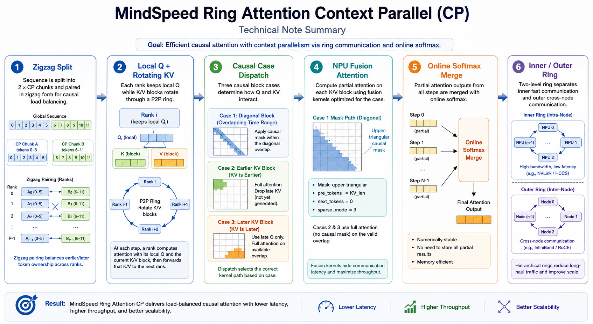

# MindSpeed Ring Attention Context Parallel 方案详解

> 本文深入解析 MindSpeed 中 Ring Attention 风格的 Context Parallel 实现。重点回答：为什么要把 sequence 切成 2×CP 份并做 zigzag 配对；Ring 通信如何在 ranks 间轮转 KV；causal mask 在 block 级别如何高效处理；双层 Ring 的设计动机和通信隐藏机制。

## 0. 总览

Ring Attention CP 的核心思想：

**每个 rank 持有自己的 Q，通过环形通信在 ranks 间轮转 KV。每个 rank 分多轮计算 partial attention，通过在线 softmax 逐步合并结果。序列被切成 2×CP 份并做 zigzag 配对，保证 causal attention 下各 rank 计算负载均衡。**

用符号表示：

```text
S: 全局 sequence length
B: micro batch size  
H: 本 TP rank 上的 attention heads
D: head dim
P: context parallel size (CP ranks 数量)
```

MindSpeed Ring Attention 的主形态：

```text
GPTDataset.__getitem__()
  -> 单条样本长度约为 seq_length + 1
  -> tokens / labels 长度为 seq_length

DataLoader
  -> batch: [B, S]

CP batch 切分 (zigzag)
  -> 先切成 2P 个 chunk
  -> rank i 拿 chunk_i 和 chunk_(2P-i-1)
  -> tokens / labels: [B, S / P]

Embedding + Transformer
  -> hidden: [S / P, B, hidden]
  -> Q/K/V: [S / P, B, H, D] -> [2s, b, h] -> [2, s, b, h]

Ring Attention 循环 (P-1 轮)
  -> 每轮: 计算当前 KV block 的 attention
         在线合并到全局输出
         通信接收下一个 KV block

输出: [S / P, B, H, D]
```

关键区别：

```text
Ulysses CP:
  all-to-all 后每张卡有完整 sequence
  不需要 zigzag
  适合中等长度 (64K-256K)

Ring CP:
  P2P 轮转 KV
  需要 zigzag 均衡负载
  适合超长序列 (1M+)
  内存高效（流式处理）
```

## 1. 关键源码路径

```text
MindSpeed-mul/MindSpeed/mindspeed/core/context_parallel/get_batch_utils.py
  get_batch_on_this_cp_rank()
  _get_batch_on_this_cp_rank_in_megatron_cp()
  zigzag / DualChunkSwap 切分逻辑

MindSpeed-mul/MindSpeed/mindspeed/core/context_parallel/ring_context_parallel/ring_context_parallel.py
  AttentionWithCp (torch.autograd.Function)
  双层 Ring 循环主体
  causal_forward_fetch / causal_backward_fetch
  AttentionStrategyFactory

MindSpeed-mul/MindSpeed/mindspeed/core/context_parallel/utils.py
  forward_update()  在线 softmax 合并
  RingP2P  环形通信封装
  compute_qkv_index()  EOD 场景索引生成

MindSpeed-mul/MindSpeed/mindspeed/core/context_parallel/ring_context_parallel/context_parallel_kv_cache.py
  KV Cache 管理 (backward 时复用 forward 的 KV)

MindSpeed-mul/MindSpeed/mindspeed/core/parallel_state.py
  initialize_context_parallel_group()
  get_context_parallel_group()
  CP 通信组初始化
```

## 2. 为什么要把 sequence 切成 2×CP 份

### 2.1 Causal Attention 的负载不均衡问题

如果直接按 CP 切 sequence：

```text
S = 8192, P = 4

rank 0: token 0..2047      因果历史短，计算量小
rank 1: token 2048..4095   因果历史中等
rank 2: token 4096..6143   因果历史较长
rank 3: token 6144..8191   因果历史最长，计算量最大
```

对于 causal attention，后面的 token 能 attend 到更长的历史，attention score 矩阵的下三角部分面积更大：

```text
rank 0 的 attention 计算量 ∝ 2048 × 2048 / 2
rank 3 的 attention 计算量 ∝ 2048 × 8192     (需要看完整历史)
```

这会导致 rank 3 成为瓶颈，其他 rank 早早算完等待。

### 2.2 Zigzag 配对均衡负载

解决方案：切成 2P 份，每个 rank 拿一个前部 chunk + 一个后部 chunk：

```text
S = 8192, P = 4, chunk_size = 8192 / 8 = 1024

切成 8 个 chunk:
  c0 c1 c2 c3 c4 c5 c6 c7
  0..1023, 1024..2047, ..., 7168..8191

rank 0: c0 + c7 = [0..1023, 7168..8191]
rank 1: c1 + c6 = [1024..2047, 6144..7167]
rank 2: c2 + c5 = [2048..3071, 5120..6143]
rank 3: c3 + c4 = [3072..4095, 4096..5119]
```

每个 rank 都有一个"历史短"的 chunk 和一个"历史长"的 chunk，计算量近似相等：

```text
rank 0: 
  c0 的计算量 ∝ 1024 × 1024 / 2  (短历史)
  c7 的计算量 ∝ 1024 × 8192      (长历史)
  总计 ≈ 1024 × (1024/2 + 8192)

rank 3:
  c3 的计算量 ∝ 1024 × 4096      (中等历史)
  c4 的计算量 ∝ 1024 × 5120      (中等历史)
  总计 ≈ 1024 × (4096 + 5120)

两者接近，负载基本均衡。
```

### 2.3 代码实现

```python
# get_batch_utils.py
def _get_batch_on_this_cp_rank_in_megatron_cp(batch):
    cp_rank = mpu.get_context_parallel_rank()
    cp_size = mpu.get_context_parallel_world_size()
    
    for key, val in batch.items():
        if key == 'attention_mask':
            continue
        if val is not None:
            seq_dim = 1
            
            # 切成 2*cp_size 个 chunk
            val = val.view(
                *val.shape[0:seq_dim],
                2 * cp_size,
                val.shape[seq_dim] // (2 * cp_size),
                *val.shape[(seq_dim + 1):],
            )
            
            # zigzag 配对: chunk_i 和 chunk_(2P-i-1)
            index = torch.tensor([cp_rank, (2 * cp_size - cp_rank - 1)], 
                                 device=val.device)
            val = val.index_select(seq_dim, index)
            
            # 合并两个 chunk
            val = val.view(*val.shape[0:seq_dim], -1, *val.shape[(seq_dim + 2):])
            batch[key] = val
    
    return batch
```

约束：

```text
seq_length % (2 * context_parallel_size) == 0
```

## 3. Ring Attention 的数据流

### 3.1 从 batch 到 Q/K/V

```python
# batch 切分后
tokens: [B, S/P]  # 每个 rank 持有 S/P 长度，由两个 chunk 拼接

# Embedding + Linear projection
hidden: [S/P, B, hidden]
query_layer: [S/P, B, H, D]
key_layer:   [S/P, B, H_kv, D]
value_layer: [S/P, B, H_kv, D]
```

### 3.2 Reshape 成两个 chunk

```python
# ring_context_parallel.py
# [2s, b, h] -> [2, s, b, h]
q, k, v = [x.view(2, x.shape[0] // 2, *x.shape[1:]) for x in [q, k, v]]
```

现在：

```text
q[0] = chunk_early (c_i, 历史短)
q[1] = chunk_late  (c_{2P-i-1}, 历史长)

k[0] = chunk_early
k[1] = chunk_late

v[0] = chunk_early
v[1] = chunk_late
```

### 3.3 Ring 循环

```python
# 初始化
cp_config.q_block_id = cp_config.rank  # 每个 rank 的 Q block ID 固定
cp_config.kv_block_id = cp_config.rank  # 当前处理的 KV block ID

# 每个 rank 初始持有自己的 KV
cur_kv = torch.cat((k.unsqueeze(0), v.unsqueeze(0)), dim=0)  # [2, 2, s, b, h]
next_kv = torch.empty_like(cur_kv)

# Ring 循环 P-1 轮
for step in range(P - 1):
    # 1. 发起异步通信，接收下一个 KV block
    if step < P - 1:
        inner_ring.async_send_recv(cur_kv, next_kv)
    
    # 2. 计算当前 KV block 的 attention
    cur_k, cur_v = cur_kv[0], cur_kv[1]  # [2, s, b, h]
    attn_outs = compute_fused_attention(q, cur_k, cur_v, ...)
    
    # 3. 在线合并到全局输出
    global_attn_outs = update_out(attn_outs, global_attn_outs)
    
    # 4. 等待通信完成，切换到下一个 KV
    if inner_ring.wait():
        cur_kv, next_kv = next_kv, cur_kv  # double buffer swap
        cp_config.kv_block_id = (cp_config.kv_block_id - 1) % P
```

### 3.4 KV 轮转方向

Ring 通信方向是**逆时针**（向后跳）：

```python
# RingP2P 初始化
self.next = ring_global_ranks[(ring_rank + 1) % ring_size]  # 发送目标
self.prev = ring_global_ranks[(ring_rank + ring_size - 1) % ring_size]  # 接收来源
```

示例（P=4）：

```text
rank 0: next=1, prev=3  (发给 rank 1, 从 rank 3 收)
rank 1: next=2, prev=0
rank 2: next=3, prev=1
rank 3: next=0, prev=2

Ring 拓扑:
  rank 0 → rank 1 → rank 2 → rank 3 → rank 0

初始:
  rank 0 持有 KV[0], rank 1 持有 KV[1], ...

Step 0:
  rank 0 计算 KV[0]，发送给 rank 1
  rank 0 从 rank 3 接收 KV[3]

Step 1:
  rank 0 计算 KV[3]，发送给 rank 1
  rank 0 从 rank 3 接收 KV[2]

Step 2:
  rank 0 计算 KV[2]，发送给 rank 1
  rank 0 从 rank 3 接收 KV[1]

rank 0 处理顺序: [0, 3, 2, 1]
```

公式：

```python
next_kv_block_id = (current_kv_block_id + P - 1) % P
```

## 4. Causal Mask 的 Block 级处理

### 4.1 三种 Case

对于 `q_block_id`（当前 rank 的 Q block ID）和 `kv_block_id`（当前处理的 KV block ID）：

```python
def causal_forward_fetch(q_block_id, kv_block_id, q, cur_k, cur_v, attn_mask=None):
    if q_block_id == kv_block_id:
        # Case 1: 对角线
        cur_attn_mask = attn_mask  # 传因果 mask
        cur_q, cur_k, cur_v = [x.view(-1, *x.shape[2:]) for x in [q, cur_k, cur_v]]
        # 全部 Q 对全部 KV，用 mask 控制因果
        
    elif kv_block_id < q_block_id:
        # Case 2: KV 来自更早的 rank
        cur_attn_mask = None  # 不传 mask
        cur_q = q.view(-1, *q.shape[2:])  # 全部 Q
        cur_k, cur_v = [x[0] for x in [cur_k, cur_v]]  # 只取 KV 前半
        # 全部 Q 只看 KV 前半，全连接
        
    else:  # kv_block_id > q_block_id
        # Case 3: KV 来自更晚的 rank
        cur_attn_mask = None  # 不传 mask
        cur_q = q[1]  # 只取 Q 后半
        cur_k, cur_v = [x.view(-1, *x.shape[2:]) for x in [cur_k, cur_v]]  # 全部 KV
        # Q 后半看全部 KV，全连接
    
    return cur_q, cur_k, cur_v, cur_attn_mask
```

### 4.2 为什么这样设计

考虑 rank 2 收到 rank 0 的 KV（`kv_block_id=0 < q_block_id=2`）：

```text
rank 2 的 Q: q[0]=chunk_2, q[1]=chunk_5
rank 0 的 KV: kv[0]=chunk_0, kv[1]=chunk_7

位置关系:
  chunk_0 < chunk_2 < chunk_5 < chunk_7
  kv[0]     q[0]      q[1]      kv[1]

因果约束:
  q[0]=chunk_2 能看到 chunk_0 (✓), 看不到 chunk_7 (✗)
  q[1]=chunk_5 能看到 chunk_0 (✓), 看不到 chunk_7 (✗)

结论:
  全部 Q 只需要看 kv[0] (chunk_0)
  kv[1] (chunk_7) 完全不需要
```

所以 Case 2 直接丢弃 `kv[1]`，只传 `kv[0]`，不传 mask，做全连接 attention。

### 4.3 Case 1 的 Mask 生成入口

对角线 case（`q_block_id == kv_block_id`）需要 mask，因为 Q 和 KV 都包含两个 chunk：

```text
q = [chunk_i, chunk_{2P-i-1}]
kv = [chunk_i, chunk_{2P-i-1}]

四个子块:
  q[0] vs kv[0]: 同一位置，需要因果 mask (下三角)
  q[0] vs kv[1]: chunk_i 在 chunk_{2P-i-1} 之前，完全不可见 (全 True)
  q[1] vs kv[0]: chunk_{2P-i-1} 在 chunk_i 之后，全部可见 (全 False)
  q[1] vs kv[1]: 同一位置，需要因果 mask (下三角)
```

普通 causal regular 路径里，如果上层没有传入 `attn_mask`，`AttentionWithCp.forward()` 会生成默认 causal mask：

```python
# ring_context_parallel.py
if cp_config.causal and attn_mask is None:
    attn_mask = torch.ones((2048, 2048), dtype=torch.bool, device=q.device)
    attn_mask = torch.triu(attn_mask, diagonal=1)
```

这个 mask 是一个上三角布尔矩阵：

```text
True  = 被遮蔽，不能 attend
False = 可见

以 4×4 为例:

[[False, True,  True,  True ],
 [False, False, True,  True ],
 [False, False, False, True ],
 [False, False, False, False]]
```

它不是按 CP rank 现场拼出一个显式的 `2s × 2s` 四象限 mask。MindSpeed 这里把 `q/k/v` flatten 成 `[2s, ...]` 后，把这个上三角 mask 交给 NPU fusion attention，并配合 `sparse_mode=3`、`next_tokens=0` 让算子按 causal 语义解释。源码中默认写成 `2048×2048`，可以理解为当前实现里给 causal regular 路径准备的 mask 模板；实际使用时要确认本地 `2s` 和算子期望的 mask 尺寸兼容。

### 4.4 Case 1 的 Mask 应用链路

Case 1 从 `causal_forward_fetch()` 开始：

```python
def causal_forward_fetch(q_block_id, kv_block_id, q, cur_k, cur_v, attn_mask=None):
    cur_attn_mask = None
    if q_block_id == kv_block_id:
        cur_attn_mask = attn_mask
        cur_q, cur_k, cur_v = [x.view(-1, *x.shape[2:]) for x in [q, cur_k, cur_v]]
    ...
    return cur_q, cur_k, cur_v, cur_attn_mask
```

此时 shape 变化是：

```text
q:     [2, s, b, h] -> [2s, b, h]
cur_k: [2, s, b, h] -> [2s, b, h]
cur_v: [2, s, b, h] -> [2s, b, h]

cur_attn_mask = attn_mask
```

然后进入 `CausalRegularAttentionStrategy._standard_causal_attention()`：

```python
attn_outs = torch_npu.npu_fusion_attention(
    cur_q, cur_k, cur_v, n, layout,
    pse=None,
    padding_mask=None,
    atten_mask=cur_attn_mask,
    scale=softmax_scale,
    pre_tockens=pre_tockens_value,
    next_tockens=0 if cur_attn_mask is not None else pre_tockens_value,
    keep_prob=cp_config.keep_prob,
    sparse_mode=3 if cur_attn_mask is not None else 0
)
```

注意源码里 `torch_npu.npu_fusion_attention` 的参数名拼成了 `pre_tockens / next_tockens`。文档里说 `pre_tokens / next_tokens` 时，指的是这两个参数的语义。

Case 1 的关键判断就是：

```python
cur_attn_mask is not None
```

只要有 mask：

```text
atten_mask = 上三角 causal mask
pre_tockens = 当前 KV 长度
next_tockens = 0
sparse_mode = 3
```

没有 mask 的 Case 2 / Case 3：

```text
atten_mask = None
pre_tockens = 当前 KV 长度
next_tockens = 当前 KV 长度
sparse_mode = 0
```

所以 Case 1 是“显式 mask + causal sparse mode”，其他 case 是“已经通过切 Q/KV 去掉不可见块，所以直接 full attention”。

### 4.5 `pre_tokens` / `next_tokens` 接入算子逻辑

这两个参数控制 fusion attention 的局部可见窗口：

```text
pre_tokens:  每个 query token 最多向左看多少个 key token
next_tokens: 每个 query token 最多向右看多少个 key token
```

在 causal 场景：

```text
pre_tokens = KV_len
next_tokens = 0
```

等价于每一行只能看当前位置及其左侧历史 token，再配合上三角 `atten_mask`，实现“不能看未来”的约束。

在非 mask 场景：

```text
pre_tokens = KV_len
next_tokens = KV_len
```

窗口覆盖完整 K/V，因此本次传入的 `cur_q × cur_k` 是全连接 attention。这里没有违反 causal，因为 `causal_forward_fetch()` 已经提前裁掉了不该参与的 Q 或 KV：

```text
Case 2: kv_block_id < q_block_id
  cur_q = q[0] + q[1]
  cur_k = kv[0]
  只保留全局位置更早的 KV 前半块

Case 3: kv_block_id > q_block_id
  cur_q = q[1]
  cur_k = kv[0] + kv[1]
  只保留全局位置更晚的 Q 后半块
```

这也是 Ring CP 的一个重要优化点：大部分 off-diagonal block 不需要真的构造 mask，直接通过 block 级裁剪把非法区域去掉。

### 4.6 带 PSE / ALiBi 时的 Case 1

如果 `cp_config.pse is not None`，代码不走 `_standard_causal_attention()`，而是走 `_pse_causal_attention()`，再调用 `flash_attention_with_alibi_pse()`。这条路径会把 Case 1 拆成更细的子块算：

```text
Case 1: q_block_id == kv_block_id

r0c0: q[0] × kv[0]
  同一 early chunk，传 causal mask

r1c0: q[1] × kv[0]
  late chunk 看 early chunk，全可见，不传 mask

r1c1: q[1] × kv[1]
  同一 late chunk，传 causal mask

r0c1: q[0] × kv[1]
  early chunk 看 late chunk，完全不可见，直接不算
```

源码结构是：

```python
if q_block_id == kv_block_id:
    attn_outs_r0c0 = npu_fusion_attention(
        cur_q[:s], cur_k[:s], cur_v[:s],
        atten_mask=cur_attn_mask,
        pre_tokens=s,
        next_tokens=0 if cur_attn_mask is not None else s,
        sparse_mode=3 if cur_attn_mask is not None else 0,
        ...
    )
    attn_outs_r1 = cal_row(cur_q[s:], cur_k, cur_v, s, attn_info)
```

`cal_row()` 里继续算：

```python
# r1c0: q[1] × kv[0]，全可见
cur_attn_mask = None
attn_outs_r1c0 = npu_fusion_attention(
    cur_q, cur_k[:s], cur_v[:s],
    atten_mask=None,
    pre_tokens=s,
    next_tokens=s,
    sparse_mode=0,
    ...
)

# r1c1: q[1] × kv[1]，同块 causal
cur_attn_mask = attn_mask
attn_outs_r1c1 = npu_fusion_attention(
    cur_q, cur_k[s:], cur_v[s:],
    atten_mask=attn_mask,
    pre_tokens=s,
    next_tokens=0,
    sparse_mode=3,
    ...
)
```

`r1c0` 和 `r1c1` 是同一批 query 对不同 KV block 的 partial attention，不能简单相加，需要再用 `forward_update()` 做在线 softmax 合并。最后 `r0c0` 和合并后的 row1 拼回 `[2s, ...]`：

```text
out = concat([r0c0_out, row1_out])
softmax_max = concat([r0c0_max, row1_max])
softmax_sum = concat([r0c0_sum, row1_sum])
```

因此：

```text
标准路径:
  Case 1 flatten 成一次 [2s × 2s] causal attention

PSE/ALiBi 路径:
  Case 1 拆成 r0c0、r1c0、r1c1 三次 attention
  跳过完全不可见的 r0c1
  row1 用在线 softmax 合并
```

### 4.7 Backward 中的对应逻辑

Backward 的 `causal_backward_fetch()` 和 forward 对齐：

```text
q_block_id == kv_block_id:
  cur_q / cur_k / cur_v / attn_out / dout 全部 flatten 成 [2s, ...]
  cur_attn_mask = attn_mask

q_block_id > kv_block_id:
  Q 全量参与
  K/V 只取前半 kv[0]
  不传 mask

q_block_id < kv_block_id:
  只取 Q 后半 q[1]
  K/V 全量参与
  不传 mask
```

随后 `npu_fusion_attention_grad()` 使用同样的窗口参数：

```python
pre_tockens=pre_tockens_value,
next_tockens=0 if cur_attn_mask is not None else pre_tockens_value,
sparse_mode=3 if cur_attn_mask is not None else 0,
```

也就是说，forward 和 backward 对 mask、窗口和 sparse mode 的判断条件完全一致，都是看当前 step 的 `cur_attn_mask` 是否为 `None`。

## 5. 在线 Softmax 合并

### 5.1 为什么需要在线合并

Ring Attention 分多轮处理不同的 KV block，每轮产生 partial attention output。需要把这些 partial outputs 合并成最终结果。

传统做法是先计算完整 attention score，再 softmax。但这样需要存储 `Q×K` 的完整矩阵，内存开销大。

在线 softmax 的做法是：

```text
每轮维护:
  attn_out: 当前累积的 attention 输出
  softmax_max: 当前累积的 softmax 最大值
  softmax_sum: 当前累积的 softmax 分母和

新来一个 KV block 时:
  计算当前 KV block 的 partial attention
  用在线 softmax 公式合并到全局
```

### 5.2 在线 Softmax 公式

```python
def forward_update(prev_attn_out, prev_softmax_max, prev_softmax_sum,
                   cur_attn_out, cur_softmax_max, cur_softmax_sum):
    # 1. 更新 softmax_max
    softmax_max = torch.maximum(prev_softmax_max, cur_softmax_max)
    
    # 2. 计算缩放因子
    prev_scale = torch.exp(prev_softmax_max - softmax_max)
    cur_scale = torch.exp(cur_softmax_max - softmax_max)
    
    # 3. 更新 softmax_sum
    prev_softmax_sum_scaled = prev_softmax_sum * prev_scale
    cur_softmax_sum_scaled = cur_softmax_sum * cur_scale
    softmax_sum = prev_softmax_sum_scaled + cur_softmax_sum_scaled
    
    # 4. 更新 attention output
    prev_out_scale = prev_softmax_sum_scaled / softmax_sum
    cur_out_scale = cur_softmax_sum_scaled / softmax_sum
    
    attn_out = prev_attn_out * prev_out_scale + cur_attn_out * cur_out_scale
    
    return attn_out, softmax_max, softmax_sum
```

数学本质：

```text
softmax(x) = exp(x - max) / sum(exp(x - max))

如果已经计算了前 k 个 block 的 softmax:
  max_k = max(score_1, ..., score_k)
  sum_k = sum(exp(score_i - max_k))
  out_k = sum(exp(score_i - max_k) * value_i) / sum_k

现在加入第 k+1 个 block:
  max_{k+1} = max(max_k, max(score_{k+1}))
  
  需要把之前的 sum_k 和 out_k 缩放到新的 max:
    scale_prev = exp(max_k - max_{k+1})
    sum_{k+1} = sum_k * scale_prev + sum(exp(score_{k+1} - max_{k+1}))
    out_{k+1} = (out_k * sum_k * scale_prev + sum(exp(score_{k+1} - max_{k+1}) * value_{k+1})) / sum_{k+1}
```

### 5.3 update_out 的三种 Case

```python
def update_out(q_block_id, kv_block_id, cur_attn_outs, global_attn_outs):
    cur_attn_out, cur_softmax_max, cur_softmax_sum = cur_attn_outs
    attn_out, softmax_max, softmax_sum, rng_states = global_attn_outs
    
    if q_block_id == kv_block_id:
        # Case 1: 第一次计算，直接覆盖
        attn_out = cur_attn_out
        softmax_max = cur_softmax_max
        softmax_sum = cur_softmax_sum
        
    elif kv_block_id < q_block_id:
        # Case 2: Q 全量，直接合并
        attn_out, softmax_max, softmax_sum = forward_update(
            attn_out, softmax_max, softmax_sum,
            cur_attn_out, cur_softmax_max, cur_softmax_sum
        )
        
    else:  # kv_block_id > q_block_id
        # Case 3: Q 只有后半，需要选择性合并
        # 1. 从全局张量中提取 Q 后半对应的统计量
        prev_softmax_max = softmax_max[..., q_index]
        prev_softmax_sum = softmax_sum[..., q_index]
        prev_attn_out = attn_out[q_index]
        
        # 2. 只对 Q 后半做在线合并
        attn_out_updated, softmax_max_updated, softmax_sum_updated = forward_update(
            prev_attn_out, prev_softmax_max, prev_softmax_sum,
            cur_attn_out, cur_softmax_max, cur_softmax_sum
        )
        
        # 3. 写回全局张量的正确位置
        attn_out.index_copy_(0, q_index, attn_out_updated)
        softmax_max.index_copy_(..., q_index, softmax_max_updated)
        softmax_sum.index_copy_(..., q_index, softmax_sum_updated)
    
    return [attn_out, softmax_max, softmax_sum, rng_states]
```

## 6. 双层 Ring 设计

### 6.1 动机

单层 Ring 的问题：

```text
N 个 rank 需要 N-1 步通信
每步都有通信延迟，累积起来很大
特别是跨节点通信（RDMA/InfiniBand）延迟更高
```

双层 Ring 的解决方案：

```text
把 N 个 rank 分成 inner_size × outer_size
Inner ring: 同节点，NVLink 高速
Outer ring: 跨节点，RDMA 慢速

Inner ring 处理本地组的 KV 轮转
Outer ring 处理跨组的 KV 交换
Outer 通信被 Inner 计算隐藏
```

### 6.2 拓扑结构

```text
cp_size = 8, inner_size = 4, outer_size = 2

Inner ring 0: [0, 1, 2, 3]  ← 同节点 NVLink
Inner ring 1: [4, 5, 6, 7]

Outer ring:
  position 0: [0, 4]  ← 跨节点 RDMA
  position 1: [1, 5]
  position 2: [2, 6]
  position 3: [3, 7]
```

### 6.3 双层循环代码

```python
for j in range(outer_size):  # 外层：跨组循环
    cp_config.kv_block_id = kv_block_id_outer
    kv_block_offset = (kv_block_id_outer // inner_size) * inner_size
    
    # 提前发起 outer 通信（与 inner 循环重叠）
    if j < outer_size - 1:
        next_kv_block_id_outer = (kv_block_id_outer + cp_size - inner_size) % cp_size
        outer_ring.async_send_recv(cur_kv, next_round_kv)
    
    for i in range(inner_size):  # 内层：组内循环
        # 提前发起 inner 通信（与计算重叠）
        if i < inner_size - 1:
            next_kv_block_id = (kv_block_id + inner_size - 1) % inner_size + kv_block_offset
            inner_ring.async_send_recv(cur_kv, next_kv)
        
        # 计算 attention
        compute_fused_attention(q, cur_kv)
        update_out()
        
        # 等待 inner 通信完成，切换
        if inner_ring.wait():
            cur_kv, next_kv = next_kv, cur_kv
            cp_config.kv_block_id = next_kv_block_id
    
    # 等待 outer 通信完成，切换
    if outer_ring.wait():
        cur_kv, next_round_kv = next_round_kv, cur_kv
        kv_block_id_outer = next_kv_block_id_outer
```

### 6.4 KV 处理顺序示例

```text
rank 0 (inner ring 0, outer position 0):

j=0 (处理 inner ring 0):
  outer_send(KV[0]→rank4), recv from rank 4 → KV[4]
  
  i=0: compute(Q × KV[0]), inner_send(KV[0]→rank1), recv from rank 3 → KV[3]
  i=1: compute(Q × KV[3]), inner_send(KV[3]→rank1), recv from rank 3 → KV[2]
  i=2: compute(Q × KV[2]), inner_send(KV[2]→rank1), recv from rank 3 → KV[1]
  i=3: compute(Q × KV[1])
  
  outer_wait → cur_kv = KV[4]
  kv_block_id_outer = 4

j=1 (处理 inner ring 1):
  i=0: compute(Q × KV[4]), inner_send(KV[4]→rank1), recv from rank 3 → KV[7]
  i=1: compute(Q × KV[7]), inner_send(KV[7]→rank1), recv from rank 3 → KV[6]
  i=2: compute(Q × KV[6]), inner_send(KV[6]→rank1), recv from rank 3 → KV[5]
  i=3: compute(Q × KV[5])

总计: rank 0 处理了 [0, 3, 2, 1, 4, 7, 6, 5]
```

### 6.5 通信隐藏时间线

```text
j=0:
  outer_send(KV[0]→rank4) ─────────────────────────┐
                                                     │
  i=0: inner_send(KV[0]→rank1)                      │
       compute(Q × KV[0])                           │
       inner_wait → swap to KV[3]                   │
                                                     │
  i=1: inner_send(KV[3]→rank1)                      │
       compute(Q × KV[3])                           │
       inner_wait → swap to KV[2]                   │
                                                     │
  i=2: inner_send(KV[2]→rank1)                      │
       compute(Q × KV[2])                           │
       inner_wait → swap to KV[1]                   │
                                                     │
  i=3: compute(Q × KV[1])                           │
                                                     │
  outer_wait ────────────────────────────────────┘
  swap to KV[4]
```

Outer 通信（跨节点，延迟大）在 inner 循环开始前发起，整个 inner_size 次 attention 计算期间都在后台进行。只要 inner 循环的总计算时间 > outer 通信时间，outer 通信就完全免费。

### 6.6 Double Buffer 机制

```python
cur_kv = 当前正在计算的 KV block
next_kv = 正在接收的下一个 KV block (inner)
next_round_kv = 正在接收的下一轮 KV block (outer)

if inner_ring.wait():
    cur_kv, next_kv = next_kv, cur_kv  # 交换指针

if outer_ring.wait():
    cur_kv, next_round_kv = next_round_kv, cur_kv  # 交换指针
```

好处：

```text
避免 tensor 拷贝，只交换 Python 引用
计算和通信可以真正并行
内存使用高效（只需 3 个 buffer）
```

## 7. EOD / Packed Sequence 场景

### 7.1 问题

Packed sequence 中，多条不等长子序列打包在一起：

```text
T = 240 tokens (TND layout)
seq_A: 100 tokens (T[0:100))
seq_B: 60 tokens  (T[100:160))
seq_C: 80 tokens  (T[160:240))
```

每条子序列有独立的因果上下文，在序列边界处因果 mask 重置。

### 7.2 索引生成

不能像单序列那样用 `view(2, s, ...)` 切分，因为每条子序列的前半后半位置不同：

```python
def compute_qkv_index(seq_lens):
    # seq_lens = [100, 160, 240] (累积长度)
    full_indices = list(range(seq_lens[-1]))  # [0, 1, ..., 239]
    prev_eod_pos = 0
    kv_indices = []
    q_indices = []
    
    for eod_pos in seq_lens:
        mid = (eod_pos + prev_eod_pos) // 2
        kv_indices.extend(full_indices[prev_eod_pos:mid])  # 前半
        q_indices.extend(full_indices[mid:eod_pos])         # 后半
        prev_eod_pos = eod_pos
    
    kv_index = torch.tensor(kv_indices)  # [0..49, 100..129, 160..199]
    q_index = torch.tensor(q_indices)    # [50..99, 130..159, 200..239]
    
    return q_index, kv_index
```

### 7.3 三种 Case 的索引使用

```python
def tnd_forward_fetch(q_block_id, kv_block_id, q, cur_k, cur_v, fetch_ptrs, attn_mask=None):
    seqlen, half_seqlen, q_index, kv_index = fetch_ptrs
    
    if q_block_id == kv_block_id:
        cur_q = q           # 全量 Q
        cur_k, cur_v = cur_k, cur_v  # 全量 KV
        cur_attn_mask = attn_mask
        
    elif kv_block_id < q_block_id:
        cur_q = q  # 全量 Q
        cur_k = torch.index_select(cur_k, 0, kv_index)  # 只取每条子序列的前半
        cur_v = torch.index_select(cur_v, 0, kv_index)
        cur_attn_mask = None
        
    else:  # kv_block_id > q_block_id
        cur_q = torch.index_select(q, 0, q_index)  # 只取每条子序列的后半
        cur_k, cur_v = cur_k, cur_v  # 全量 KV
        cur_attn_mask = None
    
    return cur_q, cur_k, cur_v, cur_attn_mask
```

## 8. 与 Ulysses CP 的对比

| 维度 | Ring CP | Ulysses CP |
|------|---------|------------|
| 通信模式 | P2P (N-1 步) | All-to-All (1 步) |
| 数据侧 CP 切分 | Zigzag (2P chunks) | 连续切 P 份 |
| 本地 sequence | 两个 chunk 拼接 | 连续一段 |
| sequence 长度约束 | `S % (2P) == 0` | `S % P == 0` |
| head 约束 | 无特殊要求 | `H % (TP × P) == 0` |
| Attention 时每个 rank 看到 | 完整 KV (通过轮转) | 完整 sequence (通过 all-to-all) |
| 是否需要 causal 负载均衡 | 是 (zigzag) | 否 (每 rank 算完整 sequence) |
| 内存开销 | 小 (流式处理) | 大 (需 gather 所有 KV) |
| 通信隐藏 | 可重叠计算 | 难重叠 |
| 适用场景 | 超长序列 (1M+) | 中等长度 (64K-256K) |

## 9. 调试要点

如果 Ring Attention 出问题，优先检查：

```text
1. seq_length % (2 * context_parallel_size) 是否为 0
2. 进入 AttentionWithCp 前 Q/K/V 是否是 [2s, b, h]
3. reshape 后是否是 [2, s, b, h]
4. causal_forward_fetch 的三种 case 是否正确
5. Case 1 是否传入 causal mask，并设置 next_tokens=0 / sparse_mode=3
6. Case 2 / Case 3 是否通过裁剪 Q 或 KV 后走 full attention
7. forward_update 的在线 softmax 合并是否数值稳定
8. PSE/ALiBi 路径是否跳过 r0c1，并用 forward_update 合并 r1c0/r1c1
9. Backward 的 mask、pre_tokens、next_tokens、sparse_mode 是否和 forward 对齐
10. Ring 通信方向是否正确（逆时针）
11. Double buffer swap 是否正确
12. Backward 时 KV cache 是否按 forward 的逆序取回
13. EOD 场景下 index_select 的索引是否正确
14. 双层 Ring 的 inner/outer 循环边界是否正确
```

常见问题：

```text
数值不稳定:
  检查 softmax_max / softmax_sum 的更新公式
  确保 exp(max_old - max_new) 不会 underflow

通信死锁:
  检查 Ring 拓扑是否成环
  确保所有 rank 都调用了 async_send_recv

负载不均衡:
  检查 zigzag 配对是否正确
  确认每个 rank 的两个 chunk 一个靠前一个靠后

EOD 索引错误:
  检查 compute_qkv_index 的累积长度是否正确
  确认 index_select 的维度是 0 (T 维度)
```

## 10. 查漏补缺

结合源码再扫一遍，Ring causal regular 路径还要特别留意下面几个边界：

```text
1. 文档里常写 pre_tokens / next_tokens，但 torch_npu 标准路径源码参数名是 pre_tockens / next_tockens。
   PSE helper 里调用的是 mindspeed.ops.fusion_attention_v2.npu_fusion_attention，参数名是 pre_tokens / next_tokens。

2. 默认 causal mask 在源码中 hard-code 为 2048×2048。
   如果实验配置让本地 [2s] 不是 2048，需要确认上层是否传入了匹配的 attn_mask，或者当前 NPU 算子路径是否允许该模板尺寸。

3. Case 1 不是“计算四个象限”。
   标准路径是一把 flatten 后由 causal mask/sparse mode 处理；PSE 路径显式计算 r0c0、r1c0、r1c1，完全不可见的 r0c1 被跳过。

4. Off-diagonal case 不传 mask 是设计结果，不是漏传。
   Case 2 丢掉 kv[1]，Case 3 丢掉 q[0]，剩下的子矩阵天然全可见。

5. Backward 需要复用和 forward 一致的 case 划分。
   否则 dq/dk/dv 的形状虽然可能对得上，但 softmax_max/softmax_sum 对应的行会错。
```

## 11. 性能优化建议

```text
1. 启用 KV Cache (backward 时复用 forward 的 KV)
   --context-parallel-kv-cache-policy full/half

2. 调整 inner/outer size 比例
   同节点 NVLink 多 → inner_size 大
   跨节点 RDMA 慢 → outer_size 小

3. 使用通信-计算重叠
   --use-cp-send-recv-overlap

4. 对于超长序列，考虑 Hybrid CP (inner=Ulysses, outer=Ring)
   --context-parallel-algo hybrid_cp_algo
   --ulysses-degree-in-cp 2

5. NPU 融合算子优化
   使用 torch_npu.npu_fusion_attention
   配合 pre_tokens / next_tokens 控制滑动窗口
```

<!-- archive-notes-summary-visual -->

## 总结图


