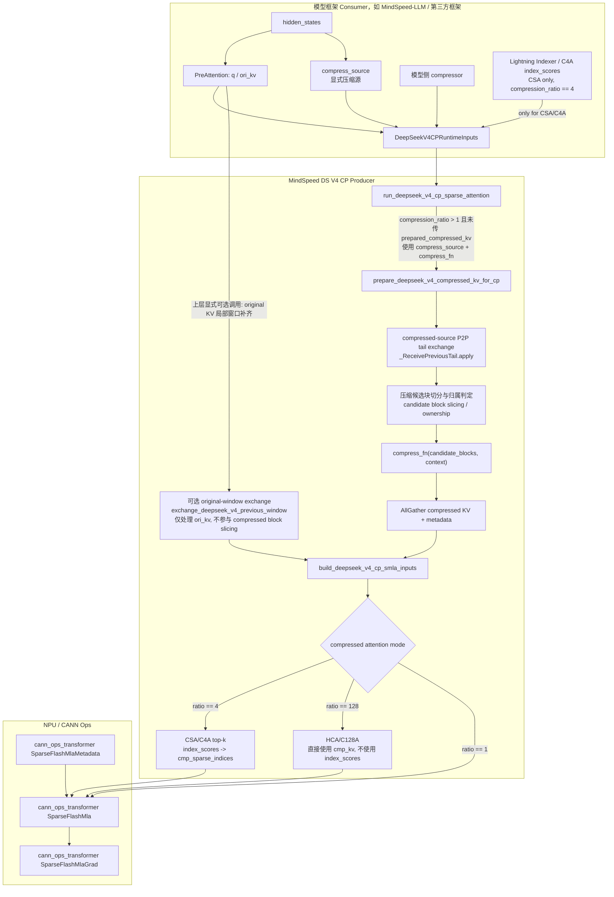
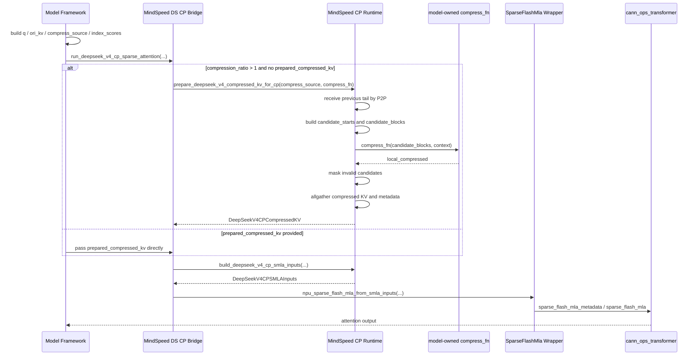
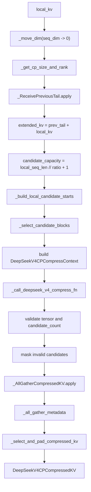
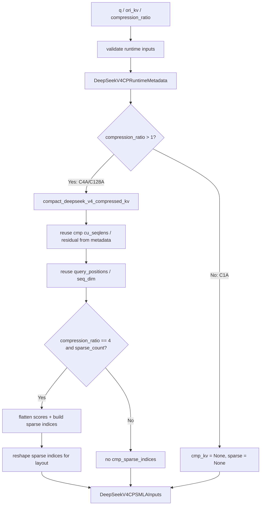
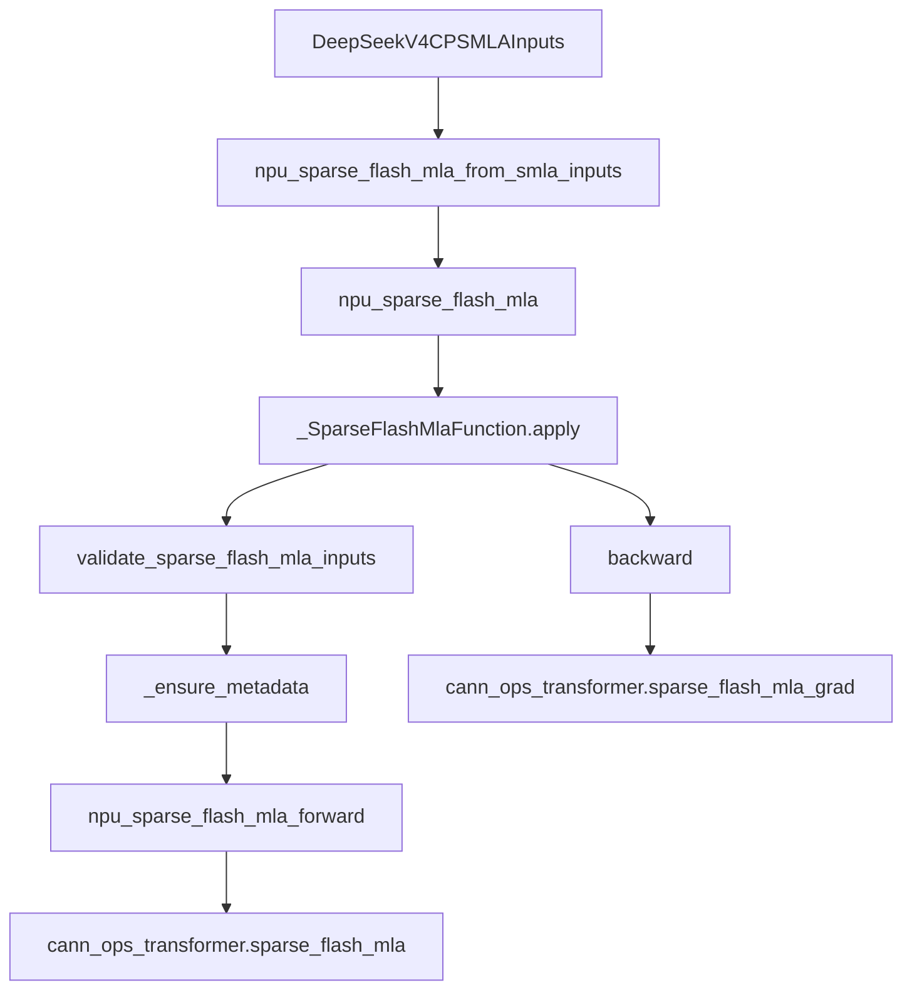
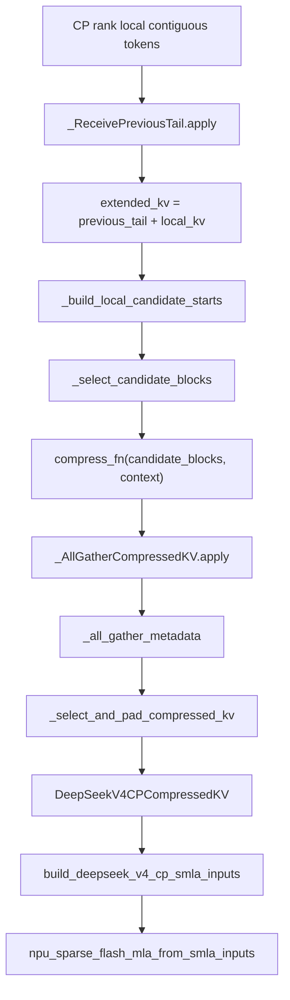
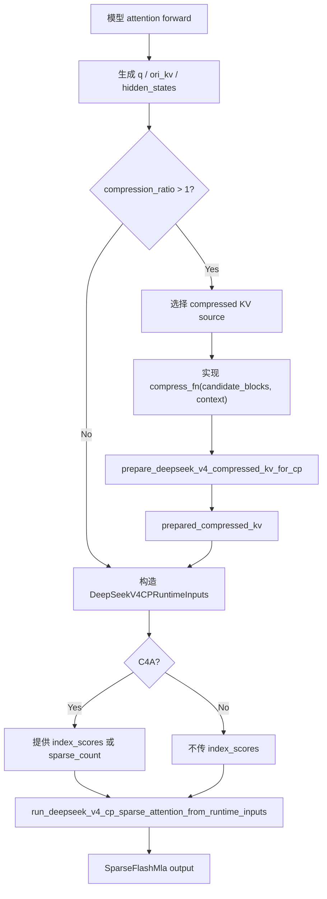
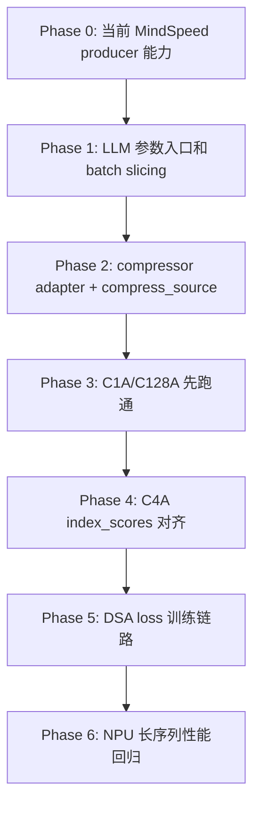
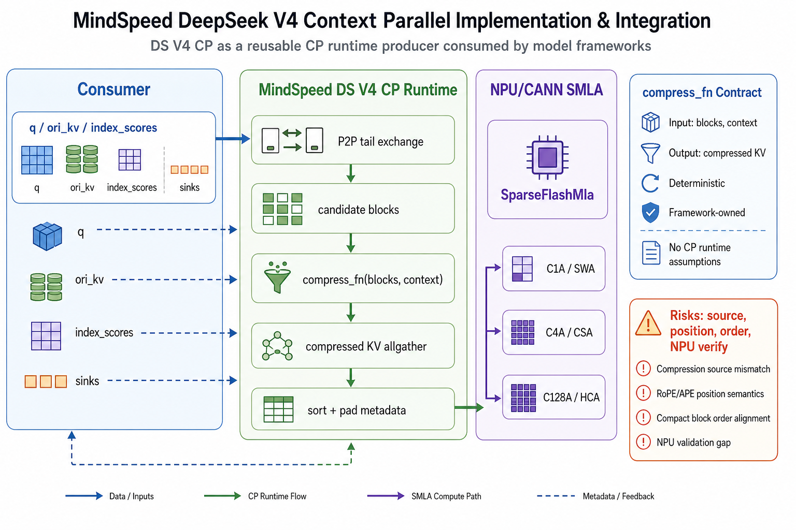

# MindSpeed DeepSeek V4 Context Parallel 方案实现与接入笔记

> 本文基于当前工作区中 MindSpeed 对 DeepSeek V4 Context Parallel 的实现，以及 MindSpeed-LLM DeepSeek4 attention/compressor/indexer 的现状，梳理 DS V4 CP 的生产者/消费者边界、核心代码路径、通信与压缩数据流、SMLA 算子接入、对外接口约束，以及第三方模型框架接入 MindSpeed DS V4 CP 时需要完成的工作。

## 1. 文档摘要

本文分析对象是 MindSpeed 中 DeepSeek V4 CP 能力的当前实现、DeepSeek V4 技术报告中的 CP 论文方案、以及上层模型框架接入方式。核心结论：MindSpeed 已实现 DS V4 CP 的通信、candidate block 选择、compressed KV allgather、runtime metadata 校验、SMLA input 构造与 SparseFlashMla bridge；最新实现已将 `compress_source` 与 `ori_kv` 显式解耦，压缩模式可通过 `compress_source + compress_fn` 自动 prepare，或直接传 `prepared_compressed_kv`；模型框架仍需补齐 compressor adapter、C4A index score 对齐和 DeepSeek4 attention 主链路接入。主要风险集中在 RoPE/APE 位置语义、compact block 顺序、真实 NPU 前反向验证、MindSpeed-LLM 当前只支持 `kvallgather_cp_algo` 的入口限制。

## 2. 整体概述

### 2.1 核心定位

DeepSeek V4 CP 的当前实现目标不是在 MindSpeed 内部完整实现某个具体 DeepSeek4 模型，而是让 MindSpeed 成为 **DS V4 CP 基础能力生产者**：

```text
MindSpeed 负责:
  - CP 组通信
  - 前序窗口 P2P exchange
  - compressed KV candidate block 选择
  - compressed KV allgather
  - compressed KV metadata / compact block order
  - runtime metadata / 输入契约校验
  - SMLA 输入构造
  - SparseFlashMla 算子 wrapper

上层模型框架负责:
  - 生成 q / ori_kv / compress source
  - 提供模型私有 compressor 数学逻辑
  - 提供或适配 C4A index_scores
  - 处理 RoPE / APE / overlap / checkpoint 参数
  - 在模型 attention forward 中调用 MindSpeed DS CP bridge
```

这个边界可以概括为：

```text
MindSpeed 管 "压哪些块、怎么跨 rank 收集、怎么喂给 SMLA"
模型框架管 "每个块如何由模型参数压缩成 compressed KV"
```

### 2.2 总体架构图



#### 2.2.1 架构分区说明

总体架构图分为 3 个职责区：

| 分区 | 职责边界 | 关键结论 |
|---|---|---|
| Consumer | 上层模型框架，如 MindSpeed-LLM 或第三方模型框架 | 负责产生模型语义相关的输入，包括 `hidden_states`、`q`、`ori_kv`、显式 `compress_source`、模型 compressor、C4A index score。 |
| MindSpeed DS V4 CP Producer | MindSpeed 提供的 DS V4 CP 基础能力 | 负责 CP 通信、压缩候选块切分与归属判定、compressed KV allgather、compact metadata、SMLA 输入构造与 attention bridge。 |
| NPU / CANN Ops | CANN 官方算子层 | 负责执行 SparseFlashMla metadata、forward 和 backward。 |

该分区体现的核心边界是：**模型框架决定模型语义，MindSpeed 负责 CP 数据组织和算子接入，CANN 负责底层融合计算**。

#### 2.2.2 图中节点逐步说明

| 节点 | 含义 | 输入 | 输出 | 归属 |
|---|---|---|---|---|
| `hidden_states` | Transformer layer attention 前的隐藏状态，是模型侧生成 query、original KV、compressor 输入和 indexer 输入的源数据。若 compressed source 是 hidden states，它只作为 `prepare_deepseek_v4_compressed_kv_for_cp` 的压缩原料进入 MindSpeed，不表示 MindSpeed 要重新计算 q/k/v。 | 上一层或 embedding 输出 | 传给 PreAttention / compressor / indexer；可作为 compressed source | Consumer |
| `PreAttention: q / ori_kv` | 模型 attention 前处理，完成 Q 投影、KV 投影、norm、RoPE 等模型侧变换，生成 SMLA 需要的 query 和 original shared KV。`q` 用于最终 attention query；`ori_kv` 用于 SparseFlashMla 的 original window attention 部分。 | `hidden_states` | `q`、`ori_kv` | Consumer |
| `模型侧 compressor` | DeepSeek V4 模型私有压缩逻辑，决定一个 token block 如何压缩成 compressed KV。当前 MindSpeed 只通过 `compress_fn` 回调消费它，不拥有具体数学实现。 | `compress_source` 切出的 candidate blocks | `compress_fn` 或已准备好的 compressed KV | Consumer |
| `Lightning Indexer / C4A index_scores` | 仅用于 C4A/CSA 路径的模型侧打分逻辑，负责给每个 query 对每个 compact compressed block 打分。HCA/C128A 不使用该节点。 | query index、key index、weights、mask 等模型侧信息 | `index_scores` | Consumer |
| `DeepSeekV4CPRuntimeInputs` | 模型框架与 MindSpeed bridge 之间的运行时契约，用一个结构集中携带 `q`、`ori_kv`、`compress_source`、`compress_fn`、`prepared_compressed_kv`、`index_scores`、`cu_seqlens`、layout 等字段。 | Consumer 侧产物 | bridge 可消费的标准输入 | Consumer |
| `run_deepseek_v4_cp_sparse_attention` | MindSpeed tensor-level bridge，串联 compressed KV 准备、SMLA input 构造和 SparseFlashMla 调用。 | `DeepSeekV4CPRuntimeInputs` 或等价参数 | attention 输出 | MindSpeed |
| `exchange_deepseek_v4_previous_window` | 可选 original-window helper，从前一个 CP rank 接收尾部窗口，并拼到当前 rank `ori_kv` 前面，用于补齐跨 rank 的 SWA 左窗口。当前 bridge 不会自动调用它。 | 当前 rank 本地 `ori_kv` 或等价 original-window tensor | 带前序窗口的 original-window tensor | MindSpeed |
| `prepare_deepseek_v4_compressed_kv_for_cp` | compressed KV 准备主函数，负责 compressed-source P2P tail exchange、candidate block 切分、调用模型 `compress_fn`、allgather compressed KV 与 metadata。自动 bridge 路径使用显式 `compress_source`，不会把 `ori_kv` 当作默认压缩源。 | compressed source、`compress_fn`、CP group、`cu_seqlens` | `DeepSeekV4CPCompressedKV` | MindSpeed |
| `compressed-source P2P tail exchange` | `prepare_deepseek_v4_compressed_kv_for_cp` 内部的第一阶段通信，先接收前一个 CP rank 的 tail，再拼出 `extended_kv`，供后续 candidate block 切分使用。 | 当前 rank compressed source | `extended_kv = prev_tail + local_source` | MindSpeed |
| `压缩候选块切分与归属判定` | 根据 `compression_ratio`、`local_seq_offset`、`cu_seqlens` 计算当前 rank 应压缩哪些原始 token block。它属于 compressed KV 生产阶段，不依赖 `index_scores`，也不是 C4A top-k。 | 本地序列、前序 tail、压缩比、sample 边界 | `candidate_blocks`、`candidate_starts`、`valid_mask` | MindSpeed |
| `compress_fn(candidate_blocks, context)` | MindSpeed 回调模型侧 compressor。`candidate_blocks` 是待压缩 token block，`context` 携带 block 全局起点、有效 mask、CP rank 等信息。 | `candidate_blocks`、`DeepSeekV4CPCompressContext` | 当前 rank 的 `local_compressed` | Consumer + MindSpeed 调用 |
| `AllGather compressed KV + metadata` | 收集所有 CP rank 的 local compressed KV、有效 mask、block start、source rank，并形成全局 compressed KV 候选集合。 | 各 rank `local_compressed` 与 metadata | gathered compressed KV 与 metadata | MindSpeed |
| `build_deepseek_v4_cp_smla_inputs` | 将 `q`、`ori_kv`、compact 后的 `cmp_kv`、C4A `cmp_sparse_indices`、`cu_seqlens`、residual 等组织成 SparseFlashMla 可消费的输入结构。`ori_kv` 在 C1A/C4A/C128A 都是 original KV 输入；C4A 会用 `index_scores` 生成 `cmp_sparse_indices`；C128A 直接使用 `cmp_kv`，不生成 `cmp_sparse_indices`。 | `q`、`ori_kv`、`DeepSeekV4CPCompressedKV`、可选 `index_scores` | `DeepSeekV4CPSMLAInputs` | MindSpeed |
| `SparseFlashMlaMetadata` | CANN metadata 构造接口，生成 SparseFlashMla forward 需要的 tiling / task metadata。 | SMLA 输入 shape、layout、mask mode、topk 等参数 | metadata tensor | NPU / CANN Ops |
| `SparseFlashMla` | CANN SparseFlashMla forward 算子，执行 C1A/SWA、C4A/CSA、C128A/HCA attention 计算。 | `DeepSeekV4CPSMLAInputs`、metadata、sinks、scale | attention output | NPU / CANN Ops |
| `SparseFlashMlaGrad` | CANN SparseFlashMla backward 算子，训练时计算 query、KV、sinks 等梯度。 | forward 保存张量与上游梯度 | backward gradients | NPU / CANN Ops |

#### 2.2.3 图中连线逐步说明

| 步骤 | 连线 | 说明 |
|---:|---|---|
| 1 | `hidden_states -> PreAttention: q / ori_kv` | 模型框架从 attention 输入中生成 query 与原始 shared KV。该步骤属于模型结构本身，MindSpeed 不替代模型的 Q/KV 投影、norm、RoPE 等逻辑。 |
| 2 | `PreAttention: q / ori_kv -> DeepSeekV4CPRuntimeInputs` | 模型把 `q`、`ori_kv` 写入运行时契约，作为 MindSpeed bridge 的核心 attention 输入。 |
| 3 | `模型侧 compressor -> DeepSeekV4CPRuntimeInputs` | 模型把压缩源以 `compress_source` 字段传给 MindSpeed，并把 compressor 以 `compress_fn` 回调形式传入；如果模型已自行准备 compressed KV，也可以直接传 `prepared_compressed_kv`。 |
| 4 | `Lightning Indexer / C4A index_scores -> DeepSeekV4CPRuntimeInputs` | 仅 C4A/CSA 路径需要模型侧提供 `index_scores`。MindSpeed 后续只负责把 score 按 compact compressed KV 顺序转换为 `cmp_sparse_indices`；HCA/C128A 不走这条边。 |
| 5 | `DeepSeekV4CPRuntimeInputs -> run_deepseek_v4_cp_sparse_attention` | 模型 attention forward 调用 MindSpeed bridge，正式进入 DS V4 CP producer 路径。 |
| 6 | `run_deepseek_v4_cp_sparse_attention -> prepare_deepseek_v4_compressed_kv_for_cp` | 当 `compression_ratio > 1` 且未传入 `prepared_compressed_kv` 时，bridge 使用 `compress_source + compress_fn` 调用 compressed KV 准备函数；若已传入 `prepared_compressed_kv`，可跳过该准备过程。 |
| 7 | `prepare_deepseek_v4_compressed_kv_for_cp -> compressed-source P2P tail exchange` | MindSpeed 先从前一个 CP rank 接收 compressed source 的 tail，并拼成 `extended_kv`。这一步发生在 candidate block 切分之前，用于补齐跨 rank 边界上的压缩 block。 |
| 8 | `compressed-source P2P tail exchange -> 压缩候选块切分与归属判定` | MindSpeed 基于 `extended_kv`、CP rank、压缩比和 sample 边界计算当前 rank 负责压缩的 block，并构造 `candidate_blocks`。 |
| 9 | `压缩候选块切分与归属判定 -> compress_fn(candidate_blocks, context)` | MindSpeed 将候选原始 token block 交给模型侧 compressor 回调。该选择只决定“哪些 block 要被压缩、由哪个 rank 负责压缩”，不需要 Lightning Indexer 或 `index_scores`。 |
| 10 | `compress_fn(candidate_blocks, context) -> AllGather compressed KV + metadata` | 模型 compressor 返回本 rank 的 compressed KV 后，MindSpeed 先 mask 无效 candidate，再跨 CP rank allgather compressed KV 与 metadata。 |
| 11 | `AllGather compressed KV + metadata -> build_deepseek_v4_cp_smla_inputs` | MindSpeed 将 gathered compressed KV compact 成连续 `cmp_kv`，并保留与 compact 顺序一致的 `block_starts`。这是 C4A index 对齐的关键步骤。 |
| 12 | `PreAttention: q / ori_kv -> exchange_deepseek_v4_previous_window` | 对需要 original KV 左窗口上下文的场景，上层可显式调用该 helper，让 MindSpeed 从前一 CP rank 拼接 `ori_kv` 尾部窗口。它不是 compressed KV candidate 切分前的内部 tail exchange。 |
| 13 | `exchange_deepseek_v4_previous_window -> build_deepseek_v4_cp_smla_inputs` | 带前序窗口的 `ori_kv` 会进入 SMLA input 构造，供 C1A/SWA 或混合 attention 使用。 |
| 14 | `build_deepseek_v4_cp_smla_inputs -> SparseFlashMla` | MindSpeed 将 `q`、`ori_kv`、`cmp_kv`、`cu_seqlens`、residual、metadata 等打包后调用 SparseFlashMla forward。C4A 会额外带上 `cmp_sparse_indices`；C128A 不允许带 `cmp_sparse_indices`。 |
| 15 | `SparseFlashMlaMetadata -> SparseFlashMla` | SparseFlashMla forward 需要 metadata 描述具体任务切分、layout 和稀疏模式；该 metadata 由 CANN wrapper 按输入参数生成或透传。 |
| 16 | `SparseFlashMla -> SparseFlashMlaGrad` | 训练反向传播时，forward 保存的上下文和上游梯度进入 SparseFlashMlaGrad，完成融合 attention 的 backward。 |

#### 2.2.4 一句话串联

完整链路可以概括为：**模型框架生成 `q/ori_kv/compress_source/compress_fn`，MindSpeed 在 compressed KV 准备阶段先做 compressed-source P2P tail exchange，再完成压缩候选块切分、压缩回调、跨 rank 收集与 compact compressed KV；只有 C4A/CSA 额外消费模型侧 `index_scores` 并生成 `cmp_sparse_indices`，HCA/C128A 直接使用 compact 后的 `cmp_kv`；最终交给 CANN SparseFlashMla 完成 attention 前反向计算**。

### 2.3 端到端顺序图



#### 2.3.1 参与方说明

| 参与方 | 对应模块 | 职责 |
|---|---|---|
| `Model Framework` | MindSpeed-LLM 或第三方模型框架 | 负责模型 attention forward，生成 `q`、`ori_kv`、`index_scores`，并决定 compressor 输入源。 |
| `MindSpeed DS CP Bridge` | `run_deepseek_v4_cp_sparse_attention` | 负责把模型侧输入串接到 MindSpeed CP runtime 和 SparseFlashMla wrapper。 |
| `MindSpeed CP Runtime` | `deepseek_v4_context_parallel.py` | 负责 P2P tail exchange、candidate block 选择、compressed KV allgather、metadata 和 SMLA input 构造。 |
| `model-owned compress_fn` | 模型侧 compressor adapter | 负责把 MindSpeed 切出的 `candidate_blocks` 压缩为 `local_compressed`。 |
| `SparseFlashMla Wrapper` | `npu_sparse_flash_mla.py` | 负责参数校验、layout normalize、metadata 补全和 CANN 算子调用。 |
| `cann_ops_transformer` | 官方 CANN transformer ops | 负责执行 SparseFlashMla metadata、forward、grad 真实算子。 |

#### 2.3.2 时序步骤说明

| 步骤 | 时序消息 | 说明 |
|---:|---|---|
| 1 | `Model -> Model: build q / ori_kv / compress_source / index_scores` | 模型框架先在本地 attention forward 内完成模型私有前处理。`q` 和 `ori_kv` 来自 PreAttention；`compress_source` 是模型选择的压缩源，可以是 `hidden_states` 或其他等长本地 shard；C4A 的 `index_scores` 来自模型侧 Lightning Indexer 或等价逻辑。 |
| 2 | `Model -> Bridge: run_deepseek_v4_cp_sparse_attention(...)` | 模型把 `q`、`ori_kv`、`compression_ratio`、`compress_source + compress_fn` 或 `prepared_compressed_kv`、`index_scores` 等传给 MindSpeed bridge。 |
| 3 | `Bridge -> CP: prepare_deepseek_v4_compressed_kv_for_cp(compress_source, compress_fn)` | 当 `compression_ratio > 1` 且未传入 `prepared_compressed_kv` 时，bridge 会自动准备 compressed KV。当前实现显式要求 `compress_source`，因此后续 P2P 和 candidate selection 针对模型选择的压缩源，而不是默认针对 `ori_kv`。 |
| 4 | `CP -> CP: receive previous tail by P2P` | CP runtime 从前一个 CP rank 接收尾部 token，用于补齐跨 rank 边界上的压缩 block。该通信对象是步骤 3 传入的本地序列张量。 |
| 5 | `CP -> CP: build candidate_starts and candidate_blocks` | MindSpeed 根据 `compression_ratio`、`local_seq_offset`、`cu_seqlens` 和前序 tail 计算当前 rank 负责压缩的 block 起点，并切出固定容量的 `candidate_blocks`。 |
| 6 | `CP -> Fn: compress_fn(candidate_blocks, context)` | MindSpeed 调用模型侧 compressor adapter。`context` 提供 `candidate_starts`、`valid_mask`、`cp_rank`、`cu_seqlens` 等信息，便于模型侧处理位置语义和无效 block。 |
| 7 | `Fn --> CP: local_compressed` | 模型侧 compressor 返回当前 rank 的 compressed KV。返回张量第 0 维必须等于 `candidate_capacity`，以便后续 allgather 对齐。 |
| 8 | `CP -> CP: mask invalid candidates` | MindSpeed 将无效 candidate 对应的 compressed KV 置零，避免 padding block 参与后续全局 compact 和 attention。 |
| 9 | `CP -> CP: allgather compressed KV and metadata` | 每个 CP rank 交换本地 compressed KV、valid mask、block starts、source rank 等 metadata，形成全局 compressed KV 候选集合。 |
| 10 | `CP --> Bridge: DeepSeekV4CPCompressedKV` | CP runtime 返回 `compressed_kv + metadata`。metadata 中的 `block_starts` 是后续 compact 顺序和 C4A index 对齐的核心依据。 |
| 11 | `Model -> Bridge: pass prepared_compressed_kv directly` | 如果模型已经自己完成 compressed KV 准备，可以直接传入 `prepared_compressed_kv`，bridge 会跳过步骤 3 到步骤 10。这适合复用既有压缩缓存或由模型侧完全自管 metadata 的场景。 |
| 12 | `Bridge -> CP: build_deepseek_v4_cp_smla_inputs(...)` | bridge 调用 SMLA input 构造函数，把 `q`、`ori_kv`、compact `cmp_kv`、`cmp_sparse_indices`、`cu_seqlens`、residual、metadata 打包成 `DeepSeekV4CPSMLAInputs`。 |
| 13 | `CP --> Bridge: DeepSeekV4CPSMLAInputs` | CP runtime 返回 SMLA-facing 输入结构。C1A 不包含 `cmp_kv`；C4A 包含 `cmp_kv` 和 `cmp_sparse_indices`；C128A 包含 `cmp_kv`，但不需要 `cmp_sparse_indices`。 |
| 14 | `Bridge -> SMLA: npu_sparse_flash_mla_from_smla_inputs(...)` | bridge 将 SMLA 输入交给 MindSpeed wrapper，wrapper 负责 layout、dtype、topk、mask mode、metadata 等校验和适配。 |
| 15 | `SMLA -> CANN: sparse_flash_mla_metadata / sparse_flash_mla` | wrapper 调用 CANN 官方 metadata 和 forward 算子；训练反向时再通过 autograd wrapper 调用 grad 算子。 |
| 16 | `CANN --> Model: attention output` | CANN forward 输出 local attention result，返回模型 attention forward，后续继续执行输出投影、TP/PP 等模型主链路。 |

#### 2.3.3 两个 compressed KV 分支的区别

| 分支 | 触发条件 | 数据源 | 优点 | 风险 |
|---|---|---|---|---|
| bridge 自动准备 | `compression_ratio > 1` 且未传入 `prepared_compressed_kv` | 显式 `compress_source`，其本地序列长度必须与 `ori_kv` local shard 一致 | 接入简单，复用 MindSpeed P2P、candidate selection、allgather 和 metadata，同时保留 `ori_kv` 与压缩源分离 | 模型侧必须保证 `compress_source`、`compress_fn`、`cu_seqlens_ori_kv` 和 `local_seq_offset` 的位置语义一致。 |
| 模型直接传入 | 模型传入 `prepared_compressed_kv` | 由模型侧自行决定，可以来自 `hidden_states`、`ori_kv` 或其他模型私有 source | 能严格表达模型 compressor 语义，适合已有压缩缓存或自定义 metadata 路径 | 模型侧需要正确生成 metadata，尤其是 `valid_mask`、`block_starts`、`compression_ratio` 和 compact 顺序。 |

#### 2.3.4 顺序图关键结论

顺序图表达的是一条 **consumer 调用 MindSpeed producer，再进入 CANN 算子** 的执行链路。当前 MindSpeed bridge 已经能完成 CP 通信、compressed KV 准备、SMLA input 构造和算子调用，但模型框架仍必须负责模型语义相关部分，尤其是 **compressor 输入源、C4A index score、RoPE/APE 位置对齐和 attention 主链路接入**。

### 2.4 核心源码路径

| 模块 | 路径 | 关键职责 |
|---|---|---|
| DS V4 CP 核心模块 | `MindSpeed-mul/MindSpeed/mindspeed/core/context_parallel/deepseek_v4_context_parallel/deepseek_v4_context_parallel.py` | dataclass 契约、P2P tail exchange、candidate block 选择、compressed KV allgather、runtime metadata 校验、SMLA input 构造、C4A sparse indices |
| DS V4 attention bridge | `MindSpeed-mul/MindSpeed/mindspeed/core/context_parallel/deepseek_v4_context_parallel/deepseek_v4_attention.py` | tensor-level bridge，先执行 runtime input 校验，再串联 compressed KV 准备、SMLA input 构造、SparseFlashMla 调用 |
| SMLA 算子 wrapper | `MindSpeed-mul/MindSpeed/mindspeed/ops/npu_sparse_flash_mla.py` | 加载 `cann_ops_transformer` 官方 SparseFlashMla / metadata / grad，封装校验和 autograd |
| DS V4 CP 包导出 | `MindSpeed-mul/MindSpeed/mindspeed/core/context_parallel/deepseek_v4_context_parallel/__init__.py` | 对上层导出 runtime inputs、prepare、bridge、helper |
| MindSpeed CP 参数入口 | `MindSpeed-mul/MindSpeed/mindspeed/arguments.py` | MindSpeed 侧已包含 `deepseek_v4_cp_algo` 选项与基础校验 |
| 通用 DotProductAttention 阻断 | `MindSpeed-mul/MindSpeed/mindspeed/core/transformer/dot_product_attention.py` | 标准 DotProductAttention 不支持 DS V4 CP，必须走专用 bridge |
| MindSpeed-LLM DeepSeek4 attention | `MindSpeed-LLM/mindspeed_llm/tasks/models/transformer/deepseek4/g2_attention.py` | 当前 DeepSeek4 attention 主链路，已有 compressor/indexer，但尚未消费 MindSpeed DS CP bridge |
| MindSpeed-LLM compressor | `MindSpeed-LLM/mindspeed_llm/tasks/models/transformer/deepseek4/compressor.py` | 模型侧压缩数学，签名为 `forward(x, start_pos, freqs_cis)` |
| MindSpeed-LLM DSA indexer | `MindSpeed-LLM/mindspeed_llm/tasks/models/transformer/dsa_indexer.py` | 生成 compressed sparse topk / score，当前逻辑围绕 kvallgather 路径 |

### 2.5 关键指标

| 指标 | 当前状态 |
|---|---|
| MindSpeed DS CP dataclass | 6 个：`DeepSeekV4CPMetadata`、`DeepSeekV4CPCompressedKV`、`DeepSeekV4CPCompressContext`、`DeepSeekV4CPSMLAInputs`、`DeepSeekV4CPRuntimeInputs`、`DeepSeekV4CPRuntimeMetadata` |
| 主要对外 helper / bridge | 约 13 个，集中在 `__init__.py` 导出 |
| 支持 attention 模式 | `compression_ratio` 为 1、4、128，对应 C1A/SWA、C4A/CSA、C128A/HCA |
| 当前 CPU/mock 覆盖 | CP adapter、runtime metadata validator、attention bridge、SMLA wrapper、Lightning Indexer wrapper |
| 当前缺口 | MindSpeed-LLM attention 主链路未接入 `deepseek_v4_cp_algo`；真实 NPU 前反向与长序列组合待验证 |

## 3. 核心模块分析

### 3.1 数据结构与运行时契约

#### 3.1.1 模块职责与边界

`deepseek_v4_context_parallel.py` 中定义了 DS V4 CP 的核心数据结构。主要 dataclass 位于该文件开头：

- `DeepSeekV4CPMetadata`：记录 compressed KV 的有效性、block 全局起点、来源 rank、local metadata、压缩比、local 序列长度与 output size，见 `deepseek_v4_context_parallel.py:11-20`。
- `DeepSeekV4CPCompressedKV`：将 `compressed_kv` 与 metadata 绑定，见 `deepseek_v4_context_parallel.py:23-26`。
- `DeepSeekV4CPCompressContext`：传给模型侧 `compress_fn` 的 CP 元数据上下文，见 `deepseek_v4_context_parallel.py:29-48`。
- `DeepSeekV4CPSMLAInputs`：SMLA-facing 输入结构，见 `deepseek_v4_context_parallel.py:51-64`。
- `DeepSeekV4CPRuntimeInputs`：生产者/消费者运行时契约，供模型框架调用 bridge，见 `deepseek_v4_context_parallel.py:67-95`。
- `DeepSeekV4CPRuntimeMetadata`：bridge 与 SMLA input 构造共享的已校验运行时元数据，见 `deepseek_v4_context_parallel.py:97-112`。

#### 3.1.2 关键数据结构

```python
# MindSpeed-mul/MindSpeed/mindspeed/core/context_parallel/deepseek_v4_context_parallel/deepseek_v4_context_parallel.py:29
@dataclass
class DeepSeekV4CPCompressContext:
    candidate_starts: torch.Tensor
    valid_mask: torch.Tensor
    local_seq_offset: int
    local_seq_len: int
    total_seq_len: int
    compression_ratio: int
    candidate_capacity: int
    cp_size: int
    cp_rank: int
    seq_dim: int
    cu_seqlens: Optional[Sequence[int]]
```

`DeepSeekV4CPCompressContext` 是当前解耦设计的关键。它让模型侧 compressor 不需要知道 MindSpeed 内部通信实现，但可以知道：

| 字段 | 语义 | 上层用途 |
|---|---|---|
| `candidate_starts` | 每个 candidate block 的全局起始 token 位置，无效 block 为 `-1` | 对齐 RoPE / APE / sample boundary |
| `valid_mask` | 标记 candidate 是否有效 | 跳过 padding candidate，避免副作用 |
| `local_seq_offset` | 当前 rank 本地序列全局起点 | 计算位置偏移 |
| `local_seq_len` | 当前 rank 本地序列长度 | shape 校验 |
| `total_seq_len` | CP 合并后的总长度 | 位置边界校验 |
| `compression_ratio` | 压缩比例 | 与模型 compressor 参数一致性校验 |
| `candidate_capacity` | 当前 rank 固定 candidate 容量 | 输出第 0 维必须一致 |
| `cp_size` / `cp_rank` | CP 组信息 | 调试、rank-aware 逻辑 |
| `seq_dim` | 输入张量序列维 | adapter reshape |
| `cu_seqlens` | packed sequence 边界 | 防止跨样本压缩 |

#### 3.1.3 依赖关系


#### 3.1.4 依赖图说明

| 节点 | 角色 | 说明 |
|---|---|---|
| `DeepSeekV4CPRuntimeInputs` | 对外契约 | 上层模型框架传给 MindSpeed 的 runtime 输入集合，包含 `q`、`ori_kv`、`compression_ratio`、`compress_source`、`compress_fn`、`prepared_compressed_kv`、`index_scores` 等字段。 |
| `run_deepseek_v4_cp_sparse_attention` | bridge 入口 | MindSpeed DS V4 CP 的 tensor-level attention bridge，先执行 runtime input 校验，再决定是否准备 compressed KV，并串接 SMLA input 与算子调用。 |
| `validate_deepseek_v4_cp_runtime_inputs` | 契约校验 | 统一校验 layout、tensor shape、`cu_seqlens`、`query_positions`、`compress_source`、`prepared_compressed_kv` 与压缩模式必需输入。 |
| `DeepSeekV4CPRuntimeMetadata` | 已校验元数据 | 保存解析后的 `query_positions`、`cu_seqlens_*`、`seqused_*`、`cmp_residual_kv`、seq_dim 与 `local_seq_offset`，供 prepare 与 SMLA input 构造复用。 |
| `prepare_deepseek_v4_compressed_kv_for_cp` | compressed KV 准备 | 在压缩模式下执行 P2P tail exchange、candidate block 选择、模型侧 `compress_fn` 调用和 compressed KV allgather。 |
| `DeepSeekV4CPCompressedKV` | 中间结果 | 绑定 allgather 后的 `compressed_kv` 与 metadata，metadata 记录 `valid_mask`、`block_starts`、`source_rank` 等信息。 |
| `build_deepseek_v4_cp_smla_inputs` | SMLA 输入构造 | 将 `q`、`ori_kv`、compact `cmp_kv`、C4A `cmp_sparse_indices`、`cu_seqlens` 和 residual 组装成算子输入。 |
| `DeepSeekV4CPSMLAInputs` | 算子输入包 | 面向 SparseFlashMla wrapper 的结构化输入，屏蔽上游 CP metadata 与下游算子参数之间的差异。 |
| `npu_sparse_flash_mla_from_smla_inputs` | 算子桥接 | 从 `DeepSeekV4CPSMLAInputs` 提取参数，调用 MindSpeed SMLA wrapper 和 CANN 官方算子。 |

| 步骤 | 依赖流转 | 说明 |
|---:|---|---|
| 1 | `DeepSeekV4CPRuntimeInputs -> run_deepseek_v4_cp_sparse_attention` | 模型框架把运行时输入交给 MindSpeed bridge，bridge 成为 DS V4 CP 的统一消费入口。 |
| 2 | `run_deepseek_v4_cp_sparse_attention -> validate_deepseek_v4_cp_runtime_inputs` | bridge 先统一校验 producer/consumer 契约，避免后续 CP 通信或 SMLA 调用才暴露 layout/shape 错误。 |
| 3 | `validate -> DeepSeekV4CPRuntimeMetadata` | 校验层返回解析后的 seq_dim、默认 query positions、compressed-side `cu_seqlens` 和 residual。 |
| 4 | `RuntimeMetadata -> prepare_deepseek_v4_compressed_kv_for_cp` | 当 `compression_ratio > 1` 且未传入 `prepared_compressed_kv` 时，bridge 使用显式 `compress_source`、已解析的 `ori_kv_seq_dim`、`cu_seqlens_ori_kv` 和 `local_seq_offset` 准备 compressed KV。 |
| 5 | `prepare -> DeepSeekV4CPCompressedKV` | CP runtime 输出压缩后的 KV 以及与其对齐的 metadata。 |
| 6 | `RuntimeMetadata + DeepSeekV4CPCompressedKV -> build_deepseek_v4_cp_smla_inputs` | SMLA input 构造函数复用已校验 metadata，完成 compact、packed sequence 和 C4A index 适配。 |
| 7 | `build_deepseek_v4_cp_smla_inputs -> DeepSeekV4CPSMLAInputs` | 生成统一的 SMLA-facing 输入结构。 |
| 8 | `DeepSeekV4CPSMLAInputs -> npu_sparse_flash_mla_from_smla_inputs` | MindSpeed SMLA wrapper 从结构化输入进入 CANN SparseFlashMla 调用。 |

关键结论：这张图说明 **runtime contract -> runtime metadata validator -> CP compressed KV -> SMLA input -> CANN wrapper** 的单向依赖链。模型侧不应绕过 `DeepSeekV4CPRuntimeInputs` 和 runtime validator 直接拼算子参数，否则容易破坏 layout 约束、compact block 顺序、packed sequence metadata 和 C4A index 对齐。

#### 3.1.5 运行时元数据与契约校验

最近一次实现新增了 `DeepSeekV4CPRuntimeMetadata`、`build_deepseek_v4_cp_runtime_metadata` 和 `validate_deepseek_v4_cp_runtime_inputs`，使 bridge 在执行 CP 通信与 SMLA input 构造前先得到一份统一的已校验元数据。

| 字段 | 来源 | 用途 |
|---|---|---|
| `query_positions` | 显式参数或由 `cu_seqlens_q`、`cu_seqlens_ori_kv`、`local_seq_offset` 推导 | C4A visibility、默认 sparse indices、packed sequence 边界校验 |
| `cu_seqlens_q` | 显式参数或按 layout 默认生成 | 描述 local query token 边界 |
| `cu_seqlens_ori_kv` | 显式参数、通用 `cu_seqlens` 或默认生成 | 描述 original KV 的全局 sample 边界 |
| `cu_seqlens_cmp_kv` | 当 `compression_ratio > 1` 时由 `cu_seqlens_ori_kv` 推导 | 描述 compressed KV 侧 sample 边界 |
| `seqused_ori_kv` / `seqused_cmp_kv` | 由对应 `cu_seqlens` 差分得到 | 传给 SMLA 的有效长度信息 |
| `cmp_residual_kv` | `sample_len % compression_ratio` | 恢复 compressed-side mask 的尾部余数 |
| `q_seq_dim` / `ori_kv_seq_dim` / `cmp_seq_dim` | 由 `layout_q/layout_kv` 解析 | 避免 TND/BSND 下序列维混用 |
| `local_seq_offset` | 显式传入或由 CP rank 与本地长度推导 | 默认 query position 与 CP shard 全局位置对齐 |

当前校验层覆盖以下约束：

| 校验项 | 代码依据 | 失败影响 |
|---|---|---|
| `layout_q/layout_kv` 只能是 `TND` 或 `BSND` 且二者一致 | `deepseek_v4_context_parallel.py:772-778` | 避免桥接层误接 SBND 或混合 layout |
| q / ori_kv 维度与 head_dim 一致 | `deepseek_v4_context_parallel.py:784-801` | 避免 SMLA wrapper 后置报 shape 错 |
| shared KV 要求 `num_heads_kv=1` | `deepseek_v4_context_parallel.py:797-799` | 对齐 DeepSeek V4 shared-KV 路径 |
| `cu_seqlens_q` 最后一个 offset 必须等于 local query token 数 | `deepseek_v4_context_parallel.py:344-350` | 避免 query token 数与 TND metadata 不一致 |
| `query_positions` 必须落在 `cu_seqlens_ori_kv` 边界内 | `deepseek_v4_context_parallel.py:939-947` | 避免 C4A visibility 跨样本或越界 |
| 压缩模式下 `query_positions` 必须与 `local_seq_offset` 和 `cu_seqlens` 对齐 | `deepseek_v4_context_parallel.py:950-967` | 避免 CP shard 使用错误的全局位置 |
| 压缩模式必须提供 `prepared_compressed_kv`，或同时提供 `compress_source + compress_fn` | `deepseek_v4_context_parallel.py:434-444` | 避免进入 compressed path 后无压缩源或压缩回调 |
| `compress_source` 必须是 tensor 且本地序列长度与 `ori_kv` 一致 | `deepseek_v4_context_parallel.py:1009-1019` | 避免 candidate block 切分与 original KV shard 位置语义错位 |
| BSND 压缩模式当前限制 `batch_size=1` | `deepseek_v4_context_parallel.py:450-454` | 因 `DeepSeekV4CPMetadata` 当前只保存一套 compressed block order |
| `prepared_compressed_kv` 类型、layout、head_dim、metadata shape 与 `output_size` 一致 | `deepseek_v4_context_parallel.py:970-1008` | 避免 compact 后 block order 与实际 compressed KV 不一致 |

这层校验的直接收益是：bridge 与 `build_deepseek_v4_cp_smla_inputs` 使用同一份 `DeepSeekV4CPRuntimeMetadata`，`ori_kv_seq_dim`、`cmp_seq_dim`、默认 `query_positions` 和 compressed-side metadata 不再各自推导，减少 TND/BSND、packed sequence、CP offset 三类错误。

### 3.2 compressed KV 准备：`prepare_deepseek_v4_compressed_kv_for_cp`

#### 3.2.1 模块职责与边界

`prepare_deepseek_v4_compressed_kv_for_cp` 是 MindSpeed DS V4 CP 的核心函数，定义在 `deepseek_v4_context_parallel.py:114-224`。它负责：

1. 将输入张量移动为 seq-first 布局。
2. 获取 CP size / rank。
3. 用 P2P 获取前一 rank 尾部 token。
4. 构造跨 rank 边界完整的 `extended_kv`。
5. 计算当前 rank 负责压缩的 candidate block 起点。
6. 从 `extended_kv` 切出 `candidate_blocks`。
7. 构造 `DeepSeekV4CPCompressContext` 并调用模型侧 `compress_fn`。
8. 校验输出类型与第 0 维。
9. mask 掉 padding candidate。
10. allgather 各 rank 的 compressed KV 与 metadata。
11. 按全局 block 起点排序并 pad 成固定 output size。

#### 3.2.2 内部流程图



**流程节点说明**

| 节点 | 说明 |
|---|---|
| `local_kv` | 当前 rank 的本地序列张量。在 bridge 自动准备 compressed KV 时，该张量来自显式 `compress_source`；如果模型希望基于 `hidden_states` 压缩，应把本地 hidden-state shard 作为 `compress_source`。 |
| `_move_dim(seq_dim -> 0)` | 将序列维移动到第 0 维，统一后续 P2P、block selection 和 allgather 的处理方式。 |
| `_get_cp_size_and_rank` | 获取 CP 组大小和当前 rank，用于计算全局位置和通信 peer。 |
| `_ReceivePreviousTail.apply` | 从前一个 CP rank 接收尾部 token，同时在 backward 中把梯度传回对应 rank。 |
| `extended_kv = prev_tail + local_kv` | 将前序 tail 拼到本地序列前，形成可覆盖跨 rank 边界 block 的输入。 |
| `candidate_capacity` | 当前 rank 固定候选容量，公式为 `local_seq_len // ratio + 1`，多出的 1 用于容纳跨 rank 边界候选。 |
| `_build_local_candidate_starts` | 计算当前 rank 应负责压缩的 block 全局起点，packed sequence 场景下避免跨样本压缩。 |
| `_select_candidate_blocks` | 根据 candidate start 从 `extended_kv` 中切出待压缩 token block。 |
| `DeepSeekV4CPCompressContext` | 传给模型侧 `compress_fn` 的上下文，包含 block 起点、有效 mask、CP rank、压缩比和 `cu_seqlens`。 |
| `_call_deepseek_v4_compress_fn` | 兼容 `compress_fn(candidate_blocks)`、`compress_fn(candidate_blocks, context)` 和 keyword context 三种调用形式。 |
| `validate tensor and candidate_count` | 校验 compressor 返回值必须是 tensor，且第 0 维必须等于 `candidate_capacity`。 |
| `mask invalid candidates` | 将 padding candidate 对应输出置零，避免无效 block 污染 allgather 结果。 |
| `_AllGatherCompressedKV.apply` | allgather 所有 CP rank 的 compressed KV，并在 backward 中切回本 rank 梯度。 |
| `_all_gather_metadata` | allgather `valid_mask`、`block_starts` 等 metadata。 |
| `_select_and_pad_compressed_kv` | 根据 `valid_mask` 与 `block_starts` 选择有效 compressed KV，按全局起点排序，并 padding 到固定输出长度。 |
| `DeepSeekV4CPCompressedKV` | 返回给 bridge 的结构化结果，包含 padded compressed KV 和对齐 metadata。 |

**流程步骤说明**

| 步骤 | 流转 | 说明 |
|---:|---|---|
| 1 | `local_kv -> _move_dim` | 统一序列维，避免不同调用方 layout 差异影响 CP 逻辑。 |
| 2 | `_move_dim -> _get_cp_size_and_rank` | 以 seq-first 张量为基础获取本 rank 的 CP 上下文。 |
| 3 | `_get_cp_size_and_rank -> _ReceivePreviousTail.apply` | 根据 CP rank 找到前后 peer，执行第一阶段 P2P tail exchange。 |
| 4 | `_ReceivePreviousTail.apply -> extended_kv` | 将收到的前序 tail 与本地序列拼接，补齐跨 rank block 所需 token。 |
| 5 | `extended_kv -> candidate_capacity` | 先确定固定输出容量，保证不同 rank 可以安全 allgather。 |
| 6 | `candidate_capacity -> _build_local_candidate_starts` | 计算当前 rank 负责的 compressed block 起点。 |
| 7 | `_build_local_candidate_starts -> _select_candidate_blocks` | 从拼接后的 `extended_kv` 中切出候选 block。 |
| 8 | `_select_candidate_blocks -> DeepSeekV4CPCompressContext` | 为模型侧 compressor 准备位置、mask 和 CP 元数据。 |
| 9 | `context -> _call_deepseek_v4_compress_fn` | 调用模型侧压缩数学，MindSpeed 不拥有具体 compressor 参数和计算逻辑。 |
| 10 | `compress_fn -> validate` | 防止 compressor 返回非 tensor 或 candidate 维度不一致。 |
| 11 | `validate -> mask invalid candidates` | 清理无效 candidate，保留固定 shape。 |
| 12 | `mask -> _AllGatherCompressedKV.apply` | 执行第二阶段 compressed KV allgather。 |
| 13 | `_AllGatherCompressedKV.apply -> _all_gather_metadata` | 同步各 rank metadata，使每个 rank 都能重建全局 compressed block 顺序。 |
| 14 | `_all_gather_metadata -> _select_and_pad_compressed_kv` | 依据 `block_starts` select-and-pad，得到全局顺序稳定的 compressed KV。 |
| 15 | `_select_and_pad_compressed_kv -> DeepSeekV4CPCompressedKV` | 输出给后续 SMLA input 构造流程。 |

关键结论：这张图完整覆盖论文 CP 的两阶段通信：**先 P2P 补齐跨 rank compressed source，再 allgather compressed KV 与 metadata**。当前自动路径的 P2P 源是 `local_kv`，在 bridge 中即显式传入的 `compress_source`；`ori_kv` 只作为 SparseFlashMla 的 original KV 输入，不再被默认复用为压缩源。

#### 3.2.3 关键代码片段

```python
# deepseek_v4_context_parallel.py:144-167
prev_tail = _ReceivePreviousTail.apply(
    local_kv_seq_first,
    compression_ratio,
    cp_group,
    _resolve_global_ranks(cp_group, cp_size, cp_global_ranks),
)
extended_kv = torch.cat((prev_tail, local_kv_seq_first), dim=0)

candidate_capacity = local_seq_len // compression_ratio + 1
candidate_starts = _build_local_candidate_starts(...)
candidate_blocks = _select_candidate_blocks(...)
```

这段实现对应 DS V4 CP 的第一阶段通信：当前 rank 从前一 rank 接收尾部 token，以便构造跨 rank 边界的完整压缩 block。

```python
# deepseek_v4_context_parallel.py:180-202
compress_context = DeepSeekV4CPCompressContext(...)
local_compressed = _call_deepseek_v4_compress_fn(
    compress_fn, candidate_blocks, compress_context
)
if not torch.is_tensor(local_compressed):
    raise TypeError("compress_fn must return a torch.Tensor.")
if local_compressed.shape[0] != candidate_capacity:
    raise ValueError(...)

local_compressed = local_compressed * _view_as_broadcast_mask(
    local_valid_mask, local_compressed
)
```

这里体现了 MindSpeed 与模型框架的核心分工：MindSpeed 选 block，模型侧压缩 block，MindSpeed 再统一校验与 mask padding candidate。

#### 3.2.4 candidate block 选择规则

candidate 起点选择由 `_build_local_candidate_starts` 完成，定义在 `deepseek_v4_context_parallel.py:1285-1309`。

核心规则：

```python
# deepseek_v4_context_parallel.py:1297-1303
for sample_start, sample_end in sample_boundaries:
    block_start = sample_start
    while block_start + compression_ratio <= sample_end:
        block_end = block_start + compression_ratio
        if local_start < block_end <= local_end:
            starts.append(block_start)
        block_start += compression_ratio
```

含义：

```text
一个 compressed block 归属于 "block_end 落入当前 rank 本地序列范围" 的 rank。

block_start 可以位于前一 rank；
block_end 在当前 rank；
当前 rank 通过 prev_tail + local_kv 拼出完整 block。
```

示例：

```text
compression_ratio = 4
rank 0: token [0, 1, 2, 3, 4, 5]
rank 1: token [6, 7, 8, 9, 10, 11]

block [4, 5, 6, 7] 的 block_start=4, block_end=8
如果 rank 1 的 local_start=6, local_end=12:
  6 < 8 <= 12 成立
  该 block 由 rank 1 压缩
  rank 1 通过 prev_tail 拿到 token [4, 5]
```

#### 3.2.5 allgather 与 metadata 排序

第二阶段通信由 `_AllGatherCompressedKV` 完成，定义在 `deepseek_v4_context_parallel.py:1340-1363`。forward 调用 `dist.all_gather` 收集所有 rank 的 `local_compressed`，backward 对 `grad_output` 做 all-reduce 后取回本 rank 对应切片。

metadata 收集由 `_all_gather_metadata` 完成，定义在 `deepseek_v4_context_parallel.py:1365-1371`。

收集后 `_select_and_pad_compressed_kv` 根据 `block_starts` 排序并 pad，定义在 `deepseek_v4_context_parallel.py:1392-1449`。

```python
# deepseek_v4_context_parallel.py:1404-1437
valid_indices = torch.nonzero(gathered_valid_mask, as_tuple=False).view(-1)
valid_starts = gathered_block_starts.index_select(0, valid_indices)
order = torch.argsort(valid_starts)
selected_indices = valid_indices.index_select(0, order)
selected = gathered_compressed.index_select(0, selected_indices)
pad_len = output_size - selected.shape[0]
```

输出顺序不是 rank 顺序，而是 **按 compressed block 的全局起始位置升序排列**。这点对 C4A index score 对齐非常重要。

### 3.3 前序窗口交换：`exchange_deepseek_v4_previous_window`

#### 3.3.1 模块职责

`exchange_deepseek_v4_previous_window` 定义在 `deepseek_v4_context_parallel.py:227-248`，作用是将前一 CP rank 的尾部窗口 prepend 到当前本地张量前面。

它面向 original KV attention window 场景，而不是 compressed KV allgather 场景。完整 DS V4 CP attention 中，原始 KV 通常用于局部窗口注意力，compressed KV 用于更长历史。

#### 3.3.2 关键代码

```python
# deepseek_v4_context_parallel.py:239-248
prev_window = _ReceivePreviousTail.apply(...)
if cp_rank == 0 and not pad_first_rank:
    return local_tensor
windowed = torch.cat((prev_window, local_seq_first), dim=0)
return _move_dim(windowed, 0, seq_dim).contiguous()
```

注意：当前 `run_deepseek_v4_cp_sparse_attention` bridge 不会自动调用这个函数。第三方模型框架需要根据自身 attention window 语义，在构造 `ori_kv` 时显式调用或等价处理。

### 3.4 SMLA input 构造：`build_deepseek_v4_cp_smla_inputs`

#### 3.4.1 模块职责

`build_deepseek_v4_cp_smla_inputs` 定义在 `deepseek_v4_context_parallel.py:563-641`，负责把 q、ori_kv、prepared compressed KV、runtime metadata、C4A sparse indices 组合成 `DeepSeekV4CPSMLAInputs`。

它主要做四类事情：

1. 调用 `validate_deepseek_v4_cp_runtime_inputs` 获取统一的 `DeepSeekV4CPRuntimeMetadata`。
2. 对 compressed KV 去 padding，生成 compact `cmp_kv` 与 `block_starts`。
3. 复用 runtime metadata 中的 `cu_seqlens_cmp_kv`、`seqused_*`、`cmp_residual_kv`、seq_dim 和 `query_positions`。
4. 对 C4A 根据 `query_positions`、`block_starts` 与可选 `index_scores` 构造 `cmp_sparse_indices`，并在 BSND 下执行 score flatten 与 sparse index reshape。

#### 3.4.2 内部流程图



**流程节点说明**

| 节点 | 说明 |
|---|---|
| `q / ori_kv / compression_ratio` | SMLA input 构造的基础输入。`q` 是 query，`ori_kv` 是原始 shared KV，`compression_ratio` 决定 C1A/C4A/C128A 分支。 |
| `validate runtime inputs` | 调用 `validate_deepseek_v4_cp_runtime_inputs`，统一校验 layout、shape、`cu_seqlens`、`query_positions` 和 prepared compressed KV。 |
| `DeepSeekV4CPRuntimeMetadata` | 已校验的运行时元数据，包含 `query_positions`、`cu_seqlens_*`、`seqused_*`、`cmp_residual_kv`、seq_dim 和 `local_seq_offset`。 |
| `compression_ratio > 1?` | attention 模式分叉。`1` 表示 C1A/SWA，不需要 compressed KV；`4/128` 表示需要 compressed KV。 |
| `cmp_kv = None, sparse = None` | C1A/SWA 路径，只使用原始 KV 和窗口 mask，不构造 compressed KV 相关输入。 |
| `compact_deepseek_v4_compressed_kv` | 去除 prepared compressed KV 中的 padding entry，得到 compact `cmp_kv` 和与其一一对应的 `block_starts`。 |
| `reuse cmp cu_seqlens / residual from metadata` | 复用 runtime metadata 里已经推导好的 compressed 侧 `cu_seqlens_cmp_kv`、`seqused_cmp_kv` 与 `cmp_residual_kv`。 |
| `reuse query_positions / seq_dim` | 复用 runtime metadata 里的 `query_positions`、`q_seq_dim`、`ori_kv_seq_dim` 与 `cmp_seq_dim`，避免重复推导。 |
| `compression_ratio == 4 and sparse_count?` | C4A/CSA 专用分支。只有 ratio 为 4 且需要 sparse top-k 时才构造 `cmp_sparse_indices`。 |
| `flatten scores + build sparse indices` | TND 直接使用 `[T, block_count]` score；BSND 的 `[B, S, block_count]` score 会先 flatten 为 `[B*S, block_count]` 后参与 topk。 |
| `reshape sparse indices for layout` | C4A sparse index 先以 flat 形式生成，BSND 下再 reshape 回 `[B, S, topk]`。 |
| `no cmp_sparse_indices` | C128A/HCA 不需要 top-k sparse indices；C4A 若不传 `sparse_count` 也不会构造。 |
| `DeepSeekV4CPSMLAInputs` | 最终 SMLA-facing 输入包，统一承载 C1A/C4A/C128A 三种模式的参数。 |

**流程步骤说明**

| 步骤 | 流转 | 说明 |
|---:|---|---|
| 1 | `q / ori_kv / compression_ratio -> validate runtime inputs` | 先统一校验 producer/consumer contract，后续原始 KV、compressed KV、query positions 都依赖这份 metadata。 |
| 2 | `validate -> DeepSeekV4CPRuntimeMetadata -> compression_ratio > 1?` | 根据压缩比选择是否进入 compressed KV 分支。 |
| 3 | `No: C1A -> cmp_kv = None, sparse = None` | C1A 只保留 original KV attention，compressed 侧字段保持空。 |
| 4 | `Yes: C4A/C128A -> compact_deepseek_v4_compressed_kv` | 对 prepared compressed KV 做 compact，确保 `cmp_kv[i]` 与 `block_starts[i]` 对齐。 |
| 5 | `compact -> reuse cmp cu_seqlens / residual` | 使用 runtime metadata 中已生成的 compressed 侧边界和 residual。 |
| 6 | `metadata -> reuse query_positions / seq_dim` | 使用 runtime metadata 控制 compact、visibility 和 sparse indices 的 layout。 |
| 7 | `query_positions / seq_dim -> compression_ratio == 4 and sparse_count?` | 判断是否需要 C4A sparse compressed block index。 |
| 8 | `Yes -> flatten scores + build sparse indices` | C4A 下构造 `cmp_sparse_indices`；如果传入 `index_scores`，会先 flatten 到 token-major 形态并校验 score shape 必须匹配 compact block order。 |
| 9 | `flat sparse indices -> reshape sparse indices for layout` | BSND 下把 flat indices 恢复为 `[B, S, topk]`，TND 下保持 `[T, topk]`。 |
| 10 | `No -> no cmp_sparse_indices` | C128A 或未请求 sparse index 的路径不构造该字段。 |
| 11 | `I1/J/D -> DeepSeekV4CPSMLAInputs` | 汇总所有字段，形成下游 SMLA wrapper 的唯一输入结构。 |

关键结论：这张图的核心是 **用同一份 runtime metadata 把 CP runtime 的 compressed KV 结果转换成 SparseFlashMla 可接受的结构化输入**。其中最关键的正确性约束是 `cmp_kv`、`block_starts`、`index_scores` 和 `cmp_sparse_indices` 必须使用同一个 compact block 顺序，同时 TND/BSND 的 seq_dim、score flatten 和 sparse index reshape 必须一致。

#### 3.4.3 关键代码

```python
# deepseek_v4_context_parallel.py:584-641
runtime_metadata = validate_deepseek_v4_cp_runtime_inputs(...)
if compression_ratio > 1:
    cmp_kv, block_starts = compact_deepseek_v4_compressed_kv(
        prepared_compressed_kv,
        seq_dim=runtime_metadata.cmp_seq_dim,
    )
    if compression_ratio == 4 and sparse_count is not None:
        flat_index_scores = _flatten_deepseek_v4_index_scores(index_scores, layout_q)
        flat_sparse_indices = build_deepseek_v4_causal_cmp_sparse_indices(...)
        cmp_sparse_indices = _reshape_deepseek_v4_sparse_indices_for_layout(...)
```

#### 3.4.4 packed sequence 处理

`build_deepseek_v4_cmp_cu_seqlens` 定义在 `deepseek_v4_context_parallel.py:269-282`，每个 sample 的 compressed 长度为：

```text
compressed_len = floor(sample_len / compression_ratio)
```

`build_deepseek_v4_cmp_residual_kv` 定义在 `deepseek_v4_context_parallel.py:285-297`，每个 sample 的 residual 为：

```text
residual = sample_len % compression_ratio
```

这两个值会传给 SMLA，用于 compressed-side mask 恢复。

### 3.5 C4A sparse index 构造与 `index_scores` 契约

#### 3.5.1 模块职责

C4A 模式下，SMLA 需要 `cmp_sparse_indices`。MindSpeed 当前提供两种方式：

1. 如果上层提供 `index_scores`，MindSpeed 先用 causal visibility mask 屏蔽不可见 compressed block，再做 topk。
2. 如果上层不提供 `index_scores`，MindSpeed 构造默认 causal visible compressed block indices。

相关函数：

- `build_deepseek_v4_causal_cmp_sparse_indices`：`deepseek_v4_context_parallel.py:466-526`
- `validate_deepseek_v4_c4a_index_scores`：`deepseek_v4_context_parallel.py:529-560`
- `_build_deepseek_v4_cmp_visibility`：`deepseek_v4_context_parallel.py:1103-1152`

#### 3.5.2 `index_scores` shape 约束

```text
index_scores.shape == [query_count, compact_block_count]
```

其中第二维必须与 `compact_deepseek_v4_compressed_kv` 后返回的 `block_starts` 顺序一致，即按全局 block 起点排序后的 compact order。

校验代码：

```python
# deepseek_v4_context_parallel.py:553-559
if tuple(index_scores.shape) != tuple(visibility.shape):
    raise ValueError(
        "index_scores must align with compact compressed KV blocks: ..."
    )
```

#### 3.5.3 可见性规则

`_build_deepseek_v4_cmp_visibility` 根据以下规则判断 query token 是否可见某个 compressed block：

```text
block 与 query 属于同一个 packed sample；
block_start >= sample_start；
block_start + compression_ratio <= sample_end；
block_start + compression_ratio <= query_position + 1；
block 有效且 block_start >= 0。
```

关键代码见 `deepseek_v4_context_parallel.py:1135-1151`。

这意味着 C4A 的 sparse index 选择不允许跨 packed sample，也不允许 query attend 到未来 compressed block。

### 3.6 Tensor-level bridge：`run_deepseek_v4_cp_sparse_attention`

#### 3.6.1 模块职责

`run_deepseek_v4_cp_sparse_attention` 定义在 `deepseek_v4_attention.py:16-106`，是当前 MindSpeed 暴露给模型框架的主要 attention bridge。

它做四件事：

1. 校验 `compression_ratio`。
2. 调用 `validate_deepseek_v4_cp_runtime_inputs` 生成 `DeepSeekV4CPRuntimeMetadata`。
3. 在需要 compressed KV 且未提供 `prepared_compressed_kv` 时，使用显式 `compress_source`、runtime metadata 中的 `ori_kv_seq_dim`、`cu_seqlens_ori_kv` 和 `local_seq_offset` 调用 `prepare_deepseek_v4_compressed_kv_for_cp`。
4. 构造 `DeepSeekV4CPSMLAInputs` 并调用 `npu_sparse_flash_mla_from_smla_inputs`。

#### 3.6.2 关键代码

```python
# deepseek_v4_attention.py:51-98
runtime_metadata = validate_deepseek_v4_cp_runtime_inputs(
    q,
    ori_kv,
    compression_ratio,
    compress_fn=compress_fn,
    compress_source=compress_source,
    prepared_compressed_kv=prepared_compressed_kv,
    cu_seqlens_q=cu_seqlens_q,
    cu_seqlens_ori_kv=cu_seqlens_ori_kv,
    cu_seqlens=cu_seqlens,
    query_positions=query_positions,
    local_seq_offset=local_seq_offset,
    layout_q=layout_q,
    layout_kv=layout_kv,
    cp_group=cp_group,
)

if compression_ratio > 1 and prepared_compressed_kv is None:
    prepared_compressed_kv = prepare_deepseek_v4_compressed_kv_for_cp(
        compress_source,
        compression_ratio,
        compress_fn,
        seq_dim=runtime_metadata.ori_kv_seq_dim,
        cu_seqlens=runtime_metadata.cu_seqlens_ori_kv,
        local_seq_offset=runtime_metadata.local_seq_offset,
    )

smla_inputs = build_deepseek_v4_cp_smla_inputs(
    q,
    ori_kv,
    compression_ratio,
    prepared_compressed_kv=prepared_compressed_kv,
    cu_seqlens_q=runtime_metadata.cu_seqlens_q,
    cu_seqlens_ori_kv=runtime_metadata.cu_seqlens_ori_kv,
    query_positions=runtime_metadata.query_positions,
    q_seq_dim=runtime_metadata.q_seq_dim,
    ori_kv_seq_dim=runtime_metadata.ori_kv_seq_dim,
    cmp_seq_dim=runtime_metadata.cmp_seq_dim,
    local_seq_offset=runtime_metadata.local_seq_offset,
    layout_q=layout_q,
    layout_kv=layout_kv,
)
```

注意：当前 bridge 已经把 `ori_kv` 与 compressed KV 的 candidate source 分离。`ori_kv` 负责 original-window attention；`compress_source` 负责自动 prepare 路径中的 P2P tail exchange 和 candidate block slicing。`compress_source` 使用与 `ori_kv` 相同的序列维解析结果，并要求本地序列长度与 `ori_kv` 一致。

#### 3.6.3 runtime inputs 入口

`run_deepseek_v4_cp_sparse_attention_from_runtime_inputs` 定义在 `deepseek_v4_attention.py:109-134`，只接受 `DeepSeekV4CPRuntimeInputs` 实例，便于第三方框架按结构化契约调用。

#### 3.6.4 bridge 运行时校验收益

| 场景 | 旧风险 | 当前处理 |
|---|---|---|
| TND / BSND seq_dim 混用 | prepare 与 SMLA input 构造可能使用不同序列维 | runtime metadata 统一解析 `q_seq_dim`、`ori_kv_seq_dim`、`cmp_seq_dim` |
| 未显式传 `query_positions` | CP shard 可能默认从 0 开始，导致 C4A 可见块错误 | 根据 `local_seq_offset` 和 `cu_seqlens` 自动生成，并校验与 offset 对齐 |
| `prepared_compressed_kv` shape 错误 | compact 时才暴露错误，或与 SMLA head_dim 不一致 | validator 先校验类型、layout 维度、shared KV、head_dim、metadata 长度与 output size |
| C4A 未传 `sparse_count` / `index_scores` | 可能遗漏 `cmp_sparse_indices` | bridge 默认 `sparse_count=512` |
| 压缩模式缺少压缩输入 | 进入 prepare 后才失败 | validator 明确要求 `prepared_compressed_kv`，或同时提供 `compress_source + compress_fn` |

### 3.7 SMLA 算子 wrapper：`npu_sparse_flash_mla.py`

#### 3.7.1 模块职责

`npu_sparse_flash_mla.py` 是 MindSpeed 对官方 `cann_ops_transformer` SparseFlashMla 的适配层。

它负责：

1. 动态加载 `cann_ops_transformer.ops.sparse_flash_mla_metadata` 与 `sparse_flash_mla`。
2. 动态加载 `cann_ops_transformer.ops.sparse_flash_mla_grad`。
3. 统一校验 q / ori_kv / cmp_kv / sparse indices / cu_seqlens / sinks / layout。
4. 生成 metadata。
5. 封装 autograd Function。
6. 支持从 `DeepSeekV4CPSMLAInputs` 直接调用。

加载官方算子的代码在 `npu_sparse_flash_mla.py:42-69`。

#### 3.7.2 算子调用链



**调用链节点说明**

| 节点 | 说明 |
|---|---|
| `DeepSeekV4CPSMLAInputs` | CP bridge 输出的结构化 SMLA 输入，包含 `q`、`ori_kv`、可选 `cmp_kv`、可选 `cmp_sparse_indices`、`cu_seqlens`、`seqused`、residual 和 metadata。 |
| `npu_sparse_flash_mla_from_smla_inputs` | 面向 DS V4 CP 的 convenience wrapper，将 dataclass 字段展开为 SMLA wrapper 参数。 |
| `npu_sparse_flash_mla` | MindSpeed 暴露的主调用接口，负责进入 autograd Function。 |
| `_SparseFlashMlaFunction.apply` | PyTorch autograd 封装入口，在 forward 保存 backward 所需张量与配置。 |
| `validate_sparse_flash_mla_inputs` | 参数校验层，检查 ratio、layout、dtype、head_dim、topk、mask mode、C1A/C4A/C128A 参数组合等。 |
| `_ensure_metadata` | 若调用方未显式传入 metadata，则根据输入 shape、layout 和模式调用 metadata wrapper 生成。 |
| `npu_sparse_flash_mla_forward` | MindSpeed 对 CANN forward op 的薄封装，负责加载官方 op 并按约定参数顺序调用。 |
| `cann_ops_transformer.sparse_flash_mla` | CANN 官方 SparseFlashMla forward 算子。 |
| `backward` | autograd 反向入口，读取 forward 保存的信息并调用 grad wrapper。 |
| `cann_ops_transformer.sparse_flash_mla_grad` | CANN 官方 SparseFlashMlaGrad 算子。 |

**调用步骤说明**

| 步骤 | 调用流转 | 说明 |
|---:|---|---|
| 1 | `DeepSeekV4CPSMLAInputs -> npu_sparse_flash_mla_from_smla_inputs` | DS V4 CP bridge 将结构化输入交给 SMLA wrapper，避免上层直接拼接大量算子参数。 |
| 2 | `from_smla_inputs -> npu_sparse_flash_mla` | wrapper 将 dataclass 字段展开，并补充 `softmax_scale`、`sinks`、`cmp_ratio`、layout 等参数。 |
| 3 | `npu_sparse_flash_mla -> _SparseFlashMlaFunction.apply` | 进入 autograd Function，统一 forward/backward 行为。 |
| 4 | `_SparseFlashMlaFunction.apply -> validate_sparse_flash_mla_inputs` | 在调用真实算子前做参数组合校验，提前阻断错误模式。 |
| 5 | `validate -> _ensure_metadata` | 如果 metadata 缺失，按当前输入自动构造 metadata；如果已传入，则直接使用。 |
| 6 | `_ensure_metadata -> npu_sparse_flash_mla_forward` | 准备好 metadata 和参数后调用 MindSpeed forward wrapper。 |
| 7 | `forward wrapper -> cann_ops_transformer.sparse_flash_mla` | 进入 CANN 官方 forward 算子，执行融合 attention 计算。 |
| 8 | `_SparseFlashMlaFunction.apply -> backward` | 训练反向时由 PyTorch autograd 触发 backward。 |
| 9 | `backward -> cann_ops_transformer.sparse_flash_mla_grad` | 反向调用 CANN 官方 grad 算子，返回 query/KV/sinks 等梯度。 |

关键结论：这张图说明 MindSpeed 的 SMLA 层是 **官方 CANN 算子的 adapter，而不是自研重复算子**。MindSpeed 主要负责参数校验、metadata 补全、autograd 封装和 DS V4 CP dataclass 到 CANN 参数的转换。

#### 3.7.3 关键约束

`validate_sparse_flash_mla_inputs` 定义在 `npu_sparse_flash_mla.py:72-182`，核心约束如下：

| 约束 | 代码依据 |
|---|---|
| `cmp_ratio` 只能是 1、4、128 | `npu_sparse_flash_mla.py:99-100` |
| `layout_q` 只能是 `BSND` 或 `TND` | `npu_sparse_flash_mla.py:101-102` |
| `layout_kv` 只能是 `BSND`、`TND`、`PA_BBND` | `npu_sparse_flash_mla.py:103-104` |
| 非 `PA_BBND` 时 q/kv layout 必须一致 | `npu_sparse_flash_mla.py:105-106` |
| 仅支持 `topk_value_mode=1` | `npu_sparse_flash_mla.py:107-108` |
| `ori_mask_mode=4` | `npu_sparse_flash_mla.py:109-110` |
| 原始窗口固定 `ori_win_left=127`、`ori_win_right=0` | `npu_sparse_flash_mla.py:111-112` |
| `head_dim=512` | `npu_sparse_flash_mla.py:123-124` |
| q heads 数为 1 到 128 的 2 次幂 | `npu_sparse_flash_mla.py:125-126` |
| KV heads 必须为 1 | `npu_sparse_flash_mla.py:133-135` |
| C1A 不允许传 compressed KV | `npu_sparse_flash_mla.py:137-139` |
| C4A/C128A 必须传 `cmp_kv` 和 `cmp_residual_kv` | `npu_sparse_flash_mla.py:140-149` |
| C4A 必须传 int32 `cmp_sparse_indices`，topk 为 512 或 1024 | `npu_sparse_flash_mla.py:151-158` |
| C128A 不允许传 `cmp_sparse_indices` | `npu_sparse_flash_mla.py:159-160` |
| TND layout 必须传 cu_seqlens | `npu_sparse_flash_mla.py:167-173` |
| sinks 必须是 float32 | `npu_sparse_flash_mla.py:180-181` |

#### 3.7.4 SMLA input bridge

`npu_sparse_flash_mla_from_smla_inputs` 定义在 `npu_sparse_flash_mla.py:535-567`，它会把 TND shared KV 从 `[T, D]` normalize 到 `[T, 1, D]`，并 normalize sparse indices，然后调用 `npu_sparse_flash_mla`。

### 3.8 参数入口、导出与通用 attention 阻断

#### 3.8.1 MindSpeed 侧参数入口

MindSpeed 的 `--context-parallel-algo` choices 已包含 `deepseek_v4_cp_algo`，见 `arguments.py:173-178`。

基础校验位于 `arguments.py:691-696`：

```text
deepseek_v4_cp_algo:
  - 仅支持 causal attention mask
  - 不支持 alibi position embedding
  - seq_length 必须能被 context_parallel_size 整除
  - 强制 use_flash_attn = True
```

#### 3.8.2 导出接口

`deepseek_v4_context_parallel/__init__.py` 导出以下接口，见 `__init__.py:3-48`：

```text
DeepSeekV4CPCompressedKV
DeepSeekV4CPCompressContext
DeepSeekV4CPMetadata
DeepSeekV4CPRuntimeInputs
DeepSeekV4CPRuntimeMetadata
DeepSeekV4CPSMLAInputs
build_deepseek_v4_causal_cmp_sparse_indices
build_deepseek_v4_cmp_cu_seqlens
build_deepseek_v4_cmp_residual_kv
build_deepseek_v4_cp_runtime_metadata
build_deepseek_v4_cp_smla_inputs
build_deepseek_v4_tnd_cu_seqlens
compact_deepseek_v4_compressed_kv
deepseek_v4_cp_reference_attention
exchange_deepseek_v4_previous_window
flatten_deepseek_v4_cp_tensor_to_tnd
prepare_deepseek_v4_compressed_kv_for_cp
run_deepseek_v4_cp_sparse_attention
run_deepseek_v4_cp_sparse_attention_from_runtime_inputs
validate_deepseek_v4_c4a_index_scores
validate_deepseek_v4_cp_runtime_inputs
```

#### 3.8.3 标准 DotProductAttention 不支持 DS V4 CP

MindSpeed 通用 DotProductAttention 在 `deepseek_v4_cp_algo` 下显式抛错，见 `dot_product_attention.py:161-168` 和 `dot_product_attention.py:192-197`。

这意味着第三方模型框架不能只启用 `deepseek_v4_cp_algo` 并继续走标准 attention；必须在模型 attention forward 中显式调用 DS V4 CP bridge。

## 4. 关键技术点深度解析

### 4.1 DeepSeek V4 论文方案实现视角

本节补充 DeepSeek V4 技术报告中与 CP 直接相关的方案语义，并说明它与当前 MindSpeed DS V4 CP 实现之间的映射关系。论文依据来自 `实现/DeepSeek_V4.pdf` 第 13 页、第 20-21 页、第 24-25 页；代码依据来自 `deepseek_v4_context_parallel.py`、`deepseek_v4_attention.py` 与 `npu_sparse_flash_mla.py`。

#### 4.1.1 论文中的 attention 结构

DeepSeek V4 技术报告第 13 页给出的关键约束是：CSA 和 HCA 为严格保持因果性，query 只能访问 **preceding compressed KV blocks**。这会带来一个直接后果：query 不能访问自己所在 compressed block 内的其他 token，因此论文为 CSA/HCA 额外引入 sliding window attention 分支，让 query 仍能访问最近 `n_win` 个未压缩 KV。

| 论文概念 | SMLA/CANN 映射 | MindSpeed 当前表达 | 接入含义 |
|---|---|---|---|
| Sliding Window Attention | C1A/SWA | `compression_ratio=1`，只传 `ori_kv` | 用未压缩 KV 处理局部依赖 |
| Compressed Sparse Attention | C4A/CSA | `compression_ratio=4`，传 `cmp_kv` 与 `cmp_sparse_indices` | 需要上层 indexer score 或 sparse indices 语义对齐 |
| Hierarchical Compressed Attention | C128A/HCA | `compression_ratio=128`，传 `cmp_kv`，不传 `cmp_sparse_indices` | 可见 compressed block 范围按规则构造 |
| Attention Sink | `sinks` | `run_deepseek_v4_cp_sparse_attention(..., sinks=...)` | 由上层模型框架提供 sink tensor |
| Partial RoPE | q/KV/attention output 的部分维度位置处理 | MindSpeed 不内置模型私有 RoPE | 由上层 `compress_fn` 与 attention 前处理保证 |

当前 MindSpeed 的 SMLA wrapper 对上述三种模式有显式校验：`cmp_ratio` 只允许 1、4、128，见 `npu_sparse_flash_mla.py:97-160`；C1A 不允许传 `cmp_kv/cmp_sparse_indices`，C4A 必须传 `cmp_sparse_indices` 且 TopK 只能为 512 或 1024，C128A 不允许传 `cmp_sparse_indices`。

#### 4.1.2 论文中的 CP 两阶段通信

DeepSeek V4 技术报告第 20-21 页描述的 long-context CP 方案包含以下规则：

1. 常规 CP 沿 sequence 维连续切分，每个 rank 维护本地连续 `s` 个 token。
2. packed sequence 必须独立压缩；每个 sequence 尾部不足压缩倍率 `m` 的 token 被丢弃。
3. 压缩需要连续 `m` 个 KV entry，block 可能跨越相邻 CP rank 边界。
4. 第一阶段通信：rank `i` 将尾部 `m` 个未压缩 KV entry 发送给 rank `i+1`。
5. rank `i+1` 用收到的 tail 与本地 `s` 个 KV entry 一起压缩，产生固定长度 `s / m + 1` 的本地 compressed entry，其中包含 padding entry。
6. 第二阶段通信：CP 组内 allgather 本地 compressed KV entry。
7. fused select-and-pad 将 allgather 结果重排为全局 compressed KV，长度为 `cp_size * s / m`，padding entry 放在尾部。
8. HCA 与 CSA indexer 的可见 compressed range 可以按规则预计算；CSA sparse attention 的 top-k selector 显式指定每个 query 可见 compressed KV index。

对应到当前 MindSpeed，核心实现路径如下：



**映射图节点说明**

| 节点 | 论文语义 | MindSpeed 实现语义 |
|---|---|---|
| `CP rank local contiguous tokens` | CP 连续序列切片后，每个 rank 持有本地连续 token。 | `local_kv` 与 `local_seq_offset/local_seq_len` 表达本地 shard。 |
| `_ReceivePreviousTail.apply` | 第一阶段通信：rank `i` 的尾部未压缩 token 发送给 rank `i+1`。 | P2P tail exchange，forward 接收前序 tail，backward 回传对应梯度。 |
| `extended_kv = previous_tail + local_kv` | 当前 rank 获得可覆盖跨 rank 边界 block 的连续输入。 | 将 `prev_tail` 与本地 seq-first tensor 拼接。 |
| `_build_local_candidate_starts` | 判断哪些 compressed block 应由当前 rank 负责产生。 | 根据 block end、rank 边界、`cu_seqlens` 和压缩比计算 candidate 起点。 |
| `_select_candidate_blocks` | 从连续输入中切出每个待压缩 block。 | 从 `extended_kv` 中按 candidate start 切出固定长度 block。 |
| `compress_fn(candidate_blocks, context)` | 对每个 block 执行模型定义的压缩数学。 | MindSpeed 回调模型侧 compressor，并传入 CP context。 |
| `_AllGatherCompressedKV.apply` | 第二阶段通信：收集各 rank 的 compressed KV。 | allgather local compressed KV，backward 时切分梯度回本 rank。 |
| `_all_gather_metadata` | 收集压缩块有效性和全局位置。 | allgather `valid_mask`、`block_starts`、source rank 等 metadata。 |
| `_select_and_pad_compressed_kv` | fused select-and-pad，将 allgather 结果整理为全局 compressed KV。 | 按 `block_starts` 排序、过滤 padding、再 pad 到固定长度。 |
| `DeepSeekV4CPCompressedKV` | 全局 compressed KV 与 block metadata。 | MindSpeed 内部 compressed KV 中间产物。 |
| `build_deepseek_v4_cp_smla_inputs` | 将 compressed KV 送入 attention 计算前的输入组织。 | 构造 `DeepSeekV4CPSMLAInputs`。 |
| `npu_sparse_flash_mla_from_smla_inputs` | 使用 SMLA 执行 C1A/C4A/C128A attention。 | 调用 MindSpeed SMLA wrapper 和 CANN 官方算子。 |

**映射图步骤说明**

| 步骤 | 流转 | 说明 |
|---:|---|---|
| 1 | `local tokens -> _ReceivePreviousTail.apply` | 从连续 CP shard 出发，先执行论文第一阶段 P2P tail exchange。 |
| 2 | `_ReceivePreviousTail.apply -> extended_kv` | 当前 rank 获得前序 tail 与本地 token 的拼接结果。 |
| 3 | `extended_kv -> _build_local_candidate_starts` | MindSpeed 计算当前 rank 应压缩的 block 起点，确保跨 rank 边界 block 只由一个 rank 负责。 |
| 4 | `_build_local_candidate_starts -> _select_candidate_blocks` | 从拼接序列中切出实际压缩输入。 |
| 5 | `_select_candidate_blocks -> compress_fn` | 进入模型侧 compressor，产生本地 compressed KV。 |
| 6 | `compress_fn -> _AllGatherCompressedKV.apply` | 开始论文第二阶段通信，收集所有 rank 的 compressed KV。 |
| 7 | `_AllGatherCompressedKV.apply -> _all_gather_metadata` | 同步 compressed KV 对应的有效性与全局 block 起点。 |
| 8 | `_all_gather_metadata -> _select_and_pad_compressed_kv` | 完成 select-and-pad，形成全局顺序稳定的 compressed KV。 |
| 9 | `_select_and_pad_compressed_kv -> DeepSeekV4CPCompressedKV` | 输出可被 bridge 消费的 compressed KV 结构。 |
| 10 | `DeepSeekV4CPCompressedKV -> build_deepseek_v4_cp_smla_inputs` | 转换为 SparseFlashMla 所需字段。 |
| 11 | `build_deepseek_v4_cp_smla_inputs -> npu_sparse_flash_mla_from_smla_inputs` | 进入最终 fused attention 算子调用。 |

关键结论：该图表明当前 MindSpeed 实现与论文两阶段通信主干一致：**第一阶段传未压缩 tail，第二阶段传 compressed KV，再通过 select-and-pad 得到全局 compressed KV**。差异在于模型 compressor 和真实 C4A Lightning Indexer score 仍由上层模型框架负责。

| 论文步骤 | MindSpeed 当前实现 | 代码依据 | 覆盖情况 |
|---|---|---|---|
| 连续 sequence 分片 | `local_seq_offset`、`local_seq_len`、`seq_dim` 表达本地 shard | `deepseek_v4_context_parallel.py:134-142`、`300-406` | 已覆盖基础元数据与 runtime metadata |
| 第一阶段 P2P tail exchange | `_ReceivePreviousTail.apply` 获取前一 rank tail | `deepseek_v4_context_parallel.py:144-150`、`1208-1251` | 已覆盖 forward/backward 通信 |
| 产生固定 candidate 容量 | `candidate_capacity = local_seq_len // compression_ratio + 1` | `deepseek_v4_context_parallel.py:152` | 已覆盖 |
| candidate block 归属 | block end 落入本 rank 时由该 rank 压缩 | `deepseek_v4_context_parallel.py:1285-1309` | 已覆盖 |
| packed sequence 独立压缩 | `cu_seqlens` 转 sample boundaries | `deepseek_v4_context_parallel.py:1312-1316` | 已覆盖边界表达 |
| 本地压缩 | 调用模型侧 `compress_fn(candidate_blocks, context)` | `deepseek_v4_context_parallel.py:180-202`、`1083-1103` | 已覆盖接口，数学由上层提供 |
| 第二阶段 allgather | `_AllGatherCompressedKV.apply` 与 `_all_gather_metadata` | `deepseek_v4_context_parallel.py:202-205`、`1340-1371` | 已覆盖 forward/backward 通信 |
| select-and-pad | 按 `block_starts` 排序，padding 置尾 | `deepseek_v4_context_parallel.py:1392-1449` | 已覆盖 |
| runtime contract 校验 | layout、shape、`query_positions`、prepared KV 和压缩输入校验 | `deepseek_v4_context_parallel.py:300-463` | 已覆盖 |
| C4A top-k selector | 由 `index_scores` 或默认 causal 可见块生成 `cmp_sparse_indices` | `deepseek_v4_context_parallel.py:466-526` | 已覆盖基础生成，真实 indexer score 需上层对齐 |
| attention 计算 | 构造 `DeepSeekV4CPSMLAInputs` 后调用 SMLA wrapper | `deepseek_v4_context_parallel.py:563-641`、`deepseek_v4_attention.py:80-106` | 已下沉到 MindSpeed bridge |

#### 4.1.3 与 MindSpeed 当前实现的边界

当前 MindSpeed 已经覆盖论文方案中的 **CP 基础设施与 SMLA 算子桥接**，但没有把 DeepSeek4 模型私有数学逻辑下沉为通用实现。边界如下：

| 能力 | 是否应由 MindSpeed 提供 | 当前状态 | 原因 |
|---|---|---|---|
| P2P tail exchange | 是 | 已实现 | 属于 CP 通信原子能力 |
| candidate block 选择 | 是 | 已实现 | 属于跨 rank 压缩块归属规则 |
| compressed KV allgather | 是 | 已实现 | 属于 CP 组通信与 metadata 对齐 |
| select-and-pad | 是 | 已实现 | 属于全局 compact compressed KV 重排 |
| SMLA input 构造 | 是 | 已实现 | 属于算子适配层 |
| SparseFlashMla 调用 | 是 | 已实现 | 属于 MindSpeed 算子 wrapper |
| DeepSeek4 compressor 数学 | 否 | 通过 `compress_fn` 回调消费 | 依赖模型参数、RoPE/APE、overlap/cache 策略 |
| Lightning Indexer score 生成 | 否 | 接口接收 `index_scores` | 依赖模型侧 indexer、aux loss、训练策略 |
| attention sink tensor | 否 | bridge 透传 `sinks` | 属于模型参数 |
| DeepSeek4 layer interleave 策略 | 否 | 上层选择 `compression_ratio` | 属于模型结构配置 |

因此，当前实现更接近论文方案中的 **可复用 CP runtime producer**，而不是完整 DeepSeek4 layer implementation。上层框架按 `DeepSeekV4CPRuntimeInputs` 和 `compress_fn/index_scores` 契约提供模型侧张量后，可以消费 MindSpeed 提供的通信、重排和 SMLA 计算能力。

#### 4.1.4 Flash/Pro 参数与接入配置

DeepSeek V4 技术报告第 24-25 页给出 Flash 与 Pro 的模型配置。与 CP 接入直接相关的参数如下：

| 配置项 | DeepSeek-V4-Flash | DeepSeek-V4-Pro | MindSpeed 接入含义 |
|---|---:|---:|---|
| Transformer 层数 | 43 | 61 | 上层决定每层 attention 类型 |
| hidden dimension | 4096 | 7168 | 上层模型结构参数 |
| 前两层 attention | pure SWA | HCA | 上层按层选择 C1A 或 C128A |
| 后续 attention | CSA/HCA interleaved | CSA/HCA interleaved | 上层按层传 `compression_ratio=4/128` |
| CSA compression rate | 4 | 4 | MindSpeed C4A 路径 |
| CSA attention top-k | 512 | 1024 | `sparse_count` 或 `cmp_sparse_indices.shape[-1]` |
| HCA compression rate | 128 | 128 | MindSpeed C128A 路径 |
| query heads | 64 | 128 | SMLA 支持 power-of-two heads in [1,128] |
| head dimension | 512 | 512 | SMLA 强约束 `head_dim=512` |
| query compression dim | 1024 | 1536 | 上层模型参数 |
| SWA window | 128 | 128 | SMLA wrapper 当前约束 `ori_win_left=127`、`ori_win_right=0` |

需要特别注意：论文中 CSA/HCA 的 Partial RoPE 与 attention output 相对位置修正属于模型数学逻辑。当前 MindSpeed DS V4 CP runtime 不负责生成 `freqs_cis`，也不负责替代 DeepSeek4 `Compressor.forward(x, start_pos, freqs_cis)`；MindSpeed 只通过 `DeepSeekV4CPCompressContext.candidate_starts`、`valid_mask`、`cu_seqlens` 暴露足够的 CP 元数据，让上层 adapter 能正确完成这些模型侧操作。

### 4.2 两阶段通信模型

DeepSeek V4 CP 的 compressed KV 路径可以抽象为两阶段通信：

```text
阶段 1: P2P tail exchange
  - rank i 将尾部 compression_ratio 个 token 发送给 rank i+1
  - rank i 接收 rank i-1 的尾部 token
  - 每个 rank 本地形成 extended_kv = prev_tail + local_kv
  - 每个 rank 选择 block_end 落入本 rank 的 candidate blocks

阶段 2: compressed KV allgather
  - 每个 rank 对自己负责的 candidate blocks 调用模型侧 compress_fn
  - MindSpeed mask 掉无效 padding candidate
  - 对 compressed KV、valid_mask、block_starts 做 allgather
  - 按 block_starts 排序，生成全局 compact compressed KV
```

这两个阶段在 MindSpeed 中都已经有对应实现：

| 阶段 | 实现 |
|---|---|
| P2P tail exchange | `_ReceivePreviousTail`，`deepseek_v4_context_parallel.py:1208-1251` |
| candidate block selection | `_build_local_candidate_starts`、`_select_candidate_blocks`，`deepseek_v4_context_parallel.py:1285-1332` |
| compressed KV allgather | `_AllGatherCompressedKV`，`deepseek_v4_context_parallel.py:1340-1363` |
| metadata allgather | `_all_gather_metadata`，`deepseek_v4_context_parallel.py:1365-1371` |
| sort and pad | `_select_and_pad_compressed_kv`，`deepseek_v4_context_parallel.py:1392-1449` |

### 4.3 DS V4 CP 通信清单

接入 MindSpeed DS V4 CP 时，当前实现中会出现以下 CP 通信。这里按 forward 数据流、metadata 同步和 backward 梯度流分类列出。

| 序号 | 通信名称 | 通信类型 | 触发位置 | 通信对象 | 方向 / 范围 | 是否必经 | 作用 | 代码依据 |
|---:|---|---|---|---|---|---|---|---|
| 1 | original-window previous tail exchange | P2P `isend/irecv` | 上层显式调用 `exchange_deepseek_v4_previous_window` | `ori_kv` 或等价 original-window tensor 的尾部窗口 | rank `i` 发送 tail 给 rank `i+1`；rank `i` 接收 rank `i-1` tail | 可选 | 补齐 C1A/SWA original KV 左窗口，使当前 rank 边界 query 能看到前一 rank 的原始 KV。 | `deepseek_v4_context_parallel.py:227-248`、`1208-1282` |
| 2 | compressed-source previous tail exchange | P2P `isend/irecv` | `prepare_deepseek_v4_compressed_kv_for_cp` 内部 | compressed source 的尾部，可能是 `ori_kv`，也可能是上层显式传入的 `hidden_states` | rank `i` 发送 tail 给 rank `i+1`；rank `i` 接收 rank `i-1` tail | 压缩路径必经 | 在 candidate block 切分前构造 `extended_kv = prev_tail + local_source`，补齐跨 rank 的压缩 block。 | `deepseek_v4_context_parallel.py:144-150`、`1208-1282` |
| 3 | compressed KV allgather | `dist.all_gather` | `prepare_deepseek_v4_compressed_kv_for_cp` 调用 `_AllGatherCompressedKV.apply` | 每个 rank 的 `local_compressed` | CP group 内 allgather | 压缩路径必经 | 将各 rank 产生的 compressed KV 汇聚成全局候选集合。 | `deepseek_v4_context_parallel.py:202-203`、`1340-1352` |
| 4 | valid mask metadata allgather | `dist.all_gather` | `prepare_deepseek_v4_compressed_kv_for_cp` 调用 `_all_gather_metadata` | `local_valid_mask` | CP group 内 allgather | 压缩路径必经 | 同步每个 compressed entry 是否有效，供 select-and-pad 删除 padding candidate。 | `deepseek_v4_context_parallel.py:204`、`1365-1378` |
| 5 | block starts metadata allgather | `dist.all_gather` | `prepare_deepseek_v4_compressed_kv_for_cp` 调用 `_all_gather_metadata` | `local_block_starts` | CP group 内 allgather | 压缩路径必经 | 同步每个 compressed block 的全局起点，供排序、compact block order 和 C4A `index_scores` 对齐。 | `deepseek_v4_context_parallel.py:205`、`1365-1378` |
| 6 | previous tail gradient exchange | P2P `isend/irecv` | `_ReceivePreviousTail.backward` | `grad_prev_tail` | forward 反向方向：rank `i` 将收到 tail 的梯度发回 rank `i-1`，并从 rank `i+1` 接收本地 tail 梯度 | 训练反向触发 | 将跨 rank tail exchange 引入的梯度路由回原始 tail 所属 rank。 | `deepseek_v4_context_parallel.py:1233-1251`、`1263-1282` |
| 7 | compressed KV gradient all-reduce | `dist.all_reduce` | `_AllGatherCompressedKV.backward` | `grad_output` | CP group 内 all-reduce，然后每个 rank 取回自己的 local slice | 训练反向触发 | 将 allgather 后被各 rank 使用的 compressed KV 梯度聚合回本 rank 的 `local_compressed`。 | `deepseek_v4_context_parallel.py:1354-1362`、`1381-1385` |

从功能链路看，通信可以压缩成三类：

```text
1. original-window P2P:
   服务 ori_kv 局部窗口补齐，可选，由上层显式调用。

2. compressed-source P2P + compressed KV allgather:
   服务 compressed KV 生产，压缩路径必经。

3. backward P2P / all-reduce:
   服务训练反向，把 forward 通信引入的跨 rank 梯度送回正确 rank。
```

需要特别区分的是：`exchange_deepseek_v4_previous_window` 和 `prepare_deepseek_v4_compressed_kv_for_cp` 内部的 `_ReceivePreviousTail.apply` 都使用同一个 P2P autograd primitive，但它们服务的数据流不同。前者处理 `ori_kv` 的 original-window attention；后者处理 compressed source 的 candidate block 构造。

### 4.4 `compress_fn` 的职责和契约

#### 4.4.1 合法签名

MindSpeed 支持两类 `compress_fn`：

```python
def compress_fn(candidate_blocks):
    ...
```

或：

```python
def compress_fn(candidate_blocks, context):
    ...
```

调用适配逻辑在 `_call_deepseek_v4_compress_fn`，见 `deepseek_v4_context_parallel.py:1083-1103`。

推荐第三方框架使用第二种形式，因为它可以读取 `context.candidate_starts`、`context.valid_mask`、`context.cu_seqlens`。

#### 4.4.2 输入要求

`candidate_blocks` shape：

```text
[candidate_capacity, compression_ratio, *source_non_seq_dims]
```

其中：

```text
candidate_capacity = local_seq_len // compression_ratio + 1
```

这个容量包含 padding candidate。上层不能只处理有效 block 后返回短 tensor。

#### 4.4.3 输出要求

`compress_fn` 必须返回 `torch.Tensor`，且：

```text
local_compressed.shape[0] == candidate_capacity
```

强校验在 `deepseek_v4_context_parallel.py:193-200`。

后续维度必须能被 SMLA 接受。以 TND shared KV 为例，常见输出是：

```text
[candidate_capacity, 1, 512]
```

或在 compact 前后能 normalize 为该形式。

#### 4.4.4 padding candidate 与副作用

MindSpeed 会在 `compress_fn` 返回后用 `valid_mask` 将无效 candidate 输出置零，见 `deepseek_v4_context_parallel.py:202`。

但置零发生在 `compress_fn` 执行之后。因此上层 `compress_fn` 仍然需要避免 padding candidate 污染模型内部状态，例如：

```text
不能让 padding candidate 更新 compressor cache；
不能对 candidate_start = -1 的位置做非法 RoPE；
不能让 padding block 参与统计状态；
不能因为无效 block 产生 NaN。
```

### 4.5 为什么不建议把 MindSpeed 的 `compress_fn` 设计成 `hidden_states, start_pos, freqs_cis`

MindSpeed-LLM 当前 DeepSeek4 `Compressor.forward` 的签名是：

```python
def forward(self, x: torch.Tensor, start_pos: int, freqs_cis: torch.Tensor)
```

定义在 `compressor.py:93`，调用点在 `g2_attention.py:373`。

这个签名适合模型内部连续序列压缩，但不适合作为 MindSpeed 对外 DS CP 契约，原因如下：

| 问题 | 说明 |
|---|---|
| 无法表达 candidate block 粒度 | DS CP 压缩对象是 MindSpeed 选好的 `[candidate_capacity, ratio, ...]` block |
| 缺少 `valid_mask` | 无法识别 padding candidate |
| 单个 `start_pos` 不够 | 每个 candidate block 都有独立全局 `candidate_starts` |
| 缺少 `cu_seqlens` | packed sequence 场景存在跨样本压缩风险 |
| 强耦合 DeepSeek4 表达 | `freqs_cis` 是模型侧 RoPE 表达，不适合作为 MindSpeed 通用接口字段 |
| 降低第三方框架适配性 | 其他模型不一定有相同的 `freqs_cis` 或 compressor forward 形式 |

更合理的设计是：

```python
def compress_fn(candidate_blocks, context):
    # candidate_blocks 由 MindSpeed 选择
    # context 提供 CP 与位置元数据
    # 模型框架在内部使用自己的 hidden_states / freqs_cis / compressor 参数
    return local_compressed
```

如果某个模型必须从 hidden states 而非 `ori_kv` 压缩，则应把 `compress_source` 设为 hidden-state shard，让 `candidate_blocks` 的 source 是 hidden states；或者由模型框架预先构造 `prepared_compressed_kv`，而不是把 `hidden_states/start_pos/freqs_cis` 上升为 MindSpeed 标准接口。

### 4.6 compression source 问题

当前 `run_deepseek_v4_cp_sparse_attention` 在没有 `prepared_compressed_kv` 时调用：

```python
# deepseek_v4_attention.py:68-78
prepared_compressed_kv = prepare_deepseek_v4_compressed_kv_for_cp(
    compress_source,
    compression_ratio,
    compress_fn,
    ...
)
```

这意味着自动 prepare 路径的压缩 source 是显式传入的 `compress_source`，不是 `ori_kv`。

但 MindSpeed-LLM DeepSeek4 当前 compressor 的输入是 `hidden_states`，不是 `ori_kv`：

```python
# g2_attention.py:373
kv_compress = self.compressor(hidden_states, start_pos, local_freqs_cis)
```

因此接入 MindSpeed DS CP 时必须明确选择以下方案之一：

| 方案 | 说明 | 风险 |
|---|---|---|
| 直接传 `compress_source + compress_fn` | `ori_kv` 用于 original window attention，`compress_source` 用于 compressed KV candidate 选择，由 bridge 自动调用 MindSpeed prepare | 需要保证 `compress_source` 本地序列长度与 `ori_kv` 一致，且 `compress_fn` 能消费该 source 切出的 candidate blocks |
| 上层先调用 `prepare_deepseek_v4_compressed_kv_for_cp(hidden_states, ...)` | 模型框架把 hidden states 作为 candidate source，生成 `prepared_compressed_kv` 后传给 bridge | 接入方要显式编排两步，但可复用已有压缩缓存或自定义 prepare 时机 |
| 上层完全自管 compressed KV 与 metadata | 直接传 `prepared_compressed_kv` | 正确性压力转移到上层，容易重复 MindSpeed CP 逻辑 |

当前推荐接入方式是第一种或第二种：如果压缩源与 `ori_kv` shard 等长，可直接把本地 `hidden_states` shard 作为 `compress_source` 交给 bridge；如果模型侧需要复用缓存、插入额外 metadata 校验或控制 prepare 时机，则先显式构造 `prepared_compressed_kv`。

### 4.7 C1A、C4A、C128A 模式

MindSpeed 与 SMLA wrapper 当前支持三类 `compression_ratio`：

| 模式 | `compression_ratio` | compressed KV | sparse indices | 典型语义 |
|---|---:|---|---|---|
| C1A / SWA | 1 | 不需要 | 不需要 | 只使用 original KV 窗口 |
| C4A / CSA | 4 | 需要 | 需要 `cmp_sparse_indices` | compressed KV 稀疏选择 |
| C128A / HCA | 128 | 需要 | 不允许传 `cmp_sparse_indices` | compressed KV 更粗粒度全局历史 |

`run_deepseek_v4_cp_sparse_attention` 在 C4A 且未给 `sparse_count` 和 `index_scores` 时，默认 `sparse_count=512`，见 `deepseek_v4_attention.py:46-49`。

### 4.8 SMLA 与 Lightning Indexer 的关系

SparseFlashMla 是最终 attention 计算算子。Lightning Indexer 是模型侧或辅助算子，用于产生 C4A 的 sparse block 分数或索引。

当前 MindSpeed DS CP bridge 的设计是：

```text
MindSpeed DS CP bridge:
  - 可以根据 index_scores 生成 cmp_sparse_indices
  - 不直接调用 MindSpeed-LLM DSAIndexer
  - 不直接调用 npu_lightning_indexer

模型框架:
  - 可以用自己的 DSAIndexer / Lightning Indexer 产生 index_scores
  - 必须保证 index_scores 与 compact block order 对齐
```

MindSpeed 侧存在 `npu_lightning_indexer` wrapper，并有 TND cu_seq_lens 测试，见 `test_npu_lightning_indexer.py:32-74`，但它不是 `run_deepseek_v4_cp_sparse_attention` 当前调用链中的必经环节。

### 4.9 autograd 通信设计

`_ReceivePreviousTail` 和 `_AllGatherCompressedKV` 都是 `torch.autograd.Function`：

| Function | forward | backward |
|---|---|---|
| `_ReceivePreviousTail` | 从前一 rank 收 tail，向后一 rank 发 tail | 将来自下一 rank 的 tail 梯度回传到本地尾部 |
| `_AllGatherCompressedKV` | allgather 各 rank local compressed | all-reduce grad_output，再取回本 rank slice |

这说明当前 CP 通信路径不仅是 forward 数据流，也包含训练反向的基础梯度路由设计。

## 5. 问题与风险评估

### 5.1 高风险

| 风险 | 现象 | 依据 | 影响 |
|---|---|---|---|
| MindSpeed-LLM 尚未接入 DS CP bridge | `g2_attention.py` 当前仍在内部调用 `self.sparse_attention` | `g2_attention.py:378-387` | 启用 MindSpeed DS CP 后不能自动走完整 DS V4 CP |
| compressor adapter 尚未接入真实 DeepSeek4 hidden-state 语义 | bridge 已支持显式 `compress_source`，但 LLM compressor 输入仍是 `hidden_states, start_pos, freqs_cis` 的连续序列形式 | `deepseek_v4_attention.py:68-78`、`g2_attention.py:373` | 需要 adapter 把 `candidate_blocks + context` 转换为模型 compressor 所需的位置与 RoPE/APE 语义 |
| `compress_fn` 不能直接用 LLM `Compressor.forward` | MindSpeed 期望 `compress_fn(candidate_blocks, context)`；LLM 是 `forward(x, start_pos, freqs_cis)` | `deepseek_v4_context_parallel.py:181-194`、`1083-1103`、`compressor.py:93` | 需要 adapter，不能简单透传 |
| C4A index score 对齐风险 | MindSpeed 需要 `[query_count, compact_block_count]` 且顺序与 compact `block_starts` 一致 | `deepseek_v4_context_parallel.py:529-560` | sparse block 错选会导致 attention 结果错误 |
| 真实 NPU 前反向未完全验证 | 当前测试以 CPU/mock 为主 | `test_npu_sparse_flash_mla.py` 使用 fake op | 性能与数值正确性仍需 NPU 验证 |

### 5.2 中风险

| 风险 | 现象 | 依据 | 影响 |
|---|---|---|---|
| MindSpeed-LLM 参数入口未放开 `deepseek_v4_cp_algo` | choices 不包含该算法，DeepSeek4 只允许 `kvallgather_cp_algo` | `context_parallel_feature.py:21-27`、`context_parallel_feature.py:55-56` | 用户无法在 LLM 侧直接启用 |
| batch slicing 未适配 DS V4 CP | LLM get_batch 只有 `kvallgather_cp_algo` 分支 | `get_batch_utils.py:40-56` | sequence shard 位置语义存在不匹配风险 |
| `ori_kv` window exchange 不在 bridge 内自动执行 | bridge 直接使用传入 `ori_kv` | `deepseek_v4_attention.py:80-98` | 上层必须显式处理 original window |
| C4A 默认 sparse indices 不等价于真实 Lightning Indexer | 默认仅按 causal visibility 取前若干可见 block | `deepseek_v4_context_parallel.py:521-526` | 性能或精度不一定满足模型目标 |
| SMLA 算子约束较强 | head_dim、KV heads、topk、layout 等限制 | `npu_sparse_flash_mla.py:99-181` | 接入前需要严格 shape/layout 适配 |

### 5.3 低风险

| 风险 | 说明 |
|---|---|
| helper 命名和接口文档不足 | 当前代码已有导出，但缺少正式开发者文档 |
| CPU reference attention 只适合小规模验证 | `deepseek_v4_cp_reference_attention` 是 PyTorch reference，不是性能路径 |
| `compress_fn` legacy 单参形式易误用 | 推荐统一使用 context-aware 形式 |

## 6. 第三方模型框架接入指南

### 6.1 接入前置条件

第三方模型框架需要先确认：

```text
1. 能生成 DeepSeek V4 风格 q / ori_kv。
2. q 和 kv 能整理成 SMLA 支持的 BSND 或 TND layout。
3. head_dim = 512。
4. KV heads = 1。
5. compression_ratio 只使用 1 / 4 / 128。
6. C4A 模式能提供 index_scores，或接受 MindSpeed 默认 causal sparse block indices。
7. 有模型侧 compressor，并能包装为 compress_fn(candidate_blocks, context)。
8. 如果使用 packed sequence，能提供正确 cu_seqlens。
9. 运行环境有 torch_npu / CANN / cann_ops_transformer SparseFlashMla 扩展。
```

### 6.2 推荐接入路径



#### 6.2.1 接入路径图说明

| 节点 | 说明 |
|---|---|
| `模型 attention forward` | 上层模型框架的 DeepSeek4 attention 主链路入口，负责决定是否走 DS V4 CP bridge。 |
| `生成 q / ori_kv / hidden_states` | 在模型侧完成 PreAttention 和保留压缩源。`q/ori_kv` 用于 attention，`hidden_states` 可能用于 DeepSeek4 compressor。 |
| `compression_ratio > 1?` | 判断当前层是无压缩 C1A/SWA，还是 C4A/C128A 压缩 attention。 |
| `构造 DeepSeekV4CPRuntimeInputs` | 汇总 bridge 所需字段，包括 `q`、`ori_kv`、`compress_source` 或 `prepared_compressed_kv`、ratio、`cu_seqlens`、layout、sinks、scale 等。 |
| `选择 compressed KV source` | 压缩模式下明确 compressed KV 来自 `ori_kv`、`hidden_states` 还是模型侧预处理结果。 |
| `实现 compress_fn(candidate_blocks, context)` | 将模型 compressor 适配为 MindSpeed 可调用的 block-level callback。 |
| `prepare_deepseek_v4_compressed_kv_for_cp` | 自动路径由 bridge 调用，也可由上层显式调用以生成 `prepared_compressed_kv`。 |
| `prepared_compressed_kv` | 压缩模式下可选的结构化 compressed KV 结果；传入后 bridge 跳过自动 prepare。 |
| `C4A?` | 判断当前压缩模式是否为 ratio=4 的 C4A/CSA。 |
| `提供 index_scores 或 sparse_count` | C4A 需要提供真实 index score，或在验证阶段使用默认 sparse count 生成 causal sparse indices。 |
| `不传 index_scores` | C1A/C128A 不需要 C4A top-k score。 |
| `run_deepseek_v4_cp_sparse_attention_from_runtime_inputs` | 使用 runtime contract 进入 MindSpeed DS V4 CP bridge。 |
| `SparseFlashMla output` | CANN SparseFlashMla 返回的 local attention output，继续交给模型后续输出投影。 |

| 步骤 | 流转 | 说明 |
|---:|---|---|
| 1 | `模型 attention forward -> 生成 q / ori_kv / hidden_states` | 接入起点必须在模型 attention 主链路中，而不是通用 DotProductAttention。 |
| 2 | `生成 q / ori_kv / hidden_states -> compression_ratio > 1?` | 根据层配置选择 C1A 或压缩模式。 |
| 3 | `No -> 构造 DeepSeekV4CPRuntimeInputs` | C1A 不需要 compressed KV，直接构造 runtime inputs。 |
| 4 | `Yes -> 选择 compressed KV source` | 压缩模式必须先确定压缩源，尤其 DeepSeek4 compressor 当前依赖 `hidden_states`。 |
| 5 | `source -> 实现 compress_fn` | 将模型 compressor 包装为 `candidate_blocks + context` 风格。 |
| 6 | `compress_fn -> prepare_deepseek_v4_compressed_kv_for_cp` | 若传 `compress_source + compress_fn`，bridge 自动复用 MindSpeed P2P、candidate selection、allgather 与 metadata 构造能力。 |
| 7 | `prepare -> prepared_compressed_kv -> runtime inputs` | 若上层需要控制 prepare 时机，也可以先显式准备 `prepared_compressed_kv` 再写入 runtime inputs。 |
| 8 | `runtime inputs -> C4A?` | 进入 bridge 前确认是否需要 C4A sparse index。 |
| 9 | `C4A Yes -> 提供 index_scores 或 sparse_count` | 生产路径应提供与 compact block order 对齐的 `index_scores`；mock/验证阶段可用 `sparse_count`。 |
| 10 | `C4A No -> 不传 index_scores` | C1A/C128A 不传 C4A score，减少错误参数组合。 |
| 11 | `J/K -> run_deepseek_v4_cp_sparse_attention_from_runtime_inputs` | 通过 runtime contract 调用 bridge，避免散落参数调用导致字段遗漏。 |
| 12 | `bridge -> SparseFlashMla output` | bridge 内部完成 SMLA input 构造和 CANN 算子调用，返回 attention output。 |

关键结论：推荐接入路径强调 **模型先明确压缩源，再显式构造 runtime inputs**。对 DeepSeek4 hidden-state compressor，当前 runtime contract 已支持 `compress_source`，可直接让 bridge 自动 prepare；`prepared_compressed_kv` 作为需要提前准备或自管 metadata 时的替代路径。

### 6.3 对外接口契约（API Reference）

本节面向上层模型框架接入方，集中说明 MindSpeed DS V4 CP 当前对外暴露的 runtime contract。代码依据为 `DeepSeekV4CPRuntimeInputs`（`deepseek_v4_context_parallel.py:67-95`）、`run_deepseek_v4_cp_sparse_attention`（`deepseek_v4_attention.py:16-106`）、`validate_deepseek_v4_cp_runtime_inputs`（`deepseek_v4_context_parallel.py:397-455`）和 `build_deepseek_v4_cp_smla_inputs`（`deepseek_v4_context_parallel.py:563-641`）。

#### 6.3.1 推荐入口

| 入口 | 面向对象 | 输入形式 | 推荐程度 | 说明 |
|---|---|---|---|---|
| `run_deepseek_v4_cp_sparse_attention_from_runtime_inputs` | 上层模型框架 | `DeepSeekV4CPRuntimeInputs` dataclass | 推荐 | 字段集中，便于做接口审查、日志记录和单元测试。 |
| `run_deepseek_v4_cp_sparse_attention` | bridge 内部或轻量 wrapper | 展开后的 tensor 参数 | 可用 | 与 dataclass 字段一一对应，但调用点字段较多，容易漏传。 |
| `prepare_deepseek_v4_compressed_kv_for_cp` | 需要提前准备或自定义 prepare 时机的模型框架 | `local_kv + compress_fn` | 可用 | bridge 自动路径已经支持 `compress_source`；上层显式调用该 helper 适合复用缓存、自管 metadata 或拆分 prepare 与 attention 调用。 |
| `build_deepseek_v4_cp_smla_inputs` | 测试或底层 adapter | q、ori_kv、prepared KV、metadata | 不建议作为上层主入口 | 适合单元测试 SMLA 输入构造，不应绕过 attention bridge 的统一调用路径。 |

#### 6.3.2 `DeepSeekV4CPRuntimeInputs` 字段契约

| 字段 | 类型 / shape | 是否必须 | 默认值 / 推导 | 适用模式 | 说明与关键约束 |
|---|---|---|---|---|---|
| `q` | `torch.Tensor`；TND: `[T_q, num_heads_q, D]`；BSND: `[B, S_q, num_heads_q, D]` | 是 | 无 | C1A/C4A/C128A | query tensor。`layout_q` 决定序列维；`D` 必须与 `ori_kv` 最后一维一致，DS V4 SMLA 目标形态通常为 `D=512`。 |
| `ori_kv` | `torch.Tensor`；TND: `[T_ori, 1, D]`；BSND: `[B, S_ori, 1, D]` | 是 | 无 | C1A/C4A/C128A | original shared KV。当前 validator 要求 KV head 数为 1；BSND 下 batch 维必须与 `q` 一致。 |
| `compression_ratio` | `int`，取值 `1`、`4`、`128` | 是 | 无 | C1A/C4A/C128A | `1` 对应 C1A/SWA；`4` 对应 C4A/CSA；`128` 对应 C128A/HCA。其他值直接报错。 |
| `sinks` | `Optional[torch.Tensor]` | 否 | `None` | C1A/C4A/C128A | attention sink，透传给 SMLA wrapper；若传入，SMLA wrapper 要求 dtype 为 `float32`。 |
| `softmax_scale` | `Optional[float]` | 否 | `None` | C1A/C4A/C128A | softmax scale，透传给 SMLA wrapper；未传时由下游 wrapper 或算子路径处理。 |
| `compress_fn` | `Optional[Callable]` | 条件必须 | `None` | C4A/C128A | 当 `compression_ratio > 1` 且未传 `prepared_compressed_kv` 时必须与 `compress_source` 同时提供。推荐签名为 `compress_fn(candidate_blocks, context)`。 |
| `compress_source` | `Optional[torch.Tensor]`；序列维长度等于 `ori_kv` local shard | 条件必须 | `None` | C4A/C128A | 当 `compression_ratio > 1` 且未传 `prepared_compressed_kv` 时必须与 `compress_fn` 同时提供。它是 candidate block slicing 和 compressed-source P2P 的输入，不参与 final attention original-window 计算。 |
| `prepared_compressed_kv` | `Optional[DeepSeekV4CPCompressedKV]` | 条件必须 | `None` | C4A/C128A | 当 `compression_ratio > 1` 且未同时传 `compress_source + compress_fn` 时必须提供。传入后 bridge 跳过自动 compressed KV prepare。 |
| `cu_seqlens_q` | `Optional[Iterable[int]]` 或 1-D tensor | packed sequence 必须 | TND 默认 `[0, T_q]`；BSND 默认 `[0, S_q, 2S_q, ...]` | C1A/C4A/C128A | local query token 边界。最后一个 offset 必须等于 local query token 数。 |
| `cu_seqlens_ori_kv` | `Optional[Iterable[int]]` 或 1-D tensor | packed sequence / CP 压缩路径建议必须 | 若为空先取 `cu_seqlens`；仍为空则按 layout 生成默认边界 | C1A/C4A/C128A | original KV 的全局 sample 边界；压缩路径会据此生成 `cu_seqlens_cmp_kv`、`cmp_residual_kv` 和 C4A visibility。 |
| `cu_seqlens` | `Optional[Iterable[int]]` | 否 | `None` | 兼容字段 | `cu_seqlens_ori_kv` 的 fallback。新接入建议显式传 `cu_seqlens_ori_kv`，减少歧义。 |
| `query_positions` | `Optional[torch.Tensor]`，flatten 后长度为 local query token 数 | 条件必须 | 由 `cu_seqlens_q`、`cu_seqlens_ori_kv`、`local_seq_offset` 推导 | C4A/C128A 强相关 | 表示每个 local query token 的全局位置。压缩模式下必须落在 `cu_seqlens_ori_kv` 边界内，并与 `local_seq_offset` 对齐；当 query 与 ori KV 的 sample 数不同且启用压缩时必须显式传入。 |
| `sparse_count` | `Optional[int]` | C4A 建议必须 | C4A 且 `sparse_count/index_scores` 都为空时，bridge 默认 `512` | C4A | C4A top-k 数。最终 SMLA C4A 路径要求 topk 为 `512` 或 `1024`；如果传 `index_scores`，仍建议同时传 `sparse_count`。 |
| `index_scores` | `Optional[torch.Tensor]`；TND: `[T_q, compact_block_count]`；BSND: `[B, S_q, compact_block_count]` | C4A 生产路径建议必须 | `None` | C4A | 模型侧 indexer 分数。第二维必须与 compact 后 `block_starts` 顺序一致；未传时只能使用默认 causal visible block 策略。 |
| `cp_group` | `Optional[object]` | 多 CP rank 必须 | `None` | C4A/C128A/窗口交换 | torch distributed process group。为空时按单 rank 路径处理。 |
| `cp_global_ranks` | `Optional[Sequence[int]]` | 自定义 CP group 时建议传 | 由 `cp_group` 推导或默认 rank 顺序 | C4A/C128A/窗口交换 | P2P peer 解析使用的全局 rank 列表。 |
| `local_seq_offset` | `Optional[int]` | 多 CP rank / packed sequence 建议必须 | `cp_rank * ori_seq_len` | C4A/C128A 强相关 | 当前 rank 本地 original KV shard 的全局起点。影响默认 `query_positions` 和 candidate block 起点。 |
| `metadata` | `Optional[torch.Tensor]` | 否 | `None` | C1A/C4A/C128A | 透传给 SparseFlashMla wrapper 的 CANN metadata。为空时 wrapper 可按输入自动构造。 |
| `layout_q` | `str`，`"TND"` 或 `"BSND"` | 否 | `"TND"` | C1A/C4A/C128A | 当前 DS V4 CP bridge 只支持 TND/BSND。 |
| `layout_kv` | `str`，`"TND"` 或 `"BSND"` | 否 | `"TND"` | C1A/C4A/C128A | 必须与 `layout_q` 相同；压缩模式下 BSND 当前限制 `B=1`。 |

必填规则可以归纳为：

| 模式 | 最小必填字段 | 条件必填字段 |
|---|---|---|
| C1A / `compression_ratio=1` | `q`、`ori_kv`、`compression_ratio` | TND/packed sequence 场景建议传 `cu_seqlens_q`、`cu_seqlens_ori_kv`。 |
| C4A / `compression_ratio=4` | `q`、`ori_kv`、`compression_ratio`、`compress_source + compress_fn` 或 `prepared_compressed_kv` | 生产路径建议传 `sparse_count`、`index_scores`、`query_positions`、`cu_seqlens_q`、`cu_seqlens_ori_kv`、`local_seq_offset`。 |
| C128A / `compression_ratio=128` | `q`、`ori_kv`、`compression_ratio`、`compress_source + compress_fn` 或 `prepared_compressed_kv` | 不传 `index_scores`；建议传 `query_positions`、`cu_seqlens_q`、`cu_seqlens_ori_kv`、`local_seq_offset`。 |

#### 6.3.3 layout、position 与 packed sequence 契约

| layout | `q` shape | `ori_kv` shape | seq_dim | token 计数 |
|---|---|---|---|---|
| TND | `[T_q, num_heads_q, D]` | `[T_ori, 1, D]` | `0` | `T_q` / `T_ori` |
| BSND | `[B, S_q, num_heads_q, D]` | `[B, S_ori, 1, D]` | `1` | `B * S_q` / `S_ori` per batch；压缩模式当前要求 `B=1` |

| 字段 | 约束 | 失败影响 |
|---|---|---|
| `layout_q/layout_kv` | 只能是 `TND` 或 `BSND`，且二者必须一致 | validator 直接报错 |
| `cu_seqlens_q` | 1-D，首元素为 0，单调非递减，最后 offset 等于 local query token 数 | query token 与 metadata 不一致 |
| `cu_seqlens_ori_kv` | 1-D，首元素为 0，单调非递减 | sample boundary 错误会导致压缩 block 或 C4A visibility 跨样本 |
| `query_positions` | flatten 后长度等于 local query token 数 | 每个 query 必须有一个全局位置 |
| 压缩模式下的 `query_positions` | 必须落在 `cu_seqlens_ori_kv` sample 边界内，并与 `local_seq_offset` 对齐 | C4A/C128A 可见性和 block 归属错误 |

#### 6.3.4 `compress_fn(candidate_blocks, context)` 回调契约

`compress_fn` 是模型侧拥有的数学压缩逻辑。MindSpeed 只负责切 block、传 context、收集输出和 allgather。

| 项 | 契约 |
|---|---|
| 推荐签名 | `compress_fn(candidate_blocks, context)` 或 `compress_fn(candidate_blocks, context=...)` |
| 兼容签名 | `compress_fn(candidate_blocks)`，仅保留 legacy 兼容，不推荐新接入使用 |
| `candidate_blocks` shape | `[candidate_capacity, compression_ratio, *source_non_seq_dims]` |
| `candidate_capacity` | `local_seq_len // compression_ratio + 1` |
| 返回类型 | 必须是 `torch.Tensor` |
| 返回第 0 维 | 必须等于 `candidate_capacity`，不能只返回 valid candidates |
| padding candidate | MindSpeed 会在返回后按 `context.valid_mask` 置零；但模型侧仍应避免 padding candidate 更新 cache、统计状态或产生 NaN |
| 位置信息 | 使用 `context.candidate_starts` 和 `context.cu_seqlens` 对齐 RoPE、APE、overlap 或 sample boundary |

`DeepSeekV4CPCompressContext` 字段如下：

| 字段 | 类型 / shape | 含义 |
|---|---|---|
| `candidate_starts` | 1-D long tensor，长度 `candidate_capacity` | 每个 candidate block 的全局起点；无效 candidate 为 `-1`。 |
| `valid_mask` | 1-D bool tensor，长度 `candidate_capacity` | 标记 candidate 是否真实有效。 |
| `local_seq_offset` | `int` | 当前 rank 本地 shard 的全局起点。 |
| `local_seq_len` | `int` | 当前 rank 本地序列长度。 |
| `total_seq_len` | `int` | CP 合并后的 total sequence length。 |
| `compression_ratio` | `int` | 当前压缩比。 |
| `candidate_capacity` | `int` | 当前 rank 固定 candidate 容量。 |
| `cp_size` / `cp_rank` | `int` | CP 组大小与当前 rank。 |
| `seq_dim` | `int` | 输入 source 的原始序列维。 |
| `cu_seqlens` | `Optional[Sequence[int]]` | packed sequence 的 sample 边界。 |

#### 6.3.5 `prepared_compressed_kv` 契约

`prepared_compressed_kv` 的类型必须是 `DeepSeekV4CPCompressedKV`。它适合以下场景：

```text
1. compressed KV source 不是 ori_kv，而是 hidden_states 或其他模型私有 source。
2. 上层模型已经完成 compressed KV 准备，希望 bridge 只负责 SMLA input 构造和算子调用。
3. 需要在调用 bridge 前检查或记录 compressed KV metadata。
```

| 字段 | 类型 / shape | 必填 | 说明 |
|---|---|---|---|
| `compressed_kv` | TND: `[output_size, 1, D]`；BSND: `[B, output_size, 1, D]` | 是 | 已 padding 到固定 `output_size` 的 compressed KV。BSND 压缩模式当前要求 `B=1`。 |
| `metadata` | `DeepSeekV4CPMetadata` | 是 | compressed KV 的有效性、block 起点、来源 rank 与本地候选信息。 |

`DeepSeekV4CPMetadata` 字段如下：

| 字段 | 类型 / shape | 含义 |
|---|---|---|
| `valid_mask` | 1-D bool tensor，长度 `output_size` | 标记 `compressed_kv` 中哪些 entry 有效；padding entry 为 `False`。 |
| `block_starts` | 1-D long tensor，长度 `output_size` | 每个 compressed block 的全局起点；有效部分按全局起点升序排列，padding 为 `-1`。 |
| `source_rank` | 1-D long tensor，长度 `output_size` | 每个 compressed block 来自哪个 CP rank；padding 为 `-1`。 |
| `local_valid_mask` | 1-D bool tensor，长度 `candidate_capacity` | 当前 rank 本地 candidate 有效性。 |
| `local_block_starts` | 1-D long tensor，长度 `candidate_capacity` | 当前 rank 本地 candidate 起点。 |
| `compression_ratio` | `int` | 必须与 runtime `compression_ratio` 一致。 |
| `local_seq_len` | `int` | 生成该 prepared KV 时的本地序列长度。 |
| `output_size` | `int` | 必须等于 `valid_mask` 长度，也必须等于 `compressed_kv` 的序列长度。 |

validator 会检查：`prepared_compressed_kv` 类型、`compressed_kv` tensor 类型、metadata 类型、`compression_ratio` 一致性、layout 维度、shared KV head 数、head_dim、`valid_mask/block_starts` shape 以及 `output_size` 与 compressed KV 序列长度一致性。

#### 6.3.6 C4A `index_scores` 与 `sparse_count` 契约

| 字段 | 契约 |
|---|---|
| `sparse_count` | C4A top-k 数。最终 SMLA C4A 路径要求 `512` 或 `1024`。 |
| `index_scores` TND shape | `[T_q, compact_block_count]` |
| `index_scores` BSND shape | `[B, S_q, compact_block_count]`，内部会 flatten 为 `[B*S_q, compact_block_count]` |
| `compact_block_count` | `compact_deepseek_v4_compressed_kv(prepared).block_starts.numel()` |
| score 第二维顺序 | 必须与 compact 后 `block_starts` 顺序一致，而不是原始全局 block id 或各 rank 本地顺序 |
| visibility 约束 | 不允许选择未来 compressed block，也不允许跨 packed sample boundary |

C4A 有两种输入方式：

| 方式 | 输入 | 适用场景 | 注意事项 |
|---|---|---|---|
| 模型 indexer 分数 | `index_scores + sparse_count` | 真实训练 / 推理路径 | 必须按 compact block order 对齐，推荐先调用 `validate_deepseek_v4_c4a_index_scores` 做 shape 和 visibility 校验。 |
| 默认 causal visible indices | 仅传 `sparse_count`，不传 `index_scores` | mock、smoke test、无 indexer 的功能验证 | 不等价于 Lightning Indexer 的训练策略，只能作为功能兜底。 |

#### 6.3.7 最小调用示例

C1A/SWA：

```python
runtime_inputs = DeepSeekV4CPRuntimeInputs(
    q=q,
    ori_kv=ori_kv,
    compression_ratio=1,
    cu_seqlens_q=cu_q,
    cu_seqlens_ori_kv=cu_ori,
    layout_q="TND",
    layout_kv="TND",
)
output = run_deepseek_v4_cp_sparse_attention_from_runtime_inputs(runtime_inputs)
```

C4A/CSA，直接传 `compress_source + compress_fn`：

```python
runtime_inputs = DeepSeekV4CPRuntimeInputs(
    q=q,
    ori_kv=ori_kv,
    compression_ratio=4,
    compress_source=hidden_states,
    compress_fn=compress_fn,
    cu_seqlens_q=cu_q,
    cu_seqlens_ori_kv=cu_ori,
    query_positions=query_positions,
    sparse_count=512,
    index_scores=index_scores,
    cp_group=cp_group,
    cp_global_ranks=cp_global_ranks,
    local_seq_offset=local_seq_offset,
    layout_q="TND",
    layout_kv="TND",
)
output = run_deepseek_v4_cp_sparse_attention_from_runtime_inputs(runtime_inputs)
```

如果需要提前准备 compressed KV，也可以由上层显式调用 `prepare_deepseek_v4_compressed_kv_for_cp(local_kv=hidden_states, ...)` 并把结果写入 `prepared_compressed_kv`。

C128A/HCA：

```python
runtime_inputs = DeepSeekV4CPRuntimeInputs(
    q=q,
    ori_kv=ori_kv,
    compression_ratio=128,
    compress_source=hidden_states,
    compress_fn=compress_fn,
    cu_seqlens_q=cu_q,
    cu_seqlens_ori_kv=cu_ori,
    query_positions=query_positions,
    cp_group=cp_group,
    local_seq_offset=local_seq_offset,
    layout_q="TND",
    layout_kv="TND",
)
output = run_deepseek_v4_cp_sparse_attention_from_runtime_inputs(runtime_inputs)
```

### 6.4 输入数据角色与局部窗口注意力

上层模型把 `hidden_states`、`q`、`ori_kv` 相关数据交给 MindSpeed 时，这些数据的用途不同。MindSpeed 不会拿 `hidden_states` 重新计算 q/k/v；q/k/v 投影、norm、RoPE、APE 等模型结构逻辑仍由上层模型负责。

#### 6.4.1 三类输入在 MindSpeed 中的角色

| 输入 | 谁生成 | 传给 MindSpeed 的位置 | MindSpeed 用途 | 不承担的职责 |
|---|---|---|---|---|
| `hidden_states` | 上层模型 attention forward | 可作为 `DeepSeekV4CPRuntimeInputs.compress_source`，或显式 prepare 时作为 `prepare_deepseek_v4_compressed_kv_for_cp(local_kv=hidden_states, ...)` 的 `local_kv` | 作为 compressed KV 的压缩源：P2P tail exchange、candidate block slicing、回调 `compress_fn`、allgather compressed KV。 | MindSpeed 不用它重新计算 `q`、`ori_kv`、RoPE 或模型 compressor 参数。 |
| `q` | 上层模型 PreAttention | `DeepSeekV4CPRuntimeInputs.q` | 作为 SparseFlashMla 的 query 输入；参与 shape、layout、`query_positions`、C4A sparse index 对齐。 | 不参与 compressed block 生产，不作为 compressor source。 |
| `ori_kv` | 上层模型 PreAttention | `DeepSeekV4CPRuntimeInputs.ori_kv` | 作为 SparseFlashMla 的 original KV 输入，用于 C1A/SWA 的局部窗口注意力部分；在 C4A/CSA 与 C128A/HCA 中也与 `cmp_kv` 一起组成混合 attention 输入。 | 不等同于 compressed source；如果压缩源是 `hidden_states`，应显式传 `compress_source=hidden_states` 或 `prepared_compressed_kv`。 |
| `compress_source` | 上层模型 attention forward | `DeepSeekV4CPRuntimeInputs.compress_source` | 当未传 `prepared_compressed_kv` 时，bridge 用它自动准备 compressed KV。 | 不参与 SparseFlashMla original-window attention，不替代 `ori_kv`。 |
| `prepared_compressed_kv` | MindSpeed helper 或上层自管逻辑 | `DeepSeekV4CPRuntimeInputs.prepared_compressed_kv` | 被 compact 成 `cmp_kv + block_starts`，作为 compressed attention 输入。 | 不包含 original window attention 的原始 token 信息。 |
| `index_scores` | 上层模型 Lightning Indexer | `DeepSeekV4CPRuntimeInputs.index_scores` | 仅 C4A/CSA 使用，用于将 compact compressed block 打分转换成 `cmp_sparse_indices`。 | HCA/C128A 不使用。 |

推荐的 DeepSeek4 hidden-state compressor 接入方式是：

```text
上层模型:
  hidden_states -> q
  hidden_states -> ori_kv
  hidden_states + 模型 compressor -> compress_fn

MindSpeed prepare:
  compress_source=hidden_states -> candidate_blocks -> compress_fn -> prepared_compressed_kv

MindSpeed bridge:
  q + ori_kv + compress_source + compress_fn + 可选 index_scores
    -> DeepSeekV4CPSMLAInputs
    -> SparseFlashMla
```

#### 6.4.2 `ori_kv` 与局部窗口注意力

`ori_kv` 是 SparseFlashMla 的 original KV 输入。它保留局部窗口内的未压缩 KV 信息，用于 C1A/SWA 的原始窗口注意力部分。当前 SMLA wrapper 对 DeepSeek V4 CP 固定校验 `ori_mask_mode=4`、`ori_win_left=127`、`ori_win_right=0`，因此可以把它理解为“每个 query 对左侧最多 128 个原始 KV token 做高精度局部注意力”。

直观理解：

```text
当前 query 需要看历史 token:

最近约 128 个 token:
  使用 ori_kv，以原始 KV 精度参与 attention

更远历史 token:
  使用 cmp_kv，以压缩表示参与 attention
```

不同模式下 `ori_kv` 和 `cmp_kv` 的关系如下：

| 模式 | `compression_ratio` | `ori_kv` | `cmp_kv` | `index_scores` / `cmp_sparse_indices` | 计算含义 |
|---|---:|---|---|---|---|
| C1A / SWA | 1 | 使用 | 不使用 | 不使用 | 只做 original KV 的局部窗口注意力。 |
| C4A / CSA | 4 | 使用 | 使用 | 使用 | original KV 局部窗口 + 对 compressed KV 做 C4A top-k 稀疏选择。 |
| C128A / HCA | 128 | 使用 | 使用 | 不使用 | original KV 局部窗口 + HCA compressed KV。 |

因此，`ori_kv -> build_deepseek_v4_cp_smla_inputs -> SparseFlashMla` 的含义是：MindSpeed 把上层已经算好的 original shared KV 放进 SMLA 输入包，供 SparseFlashMla 执行局部窗口注意力。它不是在这一步重新压缩 `ori_kv`，也不是用 `ori_kv` 重新生成 q/k/v。

#### 6.4.3 为什么同时传 `hidden_states`、`q` 和 `ori_kv`

这三者同时出现，是因为它们面向不同阶段：

```text
hidden_states / compress_source:
  compressed KV 生产阶段的原料

q:
  attention 计算阶段的 query

ori_kv:
  attention 计算阶段的 original KV，负责局部窗口部分

cmp_kv:
  attention 计算阶段的 compressed KV，负责更远历史或压缩注意力部分
```

如果上层只传 `q/ori_kv`，MindSpeed 只能完成 `compression_ratio=1` 的 final attention；压缩模式会在 validator 中报错。若 DeepSeek4 compressor 的数学定义要求输入 `hidden_states`，就需要把本地 hidden-state shard 作为 `compress_source` 传给 runtime inputs，或先显式准备 `prepared_compressed_kv` 后再和 `q/ori_kv` 一起进入 bridge。

### 6.5 Step 1：启用或绕开参数入口

MindSpeed 侧已有 `deepseek_v4_cp_algo` 选项和校验，见 `arguments.py:173-178`、`arguments.py:691-696`。

如果接入 MindSpeed-LLM 当前代码，需要修改 LLM 侧：

```text
MindSpeed-LLM/mindspeed_llm/features_manager/context_parallel/context_parallel_feature.py
  - choices 加入 deepseek_v4_cp_algo
  - DeepSeek4 校验允许 deepseek_v4_cp_algo
  - 针对 deepseek_v4_cp_algo 增加 seq_length % context_parallel_size 校验

MindSpeed-LLM/mindspeed_llm/core/context_parallel/get_batch_utils.py
  - 增加 deepseek_v4_cp_algo batch slicing 分支
  - 推荐连续 CP 切分，而不是 kvallgather 的 2P zigzag 语义
```

当前 LLM 侧限制为：

```text
choices = ['megatron_cp_algo', 'hybrid_cp_algo', 'kvallgather_cp_algo']
DeepSeek4 only supports kvallgather_cp_algo when context parallel is enabled
```

依据见 `context_parallel_feature.py:21-27`、`context_parallel_feature.py:55-56`。

### 6.6 Step 2：构造 q 与 ori_kv

模型框架应在自己的 attention forward 内生成：

```text
q:
  TND: [T_q, num_heads_q, 512]
  或 BSND: [B, S_q, num_heads_q, 512]

ori_kv:
  TND shared KV: [T_ori, 1, 512]
  或 BSND shared KV: [B, S_ori, 1, 512]
```

对于 DS V4 original window，模型框架需要自行决定是否调用：

```python
exchange_deepseek_v4_previous_window(
    local_tensor=ori_kv,
    window_size=128,
    cp_group=...,
    cp_global_ranks=...,
    seq_dim=...
)
```

`exchange_deepseek_v4_previous_window` 只是基础能力，bridge 当前不会自动调用。

### 6.7 Step 3：实现 `compress_fn`

推荐形式：

```python
def compress_fn(candidate_blocks, context):
    # candidate_blocks: [candidate_capacity, compression_ratio, ...]
    # context: DeepSeekV4CPCompressContext
    # return: [candidate_capacity, 1, 512]
    ...
```

实现必须满足：

| 要求 | 说明 |
|---|---|
| 返回 `torch.Tensor` | 非 tensor 会报错 |
| 第 0 维等于 `context.candidate_capacity` | 不能只返回有效 candidate |
| 不污染 padding candidate | 用 `context.valid_mask` 跳过或隔离无效 block |
| 使用 `context.candidate_starts` 对齐位置 | 特别是 RoPE / APE / overlap 压缩 |
| `compressor.compress_ratio == context.compression_ratio` | 避免压缩比错配 |
| 输出 dtype/device 与 q/kv/SMLA 兼容 | 通常保持输入 device，dtype 与 SMLA 要求一致 |

伪代码：

```python
def compress_fn(candidate_blocks, context):
    valid = context.valid_mask
    out = candidate_blocks.new_zeros(
        (context.candidate_capacity, 1, 512)
    )

    if valid.any():
        valid_blocks = candidate_blocks[valid]
        valid_starts = context.candidate_starts[valid]

        # 模型框架内部根据 valid_starts 查 RoPE / APE / sample boundary
        # 并调用自己的 compressor 数学逻辑。
        out_valid = model_compressor.compress_blocks(
            valid_blocks,
            block_starts=valid_starts,
            cu_seqlens=context.cu_seqlens,
        )
        out[valid] = out_valid

    return out
```

### 6.8 Step 4：准备 compressed KV

如果希望让 bridge 自动准备 compressed KV，必须显式传入 `compress_source + compress_fn`。当 compressed source 就是 `ori_kv` 时，也需要写明 `compress_source=ori_kv`：

```python
runtime_inputs = DeepSeekV4CPRuntimeInputs(
    q=q,
    ori_kv=ori_kv,
    compression_ratio=4,
    compress_source=ori_kv,
    compress_fn=compress_fn,
    cu_seqlens_q=cu_q,
    cu_seqlens_ori_kv=cu_ori,
    query_positions=query_positions,
    sparse_count=512,
)
output = run_deepseek_v4_cp_sparse_attention_from_runtime_inputs(runtime_inputs)
```

当前 bridge 会在进入 prepare 前调用 `validate_deepseek_v4_cp_runtime_inputs`。如果未显式传 `query_positions`，它会根据 `cu_seqlens_q`、`cu_seqlens_ori_kv` 和 `local_seq_offset` 推导默认全局位置；如果显式传入的位置与 `local_seq_offset` 不一致，压缩模式会直接报错。

如果 compressed source 是 `hidden_states`，当前推荐直接传入 `compress_source=hidden_states`：

```python
runtime_inputs = DeepSeekV4CPRuntimeInputs(
    q=q,
    ori_kv=ori_kv,
    compression_ratio=4,
    compress_source=hidden_states,
    compress_fn=compress_fn,
    cu_seqlens_q=cu_q,
    cu_seqlens_ori_kv=cu_ori,
    query_positions=query_positions,
    index_scores=index_scores,
    sparse_count=512,
)
output = run_deepseek_v4_cp_sparse_attention_from_runtime_inputs(runtime_inputs)
```

如果上层需要复用已有压缩缓存、插入自定义校验或拆分 prepare 与 attention，也可以先调用 `prepare_deepseek_v4_compressed_kv_for_cp(local_kv=hidden_states, ...)`，再把结果作为 `prepared_compressed_kv` 传给 runtime inputs。无论走哪条路径，模型框架都必须保证 `compress_fn` 能把 hidden-state candidate block 压缩成 SMLA 所需 compressed KV。

layout 约束需要额外注意：当前 DS V4 CP bridge 支持 `layout_q/layout_kv` 为 `TND` 或 `BSND`，且二者必须一致；压缩模式下 BSND 当前限制 `batch_size=1`，因为 `DeepSeekV4CPMetadata` 只保存一套 compressed block order。

### 6.9 Step 5：C4A `index_scores` 对齐

如果使用 C4A 且希望使用模型 indexer 分数，上层需要传：

```text
index_scores: [query_count, compact_block_count]
```

其第二维必须与 MindSpeed compact 后的 `block_starts` 顺序一致。

推荐接入流程：

```text
1. 用 compress_source + compress_fn 自动 prepare，或显式调用 prepare_deepseek_v4_compressed_kv_for_cp 得到 prepared_compressed_kv。
2. 从 bridge 生成的 smla_inputs.block_starts，或从 compact_deepseek_v4_compressed_kv(prepared) 得到 compact block_starts。
3. 按 block_starts 顺序重排模型 indexer score。
4. 调用 validate_deepseek_v4_c4a_index_scores 做 shape 和 visibility 校验。
5. 将 index_scores 传入 DeepSeekV4CPRuntimeInputs。
```

如果暂时没有 indexer，可传 `sparse_count=512`，让 MindSpeed 构造默认 causal visible block indices。但这只是功能兜底，不等价于训练好的 C4A indexer 策略。

### 6.10 Step 6：调用 attention bridge

结构化调用推荐使用：

```python
from mindspeed.core.context_parallel.deepseek_v4_context_parallel import (
    DeepSeekV4CPRuntimeInputs,
    run_deepseek_v4_cp_sparse_attention_from_runtime_inputs,
)

runtime_inputs = DeepSeekV4CPRuntimeInputs(
    q=q,
    ori_kv=ori_kv,
    compression_ratio=4,
    sinks=attn_sink.float(),
    softmax_scale=head_dim ** -0.5,
    compress_source=hidden_states,
    compress_fn=compress_fn,
    cu_seqlens_q=cu_q,
    cu_seqlens_ori_kv=cu_ori,
    query_positions=query_positions,
    sparse_count=512,
    index_scores=index_scores,
    cp_group=cp_group,
    cp_global_ranks=cp_global_ranks,
    local_seq_offset=local_seq_offset,
    layout_q="TND",
    layout_kv="TND",
)

output = run_deepseek_v4_cp_sparse_attention_from_runtime_inputs(runtime_inputs)
```

如果已经提前生成 `prepared_compressed_kv`，则把 `compress_source/compress_fn` 两项替换为 `prepared_compressed_kv=prepared` 即可。

### 6.11 Step 7：验证清单

接入方至少需要完成以下验证：

| 验证项 | 目的 |
|---|---|
| 单卡 `compression_ratio=1/4/128` forward | 验证 SMLA input 形态 |
| CP=2/4 candidate block starts | 验证 block 归属和跨 rank tail |
| `compress_fn` valid_mask | 验证 padding candidate 不污染状态 |
| `index_scores` compact order | 验证 C4A sparse block 选择正确 |
| runtime metadata validator | 验证 layout、`query_positions`、`local_seq_offset`、prepared KV metadata |
| packed sequence cu_seqlens | 验证不跨样本压缩和 attention |
| TND / BSND layout | 验证 seq_dim 推导、score flatten 与 sparse index reshape |
| NPU C4A/C128A forward | 验证真实算子可运行 |
| NPU backward | 验证 CP 通信和 SMLA grad |
| TP × CP 组合 | 验证 tensor parallel 与 context parallel 组合 |
| DSA indexer loss | 验证训练损失链路不变 |
| 长序列性能 | 验证 DS CP 的实际收益 |

## 7. MindSpeed-LLM 当前接入状态

### 7.1 已具备的能力

MindSpeed-LLM DeepSeek4 当前已有：

| 能力 | 代码位置 | 说明 |
|---|---|---|
| q / kv pre-attention | `g2_attention.py:288-318` | 生成 `q_compressed`、`kv_compressed`，并做 norm / RoPE |
| DeepSeek4 compressor | `compressor.py:32-156` | 使用 `wkv`、`wgate`、`ape`、softmax、norm、RoPE、可选 rotate |
| DSA indexer compressed path | `dsa_indexer.py:360-422` | 生成 compressed key 与 topk score/index |
| kvallgather CP path | `g2_attention.py:211`、`g2_attention.py:240-243` | 当前 DeepSeek4 CP 主要走 `kvallgather_cp_algo` |

### 7.2 尚未满足 MindSpeed DS CP 契约的点

| 缺口 | 当前实现 | 需要补齐 |
|---|---|---|
| `deepseek_v4_cp_algo` 参数入口 | LLM choices 不包含该算法 | 放开 choices 与 DeepSeek4 校验 |
| batch slicing | 只有 kvallgather 分支 | 增加 DS V4 CP 连续切分或约定切分 |
| `compress_fn` adapter | 只有 `self.compressor(hidden_states, start_pos, local_freqs_cis)` | 包装为 `compress_fn(candidate_blocks, context)` |
| compressed source | 当前 compressor 输入 hidden_states | 在 DS CP 分支中传 `compress_source=hidden_states`，或提前构造 `prepared_compressed_kv` |
| C4A index 对齐 | 当前 indexer 面向 kvallgather | 对齐 compact block order |
| attention bridge | 当前调用 `self.sparse_attention` | 增加 DS CP 分支调用 MindSpeed bridge |
| loss 链路 | DSA loss 使用当前 `kv_compress` | 验证 `prepared_compressed_kv` 与 loss 输入一致 |

### 7.3 为什么现有 LLM compressor 不能直接作为 `compress_fn`

`Compressor.forward` 输入为：

```text
x: [seq_len, batch, hidden_size]
start_pos: int
freqs_cis: Tensor
```

MindSpeed `compress_fn` 输入为：

```text
candidate_blocks: [candidate_capacity, compression_ratio, ...]
context: DeepSeekV4CPCompressContext
```

差异：

| 维度 | LLM compressor | MindSpeed compress_fn |
|---|---|---|
| 输入粒度 | 连续序列 | candidate block |
| 位置表达 | 一个 `start_pos` + 连续 `freqs_cis` | 每个 block 独立 `candidate_starts` |
| padding 信息 | 无 | `valid_mask` |
| packed sequence | 依赖外部传入 | `context.cu_seqlens` |
| CP 边界 | kvallgather 路径处理 | P2P tail + block_end 归属 |

因此需要 adapter，而不是直接传 `self.compressor`。

## 8. 技术选型对比

### 8.1 compressed KV 准备方式对比

| 方案 | 正确性 | 性能 | 复杂度 | 维护性 | 评价 |
|---|---:|---:|---:|---:|---|
| bridge 内自动用 `compress_source + compress_fn` | 5/5 | 4/5 | 3/5 | 5/5 | 当前推荐方案，正式表达压缩源与 `ori_kv` 分离，并复用 MindSpeed CP prepare 能力 |
| 上层显式用 hidden_states 调 `prepare_deepseek_v4_compressed_kv_for_cp`，再传 `prepared_compressed_kv` | 4/5 | 4/5 | 3/5 | 4/5 | 适合复用缓存、自定义 prepare 时机或提前检查 metadata |
| bridge 内自动用 `compress_source=ori_kv + compress_fn` | 3/5 | 4/5 | 2/5 | 3/5 | 仅当模型压缩源确实是 `ori_kv` 时可用；自动路径仍然需要显式传 `compress_source=ori_kv` |
| 上层完全自管 compressed KV + metadata | 4/5 | 3/5 | 5/5 | 2/5 | 可行但重复 MindSpeed CP 能力，不推荐默认使用 |

### 8.2 `compress_fn` 入参设计对比

| 方案 | 解耦性 | CP 语义完整性 | 对 LLM 复用友好度 | 第三方适配 | 结论 |
|---|---:|---:|---:|---:|---|
| `compress_fn(candidate_blocks)` | 3/5 | 2/5 | 2/5 | 3/5 | legacy 可用，但不推荐 |
| `compress_fn(candidate_blocks, context)` | 5/5 | 5/5 | 4/5 | 5/5 | 推荐作为标准契约 |
| `compress_fn(hidden_states, start_pos, freqs_cis)` | 2/5 | 2/5 | 5/5 | 2/5 | 适合 LLM 内部，不适合作为 MindSpeed 标准 |
| `compress_fn(candidate_blocks, context, model_context)` | 4/5 | 5/5 | 5/5 | 4/5 | 可作为扩展，但需要谨慎设计 model_context |

## 9. 优化建议

### 9.1 MindSpeed 侧建议

| 建议 | 对应问题 | 优先级 | 实施难度 |
|---|---|---|---|
| 补充 `compress_source + compress_fn` 端到端示例 | 第三方接入仍需要明确自动 prepare 与 prepared KV 两条路径 | 高 | 低 |
| 补充正式 API 文档与示例 | 第三方接入成本高 | 高 | 低 |
| 增加 multi-rank distributed unit/integration test | 当前多为 CPU/mock | 高 | 中 |
| 增加 C4A `index_scores` 对齐示例 | compact block order 易错 | 高 | 低 |
| 明确 `exchange_deepseek_v4_previous_window` 与 bridge 的关系 | original window 需要上层处理 | 中 | 低 |
| 将 `compress_fn` type hint 从 `Callable[[torch.Tensor], torch.Tensor]` 扩为 context-aware | 当前注解偏 legacy | 中 | 低 |

### 9.2 MindSpeed-LLM 侧建议

| 建议 | 对应问题 | 优先级 | 实施难度 |
|---|---|---|---|
| 放开 `deepseek_v4_cp_algo` 参数入口 | 当前 DeepSeek4 只允许 kvallgather | 高 | 低 |
| 增加 DS V4 CP batch slicing | 位置语义必须连续且可追踪 | 高 | 中 |
| 新增 DeepSeek4 compressor adapter | `Compressor.forward` 与 `compress_fn` 不兼容 | 高 | 高 |
| 将 DSA indexer score 对齐到 compact `block_starts` | C4A sparse block 错选风险 | 高 | 高 |
| 在 `DeepSeek4SelfAttention.forward` 增加 DS CP 分支 | 当前未调用 MindSpeed bridge | 高 | 中 |
| 验证 DSA indexer loss 与 prepared compressed KV 的关系 | 训练链路风险 | 高 | 高 |

### 9.3 第三方框架接入建议

| 建议 | 说明 |
|---|---|
| 不要把 MindSpeed 当作模型 compressor 参数持有者 | compressor 参数、checkpoint、optimizer state 应留在模型框架 |
| 始终优先实现 context-aware `compress_fn` | 可处理 RoPE、APE、packed sequence、padding candidate |
| C4A 上线前先禁用 indexer 或使用 deterministic score 做对齐测试 | 先验证 block order，再接真实 Lightning Indexer |
| 将 `prepared_compressed_kv.metadata.block_starts` 打日志或断言 | 便于定位跨 rank block 错位 |
| 对 CP=1 和 CP>1 做数值等价基准 | CP=1 可作为基本 reference |

## 10. 成本估算与演进路线

### 10.1 开发周期估算

| 阶段 | 工作内容 | 人力估算 |
|---|---|---:|
| 阶段 1 | MindSpeed-LLM 参数入口、batch slicing、DS CP 分支骨架 | 2-4 人日 |
| 阶段 2 | DeepSeek4 compressor adapter，支持 `candidate_blocks + context`，并接入 `compress_source=hidden_states` | 4-7 人日 |
| 阶段 3 | prepared KV 缓存/显式 prepare 备用路径与 metadata 校验 | 2-4 人日 |
| 阶段 4 | C4A index_scores compact order 对齐 | 5-8 人日 |
| 阶段 5 | DSA indexer loss 链路适配 | 4-7 人日 |
| 阶段 6 | NPU 前反向、TP×CP、长序列回归 | 1-2 周 |

### 10.2 推荐演进路线



#### 10.2.1 演进路线图说明

| 阶段 | 目标 | 主要产物 | 进入下一阶段条件 |
|---|---|---|---|
| `Phase 0` | 确认当前 MindSpeed producer 能力边界 | CP helper、bridge、SMLA wrapper、CPU/mock 测试现状 | 明确模型侧仍需接入的缺口。 |
| `Phase 1` | 打通 MindSpeed-LLM 参数入口与 batch slicing | `deepseek_v4_cp_algo` 参数识别、连续 CP 切片、普通 attention guard | LLM 侧能进入 DS V4 attention 专用分支。 |
| `Phase 2` | 适配模型 compressor，并通过 `compress_source=hidden_states` 进入 bridge 自动 prepare | `compress_fn(candidate_blocks, context)` adapter、metadata 对齐 | compressed KV 与 `block_starts` 在 CPU/mock 下验证通过。 |
| `Phase 3` | 先跑通不依赖 C4A top-k 的模式 | C1A/C128A forward smoke test | 输出 shape、mask、SMLA 参数组合正确。 |
| `Phase 4` | 接入 C4A `index_scores` 并对齐 compact order | Lightning Indexer score 到 compact block order 的映射与校验 | C4A forward 与 reference/mock top-k 对齐。 |
| `Phase 5` | 适配 DSA indexer loss 训练链路 | fused/non-fused indexer loss、score/topk、梯度缩放和日志 | forward/backward loss 链路可训练。 |
| `Phase 6` | 完成 NPU 长序列性能与稳定性回归 | TP×CP、packed sequence、长序列、HBM/step time 报告 | 达到性能验收并确认回归风险。 |

| 步骤 | 演进流转 | 说明 |
|---:|---|---|
| 1 | `Phase 0 -> Phase 1` | 先保证模型框架能合法选择 DS V4 CP 路径，否则后续 bridge 无入口。 |
| 2 | `Phase 1 -> Phase 2` | 参数入口可用后，解决最核心的 compressor adapter 与 compressed KV metadata 问题。 |
| 3 | `Phase 2 -> Phase 3` | 在不引入 C4A indexer 复杂度前，先验证 C1A/C128A 基础 attention 路径。 |
| 4 | `Phase 3 -> Phase 4` | 基础路径稳定后，再处理 C4A top-k score 与 compact block order 对齐。 |
| 5 | `Phase 4 -> Phase 5` | C4A forward 语义正确后，补齐训练期 DSA indexer loss。 |
| 6 | `Phase 5 -> Phase 6` | 功能链路完整后，进入真实 NPU 长序列性能和稳定性验收。 |

关键结论：演进路线刻意把 **C4A indexer 和 DSA loss 放在 C1A/C128A 之后**。这样可以先验证 CP 通信、compressed KV metadata、SMLA wrapper 和模型主链路，再逐步引入最容易出错的 sparse top-k 与训练 loss。

优先级建议：

```text
先跑通 C1A / C128A，再接 C4A。
先用 deterministic / mock index_scores 验证 compact order，再接真实 Lightning Indexer。
优先使用 compress_source + compress_fn 自动 prepare；只有需要复用缓存或自管 metadata 时再显式传 prepared_compressed_kv。
```

## 11. 当前测试覆盖

### 11.1 CP adapter CPU 测试

`test_deepseek_v4_cp_adapter_cpu.py` 覆盖：

| 测试 | 代码位置 | 覆盖点 |
|---|---|---|
| compressed cu_seqlens / residual | `test_deepseek_v4_cp_adapter_cpu.py:37-44` | packed sequence compressed metadata |
| compact compressed KV | `test_deepseek_v4_cp_adapter_cpu.py:47-65` | padding 删除与 block_starts 对齐 |
| context-aware compressor | `test_deepseek_v4_cp_adapter_cpu.py:68-91` | `compress_fn(candidate_blocks, context)` |
| legacy compressor | `test_deepseek_v4_cp_adapter_cpu.py:94-103` | `compress_fn(candidate_blocks)` |
| TND flatten 与 `cu_seqlens` 构造 | `test_deepseek_v4_cp_adapter_cpu.py:106-120` | `[S, B, ...]` 到 batch-major TND 的辅助转换 |
| C4A packed sample boundary | `test_deepseek_v4_cp_adapter_cpu.py:123-149` | sparse indices 不跨样本 |
| index_scores shape 校验 | `test_deepseek_v4_cp_adapter_cpu.py:152-176` | compact block order shape |
| C1A/C4A SMLA inputs | `test_deepseek_v4_cp_adapter_cpu.py:179-238` | SMLA input 构造 |
| runtime metadata 默认 query positions | `test_deepseek_v4_cp_adapter_cpu.py:241-258` | `local_seq_offset` 推导全局 query position |
| query position 与 local offset 校验 | `test_deepseek_v4_cp_adapter_cpu.py:261-282` | 拒绝忽略 CP offset 的位置输入 |
| C4A offset 默认位置 | `test_deepseek_v4_cp_adapter_cpu.py:285-310` | 不显式传 `query_positions` 时仍按 offset 构造可见 compressed block |
| query position 越界校验 | `test_deepseek_v4_cp_adapter_cpu.py:313-333` | 拒绝落在 `cu_seqlens_ori_kv` 之外的位置 |
| BSND layout 输入构造 | `test_deepseek_v4_cp_adapter_cpu.py:336-365` | 自动解析 BSND seq_dim，并 reshape `cmp_sparse_indices` 为 `[B, S, K]` |
| layout 契约拒绝 SBND | `test_deepseek_v4_cp_adapter_cpu.py:368-376` | DS V4 CP bridge 仅支持 TND/BSND |
| CP shard 模拟 | `test_deepseek_v4_cp_adapter_cpu.py:379-413` | CP=2/4 下 C4A 可见 block 与 shard offset 对齐 |
| C128A SMLA inputs | `test_deepseek_v4_cp_adapter_cpu.py:416-437` | C128A 不生成 sparse indices |

### 11.2 attention bridge CPU/mock 测试

`test_deepseek_v4_attention_bridge_cpu.py` 覆盖：

| 测试 | 代码位置 | 覆盖点 |
|---|---|---|
| C1A dispatch | `test_deepseek_v4_attention_bridge_cpu.py:113-137` | 不传 compressed KV |
| C4A dispatch | `test_deepseek_v4_attention_bridge_cpu.py:140-166` | 生成 sparse indices |
| bridge 默认位置来自 local offset | `test_deepseek_v4_attention_bridge_cpu.py:169-194` | 不显式传 `query_positions` 时仍按 `local_seq_offset` 生成 C4A indices |
| bridge 拒绝错误 query positions | `test_deepseek_v4_attention_bridge_cpu.py:197-218` | runtime validator 拒绝与 `local_seq_offset` 不一致的位置 |
| 缺少 `compress_source` 或 prepared KV 报错 | `test_deepseek_v4_attention_bridge_cpu.py:221-237` | compressed 模式必需输入 |
| bridge 自动压缩使用 `compress_source` | `test_deepseek_v4_attention_bridge_cpu.py:239-271` | 验证 candidate blocks 来自 `compress_source`，`ori_kv` 保持 original KV 语义 |
| `compress_source` 序列长度校验 | `test_deepseek_v4_attention_bridge_cpu.py:274-293` | 拒绝与 `ori_kv` local shard 长度不一致的压缩源 |
| C128A dispatch | `test_deepseek_v4_attention_bridge_cpu.py:295-318` | 不传 sparse indices |
| runtime inputs contract | `test_deepseek_v4_attention_bridge_cpu.py:320-347` | 结构化入口 |

### 11.3 SMLA wrapper 测试

`test_npu_sparse_flash_mla.py` 覆盖：

| 测试 | 代码位置 | 覆盖点 |
|---|---|---|
| C1A metadata inference | `test_npu_sparse_flash_mla.py:61-76` | BSND C1A metadata |
| 官方 op 加载 | `test_npu_sparse_flash_mla.py:78-99` | `cann_ops_transformer` 动态加载 |
| TND C4A forward args | `test_npu_sparse_flash_mla.py:102-135` | metadata 与 forward 参数顺序 |
| 无效模式拒绝 | `test_npu_sparse_flash_mla.py:138-170` | C4A/C128A/TND 校验 |
| SMLA inputs normalize | `test_npu_sparse_flash_mla.py:173-203` | TND shared KV 与 sparse indices normalize |
| grad wrapper | `test_npu_sparse_flash_mla.py:205-236` | grad op 调用 |

### 11.4 Lightning Indexer wrapper 测试

`test_npu_lightning_indexer.py` 覆盖 TND `cu_seq_lens_q` / `cu_seq_lens_k` 传递与缺失校验，见 `test_npu_lightning_indexer.py:32-74`。

### 11.5 尚未覆盖

```text
1. 真实多进程 CP P2P + allgather。
2. 真实 NPU SparseFlashMla forward/backward。
3. MindSpeed-LLM DeepSeek4 attention 主链路。
4. 真实 DeepSeek4 hidden-state compressor adapter。
5. 真实 Lightning Indexer score 与 compact block order 对齐。
6. TP × CP × packed sequence 组合。
7. 长序列性能数据。
```

## 12. 总结与下一步

### 12.1 整体评价

当前 MindSpeed 下 DS V4 CP 的基础能力已经具备清晰雏形：P2P tail exchange、candidate block 选择、模型侧 `compress_fn` 回调、compressed KV allgather、metadata 排序、SMLA input 构造、SparseFlashMla wrapper 与 runtime bridge 都已经存在。它适合作为第三方模型框架消费的 CP producer 能力。

但它还不是“打开参数即可训练 DeepSeek4”的完整方案。MindSpeed-LLM 或其他模型框架需要把自己的 attention forward、compressor、indexer 和 MindSpeed DS CP runtime contract 对齐，尤其要解决 DeepSeek4 compressor adapter、RoPE/APE 位置、C4A compact block order、DSA loss 链路等问题。

### 12.2 最优先解决的 3 个问题

1. **实现 DeepSeek4 hidden-state compressor adapter**
   当前 bridge 已支持 `compress_source`，但 MindSpeed-LLM compressor 仍是 `hidden_states, start_pos, freqs_cis` 的连续序列接口，需要适配为 `compress_fn(candidate_blocks, context)`。

2. **打通 MindSpeed-LLM attention 主链路入口**
   需要放开 `deepseek_v4_cp_algo` 参数、增加连续 CP batch slicing，并在 DeepSeek4 attention forward 中调用 MindSpeed bridge。

3. **完成 C4A index score 与 compact block order 对齐**
   `index_scores` 第二维必须严格对应 MindSpeed compact 后的 `block_starts`。这是 C4A correctness 的关键。

### 12.3 后续分析方向

```text
1. 单独分析 MindSpeed-LLM DeepSeek4 attention 如何改造成 DS CP consumer。
2. 单独设计 DeepSeek4 compressor adapter 的 shape / position / RoPE 方案。
3. 单独验证 C4A Lightning Indexer score 到 compact block order 的映射。
4. 单独补充 NPU SparseFlashMla 实测记录与性能分析。
5. 单独整理 DS V4 CP 与 kvallgather_cp_algo 的性能和内存差异。
```

✅ 已完成 5 轮自审修正

<!-- archive-notes-summary-visual:start -->
## 总结图


<!-- archive-notes-summary-visual:end -->
