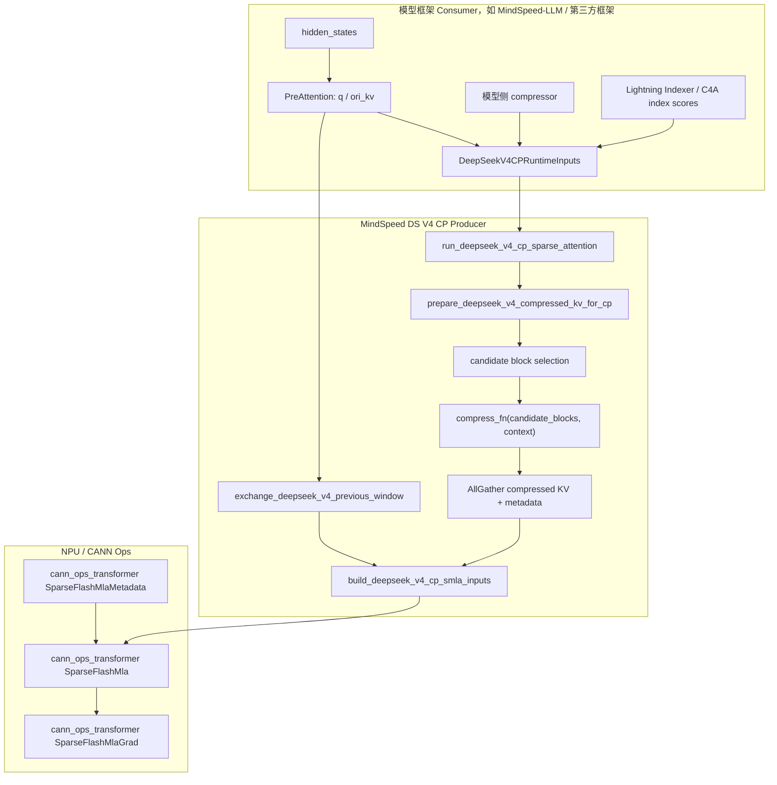
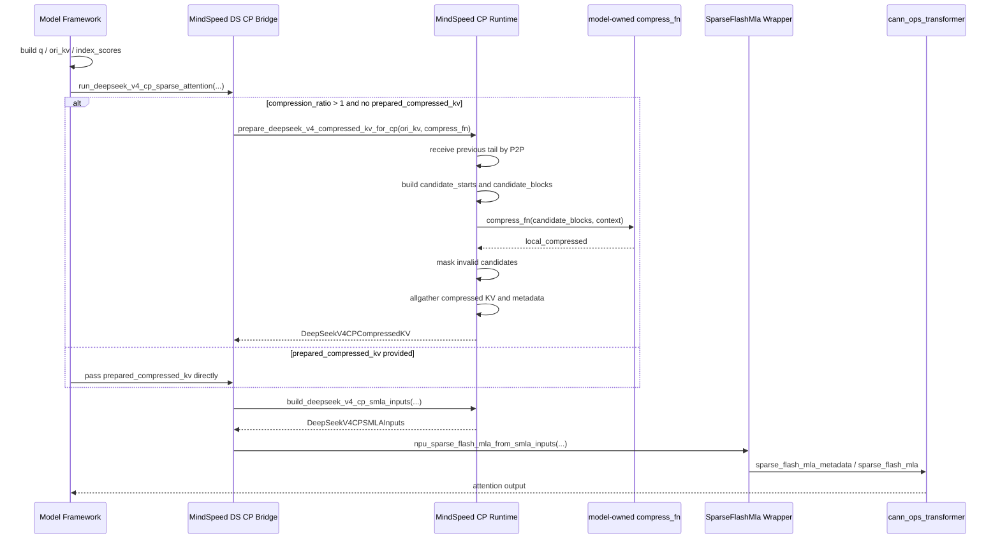
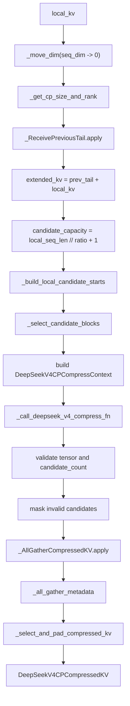
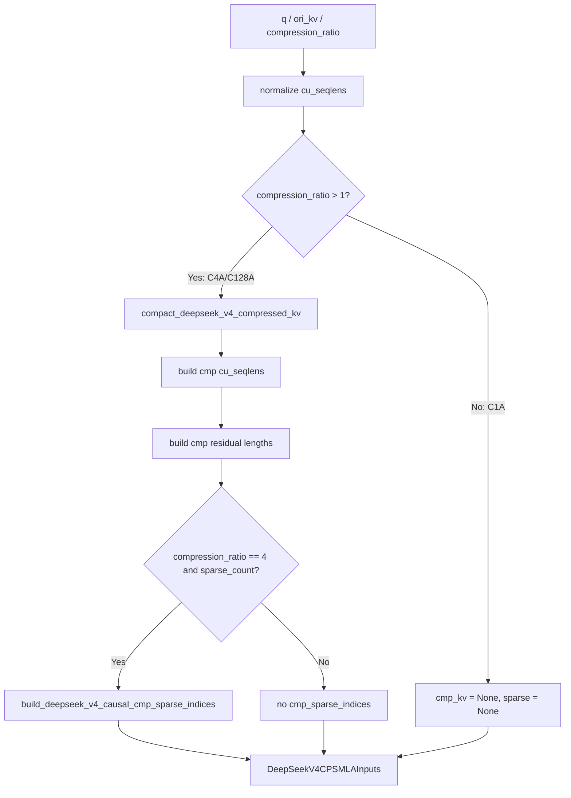
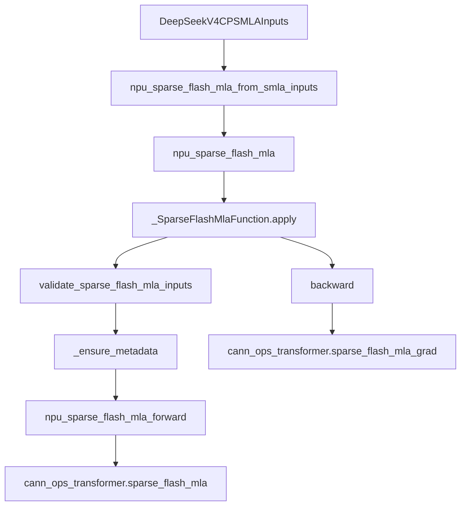
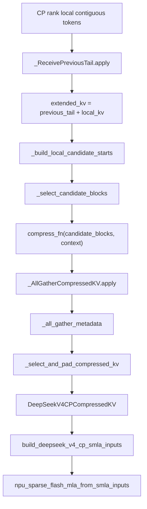
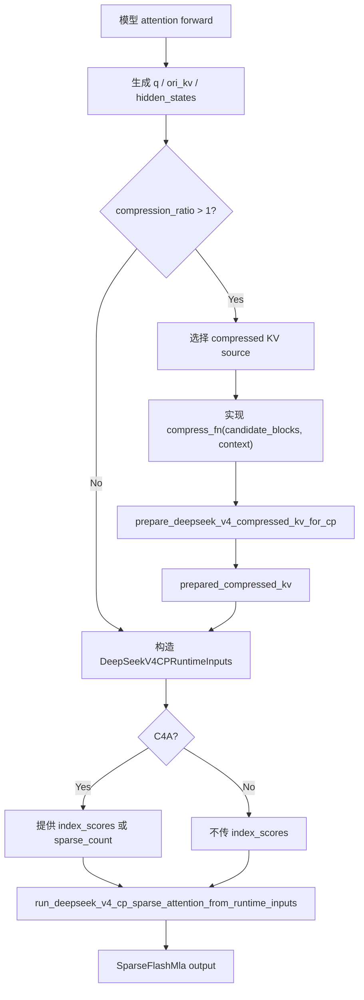
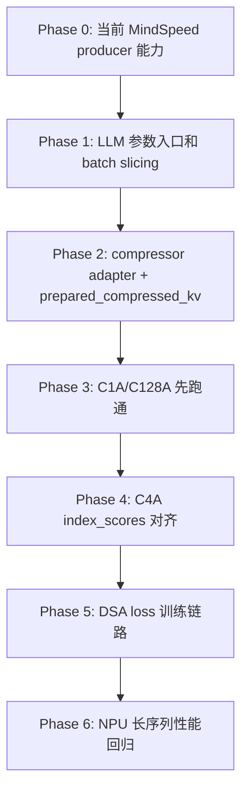

# MindSpeed DeepSeek V4 Context Parallel 方案实现与接入笔记

> 本文基于当前工作区中 MindSpeed 对 DeepSeek V4 Context Parallel 的实现，以及 MindSpeed-LLM DeepSeek4 attention/compressor/indexer 的现状，梳理 DS V4 CP 的生产者/消费者边界、核心代码路径、通信与压缩数据流、SMLA 算子接入、对外接口约束，以及第三方模型框架接入 MindSpeed DS V4 CP 时需要完成的工作。

## 1. 文档摘要

本文分析对象是 MindSpeed 中 DeepSeek V4 CP 能力的当前实现、DeepSeek V4 技术报告中的 CP 论文方案、以及上层模型框架接入方式。核心结论：MindSpeed 已实现 DS V4 CP 的通信、candidate block 选择、compressed KV allgather、SMLA input 构造与 SparseFlashMla bridge；该实现与论文中的两阶段通信方案总体一致；模型框架仍需提供模型侧 `compress_fn`、C4A index score 或 sparse index 语义对齐、以及 DeepSeek4 attention 主链路接入。主要风险集中在 compressor 输入源、RoPE/APE 位置语义、compact block 顺序、MindSpeed-LLM 当前只支持 `kvallgather_cp_algo` 的入口限制。

## 2. 整体概述

### 2.1 核心定位

DeepSeek V4 CP 的当前实现目标不是在 MindSpeed 内部完整实现某个具体 DeepSeek4 模型，而是让 MindSpeed 成为 **DS V4 CP 基础能力生产者**：

```text
MindSpeed 负责:
  - CP 组通信
  - 前序窗口 P2P exchange
  - compressed KV candidate block 选择
  - compressed KV allgather
  - compressed KV metadata / compact block order
  - SMLA 输入构造
  - SparseFlashMla 算子 wrapper

上层模型框架负责:
  - 生成 q / ori_kv / compress source
  - 提供模型私有 compressor 数学逻辑
  - 提供或适配 C4A index_scores
  - 处理 RoPE / APE / overlap / checkpoint 参数
  - 在模型 attention forward 中调用 MindSpeed DS CP bridge
```

这个边界可以概括为：

```text
MindSpeed 管 "压哪些块、怎么跨 rank 收集、怎么喂给 SMLA"
模型框架管 "每个块如何由模型参数压缩成 compressed KV"
```

### 2.2 总体架构图



### 2.3 端到端顺序图



### 2.4 核心源码路径

| 模块 | 路径 | 关键职责 |
|---|---|---|
| DS V4 CP 核心模块 | `MindSpeed-mul/MindSpeed/mindspeed/core/context_parallel/deepseek_v4_context_parallel/deepseek_v4_context_parallel.py` | dataclass 契约、P2P tail exchange、candidate block 选择、compressed KV allgather、SMLA input 构造、C4A sparse indices |
| DS V4 attention bridge | `MindSpeed-mul/MindSpeed/mindspeed/core/context_parallel/deepseek_v4_context_parallel/deepseek_v4_attention.py` | tensor-level bridge，串联 compressed KV 准备、SMLA input 构造、SparseFlashMla 调用 |
| SMLA 算子 wrapper | `MindSpeed-mul/MindSpeed/mindspeed/ops/npu_sparse_flash_mla.py` | 加载 `cann_ops_transformer` 官方 SparseFlashMla / metadata / grad，封装校验和 autograd |
| DS V4 CP 包导出 | `MindSpeed-mul/MindSpeed/mindspeed/core/context_parallel/deepseek_v4_context_parallel/__init__.py` | 对上层导出 runtime inputs、prepare、bridge、helper |
| MindSpeed CP 参数入口 | `MindSpeed-mul/MindSpeed/mindspeed/arguments.py` | MindSpeed 侧已包含 `deepseek_v4_cp_algo` 选项与基础校验 |
| 通用 DotProductAttention 阻断 | `MindSpeed-mul/MindSpeed/mindspeed/core/transformer/dot_product_attention.py` | 标准 DotProductAttention 不支持 DS V4 CP，必须走专用 bridge |
| MindSpeed-LLM DeepSeek4 attention | `MindSpeed-LLM/mindspeed_llm/tasks/models/transformer/deepseek4/g2_attention.py` | 当前 DeepSeek4 attention 主链路，已有 compressor/indexer，但尚未消费 MindSpeed DS CP bridge |
| MindSpeed-LLM compressor | `MindSpeed-LLM/mindspeed_llm/tasks/models/transformer/deepseek4/compressor.py` | 模型侧压缩数学，签名为 `forward(x, start_pos, freqs_cis)` |
| MindSpeed-LLM DSA indexer | `MindSpeed-LLM/mindspeed_llm/tasks/models/transformer/dsa_indexer.py` | 生成 compressed sparse topk / score，当前逻辑围绕 kvallgather 路径 |

### 2.5 关键指标

| 指标 | 当前状态 |
|---|---|
| MindSpeed DS CP dataclass | 5 个：`DeepSeekV4CPMetadata`、`DeepSeekV4CPCompressedKV`、`DeepSeekV4CPCompressContext`、`DeepSeekV4CPSMLAInputs`、`DeepSeekV4CPRuntimeInputs` |
| 主要对外 helper / bridge | 约 10 个，集中在 `__init__.py` 导出 |
| 支持 attention 模式 | `compression_ratio` 为 1、4、128，对应 C1A/SWA、C4A/CSA、C128A/HCA |
| 当前 CPU/mock 覆盖 | CP adapter、attention bridge、SMLA wrapper、Lightning Indexer wrapper |
| 当前缺口 | MindSpeed-LLM attention 主链路未接入 `deepseek_v4_cp_algo`；真实 NPU 前反向与长序列组合待验证 |

## 3. 核心模块分析

### 3.1 数据结构与运行时契约

#### 3.1.1 模块职责与边界

`deepseek_v4_context_parallel.py` 中定义了 DS V4 CP 的核心数据结构。主要 dataclass 位于该文件开头：

- `DeepSeekV4CPMetadata`：记录 compressed KV 的有效性、block 全局起点、来源 rank、local metadata、压缩比、local 序列长度与 output size，见 `deepseek_v4_context_parallel.py:11-20`。
- `DeepSeekV4CPCompressedKV`：将 `compressed_kv` 与 metadata 绑定，见 `deepseek_v4_context_parallel.py:23-26`。
- `DeepSeekV4CPCompressContext`：传给模型侧 `compress_fn` 的 CP 元数据上下文，见 `deepseek_v4_context_parallel.py:29-48`。
- `DeepSeekV4CPSMLAInputs`：SMLA-facing 输入结构，见 `deepseek_v4_context_parallel.py:51-64`。
- `DeepSeekV4CPRuntimeInputs`：生产者/消费者运行时契约，供模型框架调用 bridge，见 `deepseek_v4_context_parallel.py:67-94`。

#### 3.1.2 关键数据结构

```python
# MindSpeed-mul/MindSpeed/mindspeed/core/context_parallel/deepseek_v4_context_parallel/deepseek_v4_context_parallel.py:29
@dataclass
class DeepSeekV4CPCompressContext:
    candidate_starts: torch.Tensor
    valid_mask: torch.Tensor
    local_seq_offset: int
    local_seq_len: int
    total_seq_len: int
    compression_ratio: int
    candidate_capacity: int
    cp_size: int
    cp_rank: int
    seq_dim: int
    cu_seqlens: Optional[Sequence[int]]
```

`DeepSeekV4CPCompressContext` 是当前解耦设计的关键。它让模型侧 compressor 不需要知道 MindSpeed 内部通信实现，但可以知道：

| 字段 | 语义 | 上层用途 |
|---|---|---|
| `candidate_starts` | 每个 candidate block 的全局起始 token 位置，无效 block 为 `-1` | 对齐 RoPE / APE / sample boundary |
| `valid_mask` | 标记 candidate 是否有效 | 跳过 padding candidate，避免副作用 |
| `local_seq_offset` | 当前 rank 本地序列全局起点 | 计算位置偏移 |
| `local_seq_len` | 当前 rank 本地序列长度 | shape 校验 |
| `total_seq_len` | CP 合并后的总长度 | 位置边界校验 |
| `compression_ratio` | 压缩比例 | 与模型 compressor 参数一致性校验 |
| `candidate_capacity` | 当前 rank 固定 candidate 容量 | 输出第 0 维必须一致 |
| `cp_size` / `cp_rank` | CP 组信息 | 调试、rank-aware 逻辑 |
| `seq_dim` | 输入张量序列维 | adapter reshape |
| `cu_seqlens` | packed sequence 边界 | 防止跨样本压缩 |

#### 3.1.3 依赖关系


### 3.2 compressed KV 准备：`prepare_deepseek_v4_compressed_kv_for_cp`

#### 3.2.1 模块职责与边界

`prepare_deepseek_v4_compressed_kv_for_cp` 是 MindSpeed DS V4 CP 的核心函数，定义在 `deepseek_v4_context_parallel.py:97-207`。它负责：

1. 将输入张量移动为 seq-first 布局。
2. 获取 CP size / rank。
3. 用 P2P 获取前一 rank 尾部 token。
4. 构造跨 rank 边界完整的 `extended_kv`。
5. 计算当前 rank 负责压缩的 candidate block 起点。
6. 从 `extended_kv` 切出 `candidate_blocks`。
7. 构造 `DeepSeekV4CPCompressContext` 并调用模型侧 `compress_fn`。
8. 校验输出类型与第 0 维。
9. mask 掉 padding candidate。
10. allgather 各 rank 的 compressed KV 与 metadata。
11. 按全局 block 起点排序并 pad 成固定 output size。

#### 3.2.2 内部流程图



#### 3.2.3 关键代码片段

```python
# deepseek_v4_context_parallel.py:127-150
prev_tail = _ReceivePreviousTail.apply(
    local_kv_seq_first,
    compression_ratio,
    cp_group,
    _resolve_global_ranks(cp_group, cp_size, cp_global_ranks),
)
extended_kv = torch.cat((prev_tail, local_kv_seq_first), dim=0)

candidate_capacity = local_seq_len // compression_ratio + 1
candidate_starts = _build_local_candidate_starts(...)
candidate_blocks = _select_candidate_blocks(...)
```

这段实现对应 DS V4 CP 的第一阶段通信：当前 rank 从前一 rank 接收尾部 token，以便构造跨 rank 边界的完整压缩 block。

```python
# deepseek_v4_context_parallel.py:163-185
compress_context = DeepSeekV4CPCompressContext(...)
local_compressed = _call_deepseek_v4_compress_fn(
    compress_fn, candidate_blocks, compress_context
)
if not torch.is_tensor(local_compressed):
    raise TypeError("compress_fn must return a torch.Tensor.")
if local_compressed.shape[0] != candidate_capacity:
    raise ValueError(...)

local_compressed = local_compressed * _view_as_broadcast_mask(
    local_valid_mask, local_compressed
)
```

这里体现了 MindSpeed 与模型框架的核心分工：MindSpeed 选 block，模型侧压缩 block，MindSpeed 再统一校验与 mask padding candidate。

#### 3.2.4 candidate block 选择规则

candidate 起点选择由 `_build_local_candidate_starts` 完成，定义在 `deepseek_v4_context_parallel.py:850-874`。

核心规则：

```python
# deepseek_v4_context_parallel.py:862-868
for sample_start, sample_end in sample_boundaries:
    block_start = sample_start
    while block_start + compression_ratio <= sample_end:
        block_end = block_start + compression_ratio
        if local_start < block_end <= local_end:
            starts.append(block_start)
        block_start += compression_ratio
```

含义：

```text
一个 compressed block 归属于 "block_end 落入当前 rank 本地序列范围" 的 rank。

block_start 可以位于前一 rank；
block_end 在当前 rank；
当前 rank 通过 prev_tail + local_kv 拼出完整 block。
```

示例：

```text
compression_ratio = 4
rank 0: token [0, 1, 2, 3, 4, 5]
rank 1: token [6, 7, 8, 9, 10, 11]

block [4, 5, 6, 7] 的 block_start=4, block_end=8
如果 rank 1 的 local_start=6, local_end=12:
  6 < 8 <= 12 成立
  该 block 由 rank 1 压缩
  rank 1 通过 prev_tail 拿到 token [4, 5]
```

#### 3.2.5 allgather 与 metadata 排序

第二阶段通信由 `_AllGatherCompressedKV` 完成，定义在 `deepseek_v4_context_parallel.py:905-927`。forward 调用 `dist.all_gather` 收集所有 rank 的 `local_compressed`，backward 对 `grad_output` 做 all-reduce 后取回本 rank 对应切片。

metadata 收集由 `_all_gather_metadata` 完成，定义在 `deepseek_v4_context_parallel.py:930-936`。

收集后 `_select_and_pad_compressed_kv` 根据 `block_starts` 排序并 pad，定义在 `deepseek_v4_context_parallel.py:957-1014`。

```python
# deepseek_v4_context_parallel.py:969-988
valid_indices = torch.nonzero(gathered_valid_mask, as_tuple=False).view(-1)
valid_starts = gathered_block_starts.index_select(0, valid_indices)
order = torch.argsort(valid_starts)
selected_indices = valid_indices.index_select(0, order)
selected = gathered_compressed.index_select(0, selected_indices)
pad_len = output_size - selected.shape[0]
```

输出顺序不是 rank 顺序，而是 **按 compressed block 的全局起始位置升序排列**。这点对 C4A index score 对齐非常重要。

### 3.3 前序窗口交换：`exchange_deepseek_v4_previous_window`

#### 3.3.1 模块职责

`exchange_deepseek_v4_previous_window` 定义在 `deepseek_v4_context_parallel.py:210-231`，作用是将前一 CP rank 的尾部窗口 prepend 到当前本地张量前面。

它面向 original KV attention window 场景，而不是 compressed KV allgather 场景。完整 DS V4 CP attention 中，原始 KV 通常用于局部窗口注意力，compressed KV 用于更长历史。

#### 3.3.2 关键代码

```python
# deepseek_v4_context_parallel.py:222-231
prev_window = _ReceivePreviousTail.apply(...)
if cp_rank == 0 and not pad_first_rank:
    return local_tensor
windowed = torch.cat((prev_window, local_seq_first), dim=0)
return _move_dim(windowed, 0, seq_dim).contiguous()
```

注意：当前 `run_deepseek_v4_cp_sparse_attention` bridge 不会自动调用这个函数。第三方模型框架需要根据自身 attention window 语义，在构造 `ori_kv` 时显式调用或等价处理。

### 3.4 SMLA input 构造：`build_deepseek_v4_cp_smla_inputs`

#### 3.4.1 模块职责

`build_deepseek_v4_cp_smla_inputs` 定义在 `deepseek_v4_context_parallel.py:380-462`，负责把 q、ori_kv、prepared compressed KV、packed sequence metadata、C4A sparse indices 组合成 `DeepSeekV4CPSMLAInputs`。

它主要做四类事情：

1. 处理 `cu_seqlens_q` / `cu_seqlens_ori_kv`。
2. 对 compressed KV 去 padding，生成 compact `cmp_kv` 与 `block_starts`。
3. 生成 compressed 侧 `cu_seqlens_cmp_kv`、`seqused_cmp_kv`、`cmp_residual_kv`。
4. 对 C4A 根据 `query_positions`、`block_starts` 与可选 `index_scores` 构造 `cmp_sparse_indices`。

#### 3.4.2 内部流程图



#### 3.4.3 关键代码

```python
# deepseek_v4_context_parallel.py:421-447
if compression_ratio > 1:
    if prepared_compressed_kv is None:
        raise ValueError(...)
    cmp_kv, block_starts = compact_deepseek_v4_compressed_kv(...)
    cu_seqlens_cmp_tensor = build_deepseek_v4_cmp_cu_seqlens(...)
    seqused_cmp_kv = _lengths_from_cu_seqlens(cu_seqlens_cmp_tensor)
    cmp_residual_kv = build_deepseek_v4_cmp_residual_kv(...)
    if compression_ratio == 4 and sparse_count is not None:
        cmp_sparse_indices = build_deepseek_v4_causal_cmp_sparse_indices(...)
```

#### 3.4.4 packed sequence 处理

`build_deepseek_v4_cmp_cu_seqlens` 定义在 `deepseek_v4_context_parallel.py:252-265`，每个 sample 的 compressed 长度为：

```text
compressed_len = floor(sample_len / compression_ratio)
```

`build_deepseek_v4_cmp_residual_kv` 定义在 `deepseek_v4_context_parallel.py:268-280`，每个 sample 的 residual 为：

```text
residual = sample_len % compression_ratio
```

这两个值会传给 SMLA，用于 compressed-side mask 恢复。

### 3.5 C4A sparse index 构造与 `index_scores` 契约

#### 3.5.1 模块职责

C4A 模式下，SMLA 需要 `cmp_sparse_indices`。MindSpeed 当前提供两种方式：

1. 如果上层提供 `index_scores`，MindSpeed 先用 causal visibility mask 屏蔽不可见 compressed block，再做 topk。
2. 如果上层不提供 `index_scores`，MindSpeed 构造默认 causal visible compressed block indices。

相关函数：

- `build_deepseek_v4_causal_cmp_sparse_indices`：`deepseek_v4_context_parallel.py:283-343`
- `validate_deepseek_v4_c4a_index_scores`：`deepseek_v4_context_parallel.py:346-377`
- `_build_deepseek_v4_cmp_visibility`：`deepseek_v4_context_parallel.py:668-717`

#### 3.5.2 `index_scores` shape 约束

```text
index_scores.shape == [query_count, compact_block_count]
```

其中第二维必须与 `compact_deepseek_v4_compressed_kv` 后返回的 `block_starts` 顺序一致，即按全局 block 起点排序后的 compact order。

校验代码：

```python
# deepseek_v4_context_parallel.py:370-376
if tuple(index_scores.shape) != tuple(visibility.shape):
    raise ValueError(
        "index_scores must align with compact compressed KV blocks: ..."
    )
```

#### 3.5.3 可见性规则

`_build_deepseek_v4_cmp_visibility` 根据以下规则判断 query token 是否可见某个 compressed block：

```text
block 与 query 属于同一个 packed sample；
block_start >= sample_start；
block_start + compression_ratio <= sample_end；
block_start + compression_ratio <= query_position + 1；
block 有效且 block_start >= 0。
```

关键代码见 `deepseek_v4_context_parallel.py:700-715`。

这意味着 C4A 的 sparse index 选择不允许跨 packed sample，也不允许 query attend 到未来 compressed block。

### 3.6 Tensor-level bridge：`run_deepseek_v4_cp_sparse_attention`

#### 3.6.1 模块职责

`run_deepseek_v4_cp_sparse_attention` 定义在 `deepseek_v4_attention.py:15-84`，是当前 MindSpeed 暴露给模型框架的主要 attention bridge。

它做三件事：

1. 校验 `compression_ratio`。
2. 在需要 compressed KV 且未提供 `prepared_compressed_kv` 时，调用 `prepare_deepseek_v4_compressed_kv_for_cp`。
3. 构造 `DeepSeekV4CPSMLAInputs` 并调用 `npu_sparse_flash_mla_from_smla_inputs`。

#### 3.6.2 关键代码

```python
# deepseek_v4_attention.py:48-62
if compression_ratio > 1 and prepared_compressed_kv is None:
    if compress_fn is None:
        raise ValueError(
            "compress_fn or prepared_compressed_kv is required when compression_ratio > 1."
        )
    prepared_compressed_kv = prepare_deepseek_v4_compressed_kv_for_cp(
        ori_kv,
        compression_ratio,
        compress_fn,
        ...
    )
```

注意：当前 bridge 默认把 `ori_kv` 作为 compressed KV 的 candidate source。如果某个模型的 compressed KV 必须从 `hidden_states` 压缩得到，则不能简单把当前 bridge 直接用于 `compress_fn(hidden_states, start_pos, freqs_cis)`。可选方案见第 6 节。

#### 3.6.3 runtime inputs 入口

`run_deepseek_v4_cp_sparse_attention_from_runtime_inputs` 定义在 `deepseek_v4_attention.py:87-111`，只接受 `DeepSeekV4CPRuntimeInputs` 实例，便于第三方框架按结构化契约调用。

### 3.7 SMLA 算子 wrapper：`npu_sparse_flash_mla.py`

#### 3.7.1 模块职责

`npu_sparse_flash_mla.py` 是 MindSpeed 对官方 `cann_ops_transformer` SparseFlashMla 的适配层。

它负责：

1. 动态加载 `cann_ops_transformer.ops.sparse_flash_mla_metadata` 与 `sparse_flash_mla`。
2. 动态加载 `cann_ops_transformer.ops.sparse_flash_mla_grad`。
3. 统一校验 q / ori_kv / cmp_kv / sparse indices / cu_seqlens / sinks / layout。
4. 生成 metadata。
5. 封装 autograd Function。
6. 支持从 `DeepSeekV4CPSMLAInputs` 直接调用。

加载官方算子的代码在 `npu_sparse_flash_mla.py:42-69`。

#### 3.7.2 算子调用链



#### 3.7.3 关键约束

`validate_sparse_flash_mla_inputs` 定义在 `npu_sparse_flash_mla.py:72-182`，核心约束如下：

| 约束 | 代码依据 |
|---|---|
| `cmp_ratio` 只能是 1、4、128 | `npu_sparse_flash_mla.py:99-100` |
| `layout_q` 只能是 `BSND` 或 `TND` | `npu_sparse_flash_mla.py:101-102` |
| `layout_kv` 只能是 `BSND`、`TND`、`PA_BBND` | `npu_sparse_flash_mla.py:103-104` |
| 非 `PA_BBND` 时 q/kv layout 必须一致 | `npu_sparse_flash_mla.py:105-106` |
| 仅支持 `topk_value_mode=1` | `npu_sparse_flash_mla.py:107-108` |
| `ori_mask_mode=4` | `npu_sparse_flash_mla.py:109-110` |
| 原始窗口固定 `ori_win_left=127`、`ori_win_right=0` | `npu_sparse_flash_mla.py:111-112` |
| `head_dim=512` | `npu_sparse_flash_mla.py:123-124` |
| q heads 数为 1 到 128 的 2 次幂 | `npu_sparse_flash_mla.py:125-126` |
| KV heads 必须为 1 | `npu_sparse_flash_mla.py:133-135` |
| C1A 不允许传 compressed KV | `npu_sparse_flash_mla.py:137-139` |
| C4A/C128A 必须传 `cmp_kv` 和 `cmp_residual_kv` | `npu_sparse_flash_mla.py:140-149` |
| C4A 必须传 int32 `cmp_sparse_indices`，topk 为 512 或 1024 | `npu_sparse_flash_mla.py:151-158` |
| C128A 不允许传 `cmp_sparse_indices` | `npu_sparse_flash_mla.py:159-160` |
| TND layout 必须传 cu_seqlens | `npu_sparse_flash_mla.py:167-173` |
| sinks 必须是 float32 | `npu_sparse_flash_mla.py:180-181` |

#### 3.7.4 SMLA input bridge

`npu_sparse_flash_mla_from_smla_inputs` 定义在 `npu_sparse_flash_mla.py:535-567`，它会把 TND shared KV 从 `[T, D]` normalize 到 `[T, 1, D]`，并 normalize sparse indices，然后调用 `npu_sparse_flash_mla`。

### 3.8 参数入口、导出与通用 attention 阻断

#### 3.8.1 MindSpeed 侧参数入口

MindSpeed 的 `--context-parallel-algo` choices 已包含 `deepseek_v4_cp_algo`，见 `arguments.py:173-178`。

基础校验位于 `arguments.py:691-696`：

```text
deepseek_v4_cp_algo:
  - 仅支持 causal attention mask
  - 不支持 alibi position embedding
  - seq_length 必须能被 context_parallel_size 整除
  - 强制 use_flash_attn = True
```

#### 3.8.2 导出接口

`deepseek_v4_context_parallel/__init__.py` 导出以下接口，见 `__init__.py:3-42`：

```text
DeepSeekV4CPCompressedKV
DeepSeekV4CPCompressContext
DeepSeekV4CPMetadata
DeepSeekV4CPRuntimeInputs
DeepSeekV4CPSMLAInputs
build_deepseek_v4_causal_cmp_sparse_indices
build_deepseek_v4_cmp_cu_seqlens
build_deepseek_v4_cmp_residual_kv
build_deepseek_v4_cp_smla_inputs
build_deepseek_v4_tnd_cu_seqlens
compact_deepseek_v4_compressed_kv
deepseek_v4_cp_reference_attention
exchange_deepseek_v4_previous_window
flatten_deepseek_v4_cp_tensor_to_tnd
prepare_deepseek_v4_compressed_kv_for_cp
run_deepseek_v4_cp_sparse_attention
run_deepseek_v4_cp_sparse_attention_from_runtime_inputs
validate_deepseek_v4_c4a_index_scores
```

#### 3.8.3 标准 DotProductAttention 不支持 DS V4 CP

MindSpeed 通用 DotProductAttention 在 `deepseek_v4_cp_algo` 下显式抛错，见 `dot_product_attention.py:161-168` 和 `dot_product_attention.py:192-197`。

这意味着第三方模型框架不能只启用 `deepseek_v4_cp_algo` 并继续走标准 attention；必须在模型 attention forward 中显式调用 DS V4 CP bridge。

## 4. 关键技术点深度解析

### 4.1 DeepSeek V4 论文方案实现视角

本节补充 DeepSeek V4 技术报告中与 CP 直接相关的方案语义，并说明它与当前 MindSpeed DS V4 CP 实现之间的映射关系。论文依据来自 `实现/DeepSeek_V4.pdf` 第 13 页、第 20-21 页、第 24-25 页；代码依据来自 `deepseek_v4_context_parallel.py`、`deepseek_v4_attention.py` 与 `npu_sparse_flash_mla.py`。

#### 4.1.1 论文中的 attention 结构

DeepSeek V4 技术报告第 13 页给出的关键约束是：CSA 和 HCA 为严格保持因果性，query 只能访问 **preceding compressed KV blocks**。这会带来一个直接后果：query 不能访问自己所在 compressed block 内的其他 token，因此论文为 CSA/HCA 额外引入 sliding window attention 分支，让 query 仍能访问最近 `n_win` 个未压缩 KV。

| 论文概念 | SMLA/CANN 映射 | MindSpeed 当前表达 | 接入含义 |
|---|---|---|---|
| Sliding Window Attention | C1A/SWA | `compression_ratio=1`，只传 `ori_kv` | 用未压缩 KV 处理局部依赖 |
| Compressed Sparse Attention | C4A/CSA | `compression_ratio=4`，传 `cmp_kv` 与 `cmp_sparse_indices` | 需要上层 indexer score 或 sparse indices 语义对齐 |
| Hierarchical Compressed Attention | C128A/HCA | `compression_ratio=128`，传 `cmp_kv`，不传 `cmp_sparse_indices` | 可见 compressed block 范围按规则构造 |
| Attention Sink | `sinks` | `run_deepseek_v4_cp_sparse_attention(..., sinks=...)` | 由上层模型框架提供 sink tensor |
| Partial RoPE | q/KV/attention output 的部分维度位置处理 | MindSpeed 不内置模型私有 RoPE | 由上层 `compress_fn` 与 attention 前处理保证 |

当前 MindSpeed 的 SMLA wrapper 对上述三种模式有显式校验：`cmp_ratio` 只允许 1、4、128，见 `npu_sparse_flash_mla.py:97-160`；C1A 不允许传 `cmp_kv/cmp_sparse_indices`，C4A 必须传 `cmp_sparse_indices` 且 TopK 只能为 512 或 1024，C128A 不允许传 `cmp_sparse_indices`。

#### 4.1.2 论文中的 CP 两阶段通信

DeepSeek V4 技术报告第 20-21 页描述的 long-context CP 方案包含以下规则：

1. 常规 CP 沿 sequence 维连续切分，每个 rank 维护本地连续 `s` 个 token。
2. packed sequence 必须独立压缩；每个 sequence 尾部不足压缩倍率 `m` 的 token 被丢弃。
3. 压缩需要连续 `m` 个 KV entry，block 可能跨越相邻 CP rank 边界。
4. 第一阶段通信：rank `i` 将尾部 `m` 个未压缩 KV entry 发送给 rank `i+1`。
5. rank `i+1` 用收到的 tail 与本地 `s` 个 KV entry 一起压缩，产生固定长度 `s / m + 1` 的本地 compressed entry，其中包含 padding entry。
6. 第二阶段通信：CP 组内 allgather 本地 compressed KV entry。
7. fused select-and-pad 将 allgather 结果重排为全局 compressed KV，长度为 `cp_size * s / m`，padding entry 放在尾部。
8. HCA 与 CSA indexer 的可见 compressed range 可以按规则预计算；CSA sparse attention 的 top-k selector 显式指定每个 query 可见 compressed KV index。

对应到当前 MindSpeed，核心实现路径如下：



| 论文步骤 | MindSpeed 当前实现 | 代码依据 | 覆盖情况 |
|---|---|---|---|
| 连续 sequence 分片 | `local_seq_offset`、`local_seq_len`、`seq_dim` 表达本地 shard | `deepseek_v4_context_parallel.py:117-125` | 已覆盖基础元数据 |
| 第一阶段 P2P tail exchange | `_ReceivePreviousTail.apply` 获取前一 rank tail | `deepseek_v4_context_parallel.py:127-133`、`773-817` | 已覆盖 forward/backward 通信 |
| 产生固定 candidate 容量 | `candidate_capacity = local_seq_len // compression_ratio + 1` | `deepseek_v4_context_parallel.py:135` | 已覆盖 |
| candidate block 归属 | block end 落入本 rank 时由该 rank 压缩 | `deepseek_v4_context_parallel.py:850-874` | 已覆盖 |
| packed sequence 独立压缩 | `cu_seqlens` 转 sample boundaries | `deepseek_v4_context_parallel.py:860-881` | 已覆盖边界表达 |
| 本地压缩 | 调用模型侧 `compress_fn(candidate_blocks, context)` | `deepseek_v4_context_parallel.py:163-185`、`637-657` | 已覆盖接口，数学由上层提供 |
| 第二阶段 allgather | `_AllGatherCompressedKV.apply` 与 `_all_gather_metadata` | `deepseek_v4_context_parallel.py:185-188`、`905-936` | 已覆盖 forward/backward 通信 |
| select-and-pad | 按 `block_starts` 排序，padding 置尾 | `deepseek_v4_context_parallel.py:957-1014` | 已覆盖 |
| C4A top-k selector | 由 `index_scores` 或默认 causal 可见块生成 `cmp_sparse_indices` | `deepseek_v4_context_parallel.py:283-343` | 已覆盖基础生成，真实 indexer score 需上层对齐 |
| attention 计算 | 构造 `DeepSeekV4CPSMLAInputs` 后调用 SMLA wrapper | `deepseek_v4_context_parallel.py:380-462`、`deepseek_v4_attention.py:64-84` | 已下沉到 MindSpeed bridge |

#### 4.1.3 与 MindSpeed 当前实现的边界

当前 MindSpeed 已经覆盖论文方案中的 **CP 基础设施与 SMLA 算子桥接**，但没有把 DeepSeek4 模型私有数学逻辑下沉为通用实现。边界如下：

| 能力 | 是否应由 MindSpeed 提供 | 当前状态 | 原因 |
|---|---|---|---|
| P2P tail exchange | 是 | 已实现 | 属于 CP 通信原子能力 |
| candidate block 选择 | 是 | 已实现 | 属于跨 rank 压缩块归属规则 |
| compressed KV allgather | 是 | 已实现 | 属于 CP 组通信与 metadata 对齐 |
| select-and-pad | 是 | 已实现 | 属于全局 compact compressed KV 重排 |
| SMLA input 构造 | 是 | 已实现 | 属于算子适配层 |
| SparseFlashMla 调用 | 是 | 已实现 | 属于 MindSpeed 算子 wrapper |
| DeepSeek4 compressor 数学 | 否 | 通过 `compress_fn` 回调消费 | 依赖模型参数、RoPE/APE、overlap/cache 策略 |
| Lightning Indexer score 生成 | 否 | 接口接收 `index_scores` | 依赖模型侧 indexer、aux loss、训练策略 |
| attention sink tensor | 否 | bridge 透传 `sinks` | 属于模型参数 |
| DeepSeek4 layer interleave 策略 | 否 | 上层选择 `compression_ratio` | 属于模型结构配置 |

因此，当前实现更接近论文方案中的 **可复用 CP runtime producer**，而不是完整 DeepSeek4 layer implementation。上层框架按 `DeepSeekV4CPRuntimeInputs` 和 `compress_fn/index_scores` 契约提供模型侧张量后，可以消费 MindSpeed 提供的通信、重排和 SMLA 计算能力。

#### 4.1.4 Flash/Pro 参数与接入配置

DeepSeek V4 技术报告第 24-25 页给出 Flash 与 Pro 的模型配置。与 CP 接入直接相关的参数如下：

| 配置项 | DeepSeek-V4-Flash | DeepSeek-V4-Pro | MindSpeed 接入含义 |
|---|---:|---:|---|
| Transformer 层数 | 43 | 61 | 上层决定每层 attention 类型 |
| hidden dimension | 4096 | 7168 | 上层模型结构参数 |
| 前两层 attention | pure SWA | HCA | 上层按层选择 C1A 或 C128A |
| 后续 attention | CSA/HCA interleaved | CSA/HCA interleaved | 上层按层传 `compression_ratio=4/128` |
| CSA compression rate | 4 | 4 | MindSpeed C4A 路径 |
| CSA attention top-k | 512 | 1024 | `sparse_count` 或 `cmp_sparse_indices.shape[-1]` |
| HCA compression rate | 128 | 128 | MindSpeed C128A 路径 |
| query heads | 64 | 128 | SMLA 支持 power-of-two heads in [1,128] |
| head dimension | 512 | 512 | SMLA 强约束 `head_dim=512` |
| query compression dim | 1024 | 1536 | 上层模型参数 |
| SWA window | 128 | 128 | SMLA wrapper 当前约束 `ori_win_left=127`、`ori_win_right=0` |

需要特别注意：论文中 CSA/HCA 的 Partial RoPE 与 attention output 相对位置修正属于模型数学逻辑。当前 MindSpeed DS V4 CP runtime 不负责生成 `freqs_cis`，也不负责替代 DeepSeek4 `Compressor.forward(x, start_pos, freqs_cis)`；MindSpeed 只通过 `DeepSeekV4CPCompressContext.candidate_starts`、`valid_mask`、`cu_seqlens` 暴露足够的 CP 元数据，让上层 adapter 能正确完成这些模型侧操作。

### 4.2 两阶段通信模型

DeepSeek V4 CP 的 compressed KV 路径可以抽象为两阶段通信：

```text
阶段 1: P2P tail exchange
  - rank i 将尾部 compression_ratio 个 token 发送给 rank i+1
  - rank i 接收 rank i-1 的尾部 token
  - 每个 rank 本地形成 extended_kv = prev_tail + local_kv
  - 每个 rank 选择 block_end 落入本 rank 的 candidate blocks

阶段 2: compressed KV allgather
  - 每个 rank 对自己负责的 candidate blocks 调用模型侧 compress_fn
  - MindSpeed mask 掉无效 padding candidate
  - 对 compressed KV、valid_mask、block_starts 做 allgather
  - 按 block_starts 排序，生成全局 compact compressed KV
```

这两个阶段在 MindSpeed 中都已经有对应实现：

| 阶段 | 实现 |
|---|---|
| P2P tail exchange | `_ReceivePreviousTail`，`deepseek_v4_context_parallel.py:773-817` |
| candidate block selection | `_build_local_candidate_starts`、`_select_candidate_blocks`，`deepseek_v4_context_parallel.py:850-897` |
| compressed KV allgather | `_AllGatherCompressedKV`，`deepseek_v4_context_parallel.py:905-927` |
| metadata allgather | `_all_gather_metadata`，`deepseek_v4_context_parallel.py:930-936` |
| sort and pad | `_select_and_pad_compressed_kv`，`deepseek_v4_context_parallel.py:957-1014` |

### 4.3 `compress_fn` 的职责和契约

#### 4.2.1 合法签名

MindSpeed 支持两类 `compress_fn`：

```python
def compress_fn(candidate_blocks):
    ...
```

或：

```python
def compress_fn(candidate_blocks, context):
    ...
```

调用适配逻辑在 `_call_deepseek_v4_compress_fn`，见 `deepseek_v4_context_parallel.py:637-657`。

推荐第三方框架使用第二种形式，因为它可以读取 `context.candidate_starts`、`context.valid_mask`、`context.cu_seqlens`。

#### 4.2.2 输入要求

`candidate_blocks` shape：

```text
[candidate_capacity, compression_ratio, *source_non_seq_dims]
```

其中：

```text
candidate_capacity = local_seq_len // compression_ratio + 1
```

这个容量包含 padding candidate。上层不能只处理有效 block 后返回短 tensor。

#### 4.2.3 输出要求

`compress_fn` 必须返回 `torch.Tensor`，且：

```text
local_compressed.shape[0] == candidate_capacity
```

强校验在 `deepseek_v4_context_parallel.py:177-183`。

后续维度必须能被 SMLA 接受。以 TND shared KV 为例，常见输出是：

```text
[candidate_capacity, 1, 512]
```

或在 compact 前后能 normalize 为该形式。

#### 4.2.4 padding candidate 与副作用

MindSpeed 会在 `compress_fn` 返回后用 `valid_mask` 将无效 candidate 输出置零，见 `deepseek_v4_context_parallel.py:185`。

但置零发生在 `compress_fn` 执行之后。因此上层 `compress_fn` 仍然需要避免 padding candidate 污染模型内部状态，例如：

```text
不能让 padding candidate 更新 compressor cache；
不能对 candidate_start = -1 的位置做非法 RoPE；
不能让 padding block 参与统计状态；
不能因为无效 block 产生 NaN。
```

### 4.4 为什么不建议把 MindSpeed 的 `compress_fn` 设计成 `hidden_states, start_pos, freqs_cis`

MindSpeed-LLM 当前 DeepSeek4 `Compressor.forward` 的签名是：

```python
def forward(self, x: torch.Tensor, start_pos: int, freqs_cis: torch.Tensor)
```

定义在 `compressor.py:93`，调用点在 `g2_attention.py:373`。

这个签名适合模型内部连续序列压缩，但不适合作为 MindSpeed 对外 DS CP 契约，原因如下：

| 问题 | 说明 |
|---|---|
| 无法表达 candidate block 粒度 | DS CP 压缩对象是 MindSpeed 选好的 `[candidate_capacity, ratio, ...]` block |
| 缺少 `valid_mask` | 无法识别 padding candidate |
| 单个 `start_pos` 不够 | 每个 candidate block 都有独立全局 `candidate_starts` |
| 缺少 `cu_seqlens` | packed sequence 场景存在跨样本压缩风险 |
| 强耦合 DeepSeek4 表达 | `freqs_cis` 是模型侧 RoPE 表达，不适合作为 MindSpeed 通用接口字段 |
| 降低第三方框架适配性 | 其他模型不一定有相同的 `freqs_cis` 或 compressor forward 形式 |

更合理的设计是：

```python
def compress_fn(candidate_blocks, context):
    # candidate_blocks 由 MindSpeed 选择
    # context 提供 CP 与位置元数据
    # 模型框架在内部使用自己的 hidden_states / freqs_cis / compressor 参数
    return local_compressed
```

如果某个模型必须从 hidden states 而非 ori_kv 压缩，则应让 `candidate_blocks` 的 source 是 hidden states，或者由模型框架预先构造 `prepared_compressed_kv`，而不是把 `hidden_states/start_pos/freqs_cis` 上升为 MindSpeed 标准接口。

### 4.5 compression source 问题

当前 `run_deepseek_v4_cp_sparse_attention` 在没有 `prepared_compressed_kv` 时调用：

```python
# deepseek_v4_attention.py:53-56
prepared_compressed_kv = prepare_deepseek_v4_compressed_kv_for_cp(
    ori_kv,
    compression_ratio,
    compress_fn,
    ...
)
```

这意味着默认压缩 source 是 `ori_kv`。

但 MindSpeed-LLM DeepSeek4 当前 compressor 的输入是 `hidden_states`，不是 `ori_kv`：

```python
# g2_attention.py:373
kv_compress = self.compressor(hidden_states, start_pos, local_freqs_cis)
```

因此接入 MindSpeed DS CP 时必须明确选择以下方案之一：

| 方案 | 说明 | 风险 |
|---|---|---|
| 让 bridge 支持 `compress_source` | `ori_kv` 用于 original window attention，`compress_source` 用于 compressed KV candidate 选择 | 需要扩展 MindSpeed runtime inputs |
| 上层先调用 `prepare_deepseek_v4_compressed_kv_for_cp(hidden_states, ...)` | 模型框架把 hidden states 作为 candidate source，生成 `prepared_compressed_kv` 后传给 bridge | 接入方要显式编排两步 |
| 上层完全自管 compressed KV 与 metadata | 直接传 `prepared_compressed_kv` | 正确性压力转移到上层，容易重复 MindSpeed CP 逻辑 |

当前较稳妥的短期接入方式是第二种：上层模型框架明确使用 hidden states 作为 `prepare_deepseek_v4_compressed_kv_for_cp` 的 source，并传入符合契约的 `compress_fn(candidate_hidden_blocks, context)`。

### 4.6 C1A、C4A、C128A 模式

MindSpeed 与 SMLA wrapper 当前支持三类 `compression_ratio`：

| 模式 | `compression_ratio` | compressed KV | sparse indices | 典型语义 |
|---|---:|---|---|---|
| C1A / SWA | 1 | 不需要 | 不需要 | 只使用 original KV 窗口 |
| C4A / CSA | 4 | 需要 | 需要 `cmp_sparse_indices` | compressed KV 稀疏选择 |
| C128A / HCA | 128 | 需要 | 不允许传 `cmp_sparse_indices` | compressed KV 更粗粒度全局历史 |

`run_deepseek_v4_cp_sparse_attention` 在 C4A 且未给 `sparse_count` 和 `index_scores` 时，默认 `sparse_count=512`，见 `deepseek_v4_attention.py:43-46`。

### 4.7 SMLA 与 Lightning Indexer 的关系

SparseFlashMla 是最终 attention 计算算子。Lightning Indexer 是模型侧或辅助算子，用于产生 C4A 的 sparse block 分数或索引。

当前 MindSpeed DS CP bridge 的设计是：

```text
MindSpeed DS CP bridge:
  - 可以根据 index_scores 生成 cmp_sparse_indices
  - 不直接调用 MindSpeed-LLM DSAIndexer
  - 不直接调用 npu_lightning_indexer

模型框架:
  - 可以用自己的 DSAIndexer / Lightning Indexer 产生 index_scores
  - 必须保证 index_scores 与 compact block order 对齐
```

MindSpeed 侧存在 `npu_lightning_indexer` wrapper，并有 TND cu_seq_lens 测试，见 `test_npu_lightning_indexer.py:32-74`，但它不是 `run_deepseek_v4_cp_sparse_attention` 当前调用链中的必经环节。

### 4.8 autograd 通信设计

`_ReceivePreviousTail` 和 `_AllGatherCompressedKV` 都是 `torch.autograd.Function`：

| Function | forward | backward |
|---|---|---|
| `_ReceivePreviousTail` | 从前一 rank 收 tail，向后一 rank 发 tail | 将来自下一 rank 的 tail 梯度回传到本地尾部 |
| `_AllGatherCompressedKV` | allgather 各 rank local compressed | all-reduce grad_output，再取回本 rank slice |

这说明当前 CP 通信路径不仅是 forward 数据流，也包含训练反向的基础梯度路由设计。

## 5. 问题与风险评估

### 5.1 高风险

| 风险 | 现象 | 依据 | 影响 |
|---|---|---|---|
| MindSpeed-LLM 尚未接入 DS CP bridge | `g2_attention.py` 当前仍在内部调用 `self.sparse_attention` | `g2_attention.py:378-387` | 启用 MindSpeed DS CP 后不能自动走完整 DS V4 CP |
| compressor source 不一致 | bridge 默认对 `ori_kv` 做 candidate 选择；LLM compressor 输入为 `hidden_states` | `deepseek_v4_attention.py:53-56`、`g2_attention.py:373` | 直接接入会 shape 或语义错误 |
| `compress_fn` 不能直接用 LLM `Compressor.forward` | MindSpeed 期望 `compress_fn(candidate_blocks, context)`；LLM 是 `forward(x, start_pos, freqs_cis)` | `deepseek_v4_context_parallel.py:110-113`、`compressor.py:93` | 需要 adapter，不能简单透传 |
| C4A index score 对齐风险 | MindSpeed 需要 `[query_count, compact_block_count]` 且顺序与 compact `block_starts` 一致 | `deepseek_v4_context_parallel.py:346-377` | sparse block 错选会导致 attention 结果错误 |
| 真实 NPU 前反向未完全验证 | 当前测试以 CPU/mock 为主 | `test_npu_sparse_flash_mla.py` 使用 fake op | 性能与数值正确性仍需 NPU 验证 |

### 5.2 中风险

| 风险 | 现象 | 依据 | 影响 |
|---|---|---|---|
| MindSpeed-LLM 参数入口未放开 `deepseek_v4_cp_algo` | choices 不包含该算法，DeepSeek4 只允许 `kvallgather_cp_algo` | `context_parallel_feature.py:21-27`、`context_parallel_feature.py:55-56` | 用户无法在 LLM 侧直接启用 |
| batch slicing 未适配 DS V4 CP | LLM get_batch 只有 `kvallgather_cp_algo` 分支 | `get_batch_utils.py:40-56` | sequence shard 位置语义存在不匹配风险 |
| `ori_kv` window exchange 不在 bridge 内自动执行 | bridge 直接使用传入 `ori_kv` | `deepseek_v4_attention.py:64-77` | 上层必须显式处理 original window |
| C4A 默认 sparse indices 不等价于真实 Lightning Indexer | 默认仅按 causal visibility 取前若干可见 block | `deepseek_v4_context_parallel.py:338-343` | 性能或精度不一定满足模型目标 |
| SMLA 算子约束较强 | head_dim、KV heads、topk、layout 等限制 | `npu_sparse_flash_mla.py:99-181` | 接入前需要严格 shape/layout 适配 |

### 5.3 低风险

| 风险 | 说明 |
|---|---|
| helper 命名和接口文档不足 | 当前代码已有导出，但缺少正式开发者文档 |
| CPU reference attention 只适合小规模验证 | `deepseek_v4_cp_reference_attention` 是 PyTorch reference，不是性能路径 |
| `compress_fn` legacy 单参形式易误用 | 推荐统一使用 context-aware 形式 |

## 6. 第三方模型框架接入指南

### 6.1 接入前置条件

第三方模型框架需要先确认：

```text
1. 能生成 DeepSeek V4 风格 q / ori_kv。
2. q 和 kv 能整理成 SMLA 支持的 BSND 或 TND layout。
3. head_dim = 512。
4. KV heads = 1。
5. compression_ratio 只使用 1 / 4 / 128。
6. C4A 模式能提供 index_scores，或接受 MindSpeed 默认 causal sparse block indices。
7. 有模型侧 compressor，并能包装为 compress_fn(candidate_blocks, context)。
8. 如果使用 packed sequence，能提供正确 cu_seqlens。
9. 运行环境有 torch_npu / CANN / cann_ops_transformer SparseFlashMla 扩展。
```

### 6.2 推荐接入路径



### 6.3 Step 1：启用或绕开参数入口

MindSpeed 侧已有 `deepseek_v4_cp_algo` 选项和校验，见 `arguments.py:173-178`、`arguments.py:691-696`。

如果接入 MindSpeed-LLM 当前代码，需要修改 LLM 侧：

```text
MindSpeed-LLM/mindspeed_llm/features_manager/context_parallel/context_parallel_feature.py
  - choices 加入 deepseek_v4_cp_algo
  - DeepSeek4 校验允许 deepseek_v4_cp_algo
  - 针对 deepseek_v4_cp_algo 增加 seq_length % context_parallel_size 校验

MindSpeed-LLM/mindspeed_llm/core/context_parallel/get_batch_utils.py
  - 增加 deepseek_v4_cp_algo batch slicing 分支
  - 推荐连续 CP 切分，而不是 kvallgather 的 2P zigzag 语义
```

当前 LLM 侧限制为：

```text
choices = ['megatron_cp_algo', 'hybrid_cp_algo', 'kvallgather_cp_algo']
DeepSeek4 only supports kvallgather_cp_algo when context parallel is enabled
```

依据见 `context_parallel_feature.py:21-27`、`context_parallel_feature.py:55-56`。

### 6.4 Step 2：构造 q 与 ori_kv

模型框架应在自己的 attention forward 内生成：

```text
q:
  TND: [T_q, num_heads_q, 512]
  或 BSND: [B, S_q, num_heads_q, 512]

ori_kv:
  TND shared KV: [T_ori, 1, 512] 或 [T_ori, 512] 后由 wrapper normalize
  或 BSND shared KV: [B, S_ori, 1, 512]
```

对于 DS V4 original window，模型框架需要自行决定是否调用：

```python
exchange_deepseek_v4_previous_window(
    local_tensor=ori_kv,
    window_size=128,
    cp_group=...,
    cp_global_ranks=...,
    seq_dim=...
)
```

`exchange_deepseek_v4_previous_window` 只是基础能力，bridge 当前不会自动调用。

### 6.5 Step 3：实现 `compress_fn`

推荐形式：

```python
def compress_fn(candidate_blocks, context):
    # candidate_blocks: [candidate_capacity, compression_ratio, ...]
    # context: DeepSeekV4CPCompressContext
    # return: [candidate_capacity, 1, 512]
    ...
```

实现必须满足：

| 要求 | 说明 |
|---|---|
| 返回 `torch.Tensor` | 非 tensor 会报错 |
| 第 0 维等于 `context.candidate_capacity` | 不能只返回有效 candidate |
| 不污染 padding candidate | 用 `context.valid_mask` 跳过或隔离无效 block |
| 使用 `context.candidate_starts` 对齐位置 | 特别是 RoPE / APE / overlap 压缩 |
| `compressor.compress_ratio == context.compression_ratio` | 避免压缩比错配 |
| 输出 dtype/device 与 q/kv/SMLA 兼容 | 通常保持输入 device，dtype 与 SMLA 要求一致 |

伪代码：

```python
def compress_fn(candidate_blocks, context):
    valid = context.valid_mask
    out = candidate_blocks.new_zeros(
        (context.candidate_capacity, 1, 512)
    )

    if valid.any():
        valid_blocks = candidate_blocks[valid]
        valid_starts = context.candidate_starts[valid]

        # 模型框架内部根据 valid_starts 查 RoPE / APE / sample boundary
        # 并调用自己的 compressor 数学逻辑。
        out_valid = model_compressor.compress_blocks(
            valid_blocks,
            block_starts=valid_starts,
            cu_seqlens=context.cu_seqlens,
        )
        out[valid] = out_valid

    return out
```

### 6.6 Step 4：准备 compressed KV

如果 compressed source 就是 `ori_kv`，可以让 bridge 自动准备：

```python
runtime_inputs = DeepSeekV4CPRuntimeInputs(
    q=q,
    ori_kv=ori_kv,
    compression_ratio=4,
    compress_fn=compress_fn,
    cu_seqlens_q=cu_q,
    cu_seqlens_ori_kv=cu_ori,
    query_positions=query_positions,
    sparse_count=512,
)
output = run_deepseek_v4_cp_sparse_attention_from_runtime_inputs(runtime_inputs)
```

如果 compressed source 是 `hidden_states`，推荐显式准备：

```python
prepared = prepare_deepseek_v4_compressed_kv_for_cp(
    local_kv=hidden_states,
    compression_ratio=4,
    compress_fn=compress_fn,
    cp_group=cp_group,
    cp_global_ranks=cp_global_ranks,
    seq_dim=0,
    cu_seqlens=cu_ori,
    local_seq_offset=local_seq_offset,
)

runtime_inputs = DeepSeekV4CPRuntimeInputs(
    q=q,
    ori_kv=ori_kv,
    compression_ratio=4,
    prepared_compressed_kv=prepared,
    cu_seqlens_q=cu_q,
    cu_seqlens_ori_kv=cu_ori,
    query_positions=query_positions,
    index_scores=index_scores,
    sparse_count=512,
)
output = run_deepseek_v4_cp_sparse_attention_from_runtime_inputs(runtime_inputs)
```

这里的 `local_kv=hidden_states` 命名上仍叫 `local_kv`，但本质是 compressed source。此处需要模型框架保证 `compress_fn` 能把 hidden-state candidate block 压缩成 SMLA 所需 compressed KV。

### 6.7 Step 5：C4A `index_scores` 对齐

如果使用 C4A 且希望使用模型 indexer 分数，上层需要传：

```text
index_scores: [query_count, compact_block_count]
```

其第二维必须与 MindSpeed compact 后的 `block_starts` 顺序一致。

推荐接入流程：

```text
1. 用 prepare_deepseek_v4_compressed_kv_for_cp 得到 prepared_compressed_kv。
2. 用 compact_deepseek_v4_compressed_kv 得到 compact block_starts。
3. 按 block_starts 顺序重排模型 indexer score。
4. 调用 validate_deepseek_v4_c4a_index_scores 做 shape 和 visibility 校验。
5. 将 index_scores 传入 DeepSeekV4CPRuntimeInputs。
```

如果暂时没有 indexer，可传 `sparse_count=512`，让 MindSpeed 构造默认 causal visible block indices。但这只是功能兜底，不等价于训练好的 C4A indexer 策略。

### 6.8 Step 6：调用 attention bridge

结构化调用推荐使用：

```python
from mindspeed.core.context_parallel.deepseek_v4_context_parallel import (
    DeepSeekV4CPRuntimeInputs,
    run_deepseek_v4_cp_sparse_attention_from_runtime_inputs,
)

runtime_inputs = DeepSeekV4CPRuntimeInputs(
    q=q,
    ori_kv=ori_kv,
    compression_ratio=4,
    sinks=attn_sink.float(),
    softmax_scale=head_dim ** -0.5,
    prepared_compressed_kv=prepared,
    cu_seqlens_q=cu_q,
    cu_seqlens_ori_kv=cu_ori,
    query_positions=query_positions,
    sparse_count=512,
    index_scores=index_scores,
    cp_group=cp_group,
    cp_global_ranks=cp_global_ranks,
    local_seq_offset=local_seq_offset,
    layout_q="TND",
    layout_kv="TND",
)

output = run_deepseek_v4_cp_sparse_attention_from_runtime_inputs(runtime_inputs)
```

### 6.9 Step 7：验证清单

接入方至少需要完成以下验证：

| 验证项 | 目的 |
|---|---|
| 单卡 `compression_ratio=1/4/128` forward | 验证 SMLA input 形态 |
| CP=2/4 candidate block starts | 验证 block 归属和跨 rank tail |
| `compress_fn` valid_mask | 验证 padding candidate 不污染状态 |
| `index_scores` compact order | 验证 C4A sparse block 选择正确 |
| packed sequence cu_seqlens | 验证不跨样本压缩和 attention |
| NPU C4A/C128A forward | 验证真实算子可运行 |
| NPU backward | 验证 CP 通信和 SMLA grad |
| TP × CP 组合 | 验证 tensor parallel 与 context parallel 组合 |
| DSA indexer loss | 验证训练损失链路不变 |
| 长序列性能 | 验证 DS CP 的实际收益 |

## 7. MindSpeed-LLM 当前接入状态

### 7.1 已具备的能力

MindSpeed-LLM DeepSeek4 当前已有：

| 能力 | 代码位置 | 说明 |
|---|---|---|
| q / kv pre-attention | `g2_attention.py:288-318` | 生成 `q_compressed`、`kv_compressed`，并做 norm / RoPE |
| DeepSeek4 compressor | `compressor.py:32-156` | 使用 `wkv`、`wgate`、`ape`、softmax、norm、RoPE、可选 rotate |
| DSA indexer compressed path | `dsa_indexer.py:360-422` | 生成 compressed key 与 topk score/index |
| kvallgather CP path | `g2_attention.py:211`、`g2_attention.py:240-243` | 当前 DeepSeek4 CP 主要走 `kvallgather_cp_algo` |

### 7.2 尚未满足 MindSpeed DS CP 契约的点

| 缺口 | 当前实现 | 需要补齐 |
|---|---|---|
| `deepseek_v4_cp_algo` 参数入口 | LLM choices 不包含该算法 | 放开 choices 与 DeepSeek4 校验 |
| batch slicing | 只有 kvallgather 分支 | 增加 DS V4 CP 连续切分或约定切分 |
| `compress_fn` adapter | 只有 `self.compressor(hidden_states, start_pos, local_freqs_cis)` | 包装为 `compress_fn(candidate_blocks, context)` |
| compressed source | 当前 compressor 输入 hidden_states | 明确 hidden_states candidate source 或扩展 bridge |
| C4A index 对齐 | 当前 indexer 面向 kvallgather | 对齐 compact block order |
| attention bridge | 当前调用 `self.sparse_attention` | 增加 DS CP 分支调用 MindSpeed bridge |
| loss 链路 | DSA loss 使用当前 `kv_compress` | 验证 `prepared_compressed_kv` 与 loss 输入一致 |

### 7.3 为什么现有 LLM compressor 不能直接作为 `compress_fn`

`Compressor.forward` 输入为：

```text
x: [seq_len, batch, hidden_size]
start_pos: int
freqs_cis: Tensor
```

MindSpeed `compress_fn` 输入为：

```text
candidate_blocks: [candidate_capacity, compression_ratio, ...]
context: DeepSeekV4CPCompressContext
```

差异：

| 维度 | LLM compressor | MindSpeed compress_fn |
|---|---|---|
| 输入粒度 | 连续序列 | candidate block |
| 位置表达 | 一个 `start_pos` + 连续 `freqs_cis` | 每个 block 独立 `candidate_starts` |
| padding 信息 | 无 | `valid_mask` |
| packed sequence | 依赖外部传入 | `context.cu_seqlens` |
| CP 边界 | kvallgather 路径处理 | P2P tail + block_end 归属 |

因此需要 adapter，而不是直接传 `self.compressor`。

## 8. 技术选型对比

### 8.1 compressed KV 准备方式对比

| 方案 | 正确性 | 性能 | 复杂度 | 维护性 | 评价 |
|---|---:|---:|---:|---:|---|
| bridge 内自动用 `ori_kv + compress_fn` | 3/5 | 4/5 | 2/5 | 4/5 | 适合压缩源就是 ori_kv 的模型；不适合 DeepSeek4 hidden-state compressor |
| 上层显式用 hidden_states 调 `prepare_deepseek_v4_compressed_kv_for_cp`，再传 `prepared_compressed_kv` | 4/5 | 4/5 | 3/5 | 4/5 | 推荐短期方案，边界清晰 |
| 扩展 `DeepSeekV4CPRuntimeInputs.compress_source` | 5/5 | 4/5 | 4/5 | 5/5 | 推荐中长期方案，可正式表达压缩源与 ori_kv 分离 |
| 上层完全自管 compressed KV + metadata | 4/5 | 3/5 | 5/5 | 2/5 | 可行但重复 MindSpeed CP 能力，不推荐默认使用 |

### 8.2 `compress_fn` 入参设计对比

| 方案 | 解耦性 | CP 语义完整性 | 对 LLM 复用友好度 | 第三方适配 | 结论 |
|---|---:|---:|---:|---:|---|
| `compress_fn(candidate_blocks)` | 3/5 | 2/5 | 2/5 | 3/5 | legacy 可用，但不推荐 |
| `compress_fn(candidate_blocks, context)` | 5/5 | 5/5 | 4/5 | 5/5 | 推荐作为标准契约 |
| `compress_fn(hidden_states, start_pos, freqs_cis)` | 2/5 | 2/5 | 5/5 | 2/5 | 适合 LLM 内部，不适合作为 MindSpeed 标准 |
| `compress_fn(candidate_blocks, context, model_context)` | 4/5 | 5/5 | 5/5 | 4/5 | 可作为扩展，但需要谨慎设计 model_context |

## 9. 优化建议

### 9.1 MindSpeed 侧建议

| 建议 | 对应问题 | 优先级 | 实施难度 |
|---|---|---|---|
| 在 `DeepSeekV4CPRuntimeInputs` 增加 `compress_source` | `ori_kv` 与 hidden_states 压缩源不一致 | 高 | 中 |
| 补充正式 API 文档与示例 | 第三方接入成本高 | 高 | 低 |
| 增加 multi-rank distributed unit/integration test | 当前多为 CPU/mock | 高 | 中 |
| 增加 C4A `index_scores` 对齐示例 | compact block order 易错 | 高 | 低 |
| 明确 `exchange_deepseek_v4_previous_window` 与 bridge 的关系 | original window 需要上层处理 | 中 | 低 |
| 将 `compress_fn` type hint 从 `Callable[[torch.Tensor], torch.Tensor]` 扩为 context-aware | 当前注解偏 legacy | 中 | 低 |

### 9.2 MindSpeed-LLM 侧建议

| 建议 | 对应问题 | 优先级 | 实施难度 |
|---|---|---|---|
| 放开 `deepseek_v4_cp_algo` 参数入口 | 当前 DeepSeek4 只允许 kvallgather | 高 | 低 |
| 增加 DS V4 CP batch slicing | 位置语义必须连续且可追踪 | 高 | 中 |
| 新增 DeepSeek4 compressor adapter | `Compressor.forward` 与 `compress_fn` 不兼容 | 高 | 高 |
| 将 DSA indexer score 对齐到 compact `block_starts` | C4A sparse block 错选风险 | 高 | 高 |
| 在 `DeepSeek4SelfAttention.forward` 增加 DS CP 分支 | 当前未调用 MindSpeed bridge | 高 | 中 |
| 验证 DSA indexer loss 与 prepared compressed KV 的关系 | 训练链路风险 | 高 | 高 |

### 9.3 第三方框架接入建议

| 建议 | 说明 |
|---|---|
| 不要把 MindSpeed 当作模型 compressor 参数持有者 | compressor 参数、checkpoint、optimizer state 应留在模型框架 |
| 始终优先实现 context-aware `compress_fn` | 可处理 RoPE、APE、packed sequence、padding candidate |
| C4A 上线前先禁用 indexer 或使用 deterministic score 做对齐测试 | 先验证 block order，再接真实 Lightning Indexer |
| 将 `prepared_compressed_kv.metadata.block_starts` 打日志或断言 | 便于定位跨 rank block 错位 |
| 对 CP=1 和 CP>1 做数值等价基准 | CP=1 可作为基本 reference |

## 10. 成本估算与演进路线

### 10.1 开发周期估算

| 阶段 | 工作内容 | 人力估算 |
|---|---|---:|
| 阶段 1 | MindSpeed-LLM 参数入口、batch slicing、DS CP 分支骨架 | 2-4 人日 |
| 阶段 2 | DeepSeek4 compressor adapter，支持 `candidate_blocks + context` | 4-7 人日 |
| 阶段 3 | hidden_states compress source / prepared KV 接入 | 3-5 人日 |
| 阶段 4 | C4A index_scores compact order 对齐 | 5-8 人日 |
| 阶段 5 | DSA indexer loss 链路适配 | 4-7 人日 |
| 阶段 6 | NPU 前反向、TP×CP、长序列回归 | 1-2 周 |

### 10.2 推荐演进路线



优先级建议：

```text
先跑通 C1A / C128A，再接 C4A。
先用 deterministic / mock index_scores 验证 compact order，再接真实 Lightning Indexer。
先显式传 prepared_compressed_kv，后续再考虑把 compress_source 纳入 MindSpeed runtime inputs。
```

## 11. 当前测试覆盖

### 11.1 CP adapter CPU 测试

`test_deepseek_v4_cp_adapter_cpu.py` 覆盖：

| 测试 | 代码位置 | 覆盖点 |
|---|---|---|
| compressed cu_seqlens / residual | `test_deepseek_v4_cp_adapter_cpu.py:37-44` | packed sequence compressed metadata |
| compact compressed KV | `test_deepseek_v4_cp_adapter_cpu.py:47-65` | padding 删除与 block_starts 对齐 |
| context-aware compressor | `test_deepseek_v4_cp_adapter_cpu.py:68-91` | `compress_fn(candidate_blocks, context)` |
| legacy compressor | `test_deepseek_v4_cp_adapter_cpu.py:94-103` | `compress_fn(candidate_blocks)` |
| C4A packed sample boundary | `test_deepseek_v4_cp_adapter_cpu.py:123-149` | sparse indices 不跨样本 |
| index_scores shape 校验 | `test_deepseek_v4_cp_adapter_cpu.py:152-176` | compact block order shape |
| C1A/C4A/C128A SMLA inputs | `test_deepseek_v4_cp_adapter_cpu.py:179-280` | SMLA input 构造 |

### 11.2 attention bridge CPU/mock 测试

`test_deepseek_v4_attention_bridge_cpu.py` 覆盖：

| 测试 | 代码位置 | 覆盖点 |
|---|---|---|
| C1A dispatch | `test_deepseek_v4_attention_bridge_cpu.py:113-137` | 不传 compressed KV |
| C4A dispatch | `test_deepseek_v4_attention_bridge_cpu.py:140-166` | 生成 sparse indices |
| 缺少 compressor/prepared KV 报错 | `test_deepseek_v4_attention_bridge_cpu.py:169-184` | compressed 模式必需输入 |
| C128A dispatch | `test_deepseek_v4_attention_bridge_cpu.py:187-209` | 不传 sparse indices |
| runtime inputs contract | `test_deepseek_v4_attention_bridge_cpu.py:212-239` | 结构化入口 |

### 11.3 SMLA wrapper 测试

`test_npu_sparse_flash_mla.py` 覆盖：

| 测试 | 代码位置 | 覆盖点 |
|---|---|---|
| C1A metadata inference | `test_npu_sparse_flash_mla.py:61-76` | BSND C1A metadata |
| 官方 op 加载 | `test_npu_sparse_flash_mla.py:78-99` | `cann_ops_transformer` 动态加载 |
| TND C4A forward args | `test_npu_sparse_flash_mla.py:102-135` | metadata 与 forward 参数顺序 |
| 无效模式拒绝 | `test_npu_sparse_flash_mla.py:138-170` | C4A/C128A/TND 校验 |
| SMLA inputs normalize | `test_npu_sparse_flash_mla.py:173-203` | TND shared KV 与 sparse indices normalize |
| grad wrapper | `test_npu_sparse_flash_mla.py:205-236` | grad op 调用 |

### 11.4 Lightning Indexer wrapper 测试

`test_npu_lightning_indexer.py` 覆盖 TND `cu_seq_lens_q` / `cu_seq_lens_k` 传递与缺失校验，见 `test_npu_lightning_indexer.py:32-74`。

### 11.5 尚未覆盖

```text
1. 真实多进程 CP P2P + allgather。
2. 真实 NPU SparseFlashMla forward/backward。
3. MindSpeed-LLM DeepSeek4 attention 主链路。
4. hidden_states 作为 compress source 的 adapter。
5. 真实 Lightning Indexer score 与 compact block order 对齐。
6. TP × CP × packed sequence 组合。
7. 长序列性能数据。
```

## 12. 总结与下一步

### 12.1 整体评价

当前 MindSpeed 下 DS V4 CP 的基础能力已经具备清晰雏形：P2P tail exchange、candidate block 选择、模型侧 `compress_fn` 回调、compressed KV allgather、metadata 排序、SMLA input 构造、SparseFlashMla wrapper 与 runtime bridge 都已经存在。它适合作为第三方模型框架消费的 CP producer 能力。

但它还不是“打开参数即可训练 DeepSeek4”的完整方案。MindSpeed-LLM 或其他模型框架需要把自己的 attention forward、compressor、indexer 和 MindSpeed DS CP runtime contract 对齐，尤其要解决 hidden-state compression source、RoPE/APE 位置、C4A compact block order、DSA loss 链路等问题。

### 12.2 最优先解决的 3 个问题

1. **明确 compressed KV source 的正式接口**
   当前 bridge 默认使用 `ori_kv`，而 DeepSeek4 compressor 使用 `hidden_states`。短期可通过 `prepared_compressed_kv` 解决，中长期建议增加 `compress_source`。

2. **实现模型侧 context-aware `compress_fn` adapter**
   该 adapter 必须消费 `candidate_blocks + context`，正确处理 `candidate_starts`、`valid_mask`、`cu_seqlens`、RoPE/APE/overlap。

3. **完成 C4A index score 与 compact block order 对齐**
   `index_scores` 第二维必须严格对应 MindSpeed compact 后的 `block_starts`。这是 C4A correctness 的关键。

### 12.3 后续分析方向

```text
1. 单独分析 MindSpeed-LLM DeepSeek4 attention 如何改造成 DS CP consumer。
2. 单独设计 DeepSeek4 compressor adapter 的 shape / position / RoPE 方案。
3. 单独验证 C4A Lightning Indexer score 到 compact block order 的映射。
4. 单独补充 NPU SparseFlashMla 实测记录与性能分析。
5. 单独整理 DS V4 CP 与 kvallgather_cp_algo 的性能和内存差异。
```

✅ 已完成 3 轮自审修正

<!-- archive-notes-summary-visual:start -->
## 总结图


<!-- archive-notes-summary-visual:end -->
