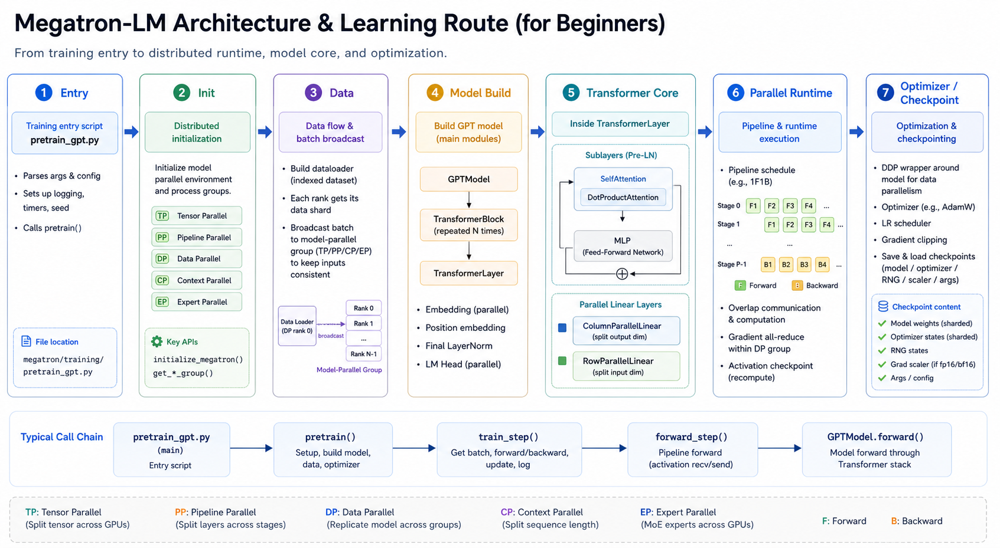

# 第一章：Megatron-LM架构与源码学习路线

> 面向 Megatron-LM 初学者。本文基于当前仓库 `Megatron-LM` 源码梳理，重点关注 GPT 预训练主链路、通信组初始化、数据流、Transformer 模型结构、Tensor Parallel Linear、Attention、MLP、Pipeline 并行、DDP 与优化器。建议先沿 dense GPT 路线学习，暂时跳过 MoE、RL、多模态、推理优化等高级分支。

## 0. 总览

Megatron-LM 可以分成两层理解：

1. **训练框架层**：负责参数解析、分布式初始化、数据集构建、模型构建、训练循环、checkpoint、日志、优化器等。
2. **Megatron-Core 模型层**：负责 GPT/Transformer 模型、并行 Linear、Attention、MLP、通信 primitive、pipeline schedule、distributed optimizer 等。

核心执行链路：

```text
pretrain_gpt.py
  -> megatron/training/training.py::pretrain()
    -> initialize_megatron()
    -> setup_model_and_optimizer()
    -> build_train_valid_test_data_iterators()
    -> train()
      -> train_step()
        -> forward_backward_func()
          -> pretrain_gpt.py::forward_step()
            -> GPTModel.forward()
              -> TransformerBlock.forward()
                -> TransformerLayer.forward()
```

如果把它类比成一条流水线：

```text
命令行参数
  -> 分布式环境和通信组
  -> 数据集和 dataloader
  -> 模型和优化器
  -> microbatch forward/backward
  -> 梯度同步
  -> 参数更新
  -> checkpoint/logging
```

## 1. 推荐学习顺序

初学不建议一开始就阅读所有目录。建议按下面顺序推进：

1. `pretrain_gpt.py`：理解 GPT 训练入口、batch、loss、forward step。
2. `megatron/training/training.py::pretrain()`：理解训练总控流程。
3. `megatron/training/initialize.py` 与 `megatron/core/parallel_state.py`：理解 TP/PP/DP/CP/EP 通信组。
4. `model_provider.py` 与 `gpt_builders.py`：理解模型如何被创建。
5. `megatron/core/models/gpt/gpt_layer_specs.py`：理解 `ModuleSpec`。
6. `megatron/core/models/gpt/gpt_model.py`：理解 GPTModel 的 embedding、decoder、output layer。
7. `megatron/core/transformer/transformer_block.py`：理解一个 pipeline stage 上有哪些 TransformerLayer。
8. `megatron/core/transformer/transformer_layer.py`：理解一层 Transformer 的完整计算顺序。
9. `megatron/core/tensor_parallel/layers.py`：理解 ColumnParallelLinear 和 RowParallelLinear。
10. `megatron/core/transformer/attention.py` 与 `dot_product_attention.py`：理解 SelfAttention 和核心 attention。
11. `megatron/core/transformer/mlp.py`：理解 MLP/FFN。
12. `megatron/core/pipeline_parallel/schedules.py`：理解无 PP、普通 1F1B、interleaved 1F1B。
13. `megatron/core/distributed/` 与 `megatron/core/optimizer/`：理解 DDP、梯度同步、分布式优化器。

## 2. 关键目录结构

当前仓库中，Megatron-LM 的核心目录如下：

```text
Megatron-LM/
  pretrain_gpt.py                 # GPT 预训练/SFT 入口
  model_provider.py               # 通用 model_provider
  gpt_builders.py                 # GPTModel builder
  megatron/
    training/                     # 训练框架层
      training.py                 # pretrain、train_step、get_model、optimizer setup
      initialize.py               # 分布式初始化入口
      arguments.py                # 参数解析与 config 构建
      checkpointing.py            # checkpoint 保存/加载
      datasets/                   # training 侧数据辅助
    core/                         # Megatron-Core
      parallel_state.py           # 通信组初始化和查询
      tensor_parallel/            # TP Linear、通信 primitive、random tracker
      pipeline_parallel/          # pipeline schedule 和 p2p 通信
      distributed/                # DDP、grad buffer、finalize grads
      optimizer/                  # Megatron optimizer / distributed optimizer
      datasets/                   # GPTDataset、BlendedDataset、indexed dataset
      models/gpt/                 # GPTModel 和 layer specs
      transformer/                # TransformerLayer、Attention、MLP、MoE 等
```

## 3. 训练入口层：`pretrain_gpt.py`

关键文件：

```text
Megatron-LM/pretrain_gpt.py
```

它是 GPT 预训练/SFT 的任务入口，主要定义下面几件事。

### 3.1 `get_batch()`

职责：从数据迭代器中拿一个 microbatch，并分发到当前 rank 应该处理的位置。

核心逻辑：

```text
data_iterator
  -> TP rank 0 next(data_iterator)
  -> batch tensor cuda()
  -> get_batch_on_this_tp_rank()
  -> get_batch_on_this_cp_rank()
  -> return attention_mask, labels, loss_mask, tokens, position_ids 等
```

注意点：

- 通常只有 TP rank 0 直接取 dataloader 数据。
- TP group 内其他 rank 通过 broadcast 得到 batch。
- 如果开启 Context Parallel，序列维度会进一步切给 CP rank。
- 如果当前 rank 不是 pipeline 第一阶段或最后阶段，有些 batch 字段可能返回 `None`，因为中间 PP stage 不需要 tokens/labels。

### 3.2 `loss_func()`

职责：计算语言模型 loss。

基本逻辑：

```text
output_tensor.view(-1)
loss_mask.view(-1)
loss = sum(losses * loss_mask)
num_tokens = sum(loss_mask)
```

它返回：

```text
loss
num_tokens
report dict
```

这里的 loss 通常是局部 microbatch 上的 loss，后续会通过 DP/CP 相关通信做统计或规约。

### 3.3 `forward_step()`

职责：一个 microbatch 的前向计算。

核心顺序：

```text
get_batch()
  -> 构造 PackedSeqParams，可选
  -> model(tokens, position_ids, attention_mask, labels=..., loss_mask=...)
  -> return output_tensor, partial(loss_func, ...)
```

`forward_step()` 不直接做 backward。它只完成前向和 loss 函数绑定，真正 forward/backward 的调度由 pipeline schedule 负责。

### 3.4 `train_valid_test_datasets_provider()`

职责：构建 train/valid/test datasets。

典型分支：

```text
args.sft -> SFTDataset
args.mock_data -> MockGPTDataset
args.fim_data -> GPTFIMDataset
else -> GPTDataset
```

外层通过 `BlendedMegatronDatasetBuilder` 支持多数据源混合。

### 3.5 `__main__`

入口最终调用：

```python
pretrain(
    full_config,
    train_valid_test_datasets_provider,
    partial(model_provider, gpt_builder),
    ModelType.encoder_or_decoder,
    forward_step,
    store=store,
    get_embedding_ranks=get_embedding_ranks,
)
```

这说明 GPT 入口把以下内容交给通用训练框架：

- 数据集构建函数
- 模型构建函数
- 模型类型
- forward step
- embedding rank 规则

## 4. 通用训练框架：`training.py`

关键文件：

```text
Megatron-LM/megatron/training/training.py
```

### 4.1 `pretrain()`

`pretrain()` 是训练总控函数。官方注释中的顺序非常重要：

```text
1. initialize Megatron
2. setup model, optimizer and lr schedule
3. call train/valid/test dataset provider
4. train the model
```

更详细地看：

```text
pretrain()
  -> initialize_megatron()
  -> set_jit_fusion_options()
  -> setup_model_and_optimizer()
  -> build_train_valid_test_data_iterators()
  -> train()
  -> save checkpoint
```

### 4.2 `get_model()`

职责：调用 `model_provider_func` 构建模型。

它会根据 pipeline 配置决定：

- 当前 rank 是否包含 embedding。
- 当前 rank 是否包含 output/loss。
- 是否有 virtual pipeline model chunk。
- 是否需要构建多个模型 chunk。

普通无 virtual PP：

```text
model_provider_func(pre_process=is_first_pp_stage, post_process=is_last_pp_stage)
```

有 virtual PP：

```text
for i in range(vp_size):
  model_provider_func(pre_process=..., post_process=..., vp_stage=i)
```

### 4.3 `setup_model_and_optimizer()`

职责：搭建模型和优化器。

核心顺序：

```text
get_model()
unwrap_model()
get_megatron_optimizer_config()
get_megatron_optimizer()
get_optimizer_param_scheduler()
load_checkpoint()  # 如果指定 load/pretrained checkpoint
```

如果训练被跳过，可能不创建 optimizer。

### 4.4 `train_step()`

职责：单个 iteration 的训练。

关键顺序：

```text
for model_chunk in model:
  zero_grad_buffer()
optimizer.zero_grad()

losses_reduced = forward_backward_func(...)

optimizer.step()
opt_param_scheduler.step()
```

其中 `forward_backward_func` 会根据 PP 配置选择不同 schedule。

## 5. 分布式初始化与通信组

关键文件：

```text
Megatron-LM/megatron/training/initialize.py
Megatron-LM/megatron/core/parallel_state.py
```

### 5.1 初始化入口

`initialize_megatron()` 的关键流程：

```text
initialize_megatron()
  -> setup_logging()
  -> initialize rerun state machine
  -> finish_mpu_init()
    -> _initialize_distributed()
      -> torch.distributed.init_process_group()
      -> mpu.initialize_model_parallel()
    -> _set_random_seed()
```

### 5.2 `torch.distributed.init_process_group()`

这一步先创建全局分布式进程组：

```python
torch.distributed.init_process_group(
    backend=args.distributed_backend,
    world_size=args.world_size,
    rank=args.rank,
    timeout=...
)
```

它只知道全局 rank/world size，还不知道 TP/PP/DP 怎么切。

### 5.3 `initialize_model_parallel()`

`parallel_state.py::initialize_model_parallel()` 负责把全局 ranks 切成各种并行通信组。

常见参数：

```text
tensor_model_parallel_size
pipeline_model_parallel_size
virtual_pipeline_model_parallel_size
context_parallel_size
expert_model_parallel_size
expert_tensor_parallel_size
order
```

### 5.4 主要通信组

#### TP: Tensor Parallel

用途：切单个张量/权重矩阵。

典型位置：

- QKV projection
- Attention output projection
- MLP fc1/fc2
- LM head

常用查询：

```text
get_tensor_model_parallel_group()
get_tensor_model_parallel_rank()
get_tensor_model_parallel_world_size()
```

#### PP: Pipeline Parallel

用途：切 Transformer 层。

例如 24 层模型，PP size = 4，每个 PP stage 可能持有 6 层。

常用查询：

```text
get_pipeline_model_parallel_group()
get_pipeline_model_parallel_rank()
is_pipeline_first_stage()
is_pipeline_last_stage()
```

#### DP: Data Parallel

用途：复制模型，切 batch，聚合梯度。

如果 world size = TP * PP * DP，那么：

```text
DP = world_size / (TP * PP)
```

在有 CP 时，Megatron 也常用 `with_context_parallel=True` 的 DP group。

#### CP: Context Parallel

用途：切 sequence/context 维度。

它主要影响 attention，因为 attention 需要跨 sequence chunk 通信。

#### EP: Expert Parallel

用途：MoE expert 并行。初学 dense GPT 时可以先跳过。

### 5.5 一个例子

假设：

```text
world_size = 16
TP = 2
PP = 4
CP = 1
DP = 2
```

那么：

```text
model_parallel_size = TP * PP * CP = 8
data_parallel_size = world_size / model_parallel_size = 2
```

每个 DP replica 中，有 2 张卡做 TP，有 4 个 PP stage。

## 6. 数据层与 batch 分发

关键文件：

```text
Megatron-LM/megatron/core/datasets/gpt_dataset.py
Megatron-LM/megatron/core/datasets/blended_megatron_dataset_builder.py
Megatron-LM/megatron/training/datasets/data_samplers.py
Megatron-LM/megatron/core/tensor_parallel/data.py
Megatron-LM/megatron/core/utils.py
```

### 6.1 数据集构建

GPT 数据集路径：

```text
train_valid_test_datasets_provider()
  -> core_gpt_dataset_config_from_args()
  -> BlendedMegatronDatasetBuilder(...)
  -> GPTDataset / GPTFIMDataset / SFTDataset / MockGPTDataset
```

`GPTDatasetConfig` 中包含：

- tokenizer
- sequence length
- data path blend
- split
- reset position ids
- reset attention mask
- eod mask loss
- CP/DP 相关配置

### 6.2 dataloader 构建

`training.py::build_train_valid_test_data_iterators()`：

```text
build_train_valid_test_data_loaders()
  -> train_dataloader / valid_dataloaders / test_dataloader
  -> RerunDataIterator
```

dataloader 类型：

```text
single
cyclic
external
```

### 6.3 batch 在 TP group 内广播

`pretrain_gpt.py::get_batch()` 中：

```text
if tp_rank == 0:
  batch = next(data_iterator)
  batch[key] = batch[key].cuda()

batch = get_batch_on_this_tp_rank(...)
```

底层可参考 `tensor_parallel/data.py::broadcast_data()`：

```text
rank 0:
  flatten tensors
all ranks:
  broadcast flatten_data
  unpack tensors
```

### 6.4 batch 在 CP group 内切分

如果开启 context parallel：

```text
batch = get_batch_on_this_cp_rank(...)
```

这一步会让不同 CP rank 拿到不同 sequence chunk。

## 7. 模型构建：`model_provider`、`gpt_builder`、`ModuleSpec`

关键文件：

```text
Megatron-LM/model_provider.py
Megatron-LM/gpt_builders.py
Megatron-LM/megatron/core/models/gpt/gpt_layer_specs.py
```

### 7.1 `model_provider()`

它是训练框架调用的统一模型构建入口：

```text
model_provider(model_builder, pre_process, post_process, vp_stage, config, pg_collection)
  -> model_builder(...)
```

对于 GPT 训练：

```text
model_builder = gpt_builder
```

### 7.2 `gpt_builder()`

核心逻辑：

```text
gpt_builder()
  -> core_transformer_config_from_args()
  -> choose transformer_layer_spec
  -> GPTModel(...)
```

`transformer_layer_spec` 的选择：

```text
args.spec is not None
  -> import user custom spec
args.experimental_attention_variant
  -> experimental attention variant spec
args.num_experts
  -> MoE decoder block spec
args.heterogeneous_layers_config_path
  -> heterogeneous layer spec
args.transformer_impl == "transformer_engine"
  -> TE spec
else
  -> local Megatron-Core spec
```

### 7.3 `ModuleSpec`

Megatron-Core 不把每层子模块写死，而是通过 `ModuleSpec` 描述模块结构。

local dense GPT spec 大致描述：

```text
TransformerLayer
  input_layernorm
  self_attention
    linear_qkv
    core_attention
    linear_proj
  self_attn_bda
  pre_mlp_layernorm
  mlp
    linear_fc1
    linear_fc2
  mlp_bda
```

好处：

- 同一个 `TransformerLayer` 可以接 PyTorch local 实现。
- 可以接 Transformer Engine 实现。
- 可以接 MoE MLP。
- 可以接 inference optimized 实现。
- 可以接实验性 Attention 变体。

初学优先看：

```text
get_gpt_layer_local_spec()
get_gpt_layer_local_submodules()
```

## 8. GPTModel

关键文件：

```text
Megatron-LM/megatron/core/models/gpt/gpt_model.py
```

### 8.1 GPTModel 结构

主要模块：

```text
GPTModel
  embedding: LanguageModelEmbedding
  rotary_pos_emb: RotaryEmbedding / YarnRotaryEmbedding / MultimodalRotaryEmbedding
  decoder: TransformerBlock
  mtp: MultiTokenPredictionBlock, optional
  output_layer: ColumnParallelLinear
```

`pre_process` 控制当前 PP stage 是否包含 embedding。

`post_process` 控制当前 PP stage 是否包含 output layer/loss。

### 8.2 初始化逻辑

```text
if pre_process:
  build embedding

if position_embedding_type == rope:
  build rotary_pos_emb

build decoder = TransformerBlock(...)

if post_process:
  build output_layer = ColumnParallelLinear(hidden_size, vocab_size)
```

注意 output layer 是 `ColumnParallelLinear`，因为 vocab 维度很大，适合按输出维度切分。

### 8.3 forward 主路径

```text
GPTModel.forward()
  -> _preprocess()
    -> embedding(input_ids, position_ids)
    -> build rotary_pos_emb
  -> decoder(...)
  -> _postprocess()
    -> output_layer(hidden_states)
    -> compute parallel lm logits or loss
```

`_preprocess()` 处理：

- embedding
- RoPE
- CP/packed sequence 下的位置参数
- inference context 下的特殊逻辑

`decoder` 是 `TransformerBlock`。

`_postprocess()` 处理：

- output projection
- labels/loss
- MTP 可选逻辑

## 9. TransformerBlock

关键文件：

```text
Megatron-LM/megatron/core/transformer/transformer_block.py
```

### 9.1 作用

`TransformerBlock` 表示当前 rank 上的一组 TransformerLayer。

在 PP 中，不是每个 rank 都有完整模型。比如 24 层、PP=4，每个 PP rank 可能只构建 6 层。

### 9.2 构建层数

核心函数：

```text
get_num_layers_to_build(config, vp_stage, pp_rank)
```

它会考虑：

- `num_layers`
- `pipeline_model_parallel_size`
- `virtual_pipeline_model_parallel_size`
- `num_layers_in_first_pipeline_stage`
- `num_layers_in_last_pipeline_stage`
- 是否把 embedding/loss 计入 pipeline split
- 自定义 pipeline layout

### 9.3 `_build_layers()`

```text
self.layers = ModuleList([
  build_layer(layer_spec, i + 1)
  for i, layer_spec in enumerate(...)
])
```

每个 layer 实际由 `ModuleSpec` build 出来。

### 9.4 forward 主路径

简化版：

```text
if not pre_process:
  hidden_states = self.input_tensor  # 来自前一个 PP stage

for layer in self.layers:
  hidden_states, context = layer(...)

if final_layernorm:
  hidden_states = final_layernorm(hidden_states)

return hidden_states
```

Pipeline 中，中间 stage 的输入不是 `forward_step()` 传来的 tokens，而是前一 stage 通过 P2P 发来的 activation。

## 10. TransformerLayer

关键文件：

```text
Megatron-LM/megatron/core/transformer/transformer_layer.py
```

### 10.1 Dense GPT layer 结构

典型 GPT decoder layer：

```text
hidden_states
  -> input_layernorm
  -> self_attention
  -> self_attn_bda: bias + dropout + residual add
  -> pre_mlp_layernorm
  -> mlp
  -> mlp_bda: bias + dropout + residual add
  -> output
```

源码中模块编号：

```text
Module 1: Input Layernorm
Module 2: SelfAttention
Module 3: BiasDropoutFusion
Module 4: Post SelfAttention / pre cross-attn LN
Module 5: CrossAttention
Module 6: CrossAttention BDA
Module 7: Pre MLP Layernorm
Module 8: MLP block
Module 9: MLP BDA
```

对于 GPT decoder-only，cross attention 通常是 `IdentityOp`。

### 10.2 `_forward_attention()`

核心流程：

```text
input_layernorm_output = input_layernorm(hidden_states)
residual = hidden_states

attention_output_with_bias = self_attention(input_layernorm_output, ...)

hidden_states = self_attn_bda(
  attention_output_with_bias,
  residual,
  hidden_dropout
)
```

`self_attn_bda` 就是 bias + dropout + add 的融合逻辑。

### 10.3 `_forward_mlp()`

核心流程：

```text
pre_mlp_layernorm_output = pre_mlp_layernorm(hidden_states)
residual = hidden_states

mlp_output_with_bias = mlp(pre_mlp_layernorm_output)

output = mlp_bda(
  mlp_output_with_bias,
  residual,
  hidden_dropout
)
```

### 10.4 recompute/offload/fusion

`TransformerLayer` 中还有很多工程优化：

- activation recompute
- selective recompute
- fine-grained activation offload
- FP8/FP4 context
- fused TP communication for inference
- CUDA graph
- MoE router 相关逻辑

初学时可以先忽略这些分支，抓住主干。

## 11. Tensor Parallel Linear

关键文件：

```text
Megatron-LM/megatron/core/tensor_parallel/layers.py
Megatron-LM/megatron/core/tensor_parallel/mappings.py
```

Tensor Parallel 是 Megatron 最核心的思想之一：把单个大矩阵切到多张卡上计算。

### 11.1 ColumnParallelLinear

定义：

```text
Y = X A + b
A 按列切分:
A = [A1, A2, ..., Ap]
```

因为 PyTorch linear 实际存的是转置权重，所以源码中 weight shape 是：

```text
[output_size_per_partition, input_size]
```

每个 TP rank 只保存一部分输出维度。

前向逻辑：

```text
input_parallel = copy_to_tensor_model_parallel_region(input)
output_parallel = linear(input_parallel, local_weight)

if gather_output:
  output = all_gather(output_parallel)
else:
  output = output_parallel
```

常见用途：

- attention QKV projection
- MLP fc1
- LM output head

### 11.2 RowParallelLinear

定义：

```text
Y = X A + b
A 按行切分，等价于按输入维度切分:
X = [X1, X2, ..., Xp]
A = transpose([A1, A2, ..., Ap])
```

每个 TP rank 计算 partial output，最后规约。

前向逻辑：

```text
if input_is_parallel:
  input_parallel = input
else:
  input_parallel = scatter_to_tensor_model_parallel_region(input)

output_parallel = linear(input_parallel, local_weight)

if sequence_parallel:
  output = reduce_scatter_to_sequence_parallel_region(output_parallel)
else:
  output = reduce_from_tensor_model_parallel_region(output_parallel)
```

常见用途：

- attention output projection
- MLP fc2

### 11.3 Column vs Row 直觉

MLP 中：

```text
hidden
  -> fc1: ColumnParallelLinear
       每张卡得到一部分 intermediate hidden
  -> activation
  -> fc2: RowParallelLinear
       每张卡把自己那部分 intermediate 投回 hidden
       all-reduce 合并完整 hidden
```

Attention 中：

```text
hidden
  -> qkv: ColumnParallelLinear
       每张卡得到一部分 heads
  -> core attention
       每张卡算自己负责的 heads
  -> linear_proj: RowParallelLinear
       合并所有 heads 的输出
```

## 12. TP 通信 primitive

关键文件：

```text
Megatron-LM/megatron/core/tensor_parallel/mappings.py
```

这些函数通常是 autograd function，前向和反向对应不同通信。

### 12.1 常用 primitive

```text
copy_to_tensor_model_parallel_region
  forward: identity
  backward: all-reduce

reduce_from_tensor_model_parallel_region
  forward: all-reduce
  backward: identity

scatter_to_tensor_model_parallel_region
  forward: split last dim
  backward: gather last dim

gather_from_tensor_model_parallel_region
  forward: gather last dim
  backward: split last dim

scatter_to_sequence_parallel_region
  forward: split first dim
  backward: gather first dim

gather_from_sequence_parallel_region
  forward: gather first dim
  backward: reduce-scatter or split first dim

reduce_scatter_to_sequence_parallel_region
  forward: reduce-scatter first dim
  backward: gather first dim
```

### 12.2 为什么用 autograd function

因为通信不仅发生在 forward，也发生在 backward。

例如 `scatter_to_tensor_model_parallel_region`：

```text
forward:
  每张卡拿 last dim 的一个切片

backward:
  梯度需要 gather 回完整 last dim
```

把通信写进 autograd function 后，模块代码更简洁，反向通信自动发生。

## 13. Attention

关键文件：

```text
Megatron-LM/megatron/core/transformer/attention.py
Megatron-LM/megatron/core/transformer/dot_product_attention.py
```

Attention 分两层理解：

```text
SelfAttention:
  工程外壳，负责 QKV projection、split heads、RoPE、GQA、KV cache、output projection

DotProductAttention:
  数学核心，负责 QK^T、mask、softmax、dropout、乘 V
```

### 13.1 SelfAttention 初始化

核心子模块：

```text
self.linear_qkv = ColumnParallelLinear(...)
self.core_attention = DotProductAttention or TE attention
self.linear_proj = RowParallelLinear(...)
```

QKV 输出维度：

```text
linear_qkv_out_dim = query_projection_size + 2 * kv_projection_size
```

如果是 GQA/MQA，Q heads 数量和 KV heads 数量不同。

### 13.2 QKV projection

`get_query_key_value_tensors()`：

```text
mixed_qkv = linear_qkv(hidden_states)
mixed_qkv reshape
split -> query, key, value
query reshape -> [sq, batch, num_heads_per_partition, head_dim]
key/value reshape -> [sk, batch, num_query_groups_per_partition, head_dim]
optional q/k layernorm
```

典型 shape：

```text
hidden_states: [seq, batch, hidden]
query: [seq, batch, heads_per_tp_rank, head_dim]
key:   [seq, batch, kv_groups_per_tp_rank, head_dim]
value: [seq, batch, kv_groups_per_tp_rank, head_dim]
```

### 13.3 RoPE

RoPE 通常在 Attention forward 中应用到 query/key。

相关对象在 `GPTModel._preprocess()` 中创建：

```text
RotaryEmbedding(...)
rotary_pos_emb = self.rotary_pos_emb(...)
```

然后传入 decoder/layer/attention。

### 13.4 DotProductAttention

核心数学：

```text
scores = Q K^T / sqrt(head_dim)
scores = mask(scores)
probs = softmax(scores)
probs = dropout(probs)
context = probs V
```

源码中主要 shape：

```text
query: [sq, b, np, hn]
key:   [sk, b, np or ng, hn]
value: [sk, b, np or ng, hn]

attention_scores: [b, np, sq, sk]
attention_probs:  [b, np, sq, sk]
context:          [sq, b, hidden_per_partition]
```

其中：

```text
np = num_attention_heads_per_partition
hn = hidden_size_per_attention_head
```

### 13.5 Attention output projection

core attention 输出是每个 TP rank 上的一部分 heads：

```text
context: [seq, batch, hidden_per_partition]
```

然后经过：

```text
linear_proj = RowParallelLinear(...)
```

RowParallelLinear 会把各 TP rank 的 partial output 规约成完整 hidden。

## 14. MLP / FFN

关键文件：

```text
Megatron-LM/megatron/core/transformer/mlp.py
```

### 14.1 基本结构

```text
MLP
  linear_fc1: ColumnParallelLinear
  activation: GELU / SwiGLU / GEGLU / quick_gelu
  linear_fc2: RowParallelLinear
```

前向：

```text
intermediate_parallel, bias = linear_fc1(hidden_states)
intermediate_parallel = activation(intermediate_parallel + bias)
output, output_bias = linear_fc2(intermediate_parallel)
```

### 14.2 普通 FFN

如果 hidden size 为 `h`，FFN hidden size 通常为 `4h`：

```text
[seq, batch, h]
  -> fc1
[seq, batch, 4h / TP]
  -> activation
[seq, batch, 4h / TP]
  -> fc2 + all-reduce
[seq, batch, h]
```

### 14.3 SwiGLU/GEGLU

如果开启 `gated_linear_unit`：

```text
fc1 output = [gate, value]
activation = act(gate) * value
```

因此 fc1 输出维度会扩大：

```text
ffn_hidden_size *= 2
```

Megatron 中还处理了 stride、sharded state dict 等细节，确保 TP size 改变时 checkpoint 可以正确 reshard。

## 15. Pipeline Parallel

关键文件：

```text
Megatron-LM/megatron/core/pipeline_parallel/schedules.py
Megatron-LM/megatron/core/pipeline_parallel/p2p_communication.py
```

### 15.1 schedule 选择

入口：

```text
get_forward_backward_func()
```

根据 PP/VPP 配置选择：

```text
forward_backward_no_pipelining()
forward_backward_pipelining_without_interleaving()
forward_backward_pipelining_with_interleaving()
```

### 15.2 无 PP

`forward_backward_no_pipelining()`：

```text
for microbatch:
  forward_step()
  backward_step()
```

如果有多个 microbatch，通常前几个在 `no_sync` 下累积梯度，最后再同步。

### 15.3 普通 PP：non-interleaved 1F1B

每个 rank 只持有部分层。

流程上有：

```text
warmup forward
steady 1F1B
cooldown backward
```

其中 1F1B 表示：

```text
one forward
one backward
```

### 15.4 Interleaved PP

如果设置 virtual pipeline：

```text
virtual_pipeline_model_parallel_size > 1
```

每个物理 PP rank 上有多个 model chunk。

例如：

```text
8 layers, PP=2, VPP=2

stage 0:
  chunk 0: layer 1,2
  chunk 1: layer 5,6

stage 1:
  chunk 0: layer 3,4
  chunk 1: layer 7,8
```

这样可以减少 pipeline bubble。

### 15.5 P2PCommunicator

`p2p_communication.py` 负责 PP stage 之间发送 activation 和 gradient。

典型通信：

```text
send_forward
recv_forward
send_backward
recv_backward
send_forward_recv_backward
send_backward_recv_forward
```

底层使用：

```text
torch.distributed.isend
torch.distributed.irecv
torch.distributed.batch_isend_irecv
```

## 16. DDP、梯度同步与优化器

关键目录：

```text
Megatron-LM/megatron/core/distributed/
Megatron-LM/megatron/core/optimizer/
```

### 16.1 DDP

关键文件：

```text
megatron/core/distributed/distributed_data_parallel.py
megatron/core/distributed/param_and_grad_buffer.py
```

Megatron 的 DDP 不只是简单包一层 PyTorch DDP。它会管理：

- 参数 buffer
- 梯度 buffer
- bucket
- overlap grad reduce
- reduce-scatter
- distributed optimizer 所需的参数布局

### 16.2 finalize model grads

关键文件：

```text
megatron/core/distributed/finalize_model_grads.py
```

训练 backward 后，需要处理：

- DP 梯度规约。
- CP 相关梯度规约。
- embedding group 梯度同步。
- position embedding group 梯度同步。
- layernorm 等特殊参数同步。

### 16.3 optimizer

关键入口：

```text
megatron/core/optimizer/__init__.py::get_megatron_optimizer()
```

常见 optimizer：

- Adam
- distributed optimizer
- mixed precision optimizer
- layer-wise optimizer
- CPU offloading optimizer

初学建议先理解普通 Adam，再理解 distributed optimizer。

### 16.4 一次 train step 的参数更新

简化版：

```text
zero_grad_buffer()
optimizer.zero_grad()

forward_backward_func()
  -> forward
  -> loss
  -> backward
  -> pipeline p2p communication
  -> TP/PP 内部通信

finalize_model_grads()
  -> DP/CP grad sync
  -> embedding grad sync

optimizer.step()
scheduler.step()
```

## 17. Checkpoint

关键目录：

```text
Megatron-LM/megatron/training/checkpointing.py
Megatron-LM/megatron/core/dist_checkpointing/
```

Megatron checkpoint 要处理很多并行维度：

- TP 切分参数。
- PP 不同 rank 持有不同层。
- DP 复制参数但 optimizer state 可能分片。
- MoE expert 参数分布。
- distributed optimizer state。

因此很多模块实现了：

```text
sharded_state_dict()
```

例如：

- `ColumnParallelLinear.sharded_state_dict()`：weight/bias 沿 axis 0 切。
- `RowParallelLinear.sharded_state_dict()`：weight 沿 axis 1 切。
- MLP 中 SwiGLU 还需要特殊 sharded factory。

## 18. 典型 GPT dense layer 数据流

以一层 decoder layer 为例：

```text
hidden_states: [seq, batch, hidden]

1. input layernorm
   -> [seq, batch, hidden]

2. QKV projection: ColumnParallelLinear
   -> mixed_qkv: [seq, batch, qkv_hidden_per_tp_rank]

3. split heads
   -> query: [seq, batch, heads_per_tp_rank, head_dim]
   -> key:   [seq, batch, kv_heads_per_tp_rank, head_dim]
   -> value: [seq, batch, kv_heads_per_tp_rank, head_dim]

4. RoPE
   -> apply to query/key

5. core attention
   -> context: [seq, batch, hidden_per_tp_rank]

6. attention output projection: RowParallelLinear
   -> all-reduce / reduce-scatter
   -> [seq, batch, hidden]

7. bias + dropout + residual
   -> [seq, batch, hidden]

8. pre-MLP layernorm
   -> [seq, batch, hidden]

9. MLP fc1: ColumnParallelLinear
   -> [seq, batch, ffn_hidden_per_tp_rank]

10. activation
   -> [seq, batch, ffn_hidden_per_tp_rank]

11. MLP fc2: RowParallelLinear
   -> all-reduce / reduce-scatter
   -> [seq, batch, hidden]

12. bias + dropout + residual
   -> [seq, batch, hidden]
```

## 19. 各类并行如何嵌入一次 forward

### 19.1 TP

TP 出现在单层内部：

```text
Linear weight split
Attention heads split
MLP intermediate split
```

通信位置：

```text
ColumnParallelLinear: 可选 all-gather
RowParallelLinear: all-reduce / reduce-scatter
autograd backward: 自动补充反向通信
```

### 19.2 PP

PP 出现在层与层之间：

```text
stage 0: embedding + layers 0..5
stage 1: layers 6..11
stage 2: layers 12..17
stage 3: layers 18..23 + output/loss
```

通信位置：

```text
activation send/recv
gradient send/recv
```

### 19.3 DP

DP 出现在 iteration/batch 维度：

```text
每个 DP rank 处理不同 data shard
模型结构相同
backward 后同步梯度
```

通信位置：

```text
gradient all-reduce / reduce-scatter
optimizer state sync or partition
```

### 19.4 CP

CP 出现在 sequence/context 维度：

```text
sequence 被切给多个 CP rank
attention 需要跨 CP rank 交换上下文信息
```

初学可以先在 CP=1 的情况下理解主链路。

### 19.5 EP

EP 出现在 MoE：

```text
tokens routed to experts
experts 分布在不同 EP rank
all-to-all 发送 token
expert MLP 计算
all-to-all 收回 token
```

dense GPT 初学阶段可以跳过。

## 20. 常见源码阅读误区

### 20.1 不要从 `TransformerLayer` 一头扎进所有分支

这个文件包含很多优化路径：

- FP8/FP4
- CUDA graph
- MoE
- offload
- recompute
- inference fusion

初学先只看 dense GPT 主路径：

```text
input LN -> self-attn -> BDA -> pre-MLP LN -> MLP -> BDA
```

### 20.2 不要一开始就看 Transformer Engine 版

TE 版本更贴近生产性能，但抽象和融合更多。建议先看 local spec：

```text
get_gpt_layer_local_spec()
DotProductAttention
ColumnParallelLinear
RowParallelLinear
MLP
```

### 20.3 不要把 TP/PP/DP 混在一起

可以用一句话区分：

```text
TP 切一层里面的矩阵。
PP 切模型的层。
DP 切数据 batch。
CP 切 sequence。
EP 切 experts。
```

### 20.4 注意 `pre_process` 和 `post_process`

在 PP 下：

```text
只有第一个 PP stage 需要 embedding。
只有最后一个 PP stage 需要 output layer/loss。
中间 stage 只处理 hidden_states。
```

因此同一个 `GPTModel` 类，在不同 rank 上构建出来的模块是不一样的。

## 21. 建议做的源码练习

### 练习 1：画出一次 GPT forward

从 `pretrain_gpt.py::forward_step()` 开始，一路跟到：

```text
GPTModel.forward()
TransformerBlock.forward()
TransformerLayer.forward()
SelfAttention.forward()
DotProductAttention.forward()
MLP.forward()
```

目标：能画出 hidden_states 的 shape 变化。

### 练习 2：理解 TP Linear

只看：

```text
ColumnParallelLinear.forward()
RowParallelLinear.forward()
tensor_parallel/mappings.py
```

目标：能解释每个通信 primitive 的 forward/backward 行为。

### 练习 3：理解 PP schedule

只看：

```text
get_forward_backward_func()
forward_backward_no_pipelining()
forward_backward_pipelining_without_interleaving()
P2PCommunicator
```

目标：能解释无 PP 和 1F1B 的区别。

### 练习 4：理解模型构建

只看：

```text
model_provider.py
gpt_builders.py
gpt_layer_specs.py
transformer/spec_utils.py
```

目标：能解释 `ModuleSpec` 如何构建真实模块。

## 22. 一句话总结

Megatron-LM 的核心是：**用不同 process group 把模型、张量、层、数据、序列和 expert 切开，再用并行 Linear、pipeline schedule、P2P 通信、梯度同步和分布式优化器，把这些切分重新组织成一次完整的大模型训练。**

初学主线可以浓缩成：

```text
pretrain_gpt.py
  -> training.py
  -> initialize.py / parallel_state.py
  -> gpt_builder / ModuleSpec
  -> GPTModel
  -> TransformerBlock
  -> TransformerLayer
  -> ColumnParallelLinear / RowParallelLinear
  -> SelfAttention / DotProductAttention
  -> MLP
  -> pipeline schedule
  -> DDP / optimizer
```

## 23. 总结图


