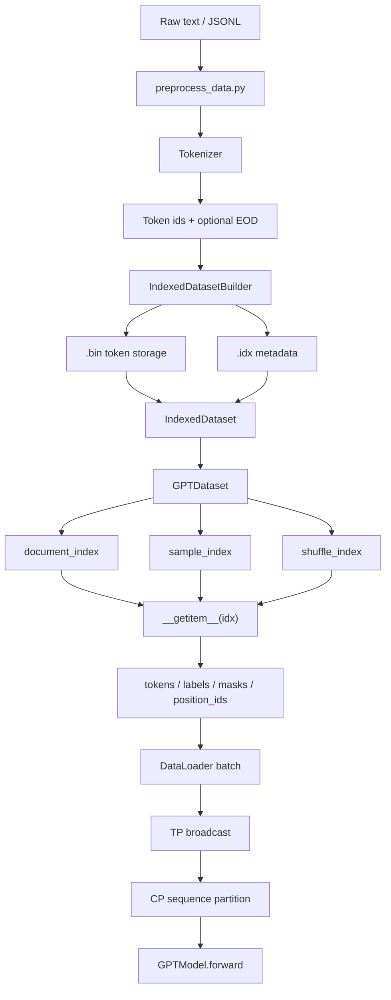
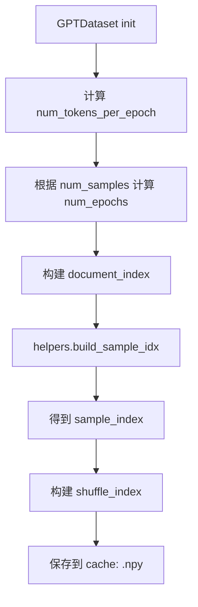
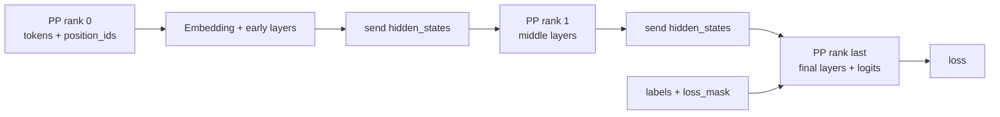
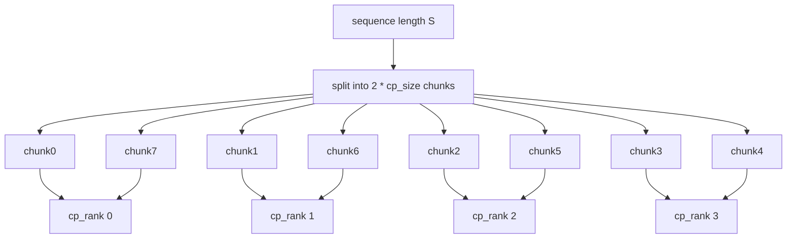
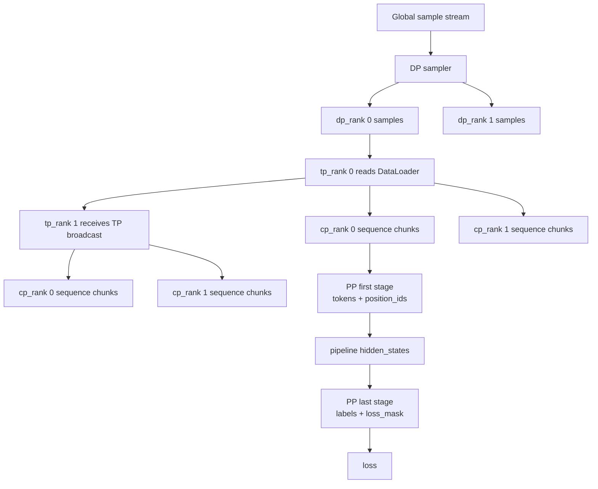
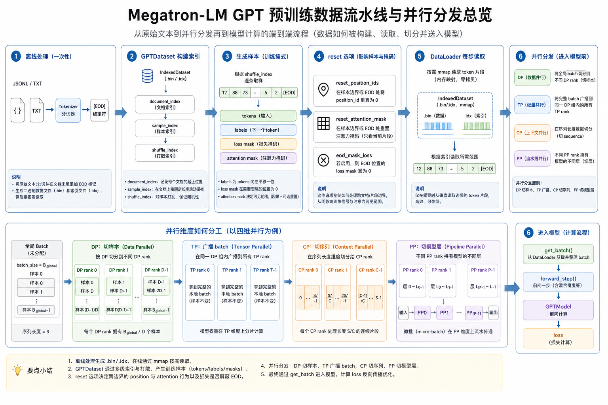

# 第二章：Megatron-LM 数据处理、数据读取与并行分发全流程

> 面向 Megatron-LM 初学者。本文基于当前仓库 `Megatron-LM` 源码梳理 GPT 预训练数据链路：离线数据处理、`.bin/.idx` indexed dataset、在线构建 train/valid/test dataset、`GPTDataset` 三类索引、`reset-position-ids` / `reset-attention-mask` / `eod-mask-loss` 的影响、DataLoader 每一步如何读取数据，以及开启 DP/TP/PP/CP 后数据如何流动到每个 rank 并进入模型训练。

## 0. 总览

Megatron 的 GPT 预训练数据链路可以先记住一句话：

**离线阶段把文本变成可随机访问的 token 二进制数据；在线阶段把多个 document 的 token 串成连续 token 流，按 `seq_length + 1` 切出 GPT 样本；DP 切不同样本，TP 广播同一 batch，CP 切同一 sequence，PP 只让对应 stage 拿自己需要的字段。**

整体流程：

```text
原始 JSONL / TXT
  -> tools/preprocess_data.py
    -> tokenizer.encode()
    -> append EOD，可选 sentence split
    -> IndexedDatasetBuilder
    -> xxx_text_document.bin
    -> xxx_text_document.idx

训练启动
  -> pretrain_gpt.py
    -> train_valid_test_datasets_provider()
    -> BlendedMegatronDatasetBuilder
    -> GPTDataset
      -> document_index / sample_index / shuffle_index
    -> DataLoader + Sampler

每个训练 step / micro-step
  -> TP rank 0: next(data_iterator)
  -> GPTDataset.__getitem__(sample_idx)
  -> tokens / labels / loss_mask / position_ids / attention_mask
  -> TP group broadcast
  -> CP group sequence partition
  -> forward_step()
  -> GPTModel.forward()
  -> loss_func()
```

流程图：



## 1. 关键源码路径

建议先围绕这些文件读：

```text
Megatron-LM/tools/preprocess_data.py
Megatron-LM/megatron/core/datasets/indexed_dataset.py
Megatron-LM/megatron/core/datasets/gpt_dataset.py
Megatron-LM/megatron/core/datasets/blended_megatron_dataset_builder.py
Megatron-LM/megatron/training/datasets/data_samplers.py
Megatron-LM/megatron/training/training.py
Megatron-LM/pretrain_gpt.py
Megatron-LM/megatron/core/utils.py
Megatron-LM/megatron/core/parallel_state.py
```

数据主线对应关系：

```text
preprocess_data.py
  离线 tokenize，并写 .bin/.idx

indexed_dataset.py
  定义 IndexedDataset 与 IndexedDatasetBuilder

gpt_dataset.py
  定义 GPTDatasetConfig、GPTDataset、MockGPTDataset
  核心是 document_index / sample_index / shuffle_index

data_samplers.py
  定义 DataLoader 的 sampler
  DP rank 在这里拿不同 sample index

pretrain_gpt.py::get_batch()
  每个 microbatch 取数据、TP 广播、CP 切分

core/utils.py::get_batch_on_this_tp_rank()
  TP 组内 batch broadcast

core/utils.py::get_batch_on_this_cp_rank()
  CP 组内 sequence partition
```

## 2. 离线处理：从原始文本到 `.bin/.idx`

### 2.1 为什么要离线处理

GPT 预训练数据很大，训练时不能每一步都做：

```text
读取 JSON
  -> 清洗文本
  -> tokenizer.encode()
  -> 生成 token ids
```

这样会让 CPU/tokenizer 成为训练瓶颈。Megatron 的做法是：

```text
训练前一次性 tokenize
训练时只读取 token ids
```

离线输出通常长这样：

```text
mydata_text_document.bin
mydata_text_document.idx
```

其中：

```text
.bin:
  连续存储 token ids

.idx:
  存储 sequence/document 元信息
  包括 sequence_lengths、sequence_pointers、document_indices 等
```

### 2.2 `preprocess_data.py` 做什么

入口脚本：

```text
Megatron-LM/tools/preprocess_data.py
```

典型输入是 JSONL：

```json
{"text": "hello world ..."}
{"text": "another document ..."}
```

常见命令形式：

```bash
python tools/preprocess_data.py \
  --input data.jsonl \
  --output-prefix mydata \
  --tokenizer-type GPT2BPETokenizer \
  --json-keys text \
  --append-eod
```

关键逻辑：

```text
Encoder.encode(json_line)
  -> json.loads(json_line)
  -> 取 args.json_keys 指定字段
  -> tokenizer.tokenize(sentence)
  -> 可选 append_eod
  -> 返回 doc_ids 与 lens

IndexedDatasetBuilder.add_item()
  -> 写 token ids 到 .bin
  -> 记录 sequence length

IndexedDatasetBuilder.end_document()
  -> 记录 document 边界

IndexedDatasetBuilder.finalize()
  -> 写 .idx
```

核心代码摘录：

```python
# Megatron-LM/tools/preprocess_data.py
def encode(self, json_line):
    data = json.loads(json_line)
    ids = {}
    lens = {}
    for key in self.args.json_keys:
        text = data[key]
        sentences = text if isinstance(text, list) else [text]
        doc_ids = []
        sentence_lens = []
        for sentence in sentences:
            sentence_ids = Encoder.tokenizer.tokenize(sentence)
            if len(sentence_ids) > 0:
                doc_ids.extend(sentence_ids)
                sentence_lens.append(len(sentence_ids))
        if len(doc_ids) > 0 and self.args.append_eod:
            doc_ids.append(Encoder.tokenizer.eod)
            sentence_lens[-1] += 1
        ids[key] = doc_ids
        lens[key] = sentence_lens
    return ids, lens, len(json_line)
```

写入 `.bin/.idx` 的核心位置：

```python
# Megatron-LM/tools/preprocess_data.py
builders[key] = indexed_dataset.IndexedDatasetBuilder(
    output_bin_files[key],
    dtype=indexed_dataset.DType.optimal_dtype(tokenizer.vocab_size),
)

for i, (doc, sentence_lens, bytes_processed) in enumerate(encoded_docs, start=1):
    for key in doc.keys():
        builders[key].add_document(doc[key], sentence_lens[key])

for key in self.args.json_keys:
    builders[key].finalize(output_idx_files[key])
```

`IndexedDatasetBuilder` 内部真正写二进制：

```python
# Megatron-LM/megatron/core/datasets/indexed_dataset.py
def add_document(self, tensor: torch.Tensor, lengths: List[int], modes=None) -> None:
    np_array = numpy.array(tensor, dtype=self.dtype)
    self.data_file.write(np_array.tobytes(order="C"))
    self.sequence_lengths.extend(lengths)
    self.document_indices.append(len(self.sequence_lengths))

def finalize(self, idx_path: str) -> None:
    self.data_file.close()
    with _IndexWriter(idx_path, self.dtype) as writer:
        writer.write(self.sequence_lengths, self.sequence_modes, self.document_indices)
```

`--append-eod` 很重要。它会在每个 document 后追加 EOD token：

```text
doc0: [A1, A2, A3, EOD]
doc1: [B1, B2, EOD]
```

后续如果开启：

```text
--reset-position-ids
--reset-attention-mask
--eod-mask-loss
```

这些选项就是靠样本中的 EOD token 找到文档边界。

### 2.3 `.bin/.idx` 的直观理解

可以把 `.bin` 理解成一条很长的 token 数组：

```text
.bin:
[A1, A2, A3, EOD, B1, B2, EOD, C1, C2, C3, EOD, ...]
```

`.idx` 记录如何在这条数组里定位每个 sequence/document：

```text
sequence_lengths:
  每段 sequence 的长度

sequence_pointers:
  每段 sequence 在 .bin 中的起始位置

document_indices:
  document 边界
```

训练时不再读原始 JSON 文本，而是通过 `IndexedDataset.get(idx, offset, length)` 从 `.bin` 中取 token id 片段。

核心代码摘录：

```python
# Megatron-LM/megatron/core/datasets/indexed_dataset.py
if isinstance(idx, (int, numpy.integer)):
    sequence_pointer, sequence_length, sequence_mode = self.index[idx]
    sequence = self.bin_reader.read(
        dtype=self.index.dtype,
        count=sequence_length,
        offset=sequence_pointer,
    )
    return (sequence, sequence_mode) if sequence_mode is not None else sequence
```

## 3. 训练启动：构建 train/valid/test Dataset

### 3.1 从 `pretrain()` 到 DataLoader

训练入口在：

```text
Megatron-LM/pretrain_gpt.py
```

它把 dataset provider 传给通用训练框架：

```text
pretrain(...)
  -> build_train_valid_test_data_iterators()
    -> build_train_valid_test_data_loaders()
      -> build_train_valid_test_datasets()
        -> train_valid_test_datasets_provider()
```

数据集 provider：

```text
pretrain_gpt.py::train_valid_test_datasets_provider()
  -> core_gpt_dataset_config_from_args()
  -> BlendedMegatronDatasetBuilder(...)
  -> build()
  -> train_ds, valid_ds, test_ds
```

核心代码摘录：

```python
# Megatron-LM/pretrain_gpt.py
def train_valid_test_datasets_provider(train_val_test_num_samples, vp_stage=None):
    args = get_args()
    config = core_gpt_dataset_config_from_args(args)

    if args.sft:
        dataset_type = SFTDataset
    else:
        if args.mock_data:
            dataset_type = MockGPTDataset
        elif args.fim_data:
            dataset_type = GPTFIMDataset
        else:
            dataset_type = GPTDataset

    train_ds, valid_ds, test_ds = BlendedMegatronDatasetBuilder(
        dataset_type, train_val_test_num_samples, is_dataset_built, config
    ).build()

    return train_ds, valid_ds, test_ds
```

对应代码分支：

```text
args.sft       -> SFTDataset
args.mock_data -> MockGPTDataset
args.fim_data  -> GPTFIMDataset
else           -> GPTDataset
```

本文重点看普通 GPT 预训练，即 `GPTDataset`。

### 3.2 `GPTDatasetConfig`

`core_gpt_dataset_config_from_args()` 会把命令行参数整理成 `GPTDatasetConfig`。

关键字段包括：

```text
random_seed
sequence_length
blend / blend_per_split
split
mmap_bin_files
tokenizer
reset_position_ids
reset_attention_mask
eod_mask_loss
create_attention_mask
context_parallel_size
data_parallel_size
sequence_parallel_size
hybrid_context_parallel
```

注意：

```text
sequence_length = args.seq_length
```

核心代码摘录：

```python
# Megatron-LM/pretrain_gpt.py
data_args = {
    "random_seed": args.seed,
    "sequence_length": args.seq_length,
    "blend": blend,
    "blend_per_split": blend_per_split,
    "split": args.split,
    "mmap_bin_files": args.mmap_bin_files,
    "tokenizer": tokenizer,
    "reset_position_ids": args.reset_position_ids,
    "reset_attention_mask": args.reset_attention_mask,
    "eod_mask_loss": args.eod_mask_loss,
    "create_attention_mask": args.create_attention_mask_in_dataloader,
    "context_parallel_size": args.context_parallel_size,
    "data_parallel_size": args.data_parallel_size,
    "sequence_parallel_size": args.tensor_model_parallel_size * args.sequence_parallel,
    "hybrid_context_parallel": args.hybrid_context_parallel,
}

return GPTDatasetConfig(**data_args)
```

后续每条 GPT 训练样本会生成：

```text
tokens: [seq_length]
labels: [seq_length]
```

但 `GPTDataset` 实际会尽量从 token 流里取：

```text
seq_length + 1
```

因为 labels 是 tokens 右移一位。

### 3.3 train/valid/test split

命令行常见参数：

```bash
--split 949,50,1
```

表示将底层 indexed dataset 按比例切成：

```text
train: 94.9%
valid: 5.0%
test:  0.1%
```

直观上，Megatron 会先确定每个 split 可见的 document/sequence index 范围，然后每个 split 分别构建自己的 `GPTDataset`：

```text
train GPTDataset
valid GPTDataset
test GPTDataset
```

每个 split 都有自己的：

```text
document_index
sample_index
shuffle_index
```

### 3.4 多数据源 blend

如果使用多个数据源：

```bash
--data-path 0.7 data_a 0.3 data_b
```

`BlendedMegatronDatasetBuilder` 会在外层构建 blended dataset。

可以理解成：

```text
data_a -> GPTDataset A
data_b -> GPTDataset B
BlendedDataset -> 按权重抽取 A/B 样本
```

普通单数据源时，可以先忽略 blended 这层，直接理解为：

```text
IndexedDataset -> GPTDataset -> DataLoader
```

## 4. `GPTDataset` 的核心：三个索引

`GPTDataset` 的核心不是每次临时扫描文件，而是先构建三个索引：

```text
document_index
sample_index
shuffle_index
```

源码入口：

```text
GPTDataset.__init__()
  -> self._build_document_sample_shuffle_indices()
```

### 4.1 `document_index`

`document_index` 是训练时 document 的访问顺序。

假设原始 split 中有 4 个 document：

```text
docs = [0, 1, 2, 3]
```

训练多个 epoch 时，会重复这些 document，并按 random seed 打乱：

```text
document_index = [2, 0, 3, 1, 1, 3, 0, 2, ...]
```

它的作用是把 document 排成一条训练 token 流：

```text
doc2 + doc0 + doc3 + doc1 + doc1 + doc3 + ...
```

### 4.2 `sample_index`

`sample_index` 记录每个 GPT sample 的起止位置。

它不是直接存 token，而是存：

```text
(document_index 中的第几个 document, document 内 offset)
```

例如：

```text
sample_index[k]     = (doc_index_beg, offset_beg)
sample_index[k + 1] = (doc_index_end, offset_end)
```

那么第 `k` 个 sample 就从：

```text
document_index[doc_index_beg] 的 offset_beg
```

读到：

```text
document_index[doc_index_end] 的 offset_end
```

这就是为什么一个 GPT sample 可以跨 document。

### 4.3 `shuffle_index`

`sample_index` 给出顺序切块后的样本边界；`shuffle_index` 再对样本级别打乱。

读取第 `idx` 个样本时：

```text
idx
  -> shuffle_index[idx]
  -> sample_index[...]
  -> document_index[...]
  -> IndexedDataset.get(...)
```

所以 `idx` 并不是“第 idx 篇原始文档”，而是“打乱后的第 idx 个固定长度训练片段”。

### 4.4 三个索引的构建流程



具体逻辑：

```text
num_tokens_per_epoch
  = sum(sequence_lengths[当前 split 可见 indices])

num_epochs
  = 为了满足 num_samples 需要重复多少个 epoch

document_index
  = 当前 split 的 document indices 重复 num_epochs 后打乱

sample_index
  = 按 seq_length 在 document_index 对应 token 流中切样本

shuffle_index
  = 对 sample id 做随机排列
```

构建完成后会缓存：

```text
document_index.npy
sample_index.npy
shuffle_index.npy
description.txt
```

下一次启动如果命中 cache，就不用重新构建这些索引。

核心代码摘录：

```python
# Megatron-LM/megatron/core/datasets/gpt_dataset.py
numpy_random_state = numpy.random.RandomState(self.config.random_seed)

# Build the document index
document_index = _build_document_index(
    self.indices, num_epochs, numpy_random_state, separate_final_epoch
)

# Build the sample index
sample_index = helpers.build_sample_idx(
    sequence_lengths_for_cpp,
    document_index,
    sequence_length,
    num_epochs,
    num_tokens_per_epoch,
    drop_last_partial_sequence,
    self.config.add_extra_token_to_sequence,
)

# Build the shuffle index
shuffle_index = _build_shuffle_index(
    sample_index.shape[0] - 1,
    sample_index.shape[0] - 1,
    numpy_random_state,
)
```

这里最关键的是 `helpers.build_sample_idx(...)`：它根据每个 document 的长度、`document_index` 顺序和 `sequence_length`，算出每个训练 sample 的边界。因此 `sample_index` 是“固定长度训练片段的边界表”，不是 token 本身。

## 5. `seq_length` 样本到底怎么来的

这是理解 GPTDataset 的关键。

### 5.1 不是“每条原始样本 padding 到 seq_length”

Megatron GPT 预训练默认不是这样：

```text
raw doc0 -> padding 到 seq_length
raw doc1 -> padding 到 seq_length
raw doc2 -> padding 到 seq_length
```

而是这样：

```text
doc0 + doc1 + doc2 + doc3 + ...
  -> 连续 token 流
  -> 每 seq_length + 1 个 token 切一段
  -> tokens = text[:-1]
  -> labels = text[1:]
```

也就是说，一个训练 sample 可以跨多个 document。

### 5.2 示例

假设：

```text
seq_length = 5
add_extra_token_to_sequence = True
```

那么每条样本实际需要：

```text
seq_length + 1 = 6
```

个 token。

原始 document：

```text
doc0 = [A1, A2, A3, EOD]
doc1 = [B1, B2, EOD]
doc2 = [C1, C2, C3, EOD]
```

拼成 token 流：

```text
[A1, A2, A3, EOD, B1, B2, EOD, C1, C2, C3, EOD]
```

某个 sample 可能取：

```text
text = [A1, A2, A3, EOD, B1, B2]
```

然后：

```text
tokens = [A1, A2, A3, EOD, B1]
labels = [A2, A3, EOD, B1, B2]
```

这条 sample 横跨了 `doc0` 和 `doc1`。

核心代码摘录：

```python
# Megatron-LM/megatron/core/datasets/gpt_dataset.py
idx = self.shuffle_index[idx]

doc_index_beg, doc_index_beg_offset = self.sample_index[idx]
doc_index_end, doc_index_end_offset = self.sample_index[idx + 1]

if doc_index_beg == doc_index_end:
    sample_parts.append(
        self.dataset.get(
            self.document_index[doc_index_beg],
            offset=int(doc_index_beg_offset),
            length=doc_index_end_offset
            - doc_index_beg_offset
            + self.config.add_extra_token_to_sequence,
        )
    )
else:
    for i in range(doc_index_beg, doc_index_end + 1):
        offset = 0 if i > doc_index_beg else doc_index_beg_offset
        length = (
            None
            if i < doc_index_end
            else doc_index_end_offset + self.config.add_extra_token_to_sequence
        )
        sample_parts.append(
            self.dataset.get(self.document_index[i], offset=int(offset), length=length)
        )
```

这段代码体现了两件事：

```text
1. 先通过 shuffle_index 映射到真实 sample id
2. 如果 sample 跨 document，就循环读取多个 document 片段并拼接
```

### 5.3 什么时候 padding

`GPTDataset._query_document_sample_shuffle_indices()` 中，如果实际取到的 token 数不足：

```text
sequence_length + add_extra_token_to_sequence
```

就会补 pad token。

训练 split 默认通常会 drop 最后不完整样本，所以 padding 不一定经常发生。validation 是否 drop 由：

```text
drop_last_partial_validation_sequence
```

控制。

padding 后，`loss_mask` 会把 pad 对应 label 位置置为 0：

```text
labels == pad_token_id -> loss_mask = 0
```

同时为了 embedding 层安全：

```text
tokens 中的 pad_token_id 替换成 0
labels 中的 pad_token_id 替换成 0
```

核心代码摘录：

```python
# Megatron-LM/megatron/core/datasets/gpt_dataset.py
length = sum(map(len, sample_parts))

if length < (self.config.sequence_length + self.config.add_extra_token_to_sequence):
    sample_parts.append(
        [self._pad_token_id]
        * (self.config.sequence_length + self.config.add_extra_token_to_sequence - length)
    )

return (
    numpy.concatenate(sample_parts, dtype=numpy.int64),
    numpy.array(document_ids, dtype=numpy.int64),
)
```

## 6. `GPTDataset.__getitem__()` 做什么

一次 `__getitem__(idx)` 的完整链路：

```text
__getitem__(idx)
  -> _query_document_sample_shuffle_indices(idx)
    -> idx = shuffle_index[idx]
    -> sample_index[idx], sample_index[idx + 1]
    -> document_index 定位真实 document
    -> IndexedDataset.get(...) 读取 token
    -> 如果跨 document，则拼接多个 sample_parts
    -> 不足长度则 padding
  -> text: [seq_length + 1]
  -> tokens = text[:-1]
  -> labels = text[1:]
  -> _get_ltor_masks_and_position_ids(...)
  -> 返回 dict
```

返回字段：

```text
{
  "tokens": tokens,
  "labels": labels,
  "attention_mask": attention_mask,  # 如果 create_attention_mask=True
  "loss_mask": loss_mask,
  "position_ids": position_ids,
}
```

单条样本形状：

```text
tokens:       [seq_length]
labels:       [seq_length]
loss_mask:    [seq_length]
position_ids: [seq_length]
```

如果创建 attention mask：

```text
attention_mask: [1, seq_length, seq_length]
```

核心代码摘录：

```python
# Megatron-LM/megatron/core/datasets/gpt_dataset.py
text = torch.from_numpy(text).long()
if self.config.add_extra_token_to_sequence:
    tokens = text[:-1].contiguous()
    labels = text[1:].contiguous()
else:
    tokens = text
    labels = torch.roll(text, shifts=-1, dims=0)
    labels[-1] = self._pad_token_id

attention_mask, loss_mask, position_ids = _get_ltor_masks_and_position_ids(
    tokens,
    self.config.tokenizer.eod,
    self.config.reset_position_ids,
    self.config.reset_attention_mask,
    self.config.eod_mask_loss,
    self.config.create_attention_mask,
)

loss_mask[labels == self._pad_token_id] = 0.0
tokens[tokens == self._pad_token_id] = 0
labels[labels == self._pad_token_id] = 0
```

返回 batch 字段：

```python
# Megatron-LM/megatron/core/datasets/gpt_dataset.py
return {
    "tokens": tokens,
    "labels": labels,
    "attention_mask": attention_mask,
    "loss_mask": loss_mask,
    "position_ids": position_ids,
}
```

DataLoader stack 成 microbatch 后：

```text
tokens:         [micro_batch, seq_length]
labels:         [micro_batch, seq_length]
loss_mask:      [micro_batch, seq_length]
position_ids:   [micro_batch, seq_length]
attention_mask: [micro_batch, 1, seq_length, seq_length]
```

## 7. reset 相关选项如何影响数据

三个常见选项：

```text
--reset-position-ids
--reset-attention-mask
--eod-mask-loss
```

它们都依赖 EOD token。

### 7.1 不开启 reset 时

假设一条样本：

```text
tokens = [A1, A2, EOD, B1, B2, EOD, C1]
```

默认 position id：

```text
position_ids = [0, 1, 2, 3, 4, 5, 6]
```

默认 causal attention 允许后面的 token 看前面的所有 token：

```text
B1 可以看 A1, A2, EOD
C1 可以看 A 文档和 B 文档
```

也就是说，虽然 token 流里有 EOD，但 attention 不一定自动隔断文档。

### 7.2 开启 `reset_position_ids`

EOD 后的位置重新从 0 开始。

```text
tokens:
[A1, A2, EOD, B1, B2, EOD, C1]

position_ids:
[0,  1,  2,   0,  1,  2,   0]
```

作用：

```text
让每个 document 片段拥有自己的局部 position id
```

核心代码摘录：

```python
# Megatron-LM/megatron/core/datasets/gpt_dataset.py
position_ids = torch.arange(seq_length, dtype=torch.long, device=data.device)
if reset_position_ids:
    position_ids = position_ids.clone()

if reset_position_ids or reset_attention_mask:
    eod_index = position_ids[data == eod_token]
    if reset_position_ids:
        eod_index = eod_index.clone()

    prev_index = 0
    for j in range(eod_index.numel()):
        i = eod_index[j]
        if reset_position_ids:
            position_ids[(i + 1) :] -= i + 1 - prev_index
            prev_index = i + 1
```

### 7.3 开启 `reset_attention_mask`

EOD 后的 token 不能 attend 到 EOD 前的 token。

```text
[A1, A2, EOD, B1, B2, EOD, C1]
             |             |
             边界          边界
```

开启后：

```text
B1/B2 不能看 A1/A2/EOD
C1 不能看 A 文档和 B 文档
```

代码直观逻辑：

```text
for each eod_index i:
  attention_mask[0, (i + 1):, :(i + 1)] = 0
```

最后会转成 bool mask：

```text
attention_mask = attention_mask < 0.5
```

在 Megatron 中，通常 bool mask 中 `True` 表示该位置要被 mask 掉。

核心代码摘录：

```python
# Megatron-LM/megatron/core/datasets/gpt_dataset.py
if create_attention_mask:
    attention_mask = torch.tril(
        torch.ones((seq_length, seq_length), device=data.device)
    ).unsqueeze(0)
else:
    attention_mask = None

if reset_position_ids or reset_attention_mask:
    eod_index = position_ids[data == eod_token]
    for j in range(eod_index.numel()):
        i = eod_index[j]
        if reset_attention_mask and attention_mask is not None:
            attention_mask[0, (i + 1) :, : (i + 1)] = 0

if attention_mask is not None:
    attention_mask = attention_mask < 0.5
```

### 7.4 开启 `eod_mask_loss`

EOD token 本身对应位置不参与 loss：

```text
loss_mask[tokens == EOD] = 0
```

此外 padding 位置也不参与 loss：

```text
loss_mask[labels == PAD] = 0
```

核心代码摘录：

```python
# Megatron-LM/megatron/core/datasets/gpt_dataset.py
loss_mask = torch.ones(seq_length, dtype=torch.float, device=data.device)
if eod_mask_loss:
    loss_mask[data == eod_token] = 0.0

# __getitem__ 中额外处理 padding label
loss_mask[labels == self._pad_token_id] = 0.0
```

### 7.5 reset 之后如何继续往下传

reset 不是在模型里做的，而是在 `GPTDataset.__getitem__()` 中生成：

```text
position_ids
attention_mask
loss_mask
```

之后这些字段和 tokens 一起进入 DataLoader batch：

```text
DataLoader
  -> TP broadcast
  -> CP sequence partition
  -> forward_step
  -> model.forward
```

如果开启 CP，`position_ids` 和 `attention_mask` 会在已经 reset 好的基础上被切到各个 CP rank，而不是每个 CP rank 重新计算 reset。

## 8. 每一步训练是否都从文件读取

答案：**每个 step/micro-step 都会通过 DataLoader 调用 `GPTDataset.__getitem__()` 取当前需要的样本，但不是读取原始文本，也不是重新 tokenize，更不是把全量数据读进内存。**

真实行为：

```text
DataLoader sampler 产生 sample index
  -> GPTDataset.__getitem__(idx)
  -> 查 shuffle_index / sample_index / document_index
  -> IndexedDataset.get(...) 从 .bin mmap 读取 token 片段
  -> 生成 tokens / labels / masks
```

`.bin` 通常以 mmap 方式访问：

```text
文件像数组一样被映射
需要哪段 token，OS 才把相关 page 读入内存
```

所以数据集可以远大于内存。

一次 microbatch 示例：

```text
micro_batch_size = 4
seq_length = 2048

sampler 给出:
[100, 101, 102, 103]

DataLoader 调用:
dataset[100]
dataset[101]
dataset[102]
dataset[103]

stack 后:
tokens: [4, 2048]
labels: [4, 2048]
```

## 9. DataLoader 与 DP：不同样本如何分给不同 DP rank

构建 DataLoader 的入口：

```text
megatron/training/datasets/data_samplers.py::build_pretraining_data_loader()
```

普通 `--dataloader-type single` 使用：

```text
MegatronPretrainingSampler
```

核心思想：

```text
先攒 micro_batch_size * data_parallel_size 个 sample index
再按 data_parallel_rank 切一段
```

代码逻辑：

```text
start_idx = data_parallel_rank * micro_batch_size
end_idx = start_idx + micro_batch_size
yield batch[start_idx:end_idx]
```

示例：

```text
micro_batch_size = 2
data_parallel_size = 4

一个 global microbatch:
[0, 1, 2, 3, 4, 5, 6, 7]

dp_rank 0 -> [0, 1]
dp_rank 1 -> [2, 3]
dp_rank 2 -> [4, 5]
dp_rank 3 -> [6, 7]
```

所以：

```text
DP rank 不同 -> 拿不同样本
```

这是数据层面真正的“样本划分”。

核心代码摘录：

```python
# Megatron-LM/megatron/training/datasets/data_samplers.py
elif args.dataloader_type == 'single':
    batch_sampler = MegatronPretrainingSampler(
        total_samples=len(dataset),
        consumed_samples=consumed_samples,
        micro_batch_size=micro_batch_size,
        data_parallel_rank=mpu.get_data_parallel_rank(),
        data_parallel_size=mpu.get_data_parallel_world_size(),
    )

def get_start_end_idx(self):
    start_idx = self.data_parallel_rank * self.micro_batch_size
    end_idx = start_idx + self.micro_batch_size
    return start_idx, end_idx

def __iter__(self):
    batch = []
    for idx in range(self.consumed_samples, self.total_samples):
        batch.append(idx)
        if len(batch) == self.micro_batch_times_data_parallel_size:
            start_idx, end_idx = self.get_start_end_idx()
            yield batch[start_idx:end_idx]
            batch = []
```

### 9.1 `single` 与 `cyclic`

`single`：

```text
样本 index 基本顺序推进
GPTDataset 内部已经通过 shuffle_index 打乱样本
```

`cyclic`：

```text
MegatronPretrainingRandomSampler
会在 sampler 层再做随机采样
并支持 data_sharding
```

对初学者，先掌握 `single` 即可：

```text
GPTDataset 的 shuffle_index 负责样本乱序
MegatronPretrainingSampler 负责按 DP rank 切样本
```

`cyclic` 的核心差异是 sampler 层再随机排列 sample index：

```python
# Megatron-LM/megatron/training/datasets/data_samplers.py
idx_range_total = torch.randperm(full_bucket_size, generator=g).tolist()
idx_range_active = idx_range_total[full_bucket_offset:]
idx_range = idx_range_active[self.data_parallel_rank :: self.data_parallel_size]

for idx in idx_range:
    batch.append(idx)
    if len(batch) == self.micro_batch_size:
        yield batch
        batch = []
```

## 10. TP：为什么 TP rank 通常拿同一份输入数据

TP 是 tensor parallel，主要切的是模型参数和计算：

```text
ColumnParallelLinear:
  切 output hidden dim

RowParallelLinear:
  切 input hidden dim

Attention:
  切 attention heads / hidden dim
```

但输入 token ids 本身不是按 TP 切样本。

`pretrain_gpt.py::get_batch()` 中：

```text
tp_rank = mpu.get_tensor_model_parallel_rank()

if tp_rank == 0:
  batch = next(data_iterator)
  batch[key] = batch[key].cuda()

batch = get_batch_on_this_tp_rank(...)
```

`get_batch_on_this_tp_rank()` 的职责：

```text
TP rank 0 持有 dataloader 产出的 batch
其他 TP rank 分配同形状空 tensor
TP group 内 broadcast
```

因此：

```text
同一个 TP group 内：
tp_rank 0, tp_rank 1, ..., tp_rank N
拿到同一个 microbatch 的同一份 tokens/labels/masks
```

为什么要这样？

因为 TP group 内的多个 rank 共同计算同一个模型副本的一部分。它们需要面对同一批 token，只是每个 rank 负责不同的 hidden/head/weight shard。

核心代码摘录：

```python
# Megatron-LM/pretrain_gpt.py
batch = {}
if tp_rank == 0:
    batch = next(data_iterator)
    for key in BATCH_KEYS:
        batch[key] = batch[key].cuda(non_blocking=True) if key in batch else None

batch = get_batch_on_this_tp_rank(
    batch,
    broadcast_src_rank=mpu.get_tensor_model_parallel_src_rank(),
    broadcast_group=mpu.get_tensor_model_parallel_group(),
    cp_size=cp_size,
    tp_rank=tp_rank,
    micro_batch_size=args.micro_batch_size,
    seq_length=args.seq_length,
    ...
)
```

TP 广播函数核心：

```python
# Megatron-LM/megatron/core/utils.py
def _broadcast(item):
    if item is not None:
        torch.distributed.broadcast(item, broadcast_src_rank, group=broadcast_group)

if tp_rank == 0:
    _broadcast(batch['tokens'])
    _broadcast(batch['labels'])
    _broadcast(batch['loss_mask'])
    _broadcast(batch['position_ids'])
    if create_attention_mask_in_dataloader:
        _broadcast(batch['attention_mask'])
else:
    shape = (micro_batch_size, seq_length)
    tokens = torch.empty(shape, dtype=torch.int64, device=torch.cuda.current_device())
    labels = torch.empty(shape, dtype=torch.int64, device=torch.cuda.current_device())
    loss_mask = torch.empty(shape, dtype=torch.float32, device=torch.cuda.current_device())
    position_ids = torch.empty(shape, dtype=torch.int64, device=torch.cuda.current_device())
```

### 10.1 TP 与 embedding

虽然 token ids 对 TP rank 相同，但 embedding / logits 可能是并行切分的。

例如 vocab parallel embedding 或 output projection 中：

```text
每个 TP rank 持有 vocab/hidden 的一部分参数
输入 token ids 相同
查表/计算结果按 TP 规则通信或拼合
```

所以不要把：

```text
TP 切模型参数
```

误解成：

```text
TP 切不同训练样本
```

## 11. PP：不同 pipeline stage 需要不同 batch 字段

PP 是 pipeline parallel，切的是模型层。

例如：

```text
pipeline_model_parallel_size = 4

pp_rank 0: embedding + layers 0..N
pp_rank 1: layers ...
pp_rank 2: layers ...
pp_rank 3: final layers + output/loss
```

数据字段需求不同：

```text
第一个 PP stage:
  需要 tokens、position_ids
  因为它要做 embedding 和第一段 transformer

中间 PP stage:
  普通 GPT pretrain 下通常不需要直接拿 tokens/labels
  它从前一个 PP stage 接收 hidden_states

最后一个 PP stage:
  需要 labels、loss_mask
  因为它要算 logits/loss
```

`get_batch_on_this_tp_rank()` 中有对应分支：

```text
pipeline_model_parallel_size == 1:
  广播 tokens / labels / loss_mask / position_ids / attention_mask

is_pipeline_first_stage:
  广播 tokens / position_ids
  labels / loss_mask 可为 None

is_pipeline_last_stage:
  广播 labels / loss_mask
  tokens / position_ids 可为 None

intermediate stage:
  普通 pretrain 可返回 None
```

核心代码摘录：

```python
# Megatron-LM/megatron/core/utils.py
if pipeline_model_parallel_size == 1 or mtp_on_this_rank:
    _broadcast(batch['tokens'])
    _broadcast(batch['labels'])
    _broadcast(batch['loss_mask'])
    _broadcast(batch['position_ids'])

elif is_pipeline_first_stage:
    batch["labels"] = None
    batch["loss_mask"] = None
    _broadcast(batch['tokens'])
    _broadcast(batch['position_ids'])

elif is_pipeline_last_stage:
    batch["tokens"] = None
    batch["position_ids"] = None
    _broadcast(batch['labels'])
    _broadcast(batch['loss_mask'])
```

PP 下 forward 数据流：



## 12. CP：同一条 sequence 如何切给不同 CP rank

CP 是 context parallel，切的是 sequence/context 维度。

入口：

```text
pretrain_gpt.py::get_batch()
  -> get_batch_on_this_cp_rank()
```

普通 GPT pretrain 下走：

```text
get_pretrain_batch_on_this_cp_rank()
```

### 12.1 为什么不是简单均分

causal attention 中，越靠后的 token 能 attend 的历史越多，计算负载越重。

如果简单切：

```text
cp_rank 0 -> 前 1/4 sequence
cp_rank 1 -> 第 2/4 sequence
cp_rank 2 -> 第 3/4 sequence
cp_rank 3 -> 最后 1/4 sequence
```

最后面的 rank 会更重。

Megatron 的普通 pretrain CP 使用 zigzag 分配：

```text
先切成 2 * cp_size 个 chunk
每个 cp_rank 拿一前一后两个 chunk
```

### 12.2 示例：`cp_size = 4`

原 sequence 被切成 8 块：

```text
chunk0 chunk1 chunk2 chunk3 chunk4 chunk5 chunk6 chunk7
```

分配：

```text
cp_rank 0 -> chunk0 + chunk7
cp_rank 1 -> chunk1 + chunk6
cp_rank 2 -> chunk2 + chunk5
cp_rank 3 -> chunk3 + chunk4
```

流程图：



代码核心：

```text
val.view(..., 2 * cp_size, seq_length // (2 * cp_size), ...)
index = [cp_rank, 2 * cp_size - cp_rank - 1]
val.index_select(seq_dim, index)
```

源码摘录：

```python
# Megatron-LM/megatron/core/utils.py
cp_size = torch.distributed.get_world_size(cp_group)
cp_rank = torch.distributed.get_rank(cp_group)

if cp_size > 1:
    for key, val in batch.items():
        if key in METADATA_KEYS or val is None:
            continue
        seq_dim = 2 if key == 'attention_mask' else 1
        val = val.view(
            *val.shape[0:seq_dim],
            2 * cp_size,
            val.shape[seq_dim] // (2 * cp_size),
            *val.shape[(seq_dim + 1) :],
        )
        index = torch.zeros(2, dtype=torch.int64, device=val.device)
        index[0].fill_(cp_rank)
        index[1].fill_(2 * cp_size - cp_rank - 1)
        val = val.index_select(seq_dim, index)
        val = val.view(*val.shape[0:seq_dim], -1, *val.shape[(seq_dim + 2) :])
        batch[key] = val
```

CP 分发入口：

```python
# Megatron-LM/megatron/core/utils.py
def get_batch_on_this_cp_rank(batch, is_hybrid_cp, cp_group=None, hybrid_cp_group_func=None):
    if batch.get("cu_seqlens") is not None:
        if is_hybrid_cp:
            ...
        else:
            batch = get_sft_batch_on_this_cp_rank(batch, cp_group=cp_group)
    else:
        batch = get_pretrain_batch_on_this_cp_rank(batch, cp_group=cp_group)
    return batch
```

### 12.3 CP 后张量形状

CP 前：

```text
tokens:       [micro_batch, seq_length]
labels:       [micro_batch, seq_length]
loss_mask:    [micro_batch, seq_length]
position_ids: [micro_batch, seq_length]
```

CP 后：

```text
tokens:       [micro_batch, seq_length / cp_size]
labels:       [micro_batch, seq_length / cp_size]
loss_mask:    [micro_batch, seq_length / cp_size]
position_ids: [micro_batch, seq_length / cp_size]
```

如果有 attention mask：

```text
CP 前:
attention_mask: [micro_batch, 1, seq_length, seq_length]

CP 后:
attention_mask: [micro_batch, 1, seq_length / cp_size, seq_length]
```

注意，attention mask 只切 query 维，key/value 的完整 context 关系由 CP attention 通信策略配合处理。

### 12.4 reset 与 CP 的关系

如果开启：

```text
--reset-position-ids
--reset-attention-mask
```

处理顺序是：

```text
GPTDataset 在完整 sequence 上生成 reset 后的 position_ids / attention_mask
  -> TP broadcast
  -> CP 按 sequence 维切走当前 cp_rank 对应片段
```

也就是说：

```text
reset 先发生
CP 切片后发生
```

CP rank 不会重新计算 reset 边界，它只是拿到完整 reset 结果中属于自己的那部分。

## 13. DP/TP/PP/CP 同时开启时，一条数据如何流动

先看 rank 维度的职责：

```text
DP:
  不同 DP rank 处理不同样本

TP:
  同一 DP replica 内，TP ranks 共同处理同一批样本
  batch 从 tp_rank 0 广播到其他 tp_rank

PP:
  不同 PP rank 处理模型不同层
  第一阶段需要 tokens
  最后阶段需要 labels/loss_mask
  中间阶段通过 pipeline 接收 hidden_states

CP:
  同一批样本的 sequence 维切到不同 cp_rank
```

一个完整例子：

```text
world_size = 16
dp_size = 2
tp_size = 2
pp_size = 2
cp_size = 2

16 = 2 * 2 * 2 * 2
```

假设：

```text
micro_batch_size = 2
seq_length = 8
```

### 13.1 DP 先决定样本

一个 global microbatch 有：

```text
micro_batch_size * dp_size = 4
```

个样本：

```text
[sample0, sample1, sample2, sample3]
```

分配：

```text
dp_rank 0 -> [sample0, sample1]
dp_rank 1 -> [sample2, sample3]
```

每个 DP rank 上 DataLoader 产出：

```text
tokens: [2, 8]
```

### 13.2 TP 广播

在同一个 DP/PP/CP 语境内的 TP group：

```text
tp_rank 0:
  next(data_iterator)

tp_rank 1:
  接收 broadcast
```

广播后：

```text
tp_rank 0 tokens: [2, 8]
tp_rank 1 tokens: [2, 8]
```

两者 token ids 相同，只是后续模型参数 shard 不同。

### 13.3 CP 切 sequence

`cp_size = 2`，sequence 被切成 4 个 chunk：

```text
chunk0 chunk1 chunk2 chunk3
```

分配：

```text
cp_rank 0 -> chunk0 + chunk3
cp_rank 1 -> chunk1 + chunk2
```

CP 后：

```text
tokens: [2, 4]
```

### 13.4 PP 进入模型

PP rank 0：

```text
拿 tokens / position_ids
做 embedding + 前半层
send hidden_states 给 PP rank 1
```

PP rank 1：

```text
拿 labels / loss_mask
receive hidden_states
做后半层 + logits + loss
```

综合流程图：



## 14. batch 如何进入 `forward_step()` 和模型

`pretrain_gpt.py::forward_step()` 会调用：

```text
get_batch(data_iterator, vp_stage)
```

返回字段顺序来自 `BATCH_KEYS`：

```text
attention_mask
cu_seqlens
cu_seqlens_padded
hybrid_cp_group
labels
local_cp_size
loss_mask
max_seqlen
position_ids
tokens
```

普通 GPT pretrain 最核心的是：

```text
tokens
labels
loss_mask
attention_mask
position_ids
```

然后调用模型：

```text
model(tokens, position_ids, attention_mask, labels=labels, ...)
```

`get_batch()` 核心代码摘录：

```python
# Megatron-LM/pretrain_gpt.py
def get_batch(data_iterator, vp_stage=None):
    cp_size = args.context_parallel_size
    tp_rank = mpu.get_tensor_model_parallel_rank()

    if tp_rank == 0:
        batch = next(data_iterator)
        for key in BATCH_KEYS:
            batch[key] = batch[key].cuda(non_blocking=True) if key in batch else None

    batch = get_batch_on_this_tp_rank(...)
    batch = get_batch_on_this_cp_rank(
        batch,
        is_hybrid_cp=is_hybrid_cp,
        cp_group=get_context_parallel_group(),
        hybrid_cp_group_func=get_hybrid_data_context_parallel_groups,
    )

    return [batch[key] for key in BATCH_KEYS]
```

`forward_step()` 中取 batch 并传给模型：

```python
# Megatron-LM/pretrain_gpt.py
(
    attention_mask,
    cu_seqlens,
    cu_seqlens_padded,
    hybrid_cp_group,
    labels,
    local_cp_size,
    loss_mask,
    max_seqlen,
    position_ids,
    tokens,
) = get_batch(data_iterator, vp_stage)

output_tensor = model(
    tokens,
    position_ids,
    attention_mask,
    labels=labels,
    loss_mask=loss_mask,
    packed_seq_params=packed_seq_params,
)
```

模型输出通常是每个 token 位置的 loss 或 logits 相关结果，之后进入：

```text
loss_func(loss_mask, output_tensor)
```

loss 逻辑：

```text
losses = output_tensor.view(-1).float()
loss_mask = loss_mask.view(-1).float()
loss = sum(losses * loss_mask)
num_tokens = sum(loss_mask)
```

核心代码摘录：

```python
# Megatron-LM/pretrain_gpt.py
losses = output_tensor.view(-1).float()
loss_mask = loss_mask.view(-1).float()
loss = torch.sum(losses * loss_mask)

num_tokens = loss_mask.sum().clone().detach().to(torch.int)
report = {'lm loss': torch.cat([loss.clone().detach().view(1), num_tokens.view(1)])}
```

所以：

```text
padding token 不参与 loss
如果 eod_mask_loss=True，EOD token 不参与 loss
如果 CP 切了 sequence，loss_mask 也同步切到对应 CP rank
```

## 15. attention mask、position ids、loss mask 的来源总结

### 15.1 `tokens`

来源：

```text
text[:-1]
```

其中 `text` 是从 token 流中取出的：

```text
seq_length + 1
```

个 token。

### 15.2 `labels`

来源：

```text
text[1:]
```

也就是 next-token prediction。

### 15.3 `position_ids`

默认：

```text
[0, 1, 2, ..., seq_length - 1]
```

如果 `reset_position_ids=True`：

```text
每个 EOD 后重新从 0 开始
```

### 15.4 `attention_mask`

如果 `create_attention_mask=True`：

```text
先生成 causal lower triangular mask
```

如果 `reset_attention_mask=True`：

```text
EOD 后 token 不能 attend 到 EOD 前 token
```

如果 `create_attention_mask=False`：

```text
Dataset 不显式创建 attention_mask
注意力 kernel/后续逻辑自行处理 causal mask
```

### 15.5 `loss_mask`

默认：

```text
全 1
```

如果：

```text
eod_mask_loss=True
```

则：

```text
tokens == EOD 的位置置 0
```

如果 padding：

```text
labels == PAD 的位置置 0
```

## 16. 常见误区

### 16.1 误区一：每条原始文档都会 padding 到 `seq_length`

不是。普通 GPT pretrain 更接近：

```text
多个 document 拼接成 token 流
按 seq_length + 1 切块
最后不足时才 padding 或 drop
```

### 16.2 误区二：TP rank 会拿不同样本

不是。TP rank 通常拿同一份 batch。TP 切的是模型参数和计算，不是切训练样本。

### 16.3 误区三：CP rank 会从 GPTDataset 读取不同样本

不是。GPTDataset 先产出完整 sequence。CP 在 `get_batch_on_this_cp_rank()` 中切 sequence 维。

### 16.4 误区四：开启 reset 后模型自己判断 EOD

普通路径下不是。`GPTDataset.__getitem__()` 已经根据 EOD 生成好：

```text
position_ids
attention_mask
loss_mask
```

模型接收的是处理后的张量。

### 16.5 误区五：每一步都重新 tokenize

不是。每一步都会取数据，但取的是 `.bin/.idx` 中已经 tokenize 好的 token ids。

## 17. 一条样本的完整生命周期

用一条样本串起来：

```text
原始文本:
"A document"

离线:
tokenizer -> [A1, A2, A3, EOD]
写入 .bin
.idx 记录长度与边界

训练初始化:
IndexedDataset 读取 .idx
GPTDataset 构建 document_index / sample_index / shuffle_index

某个 step:
Sampler 给出 sample idx
GPTDataset 根据 shuffle_index 映射真实 sample
sample_index 定位起止 document/offset
IndexedDataset.get 从 .bin 读取 token
如果跨 document，就拼接多个片段
得到 text: [seq_length + 1]

构造:
tokens = text[:-1]
labels = text[1:]
position_ids = arange 或 EOD reset 后结果
attention_mask = causal mask 或 EOD reset 后 mask
loss_mask = padding/EOD 处理后结果

DataLoader:
多条 sample stack 成 [micro_batch, seq_length]

分布式:
DP rank 拿不同 sample
TP rank 0 读取并 broadcast 给同 TP group
CP rank 切 sequence chunk
PP stage 只保留本 stage 需要字段

模型:
tokens + position_ids + attention_mask -> GPTModel.forward()
labels + loss_mask -> loss
```

## 18. 推荐阅读顺序

建议按下面顺序读源码：

1. `tools/preprocess_data.py`
   先理解离线 tokenization 和 `.bin/.idx` 写入。

2. `megatron/core/datasets/indexed_dataset.py`
   理解 `IndexedDataset.get()` 如何按 index/offset/length 取 token。

3. `megatron/core/datasets/gpt_dataset.py`
   重点看 `GPTDataset.__init__()`、`_build_document_sample_shuffle_indices()`、`_query_document_sample_shuffle_indices()`、`__getitem__()`、`_get_ltor_masks_and_position_ids()`。

4. `pretrain_gpt.py`
   重点看 `core_gpt_dataset_config_from_args()`、`train_valid_test_datasets_provider()`、`get_batch()`、`forward_step()`。

5. `megatron/training/datasets/data_samplers.py`
   理解 DP rank 如何拿不同 sample index。

6. `megatron/core/utils.py`
   理解 `get_batch_on_this_tp_rank()` 和 `get_batch_on_this_cp_rank()`。

7. `megatron/core/parallel_state.py`
   理解 DP/TP/PP/CP group 如何初始化，rank 如何查询。

## 19. 最小心智模型

最后用一张表总结：

| 阶段 | 负责内容 | 是否切样本 | 是否切 sequence | 典型输出 |
| --- | --- | --- | --- | --- |
| 离线 preprocess | 文本转 token ids | 否 | 否 | `.bin/.idx` |
| GPTDataset index | 构建 document/sample/shuffle index | 定义 sample 边界 | 否 | `.npy` cache |
| GPTDataset getitem | 读取一条完整 GPT sample | 取一个 sample | 否 | `[seq_length]` |
| DataLoader/Sampler | 组成 microbatch | 是，按 DP rank | 否 | `[micro_batch, seq_length]` |
| TP broadcast | TP 组内同步 batch | 否 | 否 | 每个 TP rank 同 batch |
| CP partition | 上下文并行切分 | 否 | 是 | `[micro_batch, seq_length / cp_size]` |
| PP schedule | 模型层流水 | 否 | 不直接切 | stage 间传 hidden states |
| Model forward | 训练计算 | 否 | 使用已分配数据 | loss/logits |

核心记忆：

```text
GPTDataset:
  把 document token 流切成完整训练样本

DP:
  切不同样本

TP:
  同一样本，同一 batch，切模型参数

CP:
  同一样本，切 sequence/context

PP:
  同一样本，切模型层，stage 间传 hidden_states
```

<!-- archive-notes-summary-visual -->

## 总结图


