# 第三章：Megatron-LM 初始化流程与并行通信组创建详解

> 面向 Megatron-LM 初学者。本文基于当前仓库 `Megatron-LM` 源码，详细梳理 GPT 预训练启动后的整个初始化过程，重点关注各类并行通信组（TP、PP、CP、EP、DP 及其组合）的创建逻辑、rank 分配算法、随机种子设置以及其他初始化步骤。

## 0. 总览

Megatron-LM 的初始化可以用一句话概括：

**先启动全局 `torch.distributed`，再用一个 `RankGenerator` 把所有 GPU 按指定顺序切成各种正交的通信组（TP/PP/CP/DP/EP），然后为每组设置随机种子、JIT 融合预热和全局内存缓冲区。**

整体调用链路：

```text
pretrain_gpt.py::__main__
  -> pretrain()
    -> initialize_megatron()
      -> setup_logging()
      -> initialize_rerun_state_machine()
      -> finish_mpu_init()
        -> _initialize_distributed()
          -> torch.cuda.set_device(local_rank)
          -> torch.distributed.init_process_group()  # 全局进程组
          -> mpu.initialize_model_parallel()         # 核心：创建所有通信组
            -> RankGenerator(tp, ep=1, dp, pp, cp, order)  # decoder 侧
            -> RankGenerator(tp=etp, ep, dp, pp, cp=1, order)  # expert 侧
            -> 创建 dp_cp / dp / cp / tp-pp / tp / pp / embd / pos_embd / tp-dp / tp-cp 等组
            -> 创建 expert 相关组 (ep / ep_tp / tp-ep / tp-ep-pp / ep_dp)
            -> 创建 distributed optimizer instance 组
            -> _set_global_memory_buffer()
        -> _set_random_seed()
          -> random.seed / np.random.seed / torch.manual_seed
          -> model_parallel_cuda_manual_seed()
      -> _init_autoresume()
      -> _compile_dependencies()
      -> _initialize_tp_communicators()  # 可选，TP 通信 overlap
    -> set_jit_fusion_options()          # JIT 融合预热
    -> setup_model_and_optimizer()       # 模型和优化器（下一章）
```

流程图：

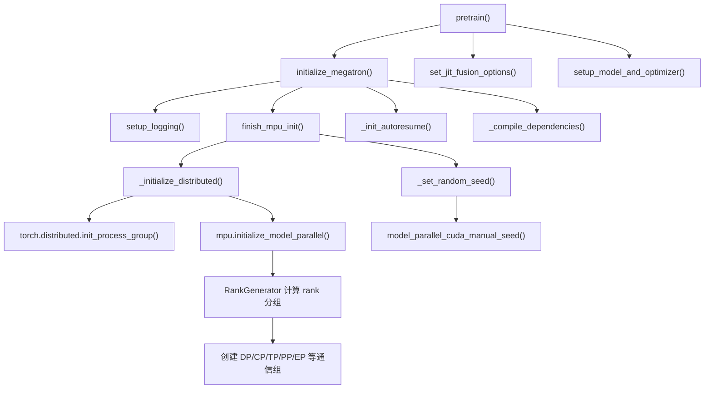

## 1. 关键源码路径

建议先围绕这些文件读：

```text
Megatron-LM/megatron/training/training.py
  pretrain() 入口函数

Megatron-LM/megatron/training/initialize.py
  initialize_megatron()
  _initialize_distributed()
  _set_random_seed()
  _compile_dependencies()
  _initialize_tp_communicators()

Megatron-LM/megatron/core/parallel_state.py
  RankGenerator 类
  generate_masked_orthogonal_rank_groups()
  create_group()
  initialize_model_parallel()
  create_hierarchical_groups()
  create_hybrid_dp_cp_groups()
  各类 get_xxx_group() / get_xxx_rank() / get_xxx_world_size()
  destroy_model_parallel()

Megatron-LM/megatron/core/tensor_parallel/random.py
  model_parallel_cuda_manual_seed()
  CudaRNGStatesTracker
```

## 2. 从 `pretrain()` 到 `initialize_megatron()`

### 2.1 `pretrain()` 入口

`pretrain()` 是训练总控函数。它按下面顺序执行四件大事：

```text
1. initialize_megatron()
2. set_jit_fusion_options()
3. setup_model_and_optimizer()
4. train()
```

本文聚焦第一步。

在 `pretrain_gpt.py::__main__` 中，GPT 入口会把自定义的 `get_embedding_ranks` 传给 `pretrain()`，再一路传到 `initialize_megatron()`。这点会影响后面 Embedding 组的 rank 选择：默认规则是 PP 首尾 stage，但 GPT 入口会额外考虑 `untie_embeddings_and_output_weights` 和 MTP ranks。

核心代码摘录：

```python
# Megatron-LM/megatron/training/training.py
def pretrain(...):
    initialize_megatron(
        get_embedding_ranks=get_embedding_ranks,
        get_position_embedding_ranks=get_position_embedding_ranks,
        store=store,
    )
    set_jit_fusion_options()
    ...
```

### 2.2 `initialize_megatron()` 的职责

```text
Megatron-LM/megatron/training/initialize.py
```

`initialize_megatron()` 做以下事情：

```text
1. 检查 CUDA 可用性
2. setup_logging()
3. 可选启动 persistent async checkpoint worker
4. initialize_rerun_state_machine()
5. 可选启用 batch invariant mode
6. 定义 finish_mpu_init() 闭包
   6a. _initialize_distributed()
       -> torch.distributed.init_process_group()
       -> mpu.initialize_model_parallel()
   6b. _set_random_seed()
   6c. 如果是 MoE，设置 MoEAuxLossAutoScaler 的初始 loss scale
7. 如果不是 lazy_mpu_init，立即执行 finish_mpu_init()
8. _init_autoresume()
9. _compile_dependencies()
10. 可选 _initialize_tp_communicators()
```

核心代码摘录：

```python
# Megatron-LM/megatron/training/initialize.py
def initialize_megatron(
    allow_no_cuda=False,
    skip_mpu_initialization=False,
    get_embedding_ranks=None,
    get_position_embedding_ranks=None,
    store=None,
):
    args = get_args()
    setup_logging()
    initialize_rerun_state_machine(...)

    def finish_mpu_init():
        _initialize_distributed(get_embedding_ranks, get_position_embedding_ranks, store)
        _set_random_seed(args.seed, ...)

    if not args.lazy_mpu_init:
        finish_mpu_init()
        _init_autoresume()
        _compile_dependencies()
        if args.tp_comm_overlap:
            _initialize_tp_communicators()
        return None
    else:
        # 延迟初始化模式，返回 finish_mpu_init 供外部调用
        mpu.set_tensor_model_parallel_world_size(args.tensor_model_parallel_size)
        mpu.set_tensor_model_parallel_rank(args.rank)
        return finish_mpu_init
```

## 3. 第一步：`torch.distributed.init_process_group()`

### 3.1 创建全局进程组

`_initialize_distributed()` 首先创建 PyTorch 全局分布式进程组。

这一步只做最基本的 `torch.distributed` 初始化，还不知道 TP/PP/DP 怎么切。

核心代码摘录：

```python
# Megatron-LM/megatron/training/initialize.py
def _initialize_distributed(get_embedding_ranks, get_position_embedding_ranks, store):
    args = get_args()
    device_count = torch.cuda.device_count()

    if not torch.distributed.is_initialized():
        # 设置当前 GPU 设备
        if device_count > 0:
            torch.cuda.set_device(args.local_rank)

        # 初始化全局进程组
        init_process_group_kwargs = {
            'backend': args.distributed_backend,  # 通常是 'nccl'
            'store': store,
            'world_size': args.world_size,
            'rank': args.rank,
            'timeout': timedelta(minutes=args.distributed_timeout_minutes),
        }
        torch.distributed.init_process_group(**init_process_group_kwargs)
```

当前源码里还有两个容易漏掉的小分支：

```text
1. 如果 torch.distributed 已经由外部初始化过，Megatron 不会重复 init_process_group，
   而是读取 torch.distributed.get_rank() / get_world_size() 回填 args.rank 和 args.world_size。

2. 如果开启 fake_process_group，会把 backend 改成 fake，并使用 PyTorch FakeStore。
   这个路径主要用于测试/模拟，不是正常 GPU 训练路径。
```

另外，`_initialize_distributed()` 会在正式初始化前按参数设置 flight recorder 相关环境变量，例如 `TORCH_NCCL_TRACE_BUFFER_SIZE`、`TORCH_NCCL_DUMP_ON_TIMEOUT` 等。这些不改变通信组切分，但对 NCCL 超时诊断很重要。

这一步完成后：

```text
每个 rank 知道自己：
  global_rank = args.rank
  global_world_size = args.world_size

但还不知道：
  自己属于哪个 TP group
  自己属于哪个 PP group
  自己属于哪个 DP group
  自己属于哪个 CP group
  自己属于哪个 EP group
```

### 3.2 调用 `initialize_model_parallel()`

全局进程组创建后，立即调用核心函数：

```python
# Megatron-LM/megatron/training/initialize.py
mpu.initialize_model_parallel(
    args.tensor_model_parallel_size,
    args.pipeline_model_parallel_size,
    args.virtual_pipeline_model_parallel_size,
    pipeline_model_parallel_comm_backend=args.pipeline_model_parallel_comm_backend,
    use_sharp=args.use_sharp,
    context_parallel_size=args.context_parallel_size,
    hierarchical_context_parallel_sizes=args.hierarchical_context_parallel_sizes,
    hybrid_context_parallel=args.hybrid_context_parallel,
    expert_model_parallel_size=args.expert_model_parallel_size,
    num_distributed_optimizer_instances=args.num_distributed_optimizer_instances,
    expert_tensor_parallel_size=args.expert_tensor_parallel_size,
    distributed_timeout_minutes=args.distributed_timeout_minutes,
    nccl_communicator_config_path=args.nccl_communicator_config_path,
    order='tp-cp-ep-dp-pp' if not args.use_tp_pp_dp_mapping else 'tp-cp-ep-pp-dp',
    get_embedding_ranks=get_embedding_ranks,
    get_position_embedding_ranks=get_position_embedding_ranks,
    create_gloo_process_groups=args.use_gloo_process_groups,
    high_priority_stream_groups=args.high_priority_stream_groups,
    sharp_enabled_group=args.sharp_enabled_group,
)
```

这是整个初始化中最复杂、最核心的函数。

## 4. Rank 分配算法：`RankGenerator` 与正交分组

### 4.1 为什么需要 rank 分配

假设有 16 张 GPU（rank 0~15），需要同时做：

```text
TP = 2   (tensor parallel)
PP = 4   (pipeline parallel)
DP = 2   (data parallel)
CP = 1   (context parallel)
```

那么每种并行维度都需要自己的通信组。关键问题是：**哪些 rank 应该被分到同一组？**

### 4.2 正交分解的核心思想

Megatron 把所有并行维度看作一个多维空间的轴。每个 rank 在这个空间中有一个唯一的坐标。

给定一个排列顺序（`order`），rank 的分配公式为：

```text
global_rank = offset + idx_tp * stride_tp + idx_cp * stride_cp + idx_ep * stride_ep + idx_dp * stride_dp + idx_pp * stride_pp
```

其中 `stride` 由排列顺序中前一个维度的尺寸决定（前缀积）。

Rank 坐标化的直观流程：

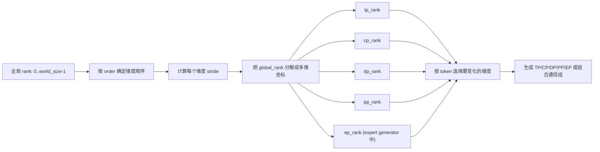

### 4.3 `order` 参数

`order` 决定 rank 的排布顺序。默认值：

```text
'tp-cp-ep-dp-pp'
```

这意味着 rank 编号时，TP 变化最快，PP 变化最慢。

如果设置 `use_tp_pp_dp_mapping`：

```text
'tp-cp-ep-pp-dp'
```

此时 PP 变化比 DP 快。

直观理解 `tp-cp-ep-dp-pp`：

```text
rank 编号 = tp_rank + cp_rank * TP + ep_rank * TP * CP + dp_rank * TP * CP * EP + pp_rank * TP * CP * EP * DP
```

### 4.4 `RankGenerator` 类

```text
Megatron-LM/megatron/core/parallel_state.py
```

`RankGenerator` 负责根据 `order` 和各维度尺寸，生成各类通信组的 rank 列表。

核心代码摘录：

```python
# Megatron-LM/megatron/core/parallel_state.py
class RankGenerator(object):
    def __init__(self, tp, ep, dp, pp, cp, order, rank_offset=0):
        assert ep == 1 or cp == 1, \
            "Both EP and CP > 1 is not allowed in one rank generator."

        self.tp = tp
        self.ep = ep
        self.dp = dp
        self.pp = pp
        self.cp = cp
        self.rank_offset = rank_offset
        self.world_size = tp * dp * pp * cp * ep

        self.name_to_size = {
            "tp": self.tp, "pp": self.pp, "dp": self.dp,
            "ep": self.ep, "cp": self.cp,
        }
        self.order = order
        # 对 order 中未出现且尺寸为 1 的维度自动追加
        for name in self.name_to_size.keys():
            if name not in order and self.name_to_size[name] != 1:
                raise RuntimeError(...)
            elif name not in order:
                order = order + "-" + name
        self.order = order
        self.ordered_size = []
        for token in order.split("-"):
            self.ordered_size.append(self.name_to_size[token])

    def get_ranks(self, token):
        """根据 token（如 'tp'、'pp'、'dp-cp'）获取对应的 rank 分组列表。"""
        mask = self.get_mask(self.order, token)
        ranks = generate_masked_orthogonal_rank_groups(
            self.world_size, self.ordered_size, mask
        )
        # 应用 rank_offset
        if self.rank_offset > 0:
            for rank_group in ranks:
                for i in range(len(rank_group)):
                    rank_group[i] += self.rank_offset
        return ranks
```

### 4.5 `generate_masked_orthogonal_rank_groups()`

这是 rank 分配的核心算法。给定一个多维空间的尺寸和一个 mask，它能算出所有通信组的 rank 列表。

算法可以分成两层循环理解：

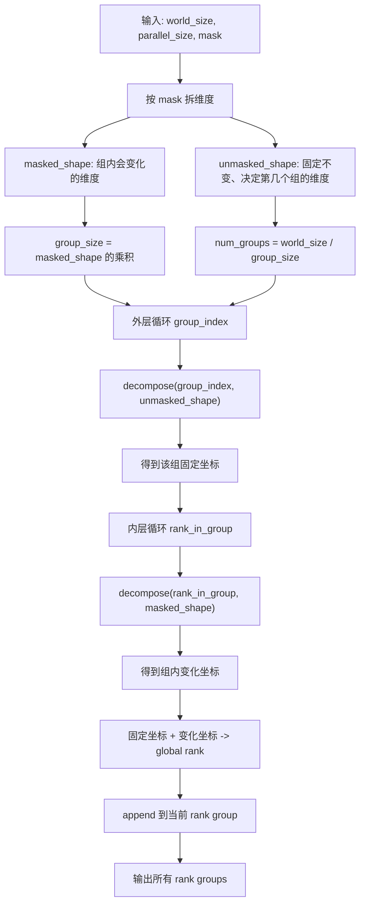

核心代码摘录：

```python
# Megatron-LM/megatron/core/parallel_state.py
def generate_masked_orthogonal_rank_groups(
    world_size: int, parallel_size: List[int], mask: List[bool]
) -> List[List[int]]:
    # prefix_product: [1, s0, s0*s1, s0*s1*s2, ...]
    # decompose: 把 index 按 stride 分解为多维坐标
    # inner_product: 多维坐标与 stride 的点积 = global_rank

    masked_shape = [s for s, m in zip(parallel_size, mask) if m]
    unmasked_shape = [s for s, m in zip(parallel_size, mask) if not m]

    global_stride = prefix_product(parallel_size)
    masked_stride = [d for d, m in zip(global_stride, mask) if m]
    unmasked_stride = [d for d, m in zip(global_stride, mask) if not m]

    group_size = prefix_product(masked_shape)[-1]
    num_of_group = world_size // group_size

    ranks = []
    for group_index in range(num_of_group):
        decomposed_group_idx = decompose(group_index, unmasked_shape)
        rank = []
        for rank_in_group in range(group_size):
            decomposed_rank_idx = decompose(rank_in_group, masked_shape)
            rank.append(
                inner_product(decomposed_rank_idx, masked_stride)
                + inner_product(decomposed_group_idx, unmasked_stride)
            )
        ranks.append(rank)
    return ranks
```

### 4.6 一个具体例子

假设：

```text
world_size = 16
TP = 2, PP = 4, CP = 1, EP = 1
DP = 16 / (2 * 4 * 1) = 2
order = 'tp-cp-ep-dp-pp'
```

`RankGenerator` 构建：

```python
decoder_rank_generator = RankGenerator(
    tp=2, ep=1, dp=2, pp=4, cp=1, order='tp-cp-ep-dp-pp'
)
```

由于 `cp=1` 和 `ep=1`，实际有效的 order 是：

```text
tp-dp-pp  （cp 和 ep 被自动追加，但尺寸为 1 不影响）
ordered_size = [2, 1, 1, 2, 4]
```

prefix_product（全局 stride）：

```text
[1, 2, 2, 2, 4, 16]
```

所以 rank 编号公式简化为：

```text
global_rank = tp_rank * 1 + dp_rank * 2 + pp_rank * 4
```

各 rank 的坐标：

```text
rank 0:  tp=0, dp=0, pp=0
rank 1:  tp=1, dp=0, pp=0
rank 2:  tp=0, dp=1, pp=0
rank 3:  tp=1, dp=1, pp=0
rank 4:  tp=0, dp=0, pp=1
rank 5:  tp=1, dp=0, pp=1
rank 6:  tp=0, dp=1, pp=1
rank 7:  tp=1, dp=1, pp=1
rank 8:  tp=0, dp=0, pp=2
rank 9:  tp=1, dp=0, pp=2
rank 10: tp=0, dp=1, pp=2
rank 11: tp=1, dp=1, pp=2
rank 12: tp=0, dp=0, pp=3
rank 13: tp=1, dp=0, pp=3
rank 14: tp=0, dp=1, pp=3
rank 15: tp=1, dp=1, pp=3
```

各组计算结果：

```text
TP groups（mask=[True, False, False, False, False] -> 只有 tp 维度）：
  [0, 1], [2, 3], [4, 5], [6, 7], [8, 9], [10, 11], [12, 13], [14, 15]
  共 8 组，每组 2 个 rank

PP groups（mask=[False, False, False, False, True] -> 只有 pp 维度）：
  [0, 4, 8, 12], [1, 5, 9, 13], [2, 6, 10, 14], [3, 7, 11, 15]
  共 4 组，每组 4 个 rank

DP groups（mask=[False, False, False, True, False] -> 只有 dp 维度）：
  [0, 2], [1, 3], [4, 6], [5, 7], [8, 10], [9, 11], [12, 14], [13, 15]
  共 8 组，每组 2 个 rank

TP-PP group (model parallel)（mask=[True, False, False, False, True]）：
  [0, 1, 4, 5, 8, 9, 12, 13], [2, 3, 6, 7, 10, 11, 14, 15]
  共 2 组，每组 8 个 rank
```

验证：

```text
TP group [0, 1]：
  rank 0 (tp=0, dp=0, pp=0) 和 rank 1 (tp=1, dp=0, pp=0)
  同一 dp/pp，不同 tp -> 正确！

PP group [0, 4, 8, 12]：
  rank 0 (pp=0), rank 4 (pp=1), rank 8 (pp=2), rank 12 (pp=3)
  同一 tp/dp，不同 pp -> 正确！

DP group [0, 2]：
  rank 0 (dp=0) 和 rank 2 (dp=1)
  同一 tp/pp，不同 dp -> 正确！
```

### 4.7 两个 `RankGenerator`：decoder 与 expert

`initialize_model_parallel()` 中创建了两个 `RankGenerator`：

```python
# decoder 侧的 rank 分组（不含 EP，CP 可能 > 1）
decoder_rank_generator = RankGenerator(
    tp=tensor_model_parallel_size,
    ep=1,
    dp=data_parallel_size,
    pp=pipeline_model_parallel_size,
    cp=context_parallel_size,
    order=order,
)

# expert 侧的 rank 分组（不含 CP，EP 可能 > 1）
expert_decoder_rank_generator = RankGenerator(
    tp=expert_tensor_parallel_size,
    ep=expert_model_parallel_size,
    dp=expert_data_parallel_size,
    pp=pipeline_model_parallel_size,
    cp=1,
    order=order,
)
```

注意约束：

```text
单个 RankGenerator 内 EP 和 CP 不能同时 > 1：
  decoder_rank_generator 使用 CP，但 ep 固定为 1
  expert_decoder_rank_generator 使用 EP，但 cp 固定为 1

整体训练配置中可以同时出现 CP>1 和 EP>1：
  注意力/普通 dense 层按 decoder generator 建 CP 组
  MoE expert 层按 expert generator 建 EP 组
  两套 generator 共享 PP 维度，并要求 PP groups 完全一致

expert_tensor_parallel_size 默认等于 tensor_model_parallel_size
expert_data_parallel_size = world_size / (expert_tp * ep * pp)
```

PP 组必须在两个 generator 中一致：

```python
assert decoder_rank_generator.get_ranks('pp') == expert_decoder_rank_generator.get_ranks('pp')
```

### 4.8 `order` 对 rank 布局的影响

不同 order 会导致完全不同的 rank 布局：

```text
order = 'tp-dp-pp'（传统映射）：
  global_rank = tp_rank + dp_rank * TP + pp_rank * TP * DP
  -> TP 变化最快，PP 变化最慢
  -> 同一个 PP stage 内，相邻 rank 属于不同 DP replica
  -> 有利于 TP 走 NVLink

order = 'tp-pp-dp'（use_tp_pp_dp_mapping）：
  global_rank = tp_rank + pp_rank * TP + dp_rank * TP * PP
  -> TP 变化最快，DP 变化最慢
  -> 同一个 DP replica 内，rank 是连续的
  -> 有利于 DP 走节点间通信
```

在当前训练参数里，实际传入的是带 CP/EP token 的完整字符串：

```text
默认：'tp-cp-ep-dp-pp'
开启 use_tp_pp_dp_mapping：'tp-cp-ep-pp-dp'
```

如果某个维度大小为 1，它仍然可以出现在 `order` 中，但不会改变 rank 结果；如果某个维度大小大于 1，却没有出现在 `order` 中，`RankGenerator` 会直接报错。

## 5. 通信组创建顺序与详情

`initialize_model_parallel()` 按以下顺序创建通信组。这个顺序很重要，因为 NCCL SHARP 等硬件特性对创建顺序有约束。

```text
创建顺序：
1. DP with CP 组 (dp_cp)         -- 最先创建，因为可能需要 SHARP
2. Intra partial DP with CP 组     -- num_distributed_optimizer_instances > 1 时创建
3. Hybrid DP-CP 组                 -- hybrid_context_parallel=True 时创建
4. DP 组 (dp)
5. CP 组 (cp) + Hierarchical CP 子组
6. Model Parallel 组 (tp-pp)
7. TP 组 (tp)
8. PP 组 (pp) + Embedding 组 + Position Embedding 组
9. TP+DP+CP 组 (tp-dp-cp)
10. TP+DP 组 (tp-dp)
11. TP+CP 组 (tp-cp)
12. Expert Model Parallel 组 (ep)
13. Expert Tensor Parallel 组 (ep_tp)
14. Expert TP+EP 组 (tp-ep)
15. Expert TP+EP+PP 组 (tp-ep-pp)
16. Expert Data Parallel 组 (ep_dp)
17. Intra/Inter partial Expert DP 组 -- num_distributed_optimizer_instances > 1 时创建
18. Distributed Optimizer Instance 组
```

创建顺序 flowchart：

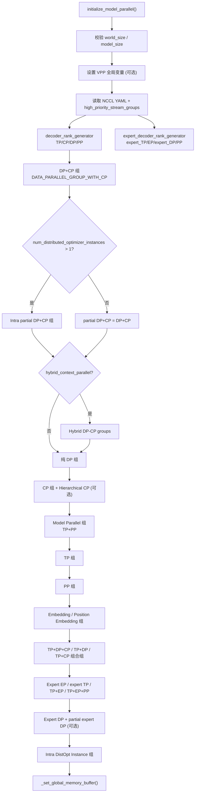

### 5.1 `create_group()` 底层

所有通信组最终都通过 `create_group()` 创建，它是对 `torch.distributed.new_group()` 的封装：

```python
# Megatron-LM/megatron/core/parallel_state.py
def create_group(
    ranks=None, timeout=None, backend=None,
    pg_options=None, use_local_synchronization=False, group_desc=None,
):
    group = torch.distributed.new_group(
        ranks=ranks, timeout=timeout, backend=backend,
        pg_options=pg_options, group_desc=group_desc,
    )
    # 记录到全局列表，方便后续统一更新 timeout
    global _global_process_group_list
    if _global_process_group_list is None:
        _global_process_group_list = [None]  # None 代表 default group
    if torch.distributed.get_rank() in ranks:
        _global_process_group_list.append(group)
    return group
```

重要细节：

```text
torch.distributed.new_group() 是一个 collective call
所有 rank 都必须调用它，即使自己不在这个组里
只有 ranks 列表中的 rank 才能使用这个 group
```

### 5.2 NCCL 配置选项

`get_nccl_options()` 可以为不同通信组设置不同的 NCCL 参数：

```python
# Megatron-LM/megatron/core/parallel_state.py
def get_nccl_options(pg_name, nccl_comm_cfgs):
    if pg_name in nccl_comm_cfgs:
        nccl_options = torch.distributed.ProcessGroupNCCL.Options(
            is_high_priority_stream=nccl_comm_cfgs[pg_name].get("is_high_priority_stream", False)
        )
        if "cga_cluster_size" in nccl_comm_cfgs[pg_name]:
            nccl_options.config.cga_cluster_size = ...
        if "max_ctas" in nccl_comm_cfgs[pg_name]:
            nccl_options.config.max_ctas = ...
        if "min_ctas" in nccl_comm_cfgs[pg_name]:
            nccl_options.config.min_ctas = ...
        return nccl_options
    return None
```

这些选项通过 YAML 文件传入，可以针对 TP、PP、DP 等分别优化 NCCL 行为。

当前代码还支持两个命令行层面的覆盖：

```text
high_priority_stream_groups:
  如果某个组名出现在这个列表中，会向对应 NCCL options 写入
  is_high_priority_stream=True。

sharp_enabled_group:
  use_sharp=True 时才合法。
  默认对 dp 组启用 SHARP；也可以在 num_distributed_optimizer_instances>1 时
  对 dp_replica（代码里的 inter partial expert DP 组）启用。
```

## 6. DP 相关通信组

### 6.1 DP with CP 组

DP with CP 组是**最先创建**的，因为它可能需要 NCCL SHARP（一种硬件加速的集合通信）。

```text
dp_cp 组 = DP * CP 的联合组

包含的 rank：同一个 TP/PP 位置，但不同 DP 和不同 CP 的所有 rank
```

DP/CP 相关组的关系：

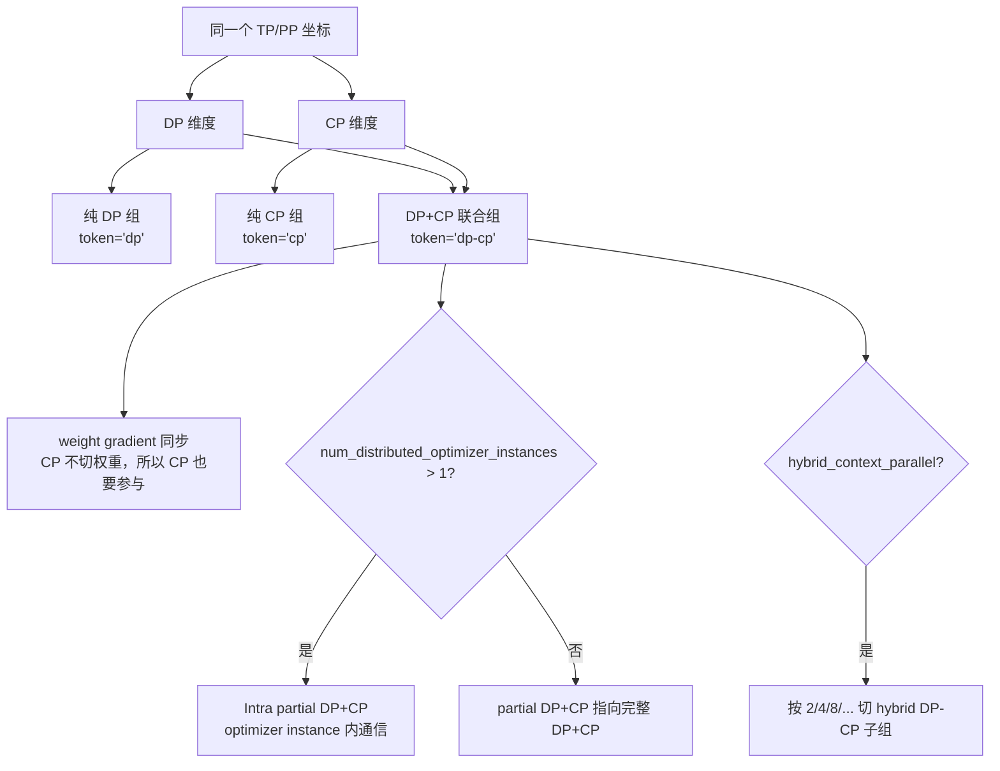

核心代码摘录：

```python
# Megatron-LM/megatron/core/parallel_state.py
for ranks_with_cp in decoder_rank_generator.get_ranks('dp-cp'):
    group_with_cp = create_group(
        ranks_with_cp,
        timeout=timeout,
        pg_options=get_nccl_options("dp_cp", nccl_comm_cfgs),
        group_desc="DATA_PARALLEL_GROUP_WITH_CP",
    )
    if rank in ranks_with_cp:
        _DATA_PARALLEL_GROUP_WITH_CP = group_with_cp
        _DATA_PARALLEL_GLOBAL_RANKS_WITH_CP = ranks_with_cp
```

如果开启 `num_distributed_optimizer_instances > 1`，还会进一步创建 intra-partial DP 组：

```python
if num_distributed_optimizer_instances > 1:
    for i in range(num_distributed_optimizer_instances):
        intra_partial_dp_ranks_with_cp = ranks_with_cp[
            (i * intra_partial_data_parallel_size) :
            ((i + 1) * intra_partial_data_parallel_size)
        ]
        intra_partial_dp_group_with_cp = create_group(
            intra_partial_dp_ranks_with_cp, ...
        )
```

`intra_partial_data_parallel_size` 的计算：

```text
intra_partial_data_parallel_size = (dp_size * cp_size) / num_distributed_optimizer_instances
```

如果没有使用 distributed optimizer instances（`num_distributed_optimizer_instances == 1`）：

```text
_INTRA_PARTIAL_DATA_PARALLEL_GROUP_WITH_CP = _DATA_PARALLEL_GROUP_WITH_CP
```

这里的“partial”不是又创建一种新的模型并行，而是把 `dp_cp` 组按 optimizer instance 数切成若干连续片段。后面的 DDP/FSDP/Distributed Optimizer 查询 `get_data_parallel_group(with_context_parallel=True, partial_data_parallel=True)` 时，拿到的就是这个 intra-partial DP+CP 组。注意当前 API 明确要求 partial DP 必须带 CP 语义：

```python
get_data_parallel_group(with_context_parallel=False, partial_data_parallel=True)
# 会触发断言：Partial DP for Optimizer needs to include CP
```

### 6.2 纯 DP 组

```python
for ranks in decoder_rank_generator.get_ranks('dp'):
    group = create_group(
        ranks,
        timeout=timeout,
        pg_options=get_nccl_options("dp", nccl_comm_cfgs),
        group_desc="DATA_PARALLEL_GROUP",
    )
    if rank in ranks:
        _DATA_PARALLEL_GROUP = group
        _DATA_PARALLEL_GLOBAL_RANKS = ranks
```

DP 组包含：

```text
同一个 TP/PP/CP 位置，但不同 DP replica 的所有 rank
```

如果 CP=1，DP 组和 DP with CP 组是相同的。

DP 组还附带一个 Gloo 后端版本：

```python
if create_gloo_process_groups:
    group_gloo = create_group(
        ranks, backend="gloo",
        group_desc="DATA_PARALLEL_GROUP_GLOO",
    )
```

Gloo 组主要用于 CPU 侧的集合通信（例如 checkpoint 元数据交换）。

同样地，`dp_cp` 和 `intra_partial_dp_cp` 也会在 `create_gloo_process_groups=True` 时创建 Gloo companion group。关闭 `--use-gloo-process-groups` 后，相关 `get_xxx_group_gloo()` API 会因为组不存在而断言失败。

### 6.3 DP 组在训练中的用途

```text
梯度同步：backward 后，DP 组内 all-reduce 或 reduce-scatter 梯度
Distributed optimizer：DP 组内分片 optimizer state
数据采样：不同 DP rank 的 sampler 取不同样本
```

### 6.4 带 CP 的 DP 组 vs 纯 DP 组的区别

```text
纯 DP 组 (dp)：
  同一 TP/PP 位置、不同 DP replica
  不包含 CP 维度的变化
  用于纯 DP 梯度同步（当 CP=1 时）

DP with CP 组 (dp_cp)：
  同一 TP/PP 位置、不同 DP 和不同 CP
  包含 CP 维度的变化
  当 CP > 1 时，梯度需要同步到所有 CP rank
  因为 CP 不切模型参数，只切 sequence
  所以 weight gradient 需要在 dp_cp 组内 all-reduce
```

训练阶段中 DP/CP 的典型使用路径：

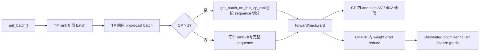

## 7. CP 通信组

### 7.1 CP 组创建

```python
for ranks in decoder_rank_generator.get_ranks('cp'):
    group = create_group(
        ranks,
        timeout=timeout,
        pg_options=get_nccl_options("cp", nccl_comm_cfgs),
        group_desc="CONTEXT_PARALLEL_GROUP",
    )
    if rank in ranks:
        _CONTEXT_PARALLEL_GROUP = group
        _CONTEXT_PARALLEL_GLOBAL_RANKS = ranks
```

CP 组包含：

```text
同一个 TP/PP/DP 位置，但不同 CP 的所有 rank
```

### 7.2 层级 CP 组 (Hierarchical CP)

如果设置了 `hierarchical_context_parallel_sizes`，会在 CP 组内进一步创建层级子组。

例如 CP=8，hierarchical sizes=[2, 2, 2]：

```text
Level 1: 2-GPU 子组（相邻 rank）
Level 2: 2-GPU 子组（间隔 rank）
Level 3: 2-GPU 子组（更大间隔）
```

更准确地说，`create_hierarchical_groups()` 会用 `einops.rearrange()` 按 level 重新排列同一个 CP ranks 列表。以 16 个 rank、hierarchical sizes=[2,2,4] 为例，源码注释给出的分组是：

```text
Level 1:
  [g0,g1], [g2,g3], ..., [g14,g15]
Level 2:
  [g0,g2], [g1,g3], [g4,g6], [g5,g7], ...
Level 3:
  [g0,g4,g8,g12], [g1,g5,g9,g13], ...
```

核心代码摘录：

```python
if hierarchical_context_parallel_sizes:
    assert np.prod(hierarchical_context_parallel_sizes) == context_parallel_size
    hierarchical_groups, _ = create_hierarchical_groups(
        rank, ranks, hierarchical_context_parallel_sizes,
        create_gloo_process_groups=False,
        pg_options=get_nccl_options("hcp", nccl_comm_cfgs),
        timeout=timeout,
        group_desc="CONTEXT_PARALLEL_GROUP",
    )
    if rank in ranks:
        _HIERARCHICAL_CONTEXT_PARALLEL_GROUPS = hierarchical_groups
```

层级 CP 主要用于 Ring Attention 等分层序列并行算法，允许在更小的子组内先做局部通信，再逐步扩大范围。

### 7.3 Hybrid DP-CP 组

如果开启 `hybrid_context_parallel`，还会创建 hybrid DP-CP 组：

```python
if hybrid_context_parallel:
    for ranks_with_cp in decoder_rank_generator.get_ranks('dp-cp'):
        _HYBRID_DP_CP_GROUPS.update(
            create_hybrid_dp_cp_groups(rank, ranks_with_cp, ...)
        )
```

Hybrid CP 是一种将 DP 和 CP 混合使用的策略，适用于需要灵活切换并行维度的场景。

当前实现不是只创建一个 hybrid 组，而是在每个 `dp-cp` rank 列表内，为从 2 开始到 `len(dp_cp_ranks)` 以下的 2 的幂创建分组：

```text
len(dp_cp_ranks)=4  -> group_size = 2
len(dp_cp_ranks)=8  -> group_size = 2, 4
len(dp_cp_ranks)=16 -> group_size = 2, 4, 8
```

`get_hybrid_data_context_parallel_groups(group_size=...)` 查询时，如果 `group_size` 等于完整 `DP*CP` 大小，会直接返回原始 `dp_cp` 组；否则返回 `_HYBRID_DP_CP_GROUPS[group_size]`。

### 7.4 CP 组在训练中的用途

```text
Attention 计算：
  每个 CP rank 持有 sequence 的一部分
  Attention 需要跨 CP rank 交换 KV（或 dKV）
  CP 组用于 all-gather 或 ring attention 通信

梯度同步：
  CP 不切权重，只切 sequence
  因此 weight gradient 需要在 dp_cp 组内 all-reduce

Batch 分发：
  get_batch_on_this_cp_rank() 按 CP rank 切 sequence
```

## 8. TP 通信组

### 8.1 Model Parallel 组 (TP + PP)

Model Parallel 组是 TP 和 PP 的联合组，在 TP 和 PP 组之前创建。

```python
for ranks in decoder_rank_generator.get_ranks('tp-pp'):
    group = create_group(
        ranks,
        timeout=timeout,
        pg_options=get_nccl_options("mp", nccl_comm_cfgs),
        group_desc="MODEL_PARALLEL_GROUP",
    )
    if rank in ranks:
        _MODEL_PARALLEL_GROUP = group
```

Model Parallel 组包含：

```text
同一个 DP（和 CP）位置，但不同 TP 和不同 PP 的所有 rank
```

它的尺寸是 `TP * PP`。在上面的例子中（TP=2, PP=4），每个 Model Parallel 组有 8 个 rank。

用途：

```text
判断当前 rank 的模型并行角色
某些通信需要在整个模型并行域内广播或同步
```

### 8.2 TP 组

```python
for ranks in decoder_rank_generator.get_ranks('tp'):
    group = create_group(
        ranks,
        timeout=timeout,
        pg_options=get_nccl_options("tp", nccl_comm_cfgs),
        group_desc="TENSOR_MODEL_PARALLEL_GROUP",
    )
    if rank in ranks:
        _TENSOR_MODEL_PARALLEL_GROUP = group
        _TENSOR_MODEL_PARALLEL_GLOBAL_RANKS = ranks
```

TP 组包含：

```text
同一个 DP/PP/CP 位置，但不同 TP 的所有 rank
```

TP 组是最核心的通信组之一，用于：

```text
ColumnParallelLinear: 可选 all-gather 输出
RowParallelLinear: all-reduce 或 reduce-scatter
Sequence Parallel: reduce-scatter / all-gather on sequence dim
Batch broadcast: TP rank 0 广播 batch 给其他 TP rank
RNG tracker: TP 组内不同 TP rank 使用不同 model-parallel RNG seed；
             默认跨 DP replica 的同一 TP rank 使用一致随机流
```

TP 在 Transformer 层中的典型通信流：

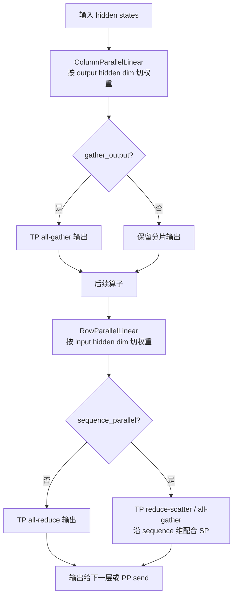

### 8.3 TP 组在 rank 分配中的位置

在默认 order `tp-cp-ep-dp-pp` 中，TP 排在第一位，意味着 TP rank 编号变化最快。这有利于：

```text
同一个 TP group 的 rank 在编号上相邻
例如 rank 0 和 rank 1 在同一个 TP group
如果启动器把相邻 rank 放在同一台机器/同一 NVLink 域，就可以获得更好的 TP 通信性能
```

## 9. PP 通信组

### 9.1 PP 组创建

PP 组的创建比前面的组更复杂，因为它还同时创建 Embedding 组和 Position Embedding 组。

```python
for ranks in decoder_rank_generator.get_ranks('pp'):
    group = create_group(
        ranks,
        timeout=timeout,
        backend=pipeline_model_parallel_comm_backend,  # 可以是 'nccl' 或 'ucc'
        pg_options=...,
        group_desc="PIPELINE_MODEL_PARALLEL_GROUP",
    )
    if rank in ranks:
        _PIPELINE_MODEL_PARALLEL_GROUP = group
        _PIPELINE_GLOBAL_RANKS = ranks

    # 同时创建 Embedding 组
    embedding_ranks = get_embedding_ranks(ranks)
    group = create_group(
        embedding_ranks, ...,
        group_desc="EMBEDDING_GROUP",
    )
    if rank in embedding_ranks:
        _EMBEDDING_GROUP = group

    # 同时创建 Position Embedding 组
    position_embedding_ranks = get_position_embedding_ranks(ranks)
    group = create_group(
        position_embedding_ranks, ...,
        group_desc="POSITION_EMBEDDING_GROUP",
    )
    if rank in position_embedding_ranks:
        _POSITION_EMBEDDING_GROUP = group
```

PP 组包含：

```text
同一个 TP/DP/CP 位置，但不同 PP 的所有 rank
```

PP 组和 embedding 相关组的创建关系：

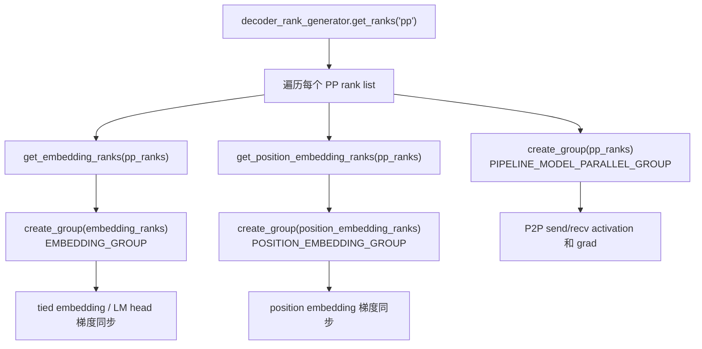

### 9.2 PP 通信后端

PP 组支持两种后端：

```text
nccl（默认）：
  使用 NVIDIA NCCL 库
  适用于大多数场景

ucc：
  使用 Unified Collective Communication
  在 InfiniBand 链路上可能获得更好的带宽利用率
  不占用 GPU SM 资源（Zero-SM）
  适合 PP 通信量大或 pipeline bubble 大的场景
```

使用 UCC 后端时，需要设置一系列环境变量：

```python
if pipeline_model_parallel_comm_backend == "ucc":
    os.environ["TORCH_UCC_BLOCKING_WAIT"] = "none"
    os.environ["UCC_EC_CUDA_STREAM_TASK_MODE"] = "driver"
    os.environ["UCX_TLS"] = "ib,cuda_copy"
    os.environ["UCC_CL_BASIC_TLS"] = "^sharp,nccl"
    ...
```

代码里还会要求 `CUDA_DEVICE_MAX_CONNECTIONS` 不能是 `1`，否则 UCC 通信无法和计算有效 overlap。

### 9.3 Embedding 组

Embedding 组连接同一 PP 管道中的第一个和最后一个 stage。

```text
parallel_state.py 的默认 embedding ranks = [pp_ranks[0], pp_ranks[-1]]

例如 PP 组 [0, 4, 8, 12]：
  embedding ranks = [0, 12]

原因：
  PP 第一个 stage 持有 word embedding（输入侧）
  PP 最后一个 stage 持有 output layer / LM head（输出侧）
  如果两者共享 embedding 权重，需要同步梯度
```

核心代码摘录：

```python
# Megatron-LM/megatron/core/parallel_state.py
def default_embedding_ranks(pp_ranks):
    if len(pp_ranks) == 1:
        return [pp_ranks[0]]
    else:
        return [pp_ranks[0], pp_ranks[-1]]
```

但是 GPT 入口实际传入了 `pretrain_gpt.py::get_embedding_ranks()`，会覆盖这个默认函数：

```python
def get_embedding_ranks(pp_ranks):
    embedding_ranks = [pp_ranks[0]]
    if len(pp_ranks) > 1:
        args = get_args()
        if not args.untie_embeddings_and_output_weights:
            embedding_ranks.append(pp_ranks[-1])
        config = core_transformer_config_from_args(args)
        mtp_ranks = get_mtp_ranks(pp_ranks, config)
        embedding_ranks.extend(mtp_ranks)
    return sorted(list(set(embedding_ranks)))
```

所以 GPT 预训练中的实际规则是：

```text
1. PP 第一 stage 一定在 embedding group 中。
2. 如果没有开启 untie_embeddings_and_output_weights，PP 最后一 stage 也在组中。
3. 如果模型配置启用了 MTP，MTP 所在 pipeline ranks 也会加入 embedding group。
4. 最后会去重并排序，避免首尾或 MTP ranks 重复。
```

Embedding 组在训练中的用途：

```text
如果模型使用 tied embedding（输入 embedding 和输出 LM head 共享权重）：
  PP 第一个 stage 的 embedding 梯度需要和最后一个 stage 的 output layer 梯度同步
  这个同步通过 Embedding 组完成
```

### 9.4 Position Embedding 组

```python
def default_position_embedding_ranks(pp_ranks):
    return [pp_ranks[0]]
```

Position Embedding 组通常只包含 PP 第一个 stage。因为：

```text
Position embedding 只在 PP 第一个 stage 使用
只有第一个 stage 做 embedding lookup
中间和最后的 PP stage 不需要 position embedding
```

GPT 入口没有传自定义 `get_position_embedding_ranks`，因此会使用 `default_position_embedding_ranks()`。

### 9.5 PP 组在训练中的用途

```text
Pipeline schedule 中：
  前一 stage 通过 P2P send/recv 传 activation 给后一 stage
  backward 时反向传 gradient

查询当前 stage 角色：
  is_pipeline_first_stage()
  is_pipeline_last_stage()
  get_pipeline_model_parallel_rank()
  get_pipeline_model_parallel_world_size()
```

## 10. 组合通信组

除了基本维度的通信组，`initialize_model_parallel()` 还创建多种组合组。

### 10.1 TP + DP + CP 组

```python
for ranks in decoder_rank_generator.get_ranks('tp-dp-cp'):
    group = create_group(
        ranks, ...,
        group_desc="TENSOR_AND_DATA_PARALLEL_GROUP_WITH_CP",
    )
    if rank in ranks:
        _TENSOR_AND_DATA_PARALLEL_GROUP_WITH_CP = group
```

包含：

```text
同一个 PP 位置，但不同 TP、不同 DP、不同 CP 的所有 rank
```

尺寸 = TP * DP * CP

用途：

```text
FP8 amax reduction
需要在整个 TP+DP+CP 域内同步 FP8 scaling factor
```

对应查询 API 是：

```python
mpu.get_amax_reduction_group(with_context_parallel=True, tp_only_amax_red=False)
```

如果 `tp_only_amax_red=True`，with-CP 情况不会返回 TP+DP+CP，而是返回 TP+CP 组。

### 10.2 TP + DP 组

```python
for ranks in decoder_rank_generator.get_ranks('tp-dp'):
    group = create_group(
        ranks, ...,
        group_desc="TENSOR_AND_DATA_PARALLEL_GROUP",
    )
    if rank in ranks:
        _TENSOR_AND_DATA_PARALLEL_GROUP = group
```

包含：

```text
同一个 PP（和 CP）位置，但不同 TP 和不同 DP 的所有 rank
```

尺寸 = TP * DP

用途：

```text
FP8 amax reduction（不使用 CP 时）
某些需要跨 TP 和 DP 同步的场景
```

不带 CP 时，`get_amax_reduction_group(tp_only_amax_red=False)` 返回这个组；如果 `tp_only_amax_red=True`，则退回到纯 TP 组。

### 10.3 TP + CP 组

```python
for ranks in decoder_rank_generator.get_ranks('tp-cp'):
    group = create_group(
        ranks, ...,
        group_desc="TENSOR_AND_CONTEXT_PARALLEL_GROUP",
    )
    if rank in ranks:
        _TENSOR_AND_CONTEXT_PARALLEL_GROUP = group
```

包含：

```text
同一个 DP/PP 位置，但不同 TP 和不同 CP 的所有 rank
```

尺寸 = TP * CP

用途：

```text
Sequence Parallel 与 Context Parallel 的联合通信
某些 attention 实现中需要跨 TP+CP 通信
```

### 10.4 组合组总结表

| 组名 | token | 包含维度 | 尺寸 | 主要用途 |
| --- | --- | --- | --- | --- |
| DP | `dp` | DP | DP | 梯度同步、数据采样 |
| DP+CP | `dp-cp` | DP * CP | DP * CP | 带 CP 的梯度同步 |
| CP | `cp` | CP | CP | Attention KV 交换 |
| Model Parallel | `tp-pp` | TP * PP | TP * PP | 模型并行域 |
| TP | `tp` | TP | TP | 矩阵切分通信 |
| PP | `pp` | PP | PP | Pipeline activation 传递 |
| Embedding | PP 首尾 | 1~2 | 1~2 | Tied embedding 梯度同步 |
| Position Embedding | PP 首 | 1 | 1 | Position embedding 同步 |
| TP+DP+CP | `tp-dp-cp` | TP * DP * CP | TP * DP * CP | FP8 amax reduction |
| TP+DP | `tp-dp` | TP * DP | TP * DP | FP8 amax reduction (无 CP) |
| TP+CP | `tp-cp` | TP * CP | TP * CP | Sequence+Context 联合通信 |

## 11. Expert 相关通信组

Expert 通信组使用 `expert_decoder_rank_generator`，它有独立的 TP 尺寸（`expert_tensor_parallel_size`）和 DP 尺寸（`expert_data_parallel_size`）。

计算方式是：

```text
expert_tensor_parallel_size 默认等于 tensor_model_parallel_size
expert_tensor_model_pipeline_parallel_size = expert_TP * EP * PP
expert_data_parallel_size = world_size / (expert_TP * EP * PP)
```

普通 dense/attention 侧的 `data_parallel_size` 是：

```text
data_parallel_size = world_size / (TP * CP * PP)
```

所以当 CP、EP、expert TP 同时参与时，普通 DP 和 expert DP 的含义不完全相同。代码还要求两套 generator 生成的 PP groups 完全一致；如果 `order` 不是以 `pp` 结尾，还要求 expert DP size 和普通 DP size 一致，否则 PP 维度无法对齐。

Expert 侧 group 的整体关系：

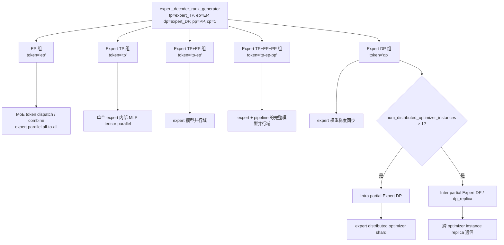

### 11.1 Expert Model Parallel 组 (EP)

```python
for ranks in expert_decoder_rank_generator.get_ranks('ep'):
    group = create_group(
        ranks, ...,
        group_desc="EXPERT_MODEL_PARALLEL_GROUP",
    )
    if rank in ranks:
        _EXPERT_MODEL_PARALLEL_GROUP = group
        _EXPERT_MODEL_PARALLEL_RANKS = ranks
```

EP 组包含：

```text
同一个 expert-TP/PP/DP 位置，但不同 EP 的所有 rank
每个 EP rank 持有一部分 expert
```

用途：

```text
MoE 中的 expert 路由
tokens 通过 all-to-all 发送到目标 expert 所在的 rank
```

### 11.2 Expert Tensor Parallel 组

```python
for ranks in expert_decoder_rank_generator.get_ranks('tp'):
    group = create_group(
        ranks, ...,
        group_desc="EXPERT_TENSOR_PARALLEL_GROUP",
    )
    if rank in ranks:
        _EXPERT_TENSOR_PARALLEL_GROUP = group
```

Expert TP 组可能和 attention TP 组不同（如果 `expert_tensor_parallel_size != tensor_model_parallel_size`）。

用途：

```text
Expert 内部的 tensor parallel
expert 的 MLP 权重可以按 TP 切分
```

### 11.3 Expert TP + EP 联合组

```python
for ranks in expert_decoder_rank_generator.get_ranks('tp-ep'):
    group = create_group(
        ranks, ...,
        group_desc="EXPERT_TENSOR_AND_MODEL_PARALLEL_GROUP",
    )
    if rank in ranks:
        _EXPERT_TENSOR_AND_MODEL_PARALLEL_GROUP = group
```

包含：

```text
同一个 expert-DP/PP 位置，但不同 expert-TP 和不同 EP 的所有 rank
尺寸 = expert_TP * EP
```

### 11.4 Expert TP + EP + PP 联合组

```python
for ranks in expert_decoder_rank_generator.get_ranks('tp-ep-pp'):
    group = create_group(
        ranks, ...,
        group_desc="EXPERT_TENSOR_MODEL_PIPELINE_PARALLEL_GROUP",
    )
    if rank in ranks:
        _EXPERT_TENSOR_MODEL_PIPELINE_PARALLEL_GROUP = group
```

包含：

```text
同一个 expert-DP 位置，但不同 expert-TP、EP 和 PP 的所有 rank
尺寸 = expert_TP * EP * PP
```

用途：

```text
Expert 的"模型并行域"
类似 attention 侧的 Model Parallel 组
```

### 11.5 Expert Data Parallel 组

```python
for ranks in expert_decoder_rank_generator.get_ranks('dp'):
    group = create_group(
        ranks, ...,
        group_desc="EXPERT_DATA_PARALLEL_GROUP",
    )
    if rank in ranks:
        _EXPERT_DATA_PARALLEL_GROUP = group
```

Expert DP 组包含：

```text
同一个 expert-TP/EP/PP 位置，但不同 expert-DP 的所有 rank
```

用途：

```text
Expert 权重的梯度同步
Expert 的 distributed optimizer 分片
```

如果 `num_distributed_optimizer_instances > 1`，还会创建层级 expert DP 组：

```python
if num_distributed_optimizer_instances > 1:
    hierarchical_groups, hierarchical_groups_gloo = create_hierarchical_groups(
        rank, ranks,
        [intra_partial_expert_data_parallel_size, num_distributed_optimizer_instances],
        ...
    )
```

这个调用返回两层当前 rank 所属的组：

```text
hierarchical_groups[0] -> _INTRA_PARTIAL_EXPERT_DATA_PARALLEL_GROUP
  大小 = expert_data_parallel_size / num_distributed_optimizer_instances
  用于每个 optimizer instance 内部的 expert 参数/梯度分片与同步

hierarchical_groups[1] -> _INTER_PARTIAL_EXPERT_DATA_PARALLEL_GROUP
  大小 = num_distributed_optimizer_instances
  用于跨 optimizer instance 的 replica 维度通信；sharp_enabled_group="dp_replica" 时，
  SHARP 作用在这一层。
```

`create_gloo_process_groups=True` 时，Expert DP 和 intra partial Expert DP 也会创建 Gloo companion group。

### 11.6 Expert 通信组总结

| 组名 | token | 尺寸 | 主要用途 |
| --- | --- | --- | --- |
| Expert Model Parallel | `ep` | EP | Expert 路由、all-to-all |
| Expert Tensor Parallel | `tp` | expert_TP | Expert 内 tensor 切分 |
| Expert TP+EP | `tp-ep` | expert_TP * EP | Expert 模型并行域 |
| Expert TP+EP+PP | `tp-ep-pp` | expert_TP * EP * PP | Expert 完整模型并行域 |
| Expert Data Parallel | `dp` | expert_DP | Expert 梯度同步 |

## 12. Distributed Optimizer Instance 组

### 12.1 创建逻辑

```python
model_parallel_group_id = 0
intra_dist_opt_ranks = []
for ranks in expert_decoder_rank_generator.get_ranks('tp-ep-pp'):
    model_parallel_group_id += 1
    intra_dist_opt_ranks.extend(ranks)
    if model_parallel_group_id % intra_partial_expert_data_parallel_size == 0:
        intra_dist_opt_instance_group = create_group(
            intra_dist_opt_ranks,
            timeout=timeout,
            pg_options=get_nccl_options("intra_dist_opt_instance", nccl_comm_cfgs),
            group_desc="INTRA_DISTRIBUTED_OPTIMIZER_INSTANCE_GROUP",
        )
        if rank in intra_dist_opt_ranks:
            _INTRA_DISTRIBUTED_OPTIMIZER_INSTANCE_GROUP = intra_dist_opt_instance_group
        intra_dist_opt_ranks = []
```

这个组用于 distributed optimizer：

```text
一个 distributed optimizer instance 包含多个 model parallel group
在这个范围内，optimizer state 被分片
每个 optimizer instance 独立更新自己负责的参数分片
```

更具体地说，代码遍历的是 expert 侧的 `tp-ep-pp` 组。每累计 `intra_partial_expert_data_parallel_size` 个 `tp-ep-pp` 组，就创建一个 `INTRA_DISTRIBUTED_OPTIMIZER_INSTANCE_GROUP`。因此该组的大小可以理解为：

```text
group_size = expert_TP * EP * PP * intra_partial_expert_data_parallel_size
```

当 `num_distributed_optimizer_instances == 1` 时，`intra_partial_expert_data_parallel_size == expert_data_parallel_size`，这个组覆盖完整 expert model-parallel 域乘以 expert DP 域，也就是当前默认的单个 optimizer instance 范围。`ParamAndGradBuffer` 后续会使用这个组做 distributed optimizer 的 reduce-scatter / all-gather。

### 12.2 可选 All-Gather overlap 组

`parallel_state.py` 里还有一个辅助函数 `create_all_gather_groups()`。它不在 `initialize_model_parallel()` 的主创建链路里，而是在需要 AG/RS overlap 的后续路径中显式调用，用来创建与 DP/Expert DP ranks 相同、但独立于原 DP 组的 all-gather communicator：

```text
DATA_PARALLEL_GROUP_WITH_CP_AG:
  ranks 与 dp-cp 组相同，用于普通参数的 all-gather overlap。

EXPERT_DATA_PARALLEL_GROUP_AG:
  for_expert_parallelism=True 且 EP>1 时创建，
  ranks 与 expert DP 组相同，用于 expert 参数的 all-gather overlap。
```

## 13. 完整通信组图示

以 `world_size=16, TP=2, PP=4, CP=1, DP=2, order='tp-cp-ep-dp-pp'` 为例：

### 13.1 Rank 坐标表

```text
rank  0: tp=0, dp=0, pp=0     rank  1: tp=1, dp=0, pp=0
rank  2: tp=0, dp=1, pp=0     rank  3: tp=1, dp=1, pp=0
rank  4: tp=0, dp=0, pp=1     rank  5: tp=1, dp=0, pp=1
rank  6: tp=0, dp=1, pp=1     rank  7: tp=1, dp=1, pp=1
rank  8: tp=0, dp=0, pp=2     rank  9: tp=1, dp=0, pp=2
rank 10: tp=0, dp=1, pp=2     rank 11: tp=1, dp=1, pp=2
rank 12: tp=0, dp=0, pp=3     rank 13: tp=1, dp=0, pp=3
rank 14: tp=0, dp=1, pp=3     rank 15: tp=1, dp=1, pp=3
```

### 13.2 所有通信组

```text
TP groups (8 groups, size 2):
  [0,1]  [2,3]  [4,5]  [6,7]  [8,9]  [10,11]  [12,13]  [14,15]

PP groups (4 groups, size 4):
  [0,4,8,12]  [1,5,9,13]  [2,6,10,14]  [3,7,11,15]

DP groups (8 groups, size 2):
  [0,2]  [1,3]  [4,6]  [5,7]  [8,10]  [9,11]  [12,14]  [13,15]

Model Parallel (TP+PP) groups (2 groups, size 8):
  [0,1,4,5,8,9,12,13]  [2,3,6,7,10,11,14,15]

Embedding groups (默认 tied embedding 且无 MTP 时，4 groups, size 2 each):
  PP group [0,4,8,12] -> embedding [0,12]
  PP group [1,5,9,13] -> embedding [1,13]
  PP group [2,6,10,14] -> embedding [2,14]
  PP group [3,7,11,15] -> embedding [3,15]

Position Embedding groups (4 groups, size 1 each):
  PP group [0,4,8,12] -> pos_embd [0]
  PP group [1,5,9,13] -> pos_embd [1]
  PP group [2,6,10,14] -> pos_embd [2]
  PP group [3,7,11,15] -> pos_embd [3]

TP+DP groups (4 groups, size 4):
  [0,1,2,3]  [4,5,6,7]  [8,9,10,11]  [12,13,14,15]
```

### 13.3 通信组与并行维度的关系图

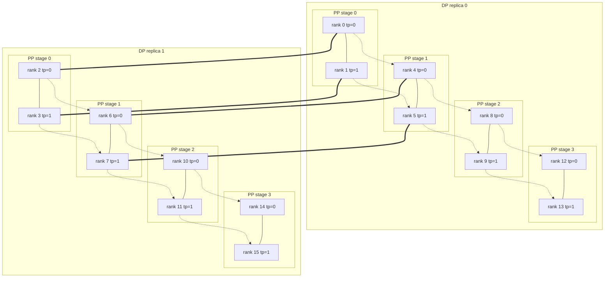

图例：

```text
--- 实线：TP 组（同一 PP stage 内，不同 TP rank）
-.-> 虚线箭头：PP 组（同一 TP/DP 位置，不同 PP stage）
=== 双线：DP 组（同一 TP/PP 位置，不同 DP replica）
```

## 14. 带 CP 的完整通信组示例

以 `world_size=16, TP=2, PP=2, CP=2, DP=2` 为例：

```text
order = 'tp-cp-ep-dp-pp'
global_rank = tp_rank + cp_rank * 2 + dp_rank * 4 + pp_rank * 8
```

Rank 坐标表：

```text
rank  0: tp=0, cp=0, dp=0, pp=0     rank  1: tp=1, cp=0, dp=0, pp=0
rank  2: tp=0, cp=1, dp=0, pp=0     rank  3: tp=1, cp=1, dp=0, pp=0
rank  4: tp=0, cp=0, dp=1, pp=0     rank  5: tp=1, cp=0, dp=1, pp=0
rank  6: tp=0, cp=1, dp=1, pp=0     rank  7: tp=1, cp=1, dp=1, pp=0
rank  8: tp=0, cp=0, dp=0, pp=1     rank  9: tp=1, cp=0, dp=0, pp=1
rank 10: tp=0, cp=1, dp=0, pp=1     rank 11: tp=1, cp=1, dp=0, pp=1
rank 12: tp=0, cp=0, dp=1, pp=1     rank 13: tp=1, cp=0, dp=1, pp=1
rank 14: tp=0, cp=1, dp=1, pp=1     rank 15: tp=1, cp=1, dp=1, pp=1
```

各组：

```text
TP groups (8 groups, size 2):
  [0,1] [2,3] [4,5] [6,7] [8,9] [10,11] [12,13] [14,15]

CP groups (8 groups, size 2):
  [0,2] [1,3] [4,6] [5,7] [8,10] [9,11] [12,14] [13,15]

DP groups (8 groups, size 2):
  [0,4] [1,5] [2,6] [3,7] [8,12] [9,13] [10,14] [11,15]

PP groups (8 groups, size 2):
  [0,8] [1,9] [2,10] [3,11] [4,12] [5,13] [6,14] [7,15]

DP+CP groups (4 groups, size 4):
  [0,2,4,6] [1,3,5,7] [8,10,12,14] [9,11,13,15]

TP+CP groups (4 groups, size 4):
  [0,1,2,3] [4,5,6,7] [8,9,10,11] [12,13,14,15]

TP+DP groups (4 groups, size 4):
  [0,1,4,5] [2,3,6,7] [8,9,12,13] [10,11,14,15]
```

注意：

```text
CP 组 [0,2] 中：
  rank 0 (tp=0, cp=0, dp=0, pp=0)
  rank 2 (tp=0, cp=1, dp=0, pp=0)
  同一 TP/DP/PP，不同 CP -> 正确！

DP+CP 组 [0,2,4,6] 中：
  rank 0 (tp=0, cp=0, dp=0, pp=0)
  rank 2 (tp=0, cp=1, dp=0, pp=0)
  rank 4 (tp=0, cp=0, dp=1, pp=0)
  rank 6 (tp=0, cp=1, dp=1, pp=0)
  同一 TP/PP，不同 CP 和 DP -> 正确！
```

## 15. 随机种子初始化

### 15.1 `_set_random_seed()`

通信组创建完成后，设置随机种子。

核心代码摘录：

```python
# Megatron-LM/megatron/training/initialize.py
def _set_random_seed(seed_, data_parallel_random_init=False, ...):
    if seed_ is not None and seed_ > 0:
        # 不同 PP stage 使用不同种子
        seed = seed_ + (100 * mpu.get_pipeline_model_parallel_rank())
        # 可选：不同 DP rank 使用不同种子
        if data_parallel_random_init:
            seed = seed + (10 * mpu.get_data_parallel_rank())
        random.seed(seed)
        np.random.seed(seed)
        torch.manual_seed(seed)
        if torch.cuda.device_count() > 0:
            tensor_parallel.model_parallel_cuda_manual_seed(seed, ...)
```

种子设计逻辑：

```text
基础种子：args.seed

PP 偏移：+100 * pp_rank
  不同 PP stage 需要不同种子
  因为 dropout 等操作需要在不同 stage 独立

DP 偏移（可选）：+10 * dp_rank
  如果 data_parallel_random_init=True
  不同 DP replica 使用不同种子
  默认关闭：DP replica 共享种子，确保相同 dropout 行为
```

### 15.2 `model_parallel_cuda_manual_seed()`

```text
Megatron-LM/megatron/core/tensor_parallel/random.py
```

这个函数为 CUDA 设置三套独立的 RNG 状态：

```python
def model_parallel_cuda_manual_seed(seed, ...):
    offset = seed + 2718
    tensor_model_parallel_seed = offset + tp_rank
    data_parallel_seed = seed

    # 1. Default state（DP 种子）
    torch.cuda.manual_seed(data_parallel_seed)
    _CUDA_RNG_STATE_TRACKER.add('data-parallel-rng', data_parallel_seed)

    # 2. Model parallel state（TP 种子）
    _CUDA_RNG_STATE_TRACKER.add('model-parallel-rng', tensor_model_parallel_seed)

    # 3. Expert parallel state（EP 种子）
    expert_parallel_seed = seed + 1024 + 100 * ep_rank + etp_rank
    _CUDA_RNG_STATE_TRACKER.add('expert-parallel-rng', expert_parallel_seed)
```

三套 RNG 状态的设计意图：

```text
1. data-parallel-rng（DP 种子）：
   使用传入 model_parallel_cuda_manual_seed() 的 seed
   由于 _set_random_seed() 已经加了 +100*pp_rank，
   不同 PP stage 的 data-parallel-rng 不同
   默认不加 DP rank 偏移，因此不同 DP replica 的同一 PP/TP/CP 位置会使用相同基础种子
   用于非 TP 区域的 dropout

2. model-parallel-rng（TP 种子）：
   seed + 2718 + tp_rank
   同一个 TP group 内不同 TP rank 有不同种子
   默认不同 DP replica 之间相同；如果 data_parallel_random_init=True，则不同 DP replica 也不同
   用于 TP 区域的 dropout
   默认确保不同 DP replica 在相同执行路径上使用一致的 model-parallel 随机流

3. expert-parallel-rng（EP 种子）：
   seed + 1024 + 100*ep_rank + etp_rank
   不同 expert model parallel rank / expert tensor parallel rank 有不同种子
   用于 MoE expert 层的 dropout
```

RNG 初始化和使用 flowchart：

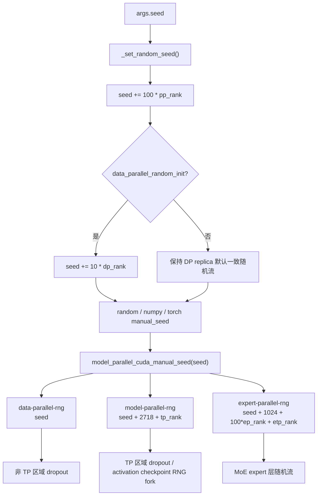

种子关系图：

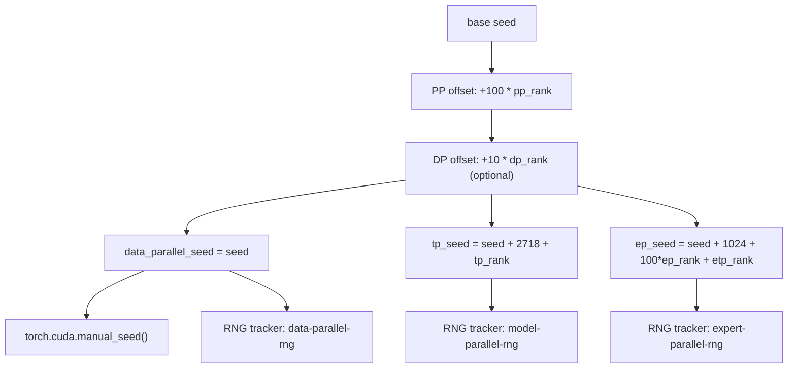

### 15.3 为什么需要多套 RNG

在 TP 下，同一个模型层的不同 TP rank 共同处理同一批数据。如果 dropout mask 完全相同：

```text
TP rank 0 和 TP rank 1 的 dropout 位置完全一致
-> 某些 hidden dim 在所有 TP rank 上都被 drop
-> 导致该维度完全丢失信息
```

所以 TP 区域内的 dropout 需要不同的 mask（使用 `model-parallel-rng`）。

但在 DP 维度：

```text
DP replica 0 和 DP replica 1 处理不同数据
但模型参数完全相同
默认使用相同的 RNG 种子，保证 DP replica 在相同执行路径上具有可复现的一致性
如果希望 DP replica 随机初始化/随机流不同，可以打开 data_parallel_random_init
```

## 16. 其他初始化步骤

### 16.1 `_init_autoresume()`

```python
def _init_autoresume():
    autoresume = get_adlr_autoresume()
    if autoresume:
        torch.distributed.barrier()
        autoresume.init()
        torch.distributed.barrier()
```

用于集群环境中的自动恢复（例如 SLURM 任务被抢占后自动重启）。

### 16.2 `_compile_dependencies()`

```python
def _compile_dependencies():
    if torch.distributed.get_rank() == 0:
        from megatron.core.datasets.utils import compile_helpers
        compile_helpers()
    torch.distributed.barrier()
```

只在 rank 0 上编译 C++ 数据集索引构建器（`helpers.cpp`），然后所有 rank 等待完成。

### 16.3 `_initialize_tp_communicators()`

如果开启 `tp_comm_overlap`，会初始化 TP 通信 overlap 的用户缓冲区。

```python
def _initialize_tp_communicators():
    import transformer_engine
    import yaml

    if getattr(args, 'decoder_tp_comm_overlap', False):
        input_shape = [
            (args.decoder_seq_length * args.micro_batch_size) // args.context_parallel_size,
            args.hidden_size,
        ]
    else:
        input_shape = [
            (args.seq_length * args.micro_batch_size) // args.context_parallel_size,
            args.hidden_size,
        ]

    te_module.base.initialize_ub(
        shape=input_shape,
        tp_size=args.tensor_model_parallel_size,
        ub_cfgs=ub_cfgs,
        bootstrap_backend=args.tp_comm_bootstrap_backend,
    )
```

这个功能需要 Transformer Engine，用于在 TP 通信和 GEMM 计算之间做 overlap 优化。

当前代码会按 Transformer Engine 版本分支：

```text
TE >= 2.7.0:
  使用 UserBufferQuantizationMode，按 fp8 / first_last_layers_bf16 选择 quantization_modes。

1.9.0 <= TE < 2.7.0:
  仍使用 use_fp8 参数。

TE < 1.9.0:
  如果 bootstrap_backend 不是 mpi，会给出 warning；
  同时通过 create_group(backend="mpi") 创建 TP_BOOTSTRAP_GROUP_MPI。
```

### 16.4 `set_jit_fusion_options()`

```python
def set_jit_fusion_options():
    if is_torch_min_version("2.2.0a0"):
        pass  # 使用 torch.compile
    elif is_torch_min_version("1.10.0a0"):
        # nvfuser
        torch._C._jit_set_nvfuser_enabled(True)
    else:
        # legacy pytorch fuser
        torch._C._jit_override_can_fuse_on_gpu(True)

    _warmup_jit_function()
```

预热 JIT 融合 kernel：

```text
bias_gelu / bias_swiglu
bias_dropout_add
```

这些融合 kernel 在训练时会被频繁调用，预热可以避免首次调用的编译开销。

### 16.5 全局内存缓冲区

`initialize_model_parallel()` 最后一步：

```python
def _set_global_memory_buffer():
    global _GLOBAL_MEMORY_BUFFER
    _GLOBAL_MEMORY_BUFFER = GlobalMemoryBuffer()
```

`GlobalMemoryBuffer` 预分配一些 GPU 内存缓冲区，避免训练过程中频繁分配内存。主要用于：

```text
TP 通信中的临时缓冲区
All-reduce / all-gather 操作的中间结果
减少 cudaMalloc 调用
```

## 17. 初始化时序总结

把所有初始化步骤串起来，按时间顺序：

```text
时间线

1. pretrain_gpt.py::__main__
   |
   v
2. pretrain()
   |
   v
3. initialize_megatron()
   3.1 setup_logging()
   3.2 initialize_rerun_state_machine()
   3.3 finish_mpu_init()
       3.3.1 _initialize_distributed()
             a. torch.cuda.set_device(local_rank)
             b. torch.distributed.init_process_group(backend='nccl')
             c. mpu.initialize_model_parallel()
                i.   创建 RankGenerator (decoder + expert)
                ii.  DP+CP 组
                iii. DP 组
                iv.  CP 组 + 层级 CP 组
                v.   Model Parallel (TP+PP) 组
                vi.  TP 组
                vii. PP 组 + Embedding 组 + Position Embedding 组
                viii.TP+DP+CP / TP+DP / TP+CP 组合组
                ix.  Expert 相关组 (EP / EP_TP / TP+EP / TP+EP+PP / EP_DP)
                x.   Distributed Optimizer Instance 组
                xi.  _set_global_memory_buffer()
       3.3.2 _set_random_seed()
             a. random.seed / np.random.seed / torch.manual_seed
             b. model_parallel_cuda_manual_seed()
                i.   data-parallel-rng tracker
                ii.  model-parallel-rng tracker
                iii. expert-parallel-rng tracker
   3.4 _init_autoresume()
   3.5 _compile_dependencies()
   3.6 _initialize_tp_communicators()  [可选]
   |
   v
4. set_jit_fusion_options()
   4.1 设置 JIT/nvfuser 选项
   4.2 _warmup_jit_function()
       a. bias_gelu / bias_swiglu 预热
       b. bias_dropout_add 预热
   |
   v
5. setup_model_and_optimizer()
   （下一章内容）
```

## 18. 查询通信组信息的 API

初始化完成后，训练代码通过以下 API 查询通信组信息。

### 18.1 基本查询

```python
# TP
mpu.get_tensor_model_parallel_group()
mpu.get_tensor_model_parallel_rank()
mpu.get_tensor_model_parallel_world_size()
mpu.get_tensor_model_parallel_src_rank()  # TP 组中 rank 最小的全局 rank

# PP
mpu.get_pipeline_model_parallel_group()
mpu.get_pipeline_model_parallel_rank()
mpu.get_pipeline_model_parallel_world_size()
mpu.is_pipeline_first_stage()
mpu.is_pipeline_last_stage()
mpu.get_pipeline_model_parallel_first_rank()
mpu.get_pipeline_model_parallel_last_rank()
mpu.get_pipeline_model_parallel_next_rank()
mpu.get_pipeline_model_parallel_prev_rank()

# DP
mpu.get_data_parallel_group(with_context_parallel=False)
mpu.get_data_parallel_group(with_context_parallel=True)
mpu.get_data_parallel_group(with_context_parallel=True, partial_data_parallel=True)
mpu.get_data_parallel_group_gloo(with_context_parallel=True, partial_data_parallel=True)
mpu.get_data_parallel_rank(with_context_parallel=False)
mpu.get_data_parallel_world_size(with_context_parallel=False)
mpu.get_data_parallel_src_rank(with_context_parallel=False)

# CP
mpu.get_context_parallel_group()
mpu.get_context_parallel_rank()
mpu.get_context_parallel_world_size()
mpu.get_context_parallel_global_ranks()
mpu.get_hierarchical_context_parallel_groups()
mpu.get_hybrid_data_context_parallel_groups(group_size=...)

# EP
mpu.get_expert_model_parallel_group()
mpu.get_expert_model_parallel_rank()
mpu.get_expert_model_parallel_world_size()
mpu.get_expert_tensor_parallel_group()
mpu.get_expert_tensor_parallel_rank()
mpu.get_expert_tensor_parallel_world_size()
mpu.get_expert_data_parallel_group()
mpu.get_expert_data_parallel_group(partial_expert_data_parallel=True)
mpu.get_expert_data_parallel_group_gloo(partial_expert_data_parallel=True)
mpu.get_expert_data_parallel_rank()
mpu.get_expert_data_parallel_world_size()

# 组合
mpu.get_model_parallel_group()           # TP+PP
mpu.get_embedding_group()                # 默认 PP 首尾，GPT 入口会按 tied/MTP 规则覆盖
mpu.get_position_embedding_group()
mpu.get_tensor_and_context_parallel_group()  # TP+CP
mpu.get_tensor_and_data_parallel_group(with_context_parallel=False)  # TP+DP(+CP)
mpu.get_amax_reduction_group(with_context_parallel=True, tp_only_amax_red=False)
mpu.get_expert_tensor_and_model_parallel_group()  # expert TP+EP
mpu.get_expert_tensor_model_pipeline_parallel_group()  # expert TP+EP+PP
mpu.get_intra_distributed_optimizer_instance_group()
mpu.get_inter_distributed_optimizer_instance_group()
```

### 18.2 `with_context_parallel` 参数的含义

很多 DP 查询函数有 `with_context_parallel` 参数：

```text
with_context_parallel=False:
  返回纯 DP 组
  不包含 CP 维度的 rank
  用于不需要考虑 CP 的梯度同步

with_context_parallel=True:
  返回 DP+CP 联合组
  包含 CP 维度的 rank
  当 CP > 1 时，梯度需要在 DP+CP 组内 all-reduce

partial_data_parallel=True:
  只能和 with_context_parallel=True 同时使用
  返回 num_distributed_optimizer_instances 切分后的 intra partial DP+CP 组
  主要给 distributed optimizer / FSDP 类路径使用
```

### 18.3 `get_all_ranks()`

```python
def get_all_ranks():
    ranks = [
        get_tensor_model_parallel_rank(),
        get_data_parallel_rank(),
        get_context_parallel_rank(),
        get_pipeline_model_parallel_rank(),
        get_expert_model_parallel_rank(),
    ]
    return "_".join(map(lambda x: str(x or 0), ranks))
```

返回一个字符串标识当前 rank 在所有并行维度中的位置，例如 `"0_1_0_2_0"` 表示 tp=0, dp=1, cp=0, pp=2, ep=0。

## 19. Virtual Pipeline Parallel (VPP)

### 19.1 VPP 初始化

如果设置了 `virtual_pipeline_model_parallel_size`：

```python
if virtual_pipeline_model_parallel_size is not None:
    if not pipeline_model_parallel_size > 1:
        raise RuntimeError(...)
    _VIRTUAL_PIPELINE_MODEL_PARALLEL_RANK = 0
    _VIRTUAL_PIPELINE_MODEL_PARALLEL_WORLD_SIZE = virtual_pipeline_model_parallel_size
```

VPP 不创建额外的通信组，而是在运行时通过虚拟 rank 来切换 pipeline stage。

### 19.2 VPP 的 rank 切换

```python
def get_virtual_pipeline_model_parallel_rank():
    return _VIRTUAL_PIPELINE_MODEL_PARALLEL_RANK

def set_virtual_pipeline_model_parallel_rank(rank):
    global _VIRTUAL_PIPELINE_MODEL_PARALLEL_RANK
    _VIRTUAL_PIPELINE_MODEL_PARALLEL_RANK = rank
```

在 interleaved pipeline schedule 中，每个物理 PP rank 持有多个 model chunk。pipeline schedule 通过切换 virtual rank 来选择当前激活的 model chunk。

## 20. `destroy_model_parallel()`

与初始化对应，`destroy_model_parallel()` 将所有全局变量设为 `None`：

```python
def destroy_model_parallel():
    global _MODEL_PARALLEL_GROUP
    _MODEL_PARALLEL_GROUP = None
    global _TENSOR_MODEL_PARALLEL_GROUP
    _TENSOR_MODEL_PARALLEL_GROUP = None
    global _PIPELINE_MODEL_PARALLEL_GROUP
    _PIPELINE_MODEL_PARALLEL_GROUP = None
    global _DATA_PARALLEL_GROUP
    _DATA_PARALLEL_GROUP = None
    global _CONTEXT_PARALLEL_GROUP
    _CONTEXT_PARALLEL_GROUP = None
    # ... 所有其他组变量 ...
    # Gloo 组需要显式 destroy
    if _DATA_PARALLEL_GROUP_GLOO is not None:
        torch.distributed.destroy_process_group(_DATA_PARALLEL_GROUP_GLOO)
    # ...
```

注意：

```text
NCCL 组：只把全局变量设为 None
  真正的 NCCL communicator 在进程退出时自动销毁

Gloo 组：需要显式调用 torch.distributed.destroy_process_group()
  因为 Gloo 组可能持有 CPU 资源
```

## 21. 常见误区

### 21.1 误区一：`init_process_group()` 就够了

不是。`init_process_group()` 只创建全局进程组。所有 TP/PP/DP/CP/EP 子组都需要额外通过 `new_group()` 创建。

### 21.2 误区二：`new_group()` 只在自己的 rank 上调用

不是。`torch.distributed.new_group()` 是一个集合操作，**所有 rank** 都必须调用它（即使自己不在目标 ranks 列表中），否则会死锁。

### 21.3 误区三：单个 `RankGenerator` 可以同时处理 EP 和 CP

不是。`RankGenerator` 中有显式断言：

```python
assert ep == 1 or cp == 1
```

但这不等于训练配置不能同时使用 CP 和 EP。当前实现的做法是拆成两套 generator：decoder generator 负责 TP/CP/DP/PP，expert generator 负责 expert_TP/EP/expert_DP/PP。它们不能在同一个 generator 里混排 CP 和 EP，但可以在同一次初始化中分别创建 CP 组和 EP 组。

### 21.4 误区四：TP 组内的 rank 一定物理相邻

不一定。虽然默认 order 让 TP 变化最快（有利于物理相邻），但如果使用 `torchrun` 或其他启动方式导致 rank 编号和物理拓扑不匹配，TP 组内的 rank 可能跨节点。

### 21.5 误区五：通信组创建后可以动态修改

通常不行。通信组在 `initialize_model_parallel()` 中一次性创建。虽然有 `_MPU_*` 系列变量可以动态修改某些尺寸，但实际不建议在训练中修改。

### 21.6 误区六：所有通信组都使用 NCCL

不是。PP 组可以选择 UCC 后端。DP 和 Expert DP 组有配套的 Gloo 版本（用于 CPU 侧操作）。TP comm overlap 使用 Transformer Engine 的用户缓冲区。

## 22. 推荐阅读顺序

建议按下面顺序读源码：

1. `megatron/training/training.py::pretrain()`
   先理解总控流程，找到 `initialize_megatron()` 调用点。

2. `megatron/training/initialize.py::initialize_megatron()`
   理解 finish_mpu_init 闭包、_initialize_distributed、_set_random_seed 的关系。

3. `megatron/training/initialize.py::_initialize_distributed()`
   理解 torch.distributed.init_process_group() 和 mpu.initialize_model_parallel() 的调用。

4. `megatron/core/parallel_state.py::RankGenerator`
   理解 order、get_ranks、mask 机制。

5. `megatron/core/parallel_state.py::generate_masked_orthogonal_rank_groups()`
   理解核心 rank 分配算法。

6. `megatron/core/parallel_state.py::initialize_model_parallel()`
   理解所有通信组的创建顺序和逻辑。重点关注 dp_cp -> dp -> cp -> tp-pp -> tp -> pp -> embedding -> 组合组 -> expert 组 的顺序。

7. `megatron/core/tensor_parallel/random.py::model_parallel_cuda_manual_seed()`
   理解三套 RNG tracker 的种子计算逻辑。

8. `megatron/training/initialize.py::_set_random_seed()`
   理解 PP/DP 种子偏移。

## 23. 一句话总结

Megatron-LM 的初始化核心是：**先用 `torch.distributed.init_process_group()` 建全局进程组，再用 `RankGenerator` 按指定 order 把 rank 坐标空间正交分解为 TP/PP/CP/DP/EP 各维度的通信子组，然后为每个维度设置独立的 CUDA RNG 状态，最后预热 JIT 融合 kernel 和通信缓冲区。**

记住这个公式：

```text
world_size = TP * PP * CP * DP
（或 world_size = expert_TP * EP * PP * expert_DP）

rank 布局由 order 决定：
'tp-cp-ep-dp-pp'  -> TP 变化最快，PP 变化最慢
'tp-cp-ep-pp-dp'  -> TP 变化最快，DP 变化最慢
```

<!-- archive-notes-summary-visual -->

## 总结图

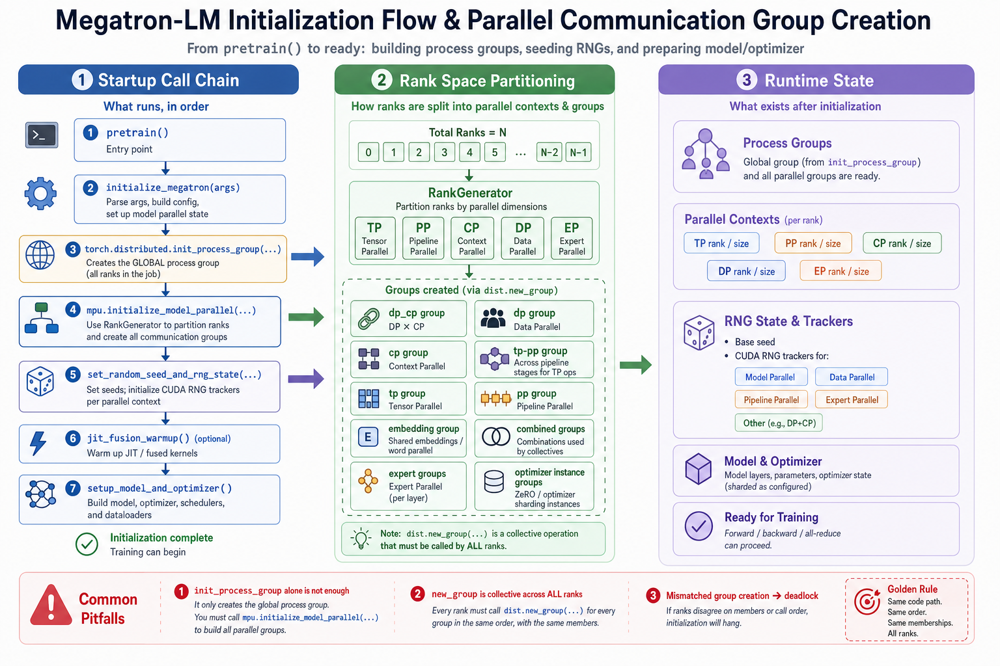
